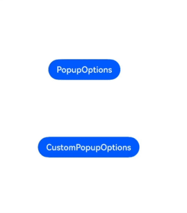
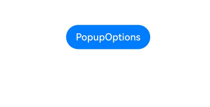
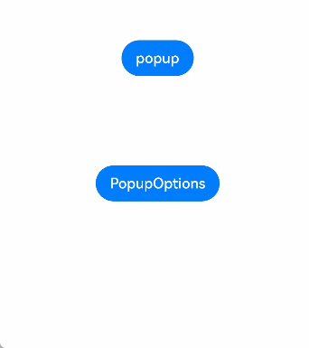
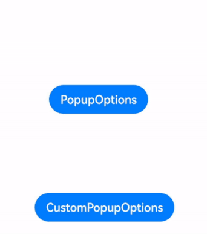
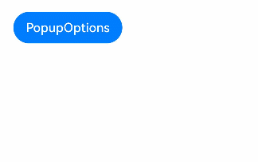
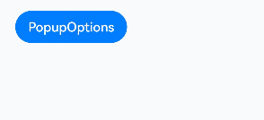

# Popup控制

给组件绑定popup弹窗，并设置弹窗内容，交互逻辑和显示状态。

>  **说明：**
>
> - 从API Version 7开始支持。后续版本如有新增内容，则采用上角标单独标记该内容的起始版本。
>  
> - popup弹窗的显示状态在onStateChange事件回调中反馈，其显隐与组件的创建或销毁无强对应关系。

## bindPopup

bindPopup(show: boolean, popup: PopupOptions | CustomPopupOptions)

给组件绑定Popup弹窗。

**系统能力：** SystemCapability.ArkUI.ArkUI.Full

**参数：**

| 参数名 | 类型                                                         | 必填 | 说明                                                         |
| ------ | ------------------------------------------------------------ | ---- | ------------------------------------------------------------ |
| show   | boolean                                                      | 是   | 弹窗显示状态，默认值为false，隐藏弹窗。popup弹窗必须等待页面全部构建完成才能展示，因此show不能在页面构建中设置为true，否则会导致popup弹窗显示位置及形状错误。 |
| popup  | [PopupOptions](#popupoptions类型说明)&nbsp;\|&nbsp;[CustomPopupOptions](#custompopupoptions8类型说明)<sup>8+</sup> | 是   | 配置弹出弹窗的参数。                                         |

## PopupOptions类型说明

| 名称                                  | 类型                                                         | 必填 | 描述                                                         |
| ------------------------------------- | ------------------------------------------------------------ | ---- | ------------------------------------------------------------ |
| message                               | string                                                       | 是   | 弹窗信息内容。<br />**元服务API：** 从API version 11开始，该接口支持在元服务中使用。                                               |
| placementOnTop<sup>(deprecated)</sup> | boolean                                                      | 否   | 是否在组件上方显示，默认值为false。<br />**说明：**<br />从 API version 10 开始废弃，建议使用`placement`替代。 |
| primaryButton                         | {<br/>value:&nbsp;string,<br/>action:&nbsp;()&nbsp;=&gt;&nbsp;void<br/>} | 否   | 第一个按钮。<br/>value:&nbsp;弹窗里主按钮的文本。<br/>action:&nbsp;点击主按钮的回调函数。<br />**元服务API：** 从API version 11开始，该接口支持在元服务中使用。 |
| secondaryButton                       | {<br/>value:&nbsp;string,<br/>action:&nbsp;()&nbsp;=&gt;&nbsp;void<br/>} | 否   | 第二个按钮。<br/>value:&nbsp;弹窗里辅助按钮的文本。<br/>action:&nbsp;点击辅助按钮的回调函数。<br />**元服务API：** 从API version 11开始，该接口支持在元服务中使用。 |
| onStateChange                         | (event:&nbsp;{&nbsp;isVisible:&nbsp;boolean&nbsp;})&nbsp;=&gt;&nbsp;void | 否   | 弹窗状态变化事件回调，参数isVisible为弹窗当前的显示状态。<br />**元服务API：** 从API version 11开始，该接口支持在元服务中使用。    |
| arrowOffset<sup>9+</sup>              | [Length](ts-types.md#length)                                 | 否   | popup箭头在弹窗处的偏移。箭头在气泡上下方时，数值为0表示箭头居最左侧，偏移量为箭头至最左侧的距离，默认居中。箭头在气泡左右侧时，偏移量为箭头至最上侧的距离，默认居中。如果显示在屏幕边缘，气泡会自动左右偏移，数值为0时箭头始终指向绑定组件。<br />**元服务API：** 从API version 11开始，该接口支持在元服务中使用。 |
| showInSubWindow<sup>9+</sup>          | boolean                                                      | 否   | 是否在子窗口显示气泡，默认值为false。<br />**元服务API：** 从API version 11开始，该接口支持在元服务中使用。                        |
| mask<sup>10+</sup>                    | boolean&nbsp;\|&nbsp;{ color : [ResourceColor](ts-types.md#resourcecolor) }| 否   | 设置气泡是否有遮罩层及遮罩颜色。如果设置为false，则没有遮罩层；如果设置为true，则设置有遮罩层并且颜色为透明色；如果设置为Color，则为遮罩层的颜色。<br />**元服务API：** 从API version 11开始，该接口支持在元服务中使用。 |
| messageOptions<sup>10+</sup>          | [PopupMessageOptions](#popupmessageoptions10类型说明)        | 否   | 设置弹窗信息文本参数。<br />**元服务API：** 从API version 11开始，该接口支持在元服务中使用。                                       |
| targetSpace<sup>10+</sup>             | [Length](ts-types.md#length)                                 | 否   | 设置popup与目标的间隙。<br />**元服务API：** 从API version 11开始，该接口支持在元服务中使用。                                      |
| placement<sup>10+</sup>               | [Placement](ts-appendix-enums.md#placement8)                 | 否   | 设置popup组件相对于目标的显示位置，默认值为Placement.Bottom。<br />如果同时设置了`placementOnTop`和`placement`，则以`placement`的设置生效。<br />**元服务API：** 从API version 11开始，该接口支持在元服务中使用。 |
| offset<sup>10+</sup>                  | [Position](ts-types.md#position)                            | 否   | 设置popup组件相对于placement设置的显示位置的偏移。<br />**说明：**<br />不支持设置百分比。<br />**元服务API：** 从API version 11开始，该接口支持在元服务中使用。 |
| enableArrow<sup>10+</sup>             | boolean                                                      | 否   | 设置是否显示箭头。<br/>默认值：true<br/>**说明：** <br/>当页面可用空间无法让气泡完全避让时，气泡会覆盖到组件上并且不显示箭头。<br />**元服务API：** 从API version 11开始，该接口支持在元服务中使用。 |
| popupColor<sup>11+</sup>              | [Color](ts-appendix-enums.md#color) &nbsp;\|&nbsp;string&nbsp;\|&nbsp;number&nbsp; \|&nbsp; [Resource](ts-types.md#resource) | 否   | 提示气泡的颜色。如需去除模糊背景填充效果，需将backgroundBlurStyle设置为BlurStyle.NONE。<br/>默认值：透明色[TRANSPARENT](ts-appendix-enums.md#color)加模糊背景填充效果[COMPONENT_ULTRA_THICK](ts-appendix-enums.md#blurstyle9)。 |
| autoCancel<sup>11+</sup>              | boolean                                                      | 否   | 页面有操作时，是否自动关闭气泡。<br/>默认值：true            |
| width<sup>11+</sup>                   | [Dimension](ts-types.md#dimension10)                         | 否   | 弹窗宽度。<br />**说明：**<br />showInSubWindow=true时最大高度为设备屏幕高度，showInSubWindow=false时最大高度为应用窗口高度。高度限定逻辑=最大高度-状态栏高度（没有时高度为0）-dock栏高度（没有时高度为0）-40VP-40VP。 |
| arrowPointPosition<sup>11+</sup>      | [ArrowPointPosition](ts-appendix-enums.md#arrowpointposition11) | 否   | 气泡尖角相对于父组件显示位置，气泡尖角在垂直和水平方向上有 ”Start“、”Center“、”End“三个位置点可选。以上所有位置点均位于父组件区域的范围内，不会超出父组件的边界范围。 |
| arrowWidth<sup>11+</sup>             | [Dimension](ts-types.md#dimension10)                  | 否   | 设置箭头宽度。若所设置的箭头宽度超过所在边的长度减去两倍的气泡圆角大小，则不绘制气泡箭头。<br/>默认值：16.0_vp <br />**说明：**<br />不支持设置百分比。                          |
| arrowHeight<sup>11+</sup>             | [Dimension](ts-types.md#dimension10)                  | 否   | 设置箭头高度。<br/>默认值：8.0_vp <br />**说明：**<br />不支持设置百分比。                          |
| radius<sup>11+</sup>             | [Dimension](ts-types.md#dimension10)                  | 否   | 设置气泡圆角半径。<br/>默认值：20.0_vp                          |
| shadow<sup>11+</sup>             | [ShadowOptions](ts-universal-attributes-image-effect.md#shadowoptions对象说明)&nbsp;\|&nbsp;[ShadowStyle](ts-universal-attributes-image-effect.md#shadowstyle10枚举说明)    | 否   | 设置气泡阴影。<br/>默认值：ShadowStyle.OUTER_DEFAULT_MD      |
| backgroundBlurStyle<sup>11+</sup> | [BlurStyle](ts-appendix-enums.md#blurstyle9) | 否 | 设置气泡模糊背景参数。<br />默认值：BlurStyle.COMPONENT_ULTRA_THICK |
| transition<sup>12+</sup> | [TransitionEffect](ts-transition-animation-component.md#transitioneffect10对象说明) | 否 | 自定义设置popup弹窗显示和退出的动画效果。<br/>**说明：**<br/>1.如果不设置，则使用默认的显示/退出动效。<br/>2.显示动效中按back键，打断显示动效，执行退出动效，动画效果为显示动效与退出动效的曲线叠加后的效果。<br/>3.退出动效中按back键，不会打断退出动效，退出动效继续执行，back键不被响应。 |
| onWillDismiss<sup>12+</sup>           | boolean\|(dismissPopupAction: [DismissPopupAction](#dismisspopupaction12类型说明)) => void                                                                               | 否   | 设置popup交互式关闭拦截开关及拦截回调函数，默认值为true，popup响应点击、左滑/右滑、三键back。<br />1.当为boolean类型时，如果设置为false，则不响应点击、左滑/右滑、三键back或键盘ESC退出事件，仅当设置“弹窗显示状态”参数show值为false时才退出；如果设置为true，则正常响应退出事件；<br />2.如果设置为函数类型，则拦截退出事件且执行回调函数。<br />**说明：**<br />在onWillDismiss回调中，不能再做onWillDismiss拦截。 |

## PopupMessageOptions<sup>10+</sup>类型说明

**元服务API：** 从API version 11开始，该接口支持在元服务中使用。

| 名称      | 类型                                       | 必填 | 描述                   |
| --------- | ------------------------------------------ | ---- | ---------------------- |
| textColor | [ResourceColor](ts-types.md#resourcecolor) | 否   | 设置弹窗信息文本颜色。 |
| font      | [Font](ts-types.md#font)                   | 否   | 设置弹窗信息字体属性。 |

## DismissPopupAction<sup>12+</sup>类型说明


| 名称    | 类型                                      | 必填 | 描述                                                            |
| ------- | ----------------------------------------- | ---- | --------------------------------------------------------------- |
| dismiss | function                                  | 是   | popup关闭回调函数。开发者需要退出时调用，不需要退出时无需调用。 |
| reason  | [DismissReason](#dismissreason12枚举说明) | 是   | 关闭原因，返回本次拦截popup消失的事件原因。                       |

## DismissReason<sup>12+</sup>枚举说明


| 名称          | 参数描述           |
| ------------- | ------------------ |
| PRESS_BACK    | 点击Back键。       |
| TOUCH_OUTSIDE | 点击组件外部区域。 |

## CustomPopupOptions<sup>8+</sup>类型说明

| 名称                           | 类型                                       | 必填   | 描述                                       |
| ---------------------------- | ---------------------------------------- | ---- | ---------------------------------------- |
| builder                      | [CustomBuilder](ts-types.md#custombuilder8) | 是    | 提示气泡内容的构造器。<br />**说明：**<br />popup为通用属性，自定义popup中不支持再次弹出popup。对builder下的第一层容器组件不支持使用position属性，如果使用将导致气泡不显示。builder中若使用自定义组件，自定义组件的aboutToAppear和aboutToDisappear生命周期与popup弹窗的显隐无关，不能使用其生命周期判断popup弹窗的显隐。<br />**元服务API：** 从API version 11开始，该接口支持在元服务中使用。                              |
| placement                    | [Placement](ts-appendix-enums.md#placement8) | 否    | 气泡组件优先显示的位置，当前位置显示不下时，会自动调整位置。<br/>默认值：Placement.Bottom<br />**元服务API：** 从API version 11开始，该接口支持在元服务中使用。 |
| popupColor                   | number&nbsp;\|&nbsp;[Color](ts-types.md#color)&nbsp;\|&nbsp;string&nbsp;\|&nbsp;[Resource](ts-types.md#resource) | 否    | 提示气泡的颜色。如需去除模糊背景填充效果，需将backgroundBlurStyle设置为BlurStyle.NONE。<br/>API version 10，默认值：'#4d4d4d'<br />API version 11及以后，默认值：透明色[TRANSPARENT](ts-appendix-enums.md#color)加模糊背景填充效果[COMPONENT_ULTRA_THICK](ts-appendix-enums.md#blurstyle9)<br />**元服务API：** 从API version 11开始，该接口支持在元服务中使用。 |
| enableArrow                  | boolean                                  | 否    | 是否显示箭头。<br/>从API Version 9开始，如果箭头所在方位侧的气泡长度不足以显示下箭头，则会默认不显示箭头。比如：placement设置为Left，此时如果气泡高度小于箭头的宽度（32vp）与气泡圆角两倍（48vp）之和（80vp），则实际不会显示箭头。<br/>默认值：true<br />**元服务API：** 从API version 11开始，该接口支持在元服务中使用。 |
| autoCancel                   | boolean                                  | 否    | 页面有操作时，是否自动关闭气泡。<br/>默认值：true<br />**说明：**<br />如果要实现点击气泡内消失需要在builder中先放一个布局组件，然后再将Popup高级组件放在布局组件里面，再在布局组件的onClick事件中修改的传入bindPopup的变量（show:&nbsp;boolean）值。<br />**元服务API：** 从API version 11开始，该接口支持在元服务中使用。 |
| onStateChange                | (event:&nbsp;{&nbsp;isVisible:&nbsp;boolean&nbsp;})&nbsp;=&gt;&nbsp;void | 否    | 弹窗状态变化事件回调，参数为弹窗当前的显示状态。<br />**元服务API：** 从API version 11开始，该接口支持在元服务中使用。                 |
| arrowOffset<sup>9+</sup>     | [Length](ts-types.md#length) | 否    | popup箭头在弹窗处的偏移。箭头在气泡上下方时，数值为0表示箭头居最左侧，偏移量为箭头至最左侧的距离，默认居中。箭头在气泡左右侧时，偏移量为箭头至最上侧的距离，默认居中。如果显示在屏幕边缘，气泡会自动左右偏移，数值为0时箭头始终指向绑定组件。<br />**元服务API：** 从API version 11开始，该接口支持在元服务中使用。 |
| showInSubWindow<sup>9+</sup> | boolean                                  | 否    | 是否在子窗口显示气泡，默认值为false。<br />**元服务API：** 从API version 11开始，该接口支持在元服务中使用。                    |
| maskColor<sup>(deprecated)</sup> | [Resource](ts-types.md#resource)&nbsp;\|&nbsp;string&nbsp;\|&nbsp;number&nbsp;\|&nbsp;&nbsp;[Color](ts-types.md#color) | 否   | 设置气泡遮罩层颜色。<br />**说明：**<br />从 API version 10 开始废弃，建议使用`mask`替代。 |
| mask<sup>10+</sup>           | boolean&nbsp;\|&nbsp;{ color : [ResourceColor](ts-types.md#resourcecolor) }| 否    | 设置气泡是否有遮罩层及遮罩颜色。如果设置为false，则没有遮罩层；如果设置为true，则设置有遮罩层并且颜色为透明色；如果设置为Color，则为遮罩层的颜色。<br />**元服务API：** 从API version 11开始，该接口支持在元服务中使用。 |
| targetSpace<sup>10+</sup>    | [Length](ts-types.md#length)             | 否    | 设置popup与目标的间隙。<br />**元服务API：** 从API version 11开始，该接口支持在元服务中使用。                           |
| offset<sup>10+</sup>         | [Position](ts-types.md#position)                            | 否   | 设置popup组件相对于placement设置的显示位置的偏移。<br />**说明：**<br />不支持设置百分比。<br />**元服务API：** 从API version 11开始，该接口支持在元服务中使用。 |
| width<sup>11+</sup> | [Dimension](ts-types.md#dimension10) | 否 | 弹窗宽度。<br />**说明：**<br />showInSubWindow=true时最大高度为设备屏幕高度，showInSubWindow=false时最大高度为应用窗口高度。高度限定逻辑=最大高度-状态栏高度（没有时高度为0）-dock栏高度（没有时高度为0）-40VP-40VP。 |
| arrowPointPosition<sup>11+</sup> | [ArrowPointPosition](ts-appendix-enums.md#arrowpointposition11) | 否 | 气泡尖角相对于父组件显示位置，气泡尖角在垂直和水平方向上有 ”Start“、”Center“、”End“三个位置点可选。以上所有位置点均位于父组件区域的范围内，不会超出父组件的边界范围。 |
| arrowWidth<sup>11+</sup>             | [Dimension](ts-types.md#dimension10)                                                      | 否   | 设置箭头宽度。若所设置的箭头宽度超过所在边的长度减去两倍的气泡圆角大小，则不绘制气泡箭头。<br/>默认值：16.0_vp <br />**说明：**<br />不支持设置百分比。                          |
| arrowHeight<sup>11+</sup>             | [Dimension](ts-types.md#dimension10)                  | 否   | 设置箭头高度。<br/>默认值：8.0_vp <br />**说明：**<br />不支持设置百分比。                          |
| radius<sup>11+</sup>             | [Dimension](ts-types.md#dimension10)                  | 否   | 设置气泡圆角半径。<br/>默认值：20.0_vp                          |
| shadow<sup>11+</sup>             | [ShadowOptions](ts-universal-attributes-image-effect.md#shadowoptions对象说明)&nbsp;\|&nbsp;[ShadowStyle](ts-universal-attributes-image-effect.md#shadowstyle10枚举说明)    | 否   | 设置气泡阴影。<br/>默认值：ShadowStyle.OUTER_DEFAULT_MD      |
| backgroundBlurStyle<sup>11+</sup> | [BlurStyle](ts-appendix-enums.md#blurstyle9) | 否 | 设置气泡模糊背景参数。<br />默认值：BlurStyle.COMPONENT_ULTRA_THICK |
| focusable<sup>11+</sup> | boolean | 否 | 设置气泡弹出后是否获焦。<br />默认值：false |
| transition<sup>12+</sup> | [TransitionEffect](ts-transition-animation-component.md#transitioneffect10对象说明) | 否 | 自定义设置popup弹窗显示和退出的动画效果。<br/>**说明：**<br/>如果不设置，则使用默认的显示/退出动效。<br/>2.显示动效中按back键，打断显示动效，执行退出动效，动画效果为显示动效与退出动效的曲线叠加后的效果。<br/>3.退出动效中按back键，不会打断退出动效，退出动效继续执行，back键不被响应。 |
| onWillDismiss<sup>12+</sup>           | boolean\|(dismissPopupAction: [DismissPopupAction](#dismisspopupaction12类型说明)) => void                                                                               | 否   | 设置popup交互式关闭拦截开关及拦截回调函数，默认值为true，popup响应点击、左滑/右滑、三键back。<br />1.当为boolean类型时，如果设置为false，则不响应点击、左滑/右滑、三键back或键盘ESC退出事件，仅当设置“弹窗显示状态”参数show值为false时才退出；如果设置为true，则正常响应退出事件；<br />2.如果设置为函数类型，则拦截退出事件且执行回调函数。<br />**说明：**<br />在onWillDismiss回调中，不能再做onWillDismiss拦截。 |

## 示例

### 示例1

```ts
// xxx.ets
@Entry
@Component
struct PopupExample {
  @State handlePopup: boolean = false
  @State customPopup: boolean = false

  // popup构造器定义弹框内容
  @Builder popupBuilder() {
    Row({ space: 2 }) {
      Image($r("app.media.icon")).width(24).height(24).margin({ left: -5 })
      Text('Custom Popup').fontSize(10)
    }.width(100).height(50).padding(5)
  }

  build() {
    Flex({ direction: FlexDirection.Column }) {
      // PopupOptions 类型设置弹框内容
      Button('PopupOptions')
        .onClick(() => {
          this.handlePopup = !this.handlePopup
        })
        .bindPopup(this.handlePopup, {
          message: 'This is a popup with PopupOptions',
          placementOnTop: true,
          showInSubWindow:false,
          primaryButton: {
            value: 'confirm',
            action: () => {
              this.handlePopup = !this.handlePopup
              console.info('confirm Button click')
            }
          },
          // 第二个按钮
          secondaryButton: {
            value: 'cancel',
            action: () => {
              this.handlePopup = !this.handlePopup
              console.info('cancel Button click')
            }
          },
          onStateChange: (e) => {
            console.info(JSON.stringify(e.isVisible))
            if (!e.isVisible) {
              this.handlePopup = false
            }
          }
        })
        .position({ x: 100, y: 150 })


      // CustomPopupOptions 类型设置弹框内容
      Button('CustomPopupOptions')
        .onClick(() => {
          this.customPopup = !this.customPopup
        })
        .bindPopup(this.customPopup, {
          builder: this.popupBuilder,
          placement: Placement.Top,
          mask: {color:'#33000000'},
          popupColor: Color.Yellow,
          enableArrow: true,
          showInSubWindow: false,
          onStateChange: (e) => {
            if (!e.isVisible) {
              this.customPopup = false
            }
          }
        })
        .position({ x: 80, y: 300 })
    }.width('100%').padding({ top: 5 })
  }
}
```



### 示例2

```ts
// xxx.ets

@Entry
@Component
struct PopupExample {
  @State handlePopup: boolean = false
  @State customPopup: boolean = false

  // popup构造器定义气泡内容
  @Builder popupBuilder() {
    Row() {
      Text('Custom Popup Message').fontSize(10)
    }.height(50).padding(5)
  }

  build() {
    Column({space: 100}) {
      Button('PopupOptions')
        .onClick(() => {
          this.handlePopup = !this.handlePopup
        })
        .bindPopup(this.handlePopup, {  // PopupOptions类型气泡的内容
          message: 'This is a popup with PopupOptions',
          messageOptions: { // 气泡的文本样式
            textColor: Color.Red,
            font: {
              size: '14vp',
              style: FontStyle.Italic,
              weight: FontWeight.Bolder
            }
          },
          placement: Placement.Bottom,
          enableArrow: false,
          targetSpace: '15vp',
          onStateChange: (e) => {
            console.info(JSON.stringify(e.isVisible))
            if (!e.isVisible) {
              this.handlePopup = false
            }
          }
        })
      Button('CustomPopupOptions')
        .onClick(() => {
          this.customPopup = !this.customPopup
        })
        .bindPopup(this.customPopup, {  // CustomPopupOptions类型气泡的内容
          builder: this.popupBuilder,
          targetSpace: '15vp',
          enableArrow: false, // 气泡弹出时不显示箭头
          onStateChange: (e) => {
            if (!e.isVisible) {
              this.customPopup = false
            }
          }
        })
    }.margin(20)
  }
}
```



### 示例3

```ts
// xxx.ets

@Entry
@Component
struct PopupExample {
  @State customPopup: boolean = false
  @State handlePopup: boolean = false

  build() {
    Column({ space: 100 }) {
      Button("popup")
        .margin({ top: 50 })
        .onClick(() => {
          this.customPopup = !this.customPopup
        })
        .bindPopup(this.customPopup, {
          message: "this is a popup",
          arrowHeight: 20, // 设置气泡箭头高度
          arrowWidth: 20, // 设置气泡箭头宽度
          radius: 20, // 设置气泡的圆角
          shadow: ShadowStyle.OUTER_DEFAULT_XS, // 设置气泡的阴影
        })

      Button('PopupOptions')
        .onClick(() => {
          this.handlePopup = !this.handlePopup
        })
        .bindPopup(this.handlePopup, {
          width: 300,
          message: 'This is a popup with PopupOptions',
          arrowPointPosition: ArrowPointPosition.START, // 设置箭头的位置
          backgroundBlurStyle: BlurStyle.NONE, // 关闭气泡的模糊背景
          popupColor: Color.Red, // 设置气泡的背景色
          autoCancel: true,
        })
    }
    .width('100%')
  }
}
```



### 示例4

本示例通过transition实现了自定义气泡显示/退出动效。

```ts
// xxx.ets
@Entry
@Component
struct PopupExample {
  @State handlePopup: boolean = false
  @State customPopup: boolean = false

  // popup构造器定义弹框内容
  @Builder popupBuilder() {
    Row() {
      Text('Custom Popup with transitionEffect').fontSize(10)
    }.height(50).padding(5)
  }

  build() {
    Flex({ direction: FlexDirection.Column }) {
      // PopupOptions 类型设置弹框内容
      Button('PopupOptions')
        .onClick(() => {
          this.handlePopup = !this.handlePopup
        })
        .bindPopup(this.handlePopup, {
          message: 'This is a popup with transitionEffect',
          placementOnTop: true,
          showInSubWindow: false,
          onStateChange: (e) => {
            console.info(JSON.stringify(e.isVisible))
            if (!e.isVisible) {
              this.handlePopup = false
            }
          },
          // 设置弹窗显示动效为透明度动效与平移动效的组合效果，无退出动效
          transition:TransitionEffect.asymmetric(
            TransitionEffect.OPACITY.animation({ duration: 1000, curve: Curve.Ease }).combine(
              TransitionEffect.translate({ x: 50, y: 50 })),
            TransitionEffect.IDENTITY)
        })
        .position({ x: 100, y: 150 })

      // CustomPopupOptions 类型设置弹框内容
      Button('CustomPopupOptions')
        .onClick(() => {
          this.customPopup = !this.customPopup
        })
        .bindPopup(this.customPopup, {
          builder: this.popupBuilder,
          placement: Placement.Top,
          showInSubWindow: false,
          onStateChange: (e) => {
            if (!e.isVisible) {
              this.customPopup = false
            }
          },
          // 设置弹窗显示动效与退出动效为缩放动效
          transition:TransitionEffect.scale({ x: 1, y: 0 }).animation({ duration: 500, curve: Curve.Ease })
        })
        .position({ x: 80, y: 300 })
    }.width('100%').padding({ top: 5 })
  }
}
```



### 示例5

```ts
// xxx.ets
//该示例实现了设置bindPopup的onWillDismiss属性为回调函数时，拦截退出事件并执行回调函数
@Entry
@Component
struct PopupExample {
  @State handlePopup: boolean = false
  build() {
    Column() {
      Button('PopupOptions')
        .onClick(() => {
          this.handlePopup = true
        })
        .bindPopup(this.handlePopup, {
          message: 'This is a popup with PopupOptions',
          messageOptions: {
            textColor: Color.Red,
            font: {
              size: '14vp',
              style: FontStyle.Italic,
              weight: FontWeight.Bolder
            }
          },
          placement: Placement.Bottom,
          enableArrow: false,
          targetSpace: '15vp',
          onStateChange: (e) => {
            if (!e.isVisible) {
              this.handlePopup = false
            }
          },
          onWillDismiss: (
            (dismissPopupAction: DismissPopupAction) => {
              console.info("dismissReason:" + JSON.stringify(dismissPopupAction.reason))
              if (dismissPopupAction.reason == DismissReason.PRESS_BACK) {
                dismissPopupAction.dismiss()
              }
            }
          )
        })
    }.margin(20)
  }
}
```



### 示例6

```ts
// xxx.ets
//该示例实现了设置bindPopup的onWillDismiss属性为回调函数时，拦截退出事件并执行回调函数
@Entry
@Component
struct PopupExample {
  @State handlePopup: boolean = false
  build() {
    Column() {
      Button('PopupOptions')
        .onClick(() => {
          this.handlePopup = true
        })
        .bindPopup(this.handlePopup, {
          message: 'This is a popup with PopupOptions',
          messageOptions: {
            textColor: Color.Red,
            font: {
              size: '14vp',
              style: FontStyle.Italic,
              weight: FontWeight.Bolder
            }
          },
          placement: Placement.Bottom,
          enableArrow: false,
          targetSpace: '15vp',
          onStateChange: (e) => {
            let timer = setTimeout(()=>{this.handlePopup = false},6000)
            if (!e.isVisible) {
              this.handlePopup = false
              clearTimeout(timer)
            }
          },
          onWillDismiss: false
        })
    }.margin(20)
  }
}
```

