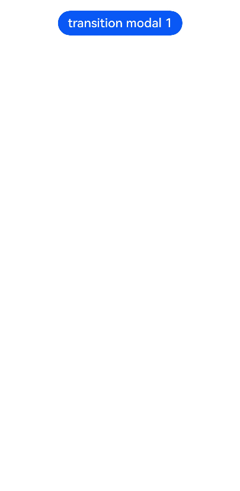

# 半模态转场

通过bindSheet属性为组件绑定半模态页面，在组件插入时可通过设置自定义或默认的内置高度确定半模态大小。

>  **说明：**
>
>  从API Version 10开始支持。后续版本如有新增内容，则采用上角标单独标记该内容的起始版本。
>
>  不支持路由跳转。

## bindSheet

bindSheet(isShow: boolean, builder: CustomBuilder, options?: SheetOptions)

给组件绑定半模态页面，点击后显示模态页面。

**系统能力：** SystemCapability.ArkUI.ArkUI.Full

**参数：** 

| 参数名  | 类型                                        | 必填 | 说明                                                         |
| ------- | ------------------------------------------- | ---- | ------------------------------------------------------------ |
| isShow  | boolean                                     | 是   | 是否显示半模态页面。<br/>从API version 10开始，该参数支持[$$](../../../quick-start/arkts-two-way-sync.md)双向绑定变量。 |
| builder | [CustomBuilder](ts-types.md#custombuilder8) | 是   | 配置半模态页面内容。                                         |
| options | [SheetOptions](#sheetoptions)               | 否   | 配置半模态页面的可选属性。                                   |

> **说明：**
>
> 在非双向绑定情况下，以拖拽方式关闭半模态页面不会改变isShow参数的值。
>
> 为了使isShow参数值与半模态界面的状态同步，建议使用[$$](../../../quick-start/arkts-two-way-sync.md)双向绑定isShow参数。
## SheetOptions

继承自[BindOptions](#bindoptions)。

| 名称              | 类型                                       | 必填   | 描述              |
| --------------- | ---------------------------------------- | ---- | --------------- |
| height          | [SheetSize](#sheetsize枚举说明)&nbsp;\|&nbsp;[Length](ts-types.md#length) | 否    | 半模态高度，默认是LARGE。<br/>**说明：**<br/>底部弹窗竖屏时，当设置detents时，该属性设置无效。<br/>底部弹窗竖屏时，最大高度为距离信号栏8vp。<br />底部弹窗横屏时，该属性设置无效，高度为距离屏幕顶部8vp。<br/>居中弹窗和跟手弹窗设置类型为SheetSize.LARGE和SheetSize.MUDIUM无效，显示默认高度560vp。居中弹窗和跟手弹窗最小高度为320vp，最大高度为窗口短边的90%。当使用Length设置的高度和使用SheetSize.FIT_CONTENT自适应的高度大于最大高度，则显示最大高度，小于最小高度，则显示最小高度。 |
| detents<sup>11+</sup> | [([SheetSize](#sheetsize枚举说明) \| [Length](ts-types.md#length)), ( [SheetSize](#sheetsize枚举说明) \| [Length](ts-types.md#length))?, ([SheetSize](#sheetsize枚举说明) \| [Length](ts-types.md#length))?] | 否 | 半模态页面的切换高度档位。<br/>**说明：**<br/>底部弹窗竖屏生效，元组中第一个高度为初始高度。<br />面板可跟手滑动切换档位，松手后是否滑动至目标档位有两个判断条件：速度和距离。速度超过阈值，则执行滑动至与手速方向一致的目标档位；速度小于阈值，则引入距离判断条件，当位移距离>当前位置与目标位置的1/2，滑动至与手速方向一致的目标档位，位移距离当前位置与目标位置的1/2，返回至当前档位。速度阈值：1000，距离阈值：50%。 |
| preferType<sup>11+</sup> | [SheetType.CENTER](#sheettype11枚举说明) \|  [SheetType.POPUP](#sheettype11枚举说明) | 否 | 半模态页面的样式。<br/>**说明：**<br/>preferType不可设置为SheetType.BOTTOM。 |
| showClose<sup>11+</sup> | boolean \| [Resource](ts-types.md#resource) | 否 | 是否显示关闭图标，默认显示。<br/>**说明：**<br/>Resource需要为boolean类型。 |
| dragBar         | boolean                                  | 否    | 是否显示控制条。<br/>**说明：**<br/>半模态面板的dentents属性设置多个不同高度并且设置生效时，默认显示控制条。否则不显示控制条。 |
| blurStyle<sup>11+</sup> | [BlurStyle](ts-appendix-enums.md#blurstyle9) | 否 | 半模态面板的模糊背景。默认无模糊背景。 |
| maskColor | [ResourceColor](ts-types.md#resourcecolor) | 否 | 半模态页面的背景蒙层颜色。 |
| title<sup>11+</sup> | [SheetTitleOptions](#sheettitleoptions11) \| [CustomBuilder](ts-types.md#custombuilder8) | 否 | 半模态面板的标题。 |
| enableOutsideInteractive<sup>11+</sup> | boolean | 否 | 半模态所在页面是否允许交互。<br/>**说明：**<br/>设置为true时允许交互，不显示蒙层；设置为false时不允许交互，显示蒙层；若不进行设置，默认底部弹窗与居中弹窗不允许交互，跟手弹窗允许交互。当设置为true时，maskColor设置无效。 |
| shouldDismiss<sup>11+</sup> | (sheetDismiss: [SheetDismiss](#sheetdismiss11)) => void | 否 | 半模态页面交互式关闭回调函数。<br/>**说明：**<br/>当用户执行下拉关闭/back事件/点击蒙层关闭/关闭按钮关闭交互操作时，如果注册该回调函数，则不会立刻关闭。 |

## SheetSize枚举说明

| 名称                      | 参数描述                         |
| ------------------------- | -------------------------------- |
| MEDIUM                    | 指定半模态高度为屏幕高度一半。   |
| LARGE                     | 指定半模态高度几乎为屏幕高度。   |
| FIT_CONTENT<sup>11+</sup> | 指定半模态高度为适应内容的高度。 |

## BindOptions

| 名称            | 类型                                       | 必填 | 说明                     |
| --------------- | ------------------------------------------ | ---- | ------------------------ |
| backgroundColor | [ResourceColor](ts-types.md#resourcecolor) | 否   | 半模态页面的背板颜色。   |
| onAppear        | () => void                                 | 否   | 半模态页面显示（动画结束后）回调函数。 |
| onDisappear     | () => void                                 | 否   | 半模态页面回退（动画结束后）回调函数。 |

## SheetType<sup>11+</sup>枚举说明

| 名称   | 参数描述                                               |
| ------ | ------------------------------------------------------ |
| BOTTOM | 底部弹窗。                                             |
| CENTER | 居中弹窗。                                             |
| POPUP  | 跟手弹窗。跟手弹窗面板不支持跟手滑动，下滑面板不关闭。 |

## SheetDismiss<sup>11+</sup>

| 名称    | 类型       | 必填 | 描述                                                         |
| ------- | ---------- | ---- | ------------------------------------------------------------ |
| dismiss | () => void | 是   | 半模态面板关闭回调函数。开发者需要退出时调用，不需要退出时无需调用。 |

## SheetTitleOptions<sup>11+</sup>

| 名称     | 类型                                   | 必填 | 描述                 |
| -------- | -------------------------------------- | ---- | -------------------- |
| title    | [ResourceStr](ts-types.md#resourcestr) | 是   | 半模态面板的主标题。 |
| subtitle | [ResourceStr](ts-types.md#resourcestr) | 否   | 半模态面板的副标题。 |

## 示例1

```ts
// xxx.ets
@Entry
@Component
struct SheetTransitionExample {
  @State isShow:boolean = false
  @State isShow2:boolean = false
  @State sheetHeight:number = 300;

  @Builder myBuilder() {
    Column() {
      Button("change height")
        .margin(10)
        .fontSize(20)
        .onClick(()=>{
          this.sheetHeight = 500;
        })

      Button("Set Illegal height")
        .margin(10)
        .fontSize(20)
        .onClick(()=>{
          this.sheetHeight = -1;
        })

      Button("close modal 1")
        .margin(10)
        .fontSize(20)
        .onClick(()=>{
          this.isShow = false;
        })
    }
    .width('100%')
    .height('100%')
  }

  build() {
    Column() {
      Button("transition modal 1")
        .onClick(() => {
          this.isShow = true
        })
        .fontSize(20)
        .margin(10)
        .bindSheet($$this.isShow, this.myBuilder(), {
          height: this.sheetHeight, 
          backgroundColor: Color.Green, 
          onAppear: () => {console.log("BindSheet onAppear.")}, 
          onDisappear: () => {console.log("BindSheet onDisappear.")}
        })
    }
    .justifyContent(FlexAlign.Center)
    .width('100%')
    .height('100%')
  }
}
```


## 示例2

```ts
// xxx.ets
@Entry
@Component
struct SheetTransitionExample {
  @State isShow:boolean = false
  @Builder myBuilder() {
    Column() {
      Button("content1")
        .margin(10)
        .fontSize(20)

      Button("content2")
        .margin(10)
        .fontSize(20)
    }
    .width('100%')
  }

  build() {
    Column() {
      Button("transition modal 1")
        .onClick(() => {
          this.isShow = true
        })
        .fontSize(20)
        .margin(10)
        .bindSheet($$this.isShow, this.myBuilder(),{
          detents:[SheetSize.MEDIUM,SheetSize.LARGE,200],
          backgroundColor:Color.Gray,
          blurStyle:BlurStyle.Thick,
          showClose:true,
          title:{title:"title", subtitle:"subtitle"},
          preferType: SheetType.CENTER,
          shouldDismiss:((sheetDismiss: SheetDismiss)=> {
            console.log("bind sheet shouldDismiss")
            sheetDismiss.dismiss()
          })
        })
    }
    .justifyContent(FlexAlign.Start)
    .width('100%')
    .height('100%')
  }
}
```

