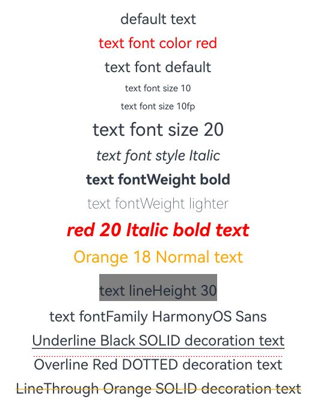

# 文本通用 

文本通用属性目前只针对包含文本元素的组件，设置文本样式。

>  **说明：**
>
>  从API Version 7开始支持。后续版本如有新增内容，则采用上角标单独标记该内容的起始版本。

## fontColor

fontColor(value: ResourceColor)

设置字体颜色。

**卡片能力：** 从API version 9开始，该接口支持在ArkTS卡片中使用。

**原子化服务API：** 从API version 11开始，该接口支持在原子化服务中使用。

**系统能力：** SystemCapability.ArkUI.ArkUI.Full

**参数：** 

| 参数名 | 类型                                       | 必填 | 说明       |
| ------ | ------------------------------------------ | ---- | ---------- |
| value  | [ResourceColor](ts-types.md#resourcecolor) | 是   | 字体颜色。 |

## fontSize

fontSize(value: number | string | Resource)

设置字体大小。

**卡片能力：** 从API version 9开始，该接口支持在ArkTS卡片中使用。

**原子化服务API：** 从API version 11开始，该接口支持在原子化服务中使用。

**系统能力：** SystemCapability.ArkUI.ArkUI.Full

**参数：** 

| 参数名 | 类型                                                         | 必填 | 说明                                                         |
| ------ | ------------------------------------------------------------ | ---- | ------------------------------------------------------------ |
| value  | [Resource](ts-types.md#resource)&nbsp;\|&nbsp;number&nbsp;\|&nbsp;string | 是   | 字体大小。fontSize为number类型时，使用fp单位。字体默认大小16fp。不支持设置百分比字符串。 |

## fontStyle

fontStyle(value: FontStyle)

设置字体样式。

**卡片能力：** 从API version 9开始，该接口支持在ArkTS卡片中使用。

**原子化服务API：** 从API version 11开始，该接口支持在原子化服务中使用。

**系统能力：** SystemCapability.ArkUI.ArkUI.Full

**参数：** 

| 参数名 | 类型                                        | 必填 | 说明                                    |
| ------ | ------------------------------------------- | ---- | --------------------------------------- |
| value  | [FontStyle](ts-appendix-enums.md#fontstyle) | 是   | 字体样式。<br/>默认值：FontStyle.Normal |

## fontWeight

fontWeight(value: number | FontWeight | string)

设置文本的字体粗细，设置过大可能会在不同字体下有截断。

**卡片能力：** 从API version 9开始，该接口支持在ArkTS卡片中使用。

**原子化服务API：** 从API version 11开始，该接口支持在原子化服务中使用。

**系统能力：** SystemCapability.ArkUI.ArkUI.Full

**参数：** 

| 参数名 | 类型                                                         | 必填 | 说明                                                         |
| ------ | ------------------------------------------------------------ | ---- | ------------------------------------------------------------ |
| value  | [FontWeight](ts-appendix-enums.md#fontweight)&nbsp;\|&nbsp;number&nbsp;\|&nbsp;string | 是   | 文本的字体粗细，number类型取值[100,&nbsp;900]，取值间隔为100，默认为400，取值越大，字体越粗。string类型仅支持number类型取值的字符串形式，例如"400"，以及"bold"、"bolder"、"lighter"、"regular"、"medium"，分别对应FontWeight中相应的枚举值。<br/>默认值：FontWeight.Normal |

## fontFamily

fontFamily(value: string | Resource)

设置字体列表。

**卡片能力：** 从API version 9开始，该接口支持在ArkTS卡片中使用。

**原子化服务API：** 从API version 11开始，该接口支持在原子化服务中使用。

**系统能力：** SystemCapability.ArkUI.ArkUI.Full

**参数：** 

| 参数名 | 类型                                                 | 必填 | 说明                                                         |
| ------ | ---------------------------------------------------- | ---- | ------------------------------------------------------------ |
| value  | [Resource](ts-types.md#resource)&nbsp;\|&nbsp;string | 是   | 字体列表。默认字体'HarmonyOS Sans'。<br>应用当前支持'HarmonyOS Sans'字体和[注册自定义字体](../js-apis-font.md)。<br>卡片当前仅支持'HarmonyOS Sans'字体。 |

## lineHeight

lineHeight(value: number | string | Resource)

设置文本的文本行高，设置值不大于0时，不限制文本行高，自适应字体大小。

**卡片能力：** 从API version 9开始，该接口支持在ArkTS卡片中使用。

**系统能力：** SystemCapability.ArkUI.ArkUI.Full

**参数：** 

| 参数名 | 类型                                                         | 必填 | 说明                               |
| ------ | ------------------------------------------------------------ | ---- | ---------------------------------- |
| value  | [Resource](ts-types.md#resource)&nbsp;\|&nbsp;number&nbsp;\|&nbsp;string | 是   | 文本行高，为number类型时单位为fp。 |

## decoration

decoration(value: DecorationStyleInterface)

设置文本装饰线样式及其颜色。

**卡片能力：** 从API version 9开始，该接口支持在ArkTS卡片中使用。

**系统能力：** SystemCapability.ArkUI.ArkUI.Full

**参数：** 

| 参数名 | 类型                                                         | 必填 | 说明                                                         |
| ------ | ------------------------------------------------------------ | ---- | ------------------------------------------------------------ |
| value  | [DecorationStyleInterface<sup>12+</sup>](ts-universal-styled-string.md#decorationstyleinterface对象说明) | 是   | 文本装饰线样式对象。<br/>默认值：<br/>{<br/>&nbsp;type:&nbsp;TextDecorationType.None,<br/>&nbsp;color:&nbsp;Color.Black,<br/>&nbsp;style:&nbsp;TextDecorationStyle.SOLID&nbsp;<br/>} |


## TextRange<sup>12+</sup>

文本范围。

| 参数名 | 类型 | 必填 | 说明 |
| -- | -- | -- | -- |
| start | number | 否 | 起始索引。 |
| end | number | 否 | 结束索引。 |

## OnDidChangeCallback<sup>12+</sup>

type OnDidChangeCallback = (rangeBefore: TextRange, rangeAfter: TextRange) => void

文本变换后回调。

**参数：**

| 参数名 | 类型 | 必填 | 说明 |
| -- | -- | -- | -- |
| rangeBefore | [TextRange](#textrange12) | 是 | 文本变化前将要被替换的文本范围。 |
| rangeAfter | [TextRange](#textrange12) | 是 | 文本变化后新增内容的文本范围。 |

## StyledStringChangedListener<sup>12+</sup>
属性字符串的文本内容变化监听器
| 参数名 | 类型 | 必填 | 说明 |
| -- | -- | -- | -- |
| onWillChange | Callback<[StyledStringChangeValue](#styledstringchangevalue12), boolean> | 否 | 文本内容将要变化回调函数。 |
| onDidChange | [OnDidChangeCallback](#ondidchangecallback12) | 否 | 文本内容完成变化回调函数。 |

## StyledStringChangeValue<sup>12+</sup>
属性字符串的文本变化信息

| 参数名 | 类型 | 必填 | 说明 |
| -- | -- | -- | -- |
| range | TextRange | 是 | 即将被替换的属性字符串子串在原字符串中的范围。 |
| replacementString | [StyledString](ts-universal-styled-string.md#styledstring) | 是 | 用于替换的属性字符串。 |

## 示例

```ts
// xxx.ets
@Entry
@Component
struct TextStyleExample {
  build() {
    Column({ space: 5 }) {
      Text('default text')
      
      Text('text font color red').fontColor(Color.Red)
      
      Text('text font default')
      Text('text font size 10').fontSize(10)
      Text('text font size 10fp').fontSize('10fp')
      Text('text font size 20').fontSize(20)
      
      Text('text font style Italic').fontStyle(FontStyle.Italic)
      
      Text('text fontWeight bold').fontWeight(700)
      Text('text fontWeight lighter').fontWeight(FontWeight.Lighter)
      
      Text('red 20 Italic bold text')
        .fontColor(Color.Red)
        .fontSize(20)
        .fontStyle(FontStyle.Italic)
        .fontWeight(FontWeight.Bold)
      
      Text('Orange 18 Normal text')
        .fontColor(Color.Orange)
        .fontSize(18)
        .fontStyle(FontStyle.Normal)
    }.width('100%')
  }
}
```


