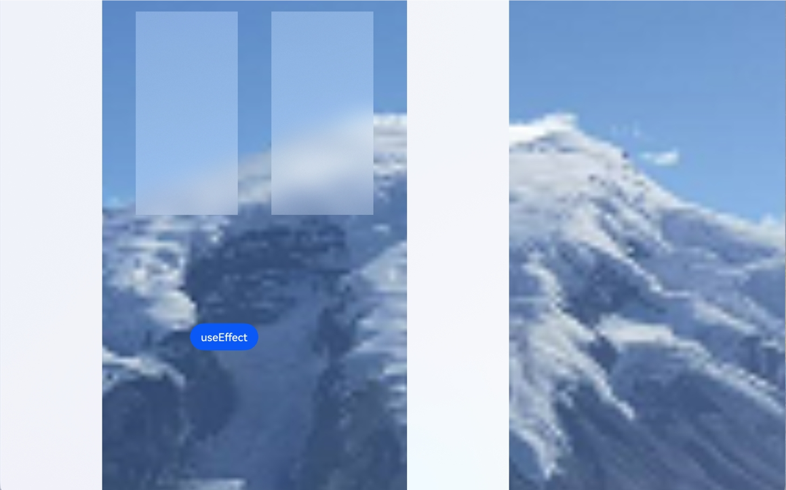

# 特效绘制合并

用于对背景模糊等特效进行绘制合并。

> **说明：**
>
> 从API Version 12开始支持。后续版本如有新增内容，则采用上角标单独标记该内容的起始版本。
>

## useEffect

useEffect(value: boolean)

用于对背景模糊等特效进行绘制合并。

**原子化服务API：** 从API version 12开始，该接口支持在原子化服务中使用。

**系统能力：** SystemCapability.ArkUI.ArkUI.Full

**参数：**

| 参数名 | 类型 | 必填 | 说明 |
| -------- | -------- | -------- | -------- |
| value | boolean | 是 | 控制组件是否继承EffectComponent组件的特效属性参数，从而合并绘制特效。<br/>useEffect为true时子组件继承EffectComponent组件的特效属性参数，为false时子组件不继承EffectComponent组件的特效属性参数。<br/>默认值：false|

## useEffect<sup>14+</sup>

useEffect(useEffect: boolean, effectType: EffectType)

用于设置组件是否应用<!--Del-->父级[EffectComponent](ts-container-effectcomponent-sys.md)或<!--DelEnd-->窗口定义的效果模板。

**原子化服务API：** 从API version 14开始，该接口支持在原子化服务中使用。

**系统能力：** SystemCapability.ArkUI.ArkUI.Full

**参数：**

| 参数名 | 类型 | 必填 | 说明 |
| -------- | -------- | -------- | -------- |
| useEffect | boolean | 是 | 控制组件是否应用<!--Del-->父级EffectComponent或<!--DelEnd-->窗口定义的效果模板。<br/>useEffect为true时表示应用<!--Del-->父级EffectComponent或<!--DelEnd-->窗口定义的效果模板。<br/>默认值：false|
| effectType | [EffectType](ts-universal-attributes-use-effect.md#effecttype14) | 是 | 设置组件应用<!--Del-->父级EffectComponent或<!--DelEnd-->窗口定义的效果模板。<br/>默认值：EffectType.DEFAULT|

## EffectType<sup>14+</sup>

使用效果模板种类的枚举值。

**原子化服务API：** 从API version 14开始，该接口支持在原子化服务中使用。

**系统能力：**  SystemCapability.ArkUI.ArkUI.Full

| 名称     | 值   | 说明                   |
| -------- | ---- | ---------------------- |
| DEFAULT  | 0   | 使用<!--Del-->父级EffectComponent定义的<!--DelEnd-->效果模板进行定义。 |
| WINDOW_EFFECT  | 1   | 使用窗口定义的效果模板进行定义。 |

效果模板

|  设备类型    | 模糊半径(单位: px)   | 饱和度                 |  亮度  |  颜色  |
| -------- | ---- | ---------------------- | -------- | -------- |
| 移动设备  | 0   | 0 | 0 | '#ffffffff'
| 2in1设备：深色模式  | 80   | 1.5 | 1.0 | '#e52e3033'
| 2in1设备：浅色模式  | 80   | 1.9 | 1.0 | '#e5ffffff'
| Tablet设备  | 0   | 0 | 0 | '#ffffffff'

<!--Del-->
## 示例

该示例主要通过背景模糊等特效进行绘制合并效果。

<!--code_no_check-->

```ts
//Index.ets
@Entry
@Component
struct Index {
  @State isUse: boolean = true;

  build() {
    Stack() {
      Image($r("app.media.mountain"))
        .autoResize(true)
      EffectComponent() {
        Column({ space: 20 }) {
           Column() {
           }
           .position({ x: 0, y: 0 })
           .width(150)
           .height(800)
           .useEffect(this.isUse, EffectType.WINDOW_EFFECT)
         
           Column() {
           }
           .position({ x: 200, y: 20 })
           .width(150)
           .height(300)
           .useEffect(this.isUse, EffectType.DEFAULT)

           Column() {
           }
           .position({ x: 400, y: 20 })
           .width(150)
           .height(300)
           .useEffect(this.isUse)
        }
        .width('100%')
        .height('100%')
      }
      .backgroundBlurStyle(BlurStyle.Thin)

       Column() {
       }
        .position({ x: 600, y: 0 })
        .width(150)
        .height(800)
        .useEffect(this.isUse, EffectType.WINDOW_EFFECT)

      Row() {
        Button('useEffect')
        .margin(30)
        .onClick(() => {
          this.isUse = !this.isUse;
        })
      }
      .position({ x: 300, y: 450 })
    }
    .backgroundColor(Color.Black)
    .width('100%')
  }
}
```


<!--DelEnd-->