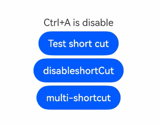

# 组件快捷键事件

开发者可以设置组件的自定义组合键，组件在未获得焦点状态下也可以响应自定义组合键，每个组件可以设置多个组合键。

开发者在设置组合键的同时可以设置自定义事件，组合键按下时，触发该自定义事件，若没有设置自定义事件，则组合键行为与click行为一致。

>  **说明：**
>
>  从API Version 10开始支持。后续版本如有新增内容，则采用上角标单独标记该内容的起始版本。

## keyboardShortcut

keyboardShortcut(value: string | FunctionKey, keys: Array\<ModifierKey>, action?: () => void): T

设置组件的自定义组合键。

**系统能力：** SystemCapability.ArkUI.ArkUI.Full

**参数：**

| 参数名   | 参数类型                                  | 必填   | 参数描述                                     |
| ----- | ------------------------------------- | ---- | ---------------------------------------- |
| value | string \| [FunctionKey](#functionkey) | 是 | 热键的单个字符（可以通过键盘输入的字符）或[FunctionKey](#functionkey)。<br />空字符串意为取消快捷键绑定。<br/> |
| keys  | Array\<[ModifierKey](#modifierkey)> | 是 | 热键组合。<br />仅当value为[FunctionKey](#functionkey)的情况下可以为空。<br/> |
| action  | () => void    | 否    | 组合快捷键触发成功后的自定义事件回调。<br/>                               |

**返回值：**

| 类型 | 说明 |
| -------- | -------- |
| T | 返回当前组件。 |

## ModifierKey

| 名称    | 描述           |
| ----- | ------------ |
| CTRL  | 表示键盘上Ctrl键。  |
| SHIFT | 表示键盘上Shift键。 |
| ALT   | 表示键盘上Alt键。   |

## FunctionKey

| 名称   | 描述           |
| ---- | ------------ |
| ESC  | 表示键盘上ESC功能键。 |
| F1   | 表示键盘上F1功能键。  |
| F2   | 表示键盘上F2功能键。  |
| F3   | 表示键盘上F3功能键。  |
| F4   | 表示键盘上F4功能键。  |
| F5   | 表示键盘上F5功能键。  |
| F6   | 表示键盘上F6功能键。  |
| F7   | 表示键盘上F7功能键。  |
| F8   | 表示键盘上F8功能键。  |
| F9   | 表示键盘上F9功能键。  |
| F10  | 表示键盘上F10功能键。 |
| F11  | 表示键盘上F11功能键。 |
| F12  | 表示键盘上F12功能键。 |
| TAB<sup>12+</sup>  | 表示键盘上TAB功能键。 |
| UP<sup>12+</sup>   | 表示键盘上UP方向键。  |
| DOWN<sup>12+</sup> | 表示键盘上DOWN方向键。 |
| LEFT<sup>12+</sup> | 表示键盘上LEFT方向键。 |
| RIGHT<sup>12+</sup> | 表示键盘上RIGHT方向键。 |

## 快捷键使用注意事项

快捷键是对系统按键的响应，优先于普通的按键事件`OnKeyEvent`，按键事件触发的逻辑详见[按键事件数据流](../../../ui/arkts-common-events-device-input-event.md#按键事件数据流)

| 场景                                       | 快捷键处理逻辑                            | 例子                                       |
| ---------------------------------------- | ---------------------------------- | ---------------------------------------- |
| 所有支持onClick事件的组件                         | 支持自定义组合键                           | 无                                        |
| 自定义组合键要求                                 | 控制键Ctrl、Shift、Alt及它们的组合加上其它可输入字符按键 | Button('button1').keyboardShortcut('a',[ModifierKey.CTRL]) |
| 多个不同组件设置相同组合键                            | 只响应结点树上的第一个组件，其它组件不响应快捷键。          | Button('button1').keyboardShortcut('a',[ModifierKey.CTRL])<br />Button('button2').keyboardShortcut('a',[ModifierKey.CTRL]) |
| 无论组件是否获得焦点                               | 只要窗口获焦快捷键就会响应                      | 无                                        |
| 使用单个`FunctionKey`触发快捷键 | 单个`FunctionKey`，没有`ModifierKey`，可以绑定为快捷键 | Button('button1').keyboardShortcut('FunctionKey.F2',[])                                        |
| `keyboardShortcut`的入参`value`为空 | 取消绑定的快捷键。<br />绑定多个快捷键的时候无法取消快捷键。| Button('button1').keyboardShortcut('',[ModifierKey.CTRL])<br />Button('button2').keyboardShortcut('',[]) |
| 独立pipeline子窗口、主窗口共存的情况下                  | 获焦的窗口响应快捷键                         | 无                                        |
| keyboardShortcut接口中的keys命令中ctrl、shift、alt | 不区分左右键都响应                          | Button('button1').keyboardShortcut('a',[ModifierKey.CTRL, ModifierKey.ALT]) |
| keyboardShortcut接口中的value单个字符            | 不区分大小写都响应                          | Button('button1').keyboardShortcut('a',[ModifierKey.CTRL])<br />Button('button2').keyboardShortcut('A',[ModifierKey.CTRL]) |
| 快捷键的响应                                   | `keys`键处于按下状态且`value`键触发down事件（长按会连续响应）              | 无                                        |
| 隐藏组件<br />                               | 响应快捷键                              | 无                                        |
| disable状态组件                              | 不响应快捷键                             | 无                                        |
| 1. 组件的组合键(包括系统预定义快捷键)相同时。<br />2. 接口参数value有多个字符时。<br />3. 接口参数keys有重复的控制键时。 | 这几种情况不绑定组合键, 先前绑定的组合键仍然有效          | Button('button1').keyboardShortcut('c',[ModifierKey.CTRL])<br />Button('button2').keyboardShortcut('ab',[ModifierKey.CTRL])<br />Button('button3').keyboardShortcut('ab',[ModifierKey.CTRL,ModifierKey.CTRL]) |
| SHIFT+TAB键用于响应焦点事件 | 焦点事件响应优先级详见[按键事件数据流](../../../ui/arkts-common-events-device-input-event.md#按键事件数据流)    | 无 |

## 系统已有组合键

| 快捷键            | 组件                                       |
| -------------- | ---------------------------------------- |
| Ctrl + C       | [Image](ts-basic-components-image.md)、[TextInput](ts-basic-components-textinput.md)、[TextArea](ts-basic-components-textarea.md) |
| Ctrl+ A        |  [Image](ts-basic-components-image.md)、[TextInput](ts-basic-components-textinput.md)、[TextArea](ts-basic-components-textarea.md) |
| Ctrl+ V        |  [Image](ts-basic-components-image.md)、[TextInput](ts-basic-components-textinput.md)、[TextArea](ts-basic-components-textarea.md) |
| Ctrl+ X        |  [Image](ts-basic-components-image.md)、[TextInput](ts-basic-components-textinput.md)、[TextArea](ts-basic-components-textarea.md) |
| Shift + 方向键    |  [Image](ts-basic-components-image.md)、[TextInput](ts-basic-components-textinput.md)、[TextArea](ts-basic-components-textarea.md) |
| Ctrl+ Shift+ Z |  [Image](ts-basic-components-image.md)、[TextInput](ts-basic-components-textinput.md)、[TextArea](ts-basic-components-textarea.md) |
| Ctrl+ Z        |  [Image](ts-basic-components-image.md)、[TextInput](ts-basic-components-textinput.md)、[TextArea](ts-basic-components-textarea.md) |
| Ctrl+ Y        |  [Image](ts-basic-components-image.md)、[TextInput](ts-basic-components-textinput.md)、[TextArea](ts-basic-components-textarea.md) |
| 方向键、回车键        |  [Image](ts-basic-components-image.md)、[TextInput](ts-basic-components-textinput.md)、[TextArea](ts-basic-components-textarea.md) |
| TAB键           |  [Image](ts-basic-components-image.md)、[TextInput](ts-basic-components-textinput.md)、[TextArea](ts-basic-components-textarea.md) |
| Shift + TAB     |  [Image](ts-basic-components-image.md)、[TextInput](ts-basic-components-textinput.md)、[TextArea](ts-basic-components-textarea.md) |

## 示例

### 示例1

设置组件的快捷键，同时按控制键+对应的字符可以触发组件响应快捷键，并触发onClick事件或自定义事件。

```ts
@Entry
@Component
struct Index {
  @State message: string = 'Hello World'

  build() {
    Row() {
      Column({ space: 5 }) {
        Text(this.message)
        Button("Test short cut 1").onClick((event) => {
          this.message = "I clicked Button 1";
          console.log("I clicked 1");
        }).keyboardShortcut('.', [ModifierKey.SHIFT, ModifierKey.CTRL, ModifierKey.ALT])
          .onKeyEvent((event)=>{
            console.log("event.keyCode: " + JSON.stringify(event));
          })
        Button("Test short cut 2").onClick((event) => {
          this.message = "I clicked Button 2";
          console.log("I clicked 2");
        }).keyboardShortcut('1', [ModifierKey.CTRL])
        Button("Test short cut 3").onClick((event) => {
          this.message = "I clicked Button 3";
          console.log("I clicked 3");
        }).keyboardShortcut('A', [ModifierKey.SHIFT])
        Button("Test short cut 4").onClick((event) => {
          this.message = "I clicked Button 4";
          console.log("I clicked 4");
        }).keyboardShortcut(FunctionKey.F5, [], () => {
          this.message = "I clicked Button 4";
          console.log("I clicked user callback.");
        }).keyboardShortcut(FunctionKey.F3, [])
      }
      .width('100%')
    }
    .height('100%')
  }
}
```

 

### 示例2

通过按键注册和解注册快捷键绑定

```ts
@Entry
@Component
struct Index {
  @State message: string = 'disable'
  @State shortCutEnable: boolean = false
  @State keyValue: string = ''

  build() {
    Row() {
      Column({ space: 5 }) {
        Text('Ctrl+A is ' + this.message)
        Button("Test short cut").onClick((event) => {
          this.message = "I clicked Button";
          console.log("I clicked");
        }).keyboardShortcut(this.keyValue, [ModifierKey.CTRL])
        Button(this.message + 'shortCut').onClick((event) => {
          this.shortCutEnable = !this.shortCutEnable;
          this.message = this.shortCutEnable ? 'enable' : 'disable';
          this.keyValue = this.shortCutEnable ? 'a' : '';
        })
        Button('multi-shortcut').onClick((event) => {
          console.log('Trigger keyboard shortcut success.')
        }).keyboardShortcut('q', [ModifierKey.CTRL])
          .keyboardShortcut('w', [ModifierKey.CTRL])
          .keyboardShortcut('', []) // 不生效，绑定了多个快捷键的组件不能取消快捷键
      }
      .width('100%')
    }
    .height('100%')
  }
}
```

 