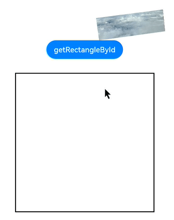

# @ohos.arkui.componentUtils (componentUtils)

提供获取组件绘制区域坐标和大小的能力。

> **说明：**
>
> 从API Version 10开始支持。后续版本如有新增内容，则采用上角标单独标记该内容的起始版本。
>
> 本模块功能依赖UI的执行上下文，不可在[UI上下文不明确](../../ui/arkts-global-interface.md#ui上下文不明确)的地方使用，参见[UIContext](./arkts-apis-uicontext-uicontext.md)说明。 

## 导入模块

```ts
import { componentUtils } from '@kit.ArkUI';
```
## componentUtils.getRectangleById<sup>(deprecated)</sup>

getRectangleById(id: string): ComponentInfo

根据组件ID获取组件实例对象，通过组件实例对象将获取的坐标位置和大小同步返回给开发者。

> **说明：**
>
> 从API version 18开始废弃，建议使用[UIContext](arkts-apis-uicontext-uicontext.md)中的[getComponentUtils](arkts-apis-uicontext-uicontext.md#getcomponentutils)获取[ComponentUtils](arkts-apis-uicontext-uicontext.md#componentutils)实例，再通过此实例调用替代方法[getRectangleById](arkts-apis-uicontext-uicontext.md#getrectanglebyid)。
>
> 从API version 10开始，可以通过使用[UIContext](arkts-apis-uicontext-uicontext.md)中的[getComponentUtils](arkts-apis-uicontext-uicontext.md#getcomponentutils)方法获取当前UI上下文关联的[ComponentUtils](arkts-apis-uicontext-uicontext.md#componentutils)对象。该接口需要在目标组件布局、完成以后获取目标组件区域大小信息，建议在[onAppear](./arkui-ts/ts-universal-events-show-hide.md#onappear)中使用该接口。

**原子化服务API：** 从API version 11开始，该接口支持在原子化服务中使用。

**系统能力：** SystemCapability.ArkUI.ArkUI.Full

**参数：** 

| 参数名 | 类型   | 必填 | 说明       |
| ------ | ------ | ---- | ---------- |
| id     | string | 是   | 指定组件id。 |

**返回值：** 

| 类型   | 说明       |
| ------ | ---------- |
| [ComponentInfo](#componentinfo) | 组件大小、位置、平移缩放旋转及仿射矩阵属性信息。 |

**错误码：** 

以下错误码的详细介绍请参见[通用错误码](../errorcode-universal.md)错误码。

| 错误码ID  | 错误信息                |
| ------ | ------------------- |
| 100001 | UI execution context not found. |

**示例：**

```ts
import { componentUtils } from '@kit.ArkUI';
let modePosition:componentUtils.ComponentInfo = componentUtils.getRectangleById("onClick");
```

## ComponentInfo

组件大小、位置、平移缩放旋转及仿射矩阵属性信息。

**原子化服务API：** 从API version 11开始，该接口支持在原子化服务中使用。

**系统能力：** SystemCapability.ArkUI.ArkUI.Full

| 名称           | 类型             | 必填           | 说明                         |
| ---------------|------------     | -----------------------------| -----------------------------|
| size           | [Size](#size) | 是 | 组件大小。                    |
| localOffset    | [Offset](#offset) | 是 | 组件相对于父组件信息。         |
| windowOffset   | [Offset](#offset) | 是 | 组件相对于窗口信息。           |
| screenOffset   | [Offset](#offset) | 是 | 组件相对于屏幕信息。           |
| translate      | [TranslateResult](#translateresult) | 是 | 组件平移信息。                |
| scale          | [ScaleResult](#scaleresult) | 是 | 组件缩放信息。                |
| rotate         | [RotateResult](#rotateresult) | 是 | 组件旋转信息。                |
| transform      | [Matrix4Result](#matrix4result) | 是 | 仿射矩阵信息，根据入参创建的四阶矩阵对象。  |

### Size 

**原子化服务API：** 从API version 11开始，该接口支持在原子化服务中使用。

**系统能力：** SystemCapability.ArkUI.ArkUI.Full

| 名称     | 类型 | 必填 | 说明                               |
| -------- | ---- | ----------------------------------| ----------------------------------|
| width    | number | 是 | 组件宽度。<br />单位: px                      |
| height   | number | 是 | 组件高度。<br />单位: px                      |

### Offset

**原子化服务API：** 从API version 11开始，该接口支持在原子化服务中使用。

**系统能力：** SystemCapability.ArkUI.ArkUI.Full

| 名称     | 类型 | 必填 | 说明                               |
| --------| ---- | -----------------------------------| -----------------------------------|
| x       | number | 是 | x点坐标。<br />单位: px                           |
| y       | number | 是 | y点坐标。<br />单位: px                           |

### TranslateResult

**原子化服务API：** 从API version 11开始，该接口支持在原子化服务中使用。

**系统能力：** SystemCapability.ArkUI.ArkUI.Full

| 名称     | 类型 | 必填 | 说明                               |
| --------| ---- | -----------------------------------| -----------------------------------|
| x       | number | 是 | x轴平移距离。<br />单位: px                       |
| y       | number | 是 | y轴平移距离。<br />单位: px                       |
| z       | number | 是 | z轴平移距离。<br />单位: px                       |

### ScaleResult

**原子化服务API：** 从API version 11开始，该接口支持在原子化服务中使用。

**系统能力：** SystemCapability.ArkUI.ArkUI.Full

| 名称     | 类型 | 必填 | 说明                               |
| --------| ---- | -----------------------------------| -----------------------------------|
| x       | number | 是 | x轴缩放倍数。<br />单位: px                       |
| y       | number | 是 | y轴缩放倍数。<br />单位: px                       |
| z       | number | 是 | z轴缩放倍数。<br />单位: px                       |
| centerX | number | 是 | 变换中心点x轴坐标。<br />单位: px                  |
| centerY | number | 是 | 变换中心点y轴坐标。<br />单位: px                |

### RotateResult

**原子化服务API：** 从API version 11开始，该接口支持在原子化服务中使用。

**系统能力：** SystemCapability.ArkUI.ArkUI.Full

| 名称     | 类型 | 必填 | 说明                               |
| --------| ---- | -----------------------------------| -----------------------------------|
| x       | number | 是 | 旋转轴向量x坐标。<br />单位: px                   |
| y       | number | 是 | 旋转轴向量y坐标。<br />单位: px                   |
| z       | number | 是 | 旋转轴向量z坐标。<br />单位: px                   |
| angle   | number | 是 | 旋转角度。<br />单位: px                          |
| centerX | number | 是 | 变换中心点x轴坐标。<br />单位: px                 |
| centerY | number | 是 | 变换中心点y轴坐标。<br />单位: px                 |

### Matrix4Result

type Matrix4Result = [number,number,number,number,number,number,number,number,number,number,number,number,number,number,number,number]

**原子化服务API：** 从API version 11开始，该接口支持在原子化服务中使用。

**系统能力：** SystemCapability.ArkUI.ArkUI.Full

| 类型 | 说明                               |
| --------| -----------------------------------|
| [number,number,number,number,<br />number,number,number,number,<br />number,number,number,number,<br />number,number,number,number] | 取值范围为长度为16（4\*4）的number数组，&nbsp;详情见四阶矩阵说明。<br/>单位: px  |

**四阶矩阵说明：**

| 参数名 | 类型   | 必填 | 说明                                 |
| ------ | ------ | ---- | ------------------------------------ |
| m00    | number | 是   | x轴缩放值，单位矩阵默认为1。         |
| m01    | number | 是   | 第2个值，xyz轴旋转会影响这个值。     |
| m02    | number | 是   | 第3个值，xyz轴旋转会影响这个值。     |
| m03    | number | 是   | 无实际意义。                         |
| m10    | number | 是   | 第5个值，xyz轴旋转会影响这个值。     |
| m11    | number | 是   | y轴缩放值，单位矩阵默认为1。         |
| m12    | number | 是   | 第7个值，xyz轴旋转会影响这个值。     |
| m13    | number | 是   | 无实际意义。                         |
| m20    | number | 是   | 第9个值，xyz轴旋转会影响这个值。     |
| m21    | number | 是   | 第10个值，xyz轴旋转会影响这个值。    |
| m22    | number | 是   | z轴缩放值，单位矩阵默认为1。         |
| m23    | number | 是   | 无实际意义。                         |
| m30    | number | 是   | x轴平移值，单位px，单位矩阵默认为0。 |
| m31    | number | 是   | y轴平移值，单位px，单位矩阵默认为0。 |
| m32    | number | 是   | z轴平移值，单位px，单位矩阵默认为0。 |
| m33    | number | 是   | 齐次坐标下生效，产生透视投影效果。   |

**示例：**

> **说明：**
>
> 推荐通过使用[UIContext](arkts-apis-uicontext-uicontext.md)中的[getComponentUtils](./arkts-apis-uicontext-uicontext.md#getcomponentutils)方法获取当前UI上下文关联的ComponentUtils对象。

  ```ts
import { matrix4, componentUtils } from '@kit.ArkUI';

@Entry
@Component
struct Utils {
  @State x: number = 120;
  @State y: number = 10;
  @State z: number = 100;
  @State value: string = '';
  private matrix1 = matrix4.identity().translate({ x: this.x, y: this.y, z: this.z });

  build() {
    Column() {
      Image($r("app.media.img"))
        .transform(this.matrix1)
        .translate({ x: 20, y: 20, z: 20 })
        .scale({ x: 0.5, y: 0.5, z: 1 })
        .rotate({
          x: 1,
          y: 1,
          z: 1,
          centerX: '50%',
          centerY: '50%',
          angle: 300
        })
        .width(300)
        .height(100)
        .key("image_01")
      Button('getRectangleById')
      .onClick(() => {
        this.value = JSON.stringify(this.getUIContext().getComponentUtils().getRectangleById("image_01")) // 建议使用this.getUIContext().getComponentUtils()接口
      }).margin(10).id('onClick')
      Text(this.value)
        .margin(20)
        .width(300)
        .height(300)
        .borderWidth(2)
    }.margin({left: 50})
  }
}
  ```

   
