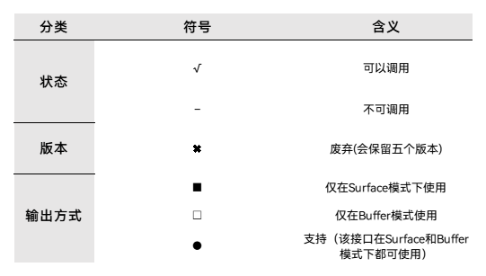
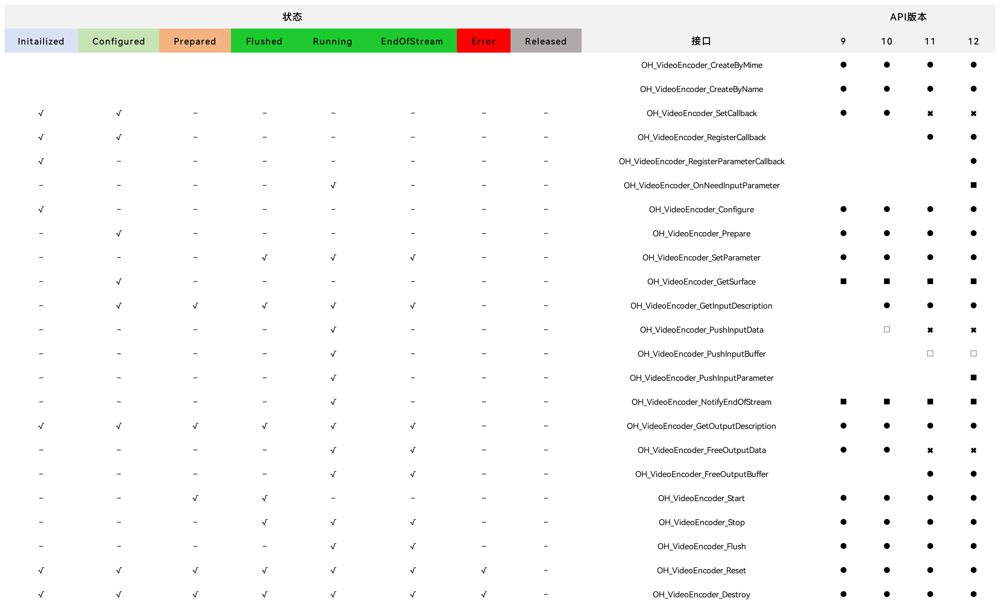

# VideoEncoder


## 概述

VideoEncoder模块提供用于视频编码的函数。

**系统能力：** SystemCapability.Multimedia.VideoEncoder

**起始版本：** 9

函数在每个版本，对每种模式的支持情况说明，如下图所示。





## 汇总


### 文件

| 名称 | 描述 | 
| -------- | -------- |
| [native_avcodec_videoencoder.h](native__avcodec__videoencoder_8h.md) | 声明用于视频编码的Native API。  | 


### 类型定义

| 名称 | 描述 | 
| -------- | -------- |
| typedef void(\* [OH_VideoEncoder_OnNeedInputParameter](#oh_videoencoder_onneedinputparameter)) ([OH_AVCodec](_codec_base.md#oh_avcodec) \*codec, uint32_t index, OH_AVFormat \*parameter, void \*userData) | 当OH_AVCodec在运行过程中需要新的输入参数时，将调用此函数指针，并携带可用的缓冲区来填充新的输入参数。设置的参数随帧立即生效。  | 

### 枚举

| 名称 | 描述 | 
| -------- | -------- |
| [OH_VideoEncodeBitrateMode](#oh_videoencodebitratemode) { CBR = 0, VBR = 1, CQ = 2 } | 视频编码器的比特率模式。  | 


### 函数

| 名称 | 描述 | 
| -------- | -------- |
| [OH_AVCodec](_codec_base.md#oh_avcodec) \* [OH_VideoEncoder_CreateByMime](#oh_videoencoder_createbymime) (const char \*mime) | 从MIME类型创建视频编码器实例，大多数情况下建议使用。  | 
| [OH_AVCodec](_codec_base.md#oh_avcodec) \* [OH_VideoEncoder_CreateByName](#oh_videoencoder_createbyname) (const char \*name) | 通过视频编码器名称创建视频编码器实例。  | 
| [OH_AVErrCode](_core.md#oh_averrcode) [OH_VideoEncoder_Destroy](#oh_videoencoder_destroy) ([OH_AVCodec](_codec_base.md#oh_avcodec) \*codec) | 清理编码器内部资源，销毁编码器实例。  | 
| [OH_AVErrCode](_core.md#oh_averrcode) [OH_VideoEncoder_SetCallback](#oh_videoencoder_setcallback) ([OH_AVCodec](_codec_base.md#oh_avcodec) \*codec, [OH_AVCodecAsyncCallback](_o_h___a_v_codec_async_callback.md) callback, void \*userData) | 设置异步回调函数，让应用可以响应视频编码器生成的事件。  | 
| [OH_AVErrCode](_core.md#oh_averrcode) [OH_VideoEncoder_RegisterCallback](#oh_videoencoder_registercallback) ([OH_AVCodec](_codec_base.md#oh_avcodec) \*codec, [OH_AVCodecCallback](_o_h___a_v_codec_callback.md) callback, void \*userData) | 注册异步回调函数，让应用可以响应视频编码器生成的事件。  | 
| [OH_AVErrCode](_core.md#oh_averrcode) [OH_VideoEncoder_RegisterParameterCallback](#oh_videoencoder_registerparametercallback) ([OH_AVCodec](_codec_base.md#oh_avcodec) \*codec, [OH_VideoEncoder_OnNeedInputParameter](#oh_videoencoder_onneedinputparameter) onInputParameter, void \*userData) | 注册异步输入参数回调函数，让应用可以响应视频编码器生成的事件。  | 
| [OH_AVErrCode](_core.md#oh_averrcode) [OH_VideoEncoder_Configure](#oh_videoencoder_configure) ([OH_AVCodec](_codec_base.md#oh_avcodec) \*codec, OH_AVFormat \*format) | 配置视频编码器，通常需要配置要编码的视频轨的描述信息。。  | 
| [OH_AVErrCode](_core.md#oh_averrcode) [OH_VideoEncoder_Prepare](#oh_videoencoder_prepare) ([OH_AVCodec](_codec_base.md#oh_avcodec) \*codec) | 准备编码器的内部资源。  | 
| [OH_AVErrCode](_core.md#oh_averrcode) [OH_VideoEncoder_Start](#oh_videoencoder_start) ([OH_AVCodec](_codec_base.md#oh_avcodec) \*codec) | 启动编码器，准备成功后必须调用此接口。  | 
| [OH_AVErrCode](_core.md#oh_averrcode) [OH_VideoEncoder_Stop](#oh_videoencoder_stop) ([OH_AVCodec](_codec_base.md#oh_avcodec) \*codec) | 停止编码器。  | 
| [OH_AVErrCode](_core.md#oh_averrcode) [OH_VideoEncoder_Flush](#oh_videoencoder_flush) ([OH_AVCodec](_codec_base.md#oh_avcodec) \*codec) | 清除编码器中缓存的输入和输出数据。  | 
| [OH_AVErrCode](_core.md#oh_averrcode) [OH_VideoEncoder_Reset](#oh_videoencoder_reset) ([OH_AVCodec](_codec_base.md#oh_avcodec) \*codec) | 重置编码器。  | 
| OH_AVFormat \* [OH_VideoEncoder_GetOutputDescription](#oh_videoencoder_getoutputdescription) ([OH_AVCodec](_codec_base.md#oh_avcodec) \*codec) | 获取编码器输出数据的描述信息。  | 
| [OH_AVErrCode](_core.md#oh_averrcode) [OH_VideoEncoder_SetParameter](#oh_videoencoder_setparameter) ([OH_AVCodec](_codec_base.md#oh_avcodec) \*codec, OH_AVFormat \*format) | 为编码器设置动态参数。  | 
| [OH_AVErrCode](_core.md#oh_averrcode) [OH_VideoEncoder_GetSurface](#oh_videoencoder_getsurface) ([OH_AVCodec](_codec_base.md#oh_avcodec) \*codec, [OHNativeWindow](_codec_base.md#ohnativewindow) \*\*window) | 从视频编码器获取输入Surface。  | 
| [OH_AVErrCode](_core.md#oh_averrcode) [OH_VideoEncoder_FreeOutputData](#oh_videoencoder_freeoutputdata) ([OH_AVCodec](_codec_base.md#oh_avcodec) \*codec, uint32_t index) | 将处理后的输出缓冲区返回给编码器。  | 
| [OH_AVErrCode](_core.md#oh_averrcode) [OH_VideoEncoder_NotifyEndOfStream](#oh_videoencoder_notifyendofstream) ([OH_AVCodec](_codec_base.md#oh_avcodec) \*codec) | 通知视频编码器输入流已结束。  | 
| [OH_AVErrCode](_core.md#oh_averrcode) [OH_VideoEncoder_PushInputData](#oh_videoencoder_pushinputdata) ([OH_AVCodec](_codec_base.md#oh_avcodec) \*codec, uint32_t index, [OH_AVCodecBufferAttr](_o_h___a_v_codec_buffer_attr.md) attr) | 将填入数据的输入缓冲区提交给视频编码器。  | 
| [OH_AVErrCode](_core.md#oh_averrcode) [OH_VideoEncoder_PushInputBuffer](#oh_videoencoder_pushinputbuffer) ([OH_AVCodec](_codec_base.md#oh_avcodec) \*codec, uint32_t index) | 将填入数据的输入缓冲区提交给视频编码器。  | 
| [OH_AVErrCode](_core.md#oh_averrcode) [OH_VideoEncoder_PushInputParameter](#oh_videoencoder_pushinputparameter) ([OH_AVCodec](_codec_base.md#oh_avcodec) \*codec, uint32_t index) | 将填入数据的输入参数缓冲区提交给视频编码器。  | 
| [OH_AVErrCode](_core.md#oh_averrcode) [OH_VideoEncoder_FreeOutputBuffer](#oh_videoencoder_freeoutputbuffer) ([OH_AVCodec](_codec_base.md#oh_avcodec) \*codec, uint32_t index) | 将处理后的输出缓冲区返回给编码器。  | 
| OH_AVFormat \* [OH_VideoEncoder_GetInputDescription](#oh_videoencoder_getinputdescription) ([OH_AVCodec](_codec_base.md#oh_avcodec) \*codec) | 获取视频编码器接收的描述信息。  | 
| [OH_AVErrCode](_core.md#oh_averrcode) [OH_VideoEncoder_IsValid](#oh_videoencoder_isvalid) ([OH_AVCodec](_codec_base.md#oh_avcodec) \*codec, bool \*isValid) | 检查当前编码实例是否有效。  | 


## 类型定义说明

### OH_VideoEncoder_OnNeedInputParameter

```
typedef void(* OH_VideoEncoder_OnNeedInputParameter) (OH_AVCodec *codec, uint32_t index, OH_AVFormat *parameter, void *userData)
```
**描述**
当OH_AVCodec在运行过程中需要新的输入参数时，将调用此函数指针，并携带可用的缓冲区来填充新的输入参数。设置的参数随帧立即生效。

**系统能力：** SystemCapability.Multimedia.Media.VideoEncoder

**起始版本：** 12

**参数:**

| 名称 | 描述 | 
| -------- | -------- |
| codec | 指向视频编码实例的指针。  | 
| index | 与新可用的输入参数缓冲区相对应的索引。  | 
| parameter | 新的可用输入参数缓冲区。  | 
| userData | 用户特定数据。  | 


## 枚举类型说明


### OH_VideoEncodeBitrateMode

```
enum OH_VideoEncodeBitrateMode
```
**描述**
视频编码器的比特率模式。

**系统能力：** SystemCapability.Multimedia.Media.VideoEncoder

**起始版本：** 9

| 枚举值 | 描述 | 
| -------- | -------- |
| CBR  | 恒定比特率模式。   | 
| VBR  | 可变比特率模式。   | 
| CQ  | 恒定质量模式。   | 


## 函数说明


### OH_VideoEncoder_Configure()

```
OH_AVErrCode OH_VideoEncoder_Configure (OH_AVCodec *codec, OH_AVFormat *format )
```
**描述**
配置视频编码器，通常需要配置要编码的视频轨的描述信息。必须在调用Prepare之前，调用此接口。

参数校验：
| Key                                                                       | 配置正常范围的值 | 配置超出范围的值 | 不配置该参数 |
| ------------------------------------------------------------------------- | -------- | -------- | ------ |
| OH_MD_KEY_WIDTH                                                           | √        | ×        | ×      |
| OH_MD_KEY_HEIGHT                                                          | √        | ×        | ×      |
| OH_MD_KEY_PIXEL_FORMAT 请参见[OH_AVPixelFormat](_core.md#oh_avpixelformat) | √        | ×        | ×      |
| OH_MD_KEY_FRAME_RATE                                                       | √        | ×        | √      |
| OH_MD_KEY_PROFILE [OH_MD_KEY_PROFILE](_codec_base.md#oh_md_key_profile)    | √        | ×        | √      |
| OH_MD_KEY_I_FRAME_INTERVAL                                                 | √        | \\       | √      |

| OH_MD_KEY_<br>BITRATE | OH_MD_KEY_<br>QUALITY | OH_MD_KEY_<br>VIDEO_ENCODER_BITRATE_MODE | 校验结果 | 说明                     |
| :-------------------- | :-------------------- | :--------------------------------------- | ---- | ---------------------- |
| \\                    | \\                    | \\                                       | √    | 使用编码器默认值               |
| 超出范围                  | 超出范围                  | 不支持的模式                                   | ×    | 异常值均报错                 |
| 正常值                   | 正常值                   | \\                                       | ×    | Bitrate 与 Quality 冲突   |
| 正常值                   | \\                    | \\                                       | √    | 使能默认码控模式               |
| 正常值                   | \\                    | VBR、CBR                                  | √    |                        |
| 正常值                   | \\                    | CQ                                       | ×    | Bitrate 与 CQ 模式冲突      |
| \\                    | 正常值                   | \\                                       | √    | 使能 CQ 模式               |
| \\                    | 正常值                   | CQ                                       | √    |                        |
| \\                    | 正常值                   | VBR、CBR                                  | ×    | Quality 与 VBR、CBR 模式冲突 |
| \\                    | \\                    | VBR、CBR                                  | √    | 使用编码器默认码率              |
| \\                    | \\                    | CQ                                       | ×    | 无效值，CQ 模式必须配置 Quality  |

**系统能力：** SystemCapability.Multimedia.Media.VideoEncoder

**起始版本：** 9

**参数:**

| 名称 | 描述 | 
| -------- | -------- |
| codec | 指向视频编码实例的指针。  | 
| format | 指向OH_AVFormat的指针，用于给出要编码的视频轨的描述。  | 

**返回：**

如果执行成功，则返回AV_ERR_OK，否则返回特定错误代码，请参阅[OH_AVErrCode](_core.md#oh_averrcode)。

当输入的编码器实例已经销毁，调用本接口会返回AV_ERR_NO_MEMORY。 当输入的codec指针非编码器实例，或者为空指针，或输入format参数不支持,返回AV_ERR_INVALID_VAL。 未知错误会返回AV_ERR_UNKNOWN。 当服务状态已经消亡，返回AV_ERR_SERVICE_DIED。 本接口必须在Prepare接口前调用，如果在其他状态时调用，返回AV_ERR_INVALID_STATE。


### OH_VideoEncoder_CreateByMime()

```
OH_AVCodec* OH_VideoEncoder_CreateByMime (const char *mime)
```
**描述**
从MIME类型创建视频编码器实例，大多数情况下建议使用。

**系统能力：** SystemCapability.Multimedia.Media.VideoEncoder

**起始版本：** 9

**参数:**

| 名称 | 描述 | 
| -------- | -------- |
| mime | MIME类型描述字符串，请参阅[AVCODEC_MIMETYPE](_codec_base.md#变量)。 | 

**返回：**

成功则返回一个指向视频编码实例的指针。如果输入为不支持的编码器类型或内存不足时，则返回nullptr。


### OH_VideoEncoder_CreateByName()

```
OH_AVCodec* OH_VideoEncoder_CreateByName (const char *name)
```
**描述**
通过视频编码器名称创建视频编码器实例。使用此接口的前提是知道编码器的确切名称。

**系统能力：** SystemCapability.Multimedia.Media.VideoEncoder

**起始版本：** 9

**参数:**

| 名称 | 描述 | 
| -------- | -------- |
| name | 视频编码器名称。  | 

**返回：**

成功则返回一个指向视频编码实例的指针。如果输入是不支持编码器名称或者内存资源不足，则返回nullptr。


### OH_VideoEncoder_Destroy()

```
OH_AVErrCode OH_VideoEncoder_Destroy (OH_AVCodec *codec)
```
**描述**
清理编码器内部资源，销毁编码器实例。

**系统能力：** SystemCapability.Multimedia.Media.VideoEncoder

**起始版本：** 9

**参数:**

| 名称 | 描述 | 
| -------- | -------- |
| codec | 指向视频编码实例的指针。  | 

**返回：**

如果执行成功，则返回AV_ERR_OK，否则返回特定错误代码，请参阅[OH_AVErrCode](_core.md#oh_averrcode)。

当编码器实例已经销毁，返回AV_ERR_NO_MEMORY。 当输入的codec指针非编码器实例，或者为空指针，返回AV_ERR_INVALID_VAL。 未知错误会返回AV_ERR_UNKNOWN。 当服务状态已经消亡，返回AV_ERR_SERVICE_DIED。


### OH_VideoEncoder_Flush()

```
OH_AVErrCode OH_VideoEncoder_Flush (OH_AVCodec *codec)
```
**描述**
清除编码器中缓存的输入和输出数据。

调用此接口后，以前通过异步回调上报的所有缓冲区索引都将失效，请确保不要访问这些索引对应的缓冲区。

**系统能力：** SystemCapability.Multimedia.Media.VideoEncoder

**起始版本：** 9

**参数:**

| 名称 | 描述 | 
| -------- | -------- |
| codec | 指向视频编码实例的指针。  | 

**返回：**

如果执行成功，则返回AV_ERR_OK，否则返回特定错误代码，请参阅[OH_AVErrCode](_core.md#oh_averrcode)。

当输入的编码器实例已经销毁，调用本接口会返回AV_ERR_NO_MEMORY。 当输入的codec指针非编码器实例，或者为空指针，返回AV_ERR_INVALID_VAL。 未知错误会返回AV_ERR_UNKNOWN。 当服务状态已经消亡，返回AV_ERR_SERVICE_DIED。 当编码器状态不支持调用本接口时调用，返回AV_ERR_INVALID_STATE。


### OH_VideoEncoder_FreeOutputBuffer()

```
OH_AVErrCode OH_VideoEncoder_FreeOutputBuffer (OH_AVCodec *codec, uint32_t index )
```
**描述**
将处理后的输出缓冲区返回给编码器。

**系统能力：** SystemCapability.Multimedia.Media.VideoEncoder

**起始版本：** 11

**参数:**

| 名称 | 描述 | 
| -------- | -------- |
| codec | 指向视频编码实例的指针。  | 
| index | 输出缓冲区对应的索引值。  | 

**返回：**

如果执行成功，则返回AV_ERR_OK，否则返回特定错误代码，请参阅[OH_AVErrCode](_core.md#oh_averrcode)。

当输入的编码器实例已经销毁，调用本接口会返回AV_ERR_NO_MEMORY。 当输入的codec指针非编码器实例，或者为空指针，或输入format参数不支持，返回AV_ERR_INVALID_VAL。 index该由[OH_AVCodecOnNewOutputBuffer](_codec_base.md#oh_avcodeconnewoutputbuffer)给出。 未知错误会返回AV_ERR_UNKNOWN。 当服务状态已经消亡，返回AV_ERR_SERVICE_DIED。 当编码器状态不支持调用本接口时调用，返回AV_ERR_INVALID_STATE。


### OH_VideoEncoder_GetInputDescription()

```
OH_AVFormat* OH_VideoEncoder_GetInputDescription (OH_AVCodec *codec)
```
**描述**
获取视频编码器接收的描述信息，调用[OH_VideoEncoder_Configure](#oh_videoencoder_configure)后调用此接口。 应该注意的是，返回指针所指向的OH_AVFormat实例的生命周期需要由调用者手动释放，请参阅[OH_AVFormat_Destroy](_core.md#oh_avformat_destroy)。

**系统能力：** SystemCapability.Multimedia.Media.VideoEncoder

**起始版本：** 10

**参数:**

| 名称 | 描述 | 
| -------- | -------- |
| codec | 指向视频编码实例的指针。  | 

**返回：**

返回指向OH_AVFormat实例的指针。当codec指针非编码实例，或者为空指针，则返回空指针。


### OH_VideoEncoder_GetOutputDescription()

```
OH_AVFormat* OH_VideoEncoder_GetOutputDescription (OH_AVCodec *codec)
```
**描述**
获取编码器输出数据的描述信息。

需要注意的是，返回值指向的OH_AVFormat实例的生命周期需要调用者手动释放。

**系统能力：** SystemCapability.Multimedia.Media.VideoEncoder

**起始版本：** 9

**参数:**

| 名称 | 描述 | 
| -------- | -------- |
| codec | 指向视频编码实例的指针。  | 

**返回：**

返回指向OH_AVFormat实例的指针。当输入的codec指针非编码实例，或者为空指针，则返回空指针。


### OH_VideoEncoder_GetSurface()

```
OH_AVErrCode OH_VideoEncoder_GetSurface (OH_AVCodec *codec, OHNativeWindow ** window )
```
**描述**
从视频编码器获取输入Surface，必须在调用Prepare之前调用此接口。

**系统能力：** SystemCapability.Multimedia.Media.VideoEncoder

**起始版本：** 9

**参数:**

| 名称 | 描述 | 
| -------- | -------- |
| codec | 指向视频编码实例的指针。  | 
| window | 指向OHNativeWindow实例的指针, 请参阅[OHNativeWindow](_codec_base.md#ohnativewindow)。 应用负责管理window的生命周期，结束时调用OH_NativeWindow_DestroyNativeWindow释放。  | 

**返回：**

如果执行成功，则返回AV_ERR_OK，否则返回特定错误代码，请参阅[OH_AVErrCode](_core.md#oh_averrcode)。

当输入的编码器实例已经销毁，调用本接口会返回AV_ERR_NO_MEMORY。 当输入的codec指针非编码器实例，或者为空指针，返回AV_ERR_INVALID_VAL。 未知错误会返回AV_ERR_UNKNOWN。 当服务状态已经消亡，返回AV_ERR_SERVICE_DIED。 当编码器状态不支持调用本接口时调用，返回AV_ERR_INVALID_STATE。


### OH_VideoEncoder_IsValid()

```
OH_AVErrCode OH_VideoEncoder_IsValid (OH_AVCodec *codec, bool *isValid )
```
**描述**
检查当前编码实例是否有效。

**系统能力：** SystemCapability.Multimedia.Media.VideoEncoder

**起始版本：** 10

**参数:**

| 名称 | 描述 | 
| -------- | -------- |
| codec | 指向视频编码实例的指针。  | 
| isValid | 输出参数。指向布尔实例的指针，如果编码器实例有效，则为true，如果编码器实例无效，则为false。  | 

**返回：**

如果执行成功，则返回AV_ERR_OK，否则返回特定错误代码，请参阅[OH_AVErrCode](_core.md#oh_averrcode)。

当输入的编码器实例已经销毁，调用本接口会返回AV_ERR_NO_MEMORY。 当输入的codec指针非编码器实例，或者为空指针，返回AV_ERR_INVALID_VAL。 未知错误会返回AV_ERR_UNKNOWN。 当服务状态已经消亡，返回AV_ERR_SERVICE_DIED。


### OH_VideoEncoder_NotifyEndOfStream()

```
OH_AVErrCode OH_VideoEncoder_NotifyEndOfStream (OH_AVCodec *codec)
```
**描述**
通知视频编码器输入流已结束。建议使用此接口进行通知。编码器surface模式下，输入流的结束通知。

**系统能力：** SystemCapability.Multimedia.Media.VideoEncoder

**起始版本：** 9

**参数:**

| 名称 | 描述 | 
| -------- | -------- |
| codec | 指向视频编码实例的指针。  | 

**返回：**

如果执行成功，则返回AV_ERR_OK，否则返回特定错误代码，请参阅[OH_AVErrCode](_core.md#oh_averrcode)。

当输入的编码器实例已经销毁，调用本接口会返回AV_ERR_NO_MEMORY。 当输入的codec指针非编码器实例，或者为空指针，返回AV_ERR_INVALID_VAL。 未知错误会返回AV_ERR_UNKNOWN。 当服务状态已经消亡，返回AV_ERR_SERVICE_DIED。 当编码器状态不支持调用本接口时调用，返回AV_ERR_INVALID_STATE。


### OH_VideoEncoder_Prepare()

```
OH_AVErrCode OH_VideoEncoder_Prepare (OH_AVCodec *codec)
```
**描述**
若要准备编码器的内部资源，必须先调用Configure接口，再调用此接口。

**系统能力：** SystemCapability.Multimedia.Media.VideoEncoder

**起始版本：** 9

**参数:**

| 名称 | 描述 | 
| -------- | -------- |
| codec | 指向视频编码实例的指针。  | 

**返回：**

如果执行成功，则返回AV_ERR_OK，否则返回特定错误代码，请参阅[OH_AVErrCode](_core.md#oh_averrcode)。

当输入的编码器实例已经销毁，调用本接口会返回AV_ERR_NO_MEMORY。 当输入的codec指针非编码器实例，或者为空指针，返回AV_ERR_INVALID_VAL。 未知错误会返回AV_ERR_UNKNOWN。 当服务状态已经消亡，返回AV_ERR_SERVICE_DIED。 当编码器状态不支持调用本接口时调用，返回AV_ERR_INVALID_STATE。


### OH_VideoEncoder_PushInputBuffer()

```
OH_AVErrCode OH_VideoEncoder_PushInputBuffer (OH_AVCodec *codec, uint32_t index )
```
**描述**
将填入数据的输入缓冲区提交给视频编码器。

**系统能力：** SystemCapability.Multimedia.Media.VideoEncoder

**起始版本：** 11

**参数:**

| 名称 | 描述 | 
| -------- | -------- |
| codec | 指向视频编码实例的指针。  | 
| index | 输入缓冲区对应的索引值。  | 

**返回：**

如果执行成功，则返回AV_ERR_OK，否则返回特定错误代码，请参阅[OH_AVErrCode](_core.md#oh_averrcode)。

当输入的编码器实例已经销毁，调用本接口会返回AV_ERR_NO_MEMORY。 当输入的codec指针非编码器实例，或者为空指针，或输入format参数不支持，返回AV_ERR_INVALID_VAL。 index由[OH_AVCodecOnNeedInputBuffer](_codec_base.md#oh_avcodeconneedinputbuffer)给出。 未知错误会返回AV_ERR_UNKNOWN。 当服务状态已经消亡，返回AV_ERR_SERVICE_DIED。 当编码器状态不支持调用本接口时调用，返回AV_ERR_INVALID_STATE。


### OH_VideoEncoder_PushInputParameter()

```
OH_AVErrCode OH_VideoEncoder_PushInputParameter (OH_AVCodec *codec, uint32_t index)
```
**描述**
将填入数据的输入参数缓冲区提交给视频编码器。

**系统能力：** SystemCapability.Multimedia.Media.VideoEncoder

**起始版本：** 12

**参数:**

| 名称 | 描述 | 
| -------- | -------- |
| codec | 指向视频编码实例的指针。  | 
| index | 输入参数缓冲区对应的索引值。  | 

**返回：**

如果执行成功，则返回AV_ERR_OK，否则返回特定错误代码，请参阅[OH_AVErrCode](_core.md#oh_averrcode)。

当输入的编码器实例已经销毁，调用本接口会返回AV_ERR_NO_MEMORY。 当输入的codec指针非编码器实例，或者为空指针，返回AV_ERR_INVALID_VAL。 index由[OH_VideoEncoder_OnNeedInputParameter](#oh_videoencoder_onneedinputparameter)给出。 未知错误会返回AV_ERR_UNKNOWN。 当服务状态已经消亡，返回AV_ERR_SERVICE_DIED。 当编码器状态不支持调用本接口时调用，返回AV_ERR_INVALID_STATE。


### OH_VideoEncoder_RegisterCallback()

```
OH_AVErrCode OH_VideoEncoder_RegisterCallback (OH_AVCodec *codec, OH_AVCodecCallback callback, void *userData )
```
**描述**
注册异步回调函数，让应用可以响应视频编码器生成的事件。在调用Prepare之前，必须调用此接口。

**系统能力：** SystemCapability.Multimedia.Media.VideoEncoder

**起始版本：** 11

**参数:**

| 名称 | 描述 | 
| -------- | -------- |
| codec | 指向视频编码实例的指针。  | 
| callback | 所有回调函数的集合，请参阅[OH_AVCodecCallback](_o_h___a_v_codec_callback.md)。  | 
| userData | 用户特定数据。  | 

**返回：**

如果执行成功，则返回AV_ERR_OK，否则返回特定错误代码，请参阅[OH_AVErrCode](_core.md#oh_averrcode)。

当输入的编码器实例已经销毁，调用本接口会返回AV_ERR_NO_MEMORY。 当输入的codec指针非编码器实例，或者为空指针，返回AV_ERR_INVALID_VAL。 未知错误会返回AV_ERR_UNKNOWN。 当服务状态已经消亡，返回AV_ERR_SERVICE_DIED。 本接口必须在Prepare接口前调用，如果在其他状态时调用，返回AV_ERR_INVALID_STATE。


### OH_VideoEncoder_RegisterParameterCallback()

```
OH_AVErrCode OH_VideoEncoder_RegisterParameterCallback (OH_AVCodec *codec, OH_VideoEncoder_OnNeedInputParameter onInputParameter, void *userData)
```
**描述**
注册异步输入参数回调函数，让应用可以响应视频编码器生成的事件。编码surface模式，需要设置随帧参数时，须使用该接口。

如果使用该接口，必须在[OH_VideoEncoder_Configure](#oh_videoencoder_configure)之前调用该接口。

**系统能力：** SystemCapability.Multimedia.Media.VideoEncoder

**起始版本：** 12

**参数:**

| 名称 | 描述 | 
| -------- | -------- |
| codec | 指向视频编码实例的指针。  | 
| onInputParameter | 输入参数回调指针, 请参阅[OH_VideoEncoder_OnNeedInputParameter](#oh_videoencoder_onneedinputparameter)。  | 
| userData | 用户特定数据。  | 

**返回：**

如果执行成功，则返回AV_ERR_OK，否则返回特定错误代码，请参阅[OH_AVErrCode](_core.md#oh_averrcode)。

当输入的编码器实例已经销毁，调用本接口会返回AV_ERR_NO_MEMORY。 当输入的codec指针非编码器实例，或者为空指针，返回AV_ERR_INVALID_VAL。 未知错误会返回AV_ERR_UNKNOWN。 当服务状态已经消亡，返回AV_ERR_SERVICE_DIED。 本接口必须在Prepare接口前调用，如果在其他状态时调用，返回AV_ERR_INVALID_STATE。


### OH_VideoEncoder_Reset()

```
OH_AVErrCode OH_VideoEncoder_Reset (OH_AVCodec *codec)
```
**描述**
重置编码器。如果要继续编码，需要再次调用Configure接口配置编码器实例。

**系统能力：** SystemCapability.Multimedia.Media.VideoEncoder

**起始版本：** 9

**参数:**

| 名称 | 描述 | 
| -------- | -------- |
| codec | 指向视频编码实例的指针。  | 

**返回：**

如果执行成功，则返回AV_ERR_OK，否则返回特定错误代码，请参阅[OH_AVErrCode](_core.md#oh_averrcode)。

当输入的编码器实例已经销毁，调用本接口会返回AV_ERR_NO_MEMORY。 当输入的codec指针非编码器实例，或者为空指针，返回AV_ERR_INVALID_VAL。 未知错误会返回AV_ERR_UNKNOWN。 当服务状态已经消亡，返回AV_ERR_SERVICE_DIED。 当编码器状态不支持调用本接口时调用，返回AV_ERR_INVALID_STATE。


### OH_VideoEncoder_SetParameter()

```
OH_AVErrCode OH_VideoEncoder_SetParameter (OH_AVCodec *codec, OH_AVFormat *format )
```
**描述**
为编码器设置动态参数。 注意，此接口只有在编码器启动后才能调用。 同时，不正确的参数设置可能会导致编码失败。

**系统能力：** SystemCapability.Multimedia.Media.VideoEncoder

**起始版本：** 9

**参数:**

| 名称 | 描述 | 
| -------- | -------- |
| codec | 指向视频编码实例的指针。  | 
| format | 指向OH_AVFormat实例的指针。  | 

**返回：**

如果执行成功，则返回AV_ERR_OK，否则返回特定错误代码，请参阅[OH_AVErrCode](_core.md#oh_averrcode)。

当输入的编码器实例已经销毁，调用本接口会返回AV_ERR_NO_MEMORY。 当输入的codec指针非编码器实例，或者为空指针，或输入format参数不支持,返回AV_ERR_INVALID_VAL。 未知错误会返回AV_ERR_UNKNOWN。 当服务状态已经消亡，返回AV_ERR_SERVICE_DIED。 当编码器状态不支持调用本接口时调用，返回AV_ERR_INVALID_STATE。


### OH_VideoEncoder_Start()

```
OH_AVErrCode OH_VideoEncoder_Start (OH_AVCodec *codec)
```
**描述**
启动编码器，准备成功后必须调用此接口。成功启动后，编码器将开始报告注册的回调事件。

**系统能力：** SystemCapability.Multimedia.Media.VideoEncoder

**起始版本：** 9

**参数:**

| 名称 | 描述 | 
| -------- | -------- |
| codec | 指向视频编码实例的指针。  | 

**返回：**

如果执行成功，则返回AV_ERR_OK，否则返回特定错误代码，请参阅[OH_AVErrCode](_core.md#oh_averrcode)。

当输入的编码器实例已经销毁，调用本接口会返回AV_ERR_NO_MEMORY。 当输入的codec指针非编码器实例，或者为空指针，返回AV_ERR_INVALID_VAL。 未知错误会返回AV_ERR_UNKNOWN。 当服务状态已经消亡，返回AV_ERR_SERVICE_DIED。 当编码器状态不支持调用本接口时调用，返回AV_ERR_INVALID_STATE。


### OH_VideoEncoder_Stop()

```
OH_AVErrCode OH_VideoEncoder_Stop (OH_AVCodec *codec)
```
**描述**
停止编码器。停止之后，你可以通过Start接口进入Started状态。

**系统能力：** SystemCapability.Multimedia.Media.VideoEncoder

**起始版本：** 9

**参数:**

| 名称 | 描述 | 
| -------- | -------- |
| codec | 指向视频编码实例的指针。  | 

**返回：**

如果执行成功，则返回AV_ERR_OK，否则返回特定错误代码，请参阅[OH_AVErrCode](_core.md#oh_averrcode)。

当输入的编码器实例已经销毁，调用本接口会返回AV_ERR_NO_MEMORY。 当输入的codec指针非编码器实例，或者为空指针，返回AV_ERR_INVALID_VAL。 未知错误会返回AV_ERR_UNKNOWN。 当服务状态已经消亡，返回AV_ERR_SERVICE_DIED。 当编码器状态不支持调用本接口时调用，返回AV_ERR_INVALID_STATE。

## 废弃函数说明


### OH_VideoEncoder_SetCallback()

```
OH_AVErrCode OH_VideoEncoder_SetCallback (OH_AVCodec *codec, OH_AVCodecAsyncCallback callback, void *userData )
```
**描述**
设置异步回调函数，让应用可以响应视频编码器生成的事件。在调用Prepare之前，必须调用此接口。

**系统能力：** SystemCapability.Multimedia.Media.VideoEncoder

**起始版本：** 9

**废弃版本：** 11

**替代接口：**[OH_VideoEncoder_RegisterCallback](#oh_videoencoder_registercallback)

**参数:**

| 名称 | 描述 | 
| -------- | -------- |
| codec | 指向视频编码实例的指针。  | 
| callback | 所有回调函数的集合，请参阅[OH_AVCodecAsyncCallback](_o_h___a_v_codec_async_callback.md)。  | 
| userData | 用户特定数据。  | 

**返回：**

如果执行成功，则返回AV_ERR_OK，否则返回特定错误代码，请参阅[OH_AVErrCode](_core.md#oh_averrcode)。

当输入的编码器实例已经销毁，调用本接口会返回AV_ERR_NO_MEMORY。 当输入的codec指针非编码器实例，或者为空指针，返回AV_ERR_INVALID_VAL。 未知错误会返回AV_ERR_UNKNOWN。 当服务状态已经消亡，返回AV_ERR_SERVICE_DIED。 本接口必须在Prepare接口前调用，如果在其他状态时调用，返回AV_ERR_INVALID_STATE。


### OH_VideoEncoder_PushInputData()

```
OH_AVErrCode OH_VideoEncoder_PushInputData (OH_AVCodec *codec, uint32_t index, OH_AVCodecBufferAttr attr )
```
**描述**
将填入数据的输入缓冲区提交给视频编码器。

**系统能力：** SystemCapability.Multimedia.Media.VideoEncoder

**起始版本：** 10

**废弃版本：** 11

**替代接口：**[OH_VideoEncoder_PushInputBuffer](#oh_videoencoder_pushinputbuffer)

**参数:**

| 名称 | 描述 | 
| -------- | -------- |
| codec | 指向视频编码实例的指针。  | 
| index | 输入缓冲区对应的索引值。  | 
| attr | 缓冲区中包含数据的描述信息。  | 

**返回：**

如果执行成功，则返回AV_ERR_OK，否则返回特定错误代码，请参阅[OH_AVErrCode](_core.md#oh_averrcode)。

当输入的编码器实例已经销毁，调用本接口会返回AV_ERR_NO_MEMORY。 当输入的codec指针非编码器实例，或者为空指针，返回AV_ERR_INVALID_VAL。 index由[OH_AVCodecOnNeedInputData](_codec_base.md#oh_avcodeconneedinputdata)给出。 未知错误会返回AV_ERR_UNKNOWN。 当服务状态已经消亡，返回AV_ERR_SERVICE_DIED。 当编码器状态不支持调用本接口时调用，返回AV_ERR_INVALID_STATE。


### OH_VideoEncoder_FreeOutputData()

```
OH_AVErrCode OH_VideoEncoder_FreeOutputData (OH_AVCodec *codec, uint32_t index )
```
**描述**
将处理后的输出缓冲区返回给编码器。

**系统能力：** SystemCapability.Multimedia.Media.VideoEncoder

**起始版本：** 9

**废弃版本：** 11

**替代接口：**[OH_VideoEncoder_FreeOutputBuffer](#oh_videoencoder_freeoutputbuffer)

**参数:**

| 名称 | 描述 | 
| -------- | -------- |
| codec | 指向视频编码实例的指针。  | 
| index | 输出缓冲区对应的索引值。  | 

**返回：**

如果执行成功，则返回AV_ERR_OK，否则返回特定错误代码，请参阅[OH_AVErrCode](_core.md#oh_averrcode)。

当输入的编码器实例已经销毁，调用本接口会返回AV_ERR_NO_MEMORY。 当输入的codec指针非编码器实例，或者为空指针，返回AV_ERR_INVALID_VAL。 index由[OH_AVCodecOnNewOutputData](_codec_base.md#oh_avcodeconnewoutputdata)给出。 未知错误会返回AV_ERR_UNKNOWN。 当服务状态已经消亡，返回AV_ERR_SERVICE_DIED。 当编码器状态不支持调用本接口时调用，返回AV_ERR_INVALID_STATE。