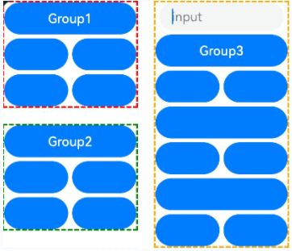

# 焦点控制

自定义组件的走焦效果，可设置组件是否走焦和具体的走焦顺序，tab键或者方向键切换焦点。

>  **说明：**
>
>  从API Version 8开始支持。后续版本如有新增内容，则采用上角标单独标记该内容的起始版本。

## focusable

focusable(value: boolean)

设置当前组件是否可以获焦。

**系统能力：** SystemCapability.ArkUI.ArkUI.Full

**参数：**

| 参数名 | 类型    | 必填 | 说明                                                         |
| ------ | ------- | ---- | ------------------------------------------------------------ |
| value  | boolean | 是   | 设置当前组件是否可以获焦。<br/>**说明：**<br/>存在默认交互逻辑的组件例如Button、TextInput等，默认即为可获焦，Text、Image等组件则默认状态为不可获焦。不可获焦状态下，无法触发[焦点事件](ts-universal-focus-event.md)。 |

## tabIndex<sup>9+</sup>

tabIndex(index: number)

自定义组件tab键走焦能力。

**系统能力：** SystemCapability.ArkUI.ArkUI.Full

**参数：**

| 参数名 | 类型   | 必填 | 说明                                                         |
| ------ | ------ | ---- | ------------------------------------------------------------ |
| index  | number | 是   | 自定义组件tab键走焦能力。若有配置了tabIndex大于0的组件，则tab键走焦只会在tabIndex大于0的组件内按照tabIndex的值从小到大并循环依次走焦。若没有配置tabIndex大于0的组件，则tabIndex等于0的组件按照组件预设的走焦规则走焦。<br />- tabIndex >= 0：表示元素是可聚焦的，并且可以通过tab键走焦来访问到该元素。<br />- tabIndex < 0（通常是tabIndex = -1）：表示元素是可聚焦的，但是不能通过tab键走焦来访问到该元素。<br/>默认值：0 |

## defaultFocus<sup>9+</sup>

defaultFocus(value: boolean)

设置当前组件是否为当前页面上的默认焦点。

**系统能力：** SystemCapability.ArkUI.ArkUI.Full

**参数：**

| 参数名 | 类型    | 必填 | 说明                                                         |
| ------ | ------- | ---- | ------------------------------------------------------------ |
| value  | boolean | 是   | 设置当前组件是否为当前页面上的默认焦点，仅在初次创建的页面第一次进入时生效。<br/>默认值：false |

## groupDefaultFocus<sup>9+</sup>

groupDefaultFocus(value: boolean)

设置当前组件是否为当前组件所在容器获焦时的默认焦点。

**系统能力：** SystemCapability.ArkUI.ArkUI.Full

**参数：**

| 参数名 | 类型    | 必填 | 说明                                                         |
| ------ | ------- | ---- | ------------------------------------------------------------ |
| value  | boolean | 是   | 设置当前组件是否为当前组件所在容器获焦时的默认焦点，仅在初次创建容器节点第一次获焦时生效。<br/>默认值：false<br/>**说明：** 必须与[tabIndex](#tabindex9)联合使用，当某个容器设置了tabIndex，且容器内某子组件设置了groupDefaultFocus，当该容器首次获焦时，会自动将焦点转移至该组件上。 |

## focusOnTouch<sup>9+</sup>

focusOnTouch(value: boolean)

设置当前组件是否支持点击获焦能力。

**系统能力：** SystemCapability.ArkUI.ArkUI.Full

**参数：**

| 参数名 | 类型    | 必填 | 说明                                                         |
| ------ | ------- | ---- | ------------------------------------------------------------ |
| value  | boolean | 是   | 设置当前组件是否支持点击获焦能力。<br/>默认值：false<br/>**说明：** 仅在组件可点击时才能正常获取焦点。 |

## focusControl<sup>9+</sup>

### requestFocus<sup>9+</sup>

requestFocus(value: string): boolean

方法语句中可使用的全局接口，调用此接口可以主动让焦点转移至参数指定的组件上。

**参数：**

| 名称 | 类型 | 必填 | 描述 |
| ----- | ------ | ---- | ---- |
| value | string | 是   | 目标组件使用接口key(value: string)绑定的字符串。 |

**返回值：**

| 类型 | 说明 |
| ------- | ---- |
| boolean | 返回是否成功给目标组件申请到焦点。若参数指向的目标组件存在，且目标组件可获焦，则返回true，否则返回false。 |

>  **说明：**
>
>  支持焦点控制的组件：TextInput、TextArea、Search、Button、Text、Image、List、Grid。焦点事件当前仅支持在真机上显示运行效果。

## 示例

### 示例1

defaultFocus/groupDefaultFocus/focusOnTouch示例代码：

defaultFocus可以使绑定的组件成为页面创建后首次获焦的焦点。groupDefaultFocus可以使绑定的组件成为tabIndex容器创建后首次获焦的焦点。focusOnTouch可以使绑定的组件点击后立即获焦。

```ts
// focusTest.ets
@Entry
@Component
struct FocusableExample {
  @State inputValue: string = ''

  build() {
    Scroll() {
      Row({ space: 20 }) {
        Column({ space: 20 }) {
          Column({ space: 5 }) {
            Button('Group1')
              .width(165)
              .height(40)
              .fontColor(Color.White)
              .focusOnTouch(true)           // 该Button组件点击后可获焦
            Row({ space: 5 }) {
              Button()
                .width(80)
                .height(40)
                .fontColor(Color.White)
              Button()
                .width(80)
                .height(40)
                .fontColor(Color.White)
                .focusOnTouch(true)           // 该Button组件点击后可获焦
            }
            Row({ space: 5 }) {
              Button()
                .width(80)
                .height(40)
                .fontColor(Color.White)
              Button()
                .width(80)
                .height(40)
                .fontColor(Color.White)
            }
          }.borderWidth(2).borderColor(Color.Red).borderStyle(BorderStyle.Dashed)
          .tabIndex(1)                      // 该Column组件为按TAB键走焦的第一个获焦的组件
          Column({ space: 5 }) {
            Button('Group2')
              .width(165)
              .height(40)
              .fontColor(Color.White)
            Row({ space: 5 }) {
              Button()
                .width(80)
                .height(40)
                .fontColor(Color.White)
              Button()
                .width(80)
                .height(40)
                .fontColor(Color.White)
                .groupDefaultFocus(true)      // 该Button组件上级Column组件获焦时获焦
            }
            Row({ space: 5 }) {
              Button()
                .width(80)
                .height(40)
                .fontColor(Color.White)
              Button()
                .width(80)
                .height(40)
                .fontColor(Color.White)
            }
          }.borderWidth(2).borderColor(Color.Green).borderStyle(BorderStyle.Dashed)
          .tabIndex(2)                      // 该Column组件为按TAB键走焦的第二个获焦的组件
        }
        Column({ space: 5 }) {
          TextInput({placeholder: 'input', text: this.inputValue})
            .onChange((value: string) => {
              this.inputValue = value
            })
            .width(156)
            .defaultFocus(true)             // 该TextInput组件为页面的初始默认焦点
          Button('Group3')
            .width(165)
            .height(40)
            .fontColor(Color.White)
          Row({ space: 5 }) {
            Button()
              .width(80)
              .height(40)
              .fontColor(Color.White)
            Button()
              .width(80)
              .height(40)
              .fontColor(Color.White)
          }
          Button()
            .width(165)
            .height(40)
            .fontColor(Color.White)
          Row({ space: 5 }) {
            Button()
              .width(80)
              .height(40)
              .fontColor(Color.White)
            Button()
              .width(80)
              .height(40)
              .fontColor(Color.White)
          }
          Button()
            .width(165)
            .height(40)
            .fontColor(Color.White)
          Row({ space: 5 }) {
            Button()
              .width(80)
              .height(40)
              .fontColor(Color.White)
            Button()
              .width(80)
              .height(40)
              .fontColor(Color.White)
          }
        }.borderWidth(2).borderColor(Color.Orange).borderStyle(BorderStyle.Dashed)
        .tabIndex(3)                      // 该Column组件为按TAB键走焦的第三个获焦的组件
      }.alignItems(VerticalAlign.Top)
    }
  }
}
```
示意图：

首次按下TAB键，焦点切换到defaultFocus绑定的组件上：



第二次按TAB键，焦点切换到tabIndex(1)的容器上，且自动走到其内部的groupDefaultFocus绑定的组件上：


第三次按TAB键，焦点切换到tabIndex(2)的容器上，且自动走到其内部的groupDefaultFocus绑定的组件上：


第四次按TAB键，焦点切换到tabIndex(3)的容器上，且自动走到其内部的groupDefaultFocus绑定的组件上：


点击绑定了focusOnTouch的组件，组件自身获焦：


### 示例2

focusControl.requestFocus示例代码：

使用focusContrl.requestFocus接口使指定组件获取焦点。
```ts
// requestFocus.ets
import promptAction from '@ohos.promptAction';

@Entry
@Component
struct RequestFocusExample {
  @State idList: string[] = ['A', 'B', 'C', 'D', 'E', 'F', 'LastPageId']
  @State selectId: string = 'LastPageId'

  build() {
    Column({ space:20 }){
      Row({space: 5}) {
        Button("id: " + this.idList[0] + " focusable(false)")
          .width(200).height(70).fontColor(Color.White)
          .key(this.idList[0])
          .focusable(false)
        Button("id: " + this.idList[1])
          .width(200).height(70).fontColor(Color.White)
          .key(this.idList[1])
      }
      Row({space: 5}) {
        Button("id: " + this.idList[2])
          .width(200).height(70).fontColor(Color.White)
          .key(this.idList[2])
        Button("id: " + this.idList[3])
          .width(200).height(70).fontColor(Color.White)
          .key(this.idList[3])
      }
      Row({space: 5}) {
        Button("id: " + this.idList[4])
          .width(200).height(70).fontColor(Color.White)
          .key(this.idList[4])
        Button("id: " + this.idList[5])
          .width(200).height(70).fontColor(Color.White)
          .key(this.idList[5])
      }
      Row({space: 5}) {
        Select([{value: this.idList[0]},
                {value: this.idList[1]},
                {value: this.idList[2]},
                {value: this.idList[3]},
                {value: this.idList[4]},
                {value: this.idList[5]},
                {value: this.idList[6]}])
          .value(this.selectId)
          .onSelect((index: number) => {
            this.selectId = this.idList[index]
          })
        Button("RequestFocus")
          .width(200).height(70).fontColor(Color.White)
          .onClick(() => {
            let res = focusControl.requestFocus(this.selectId)      // 使选中的this.selectId的组件获焦
            if (res) {
              promptAction.showToast({message: 'Request success'})
            } else {
              promptAction.showToast({message: 'Request failed'})
            }
          })
      }
    }.width('100%').margin({ top:20 })
  }
}
```

示意图：

按下TAB键，激活焦点态显示。
申请不存在的组件获焦：


申请不可获焦的组件获焦：


申请存在且可获焦的组件获焦：

