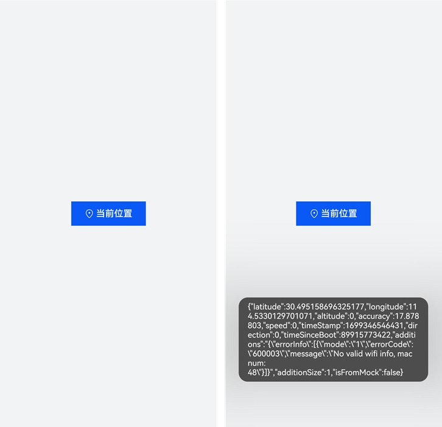

# 使用位置控件

位置控件使用直观且易懂的通用标识，让用户明确地知道这是一个获取位置信息的按钮。这满足了授权场景需要匹配用户真实意图的需求。只有当用户主观愿意，并且明确了解使用场景后点击位置控件，应用才会获得临时的授权，获取位置信息并完成相应的服务功能。

一旦应用集成了位置控件，用户点击该控件后，无论应用是否已经申请过或被授予精准定位权限，都会在本次前台期间获得精准定位的授权，可以调用位置服务获取精准定位。

对于不是强位置关联应用（例如导航、运动健康等）的应用，只在部分前台场景需要使用位置信息（例如定位城市、打卡、分享位置等）。如果需要长时间使用或是在后台使用位置信息，建议申请位置权限。

位置控件效果如图所示。




## 约束与限制

- 当用户首次点击应用中的位置控件，系统将弹窗请求用户授权。如果用户点击“取消”，弹窗消失，应用无授权，用户再次点击位置控件时，将会重新弹窗；如果用户点击“允许”，弹窗消失，应用将被授予临时位置权限，此后点击该应用的位置控件将不会弹窗。

- 精准定位的临时授权会持续到灭屏、应用切后台、应用退出等任一情况发生，然后恢复到临时授权之前的授权状态（授予/未授予/未申请）

- 应用在授权期间没有调用次数限制。

- 为了保障用户的隐私不被恶意应用获取，应用需确保安全控件是可见的且用户能够识别的。开发者需要合理的配置控件的尺寸、颜色等属性，避免视觉混淆的情况，如果发生因控件的样式不合法导致授权失败的情况，请检查设备错误日志。


## 开发步骤

以在聊天界面发送实时定位信息为例。在当前场景下，应用仅需要在前台期间，短暂地访问当前位置，不需要长时间使用。此时，可以直接使用安全控件中的位置控件，免去权限申请和权限请求等环节，获得临时授权，满足权限最小化，提升用户的隐私体验。

参考以下步骤，实现效果：点击控件“当前位置”获取临时精准定位授权，获取授权后，弹窗提示具体位置信息，效果图请见上文。

1. 引入位置服务依赖。
   
   ```ts
   import { geoLocationManager } from '@kit.LocationKit';
   ```

2. 添加位置控件和获取当前位置信息。
   
   安全控件是由图标、文本、背景组成的类似Button的按钮，其中图标、文本两者至少有其一，背景是可选的。图标和文本不支持自定义，仅支持在已有的选项中选择。应用申明安全控件的接口时，分为传参和不传参两种，不传参默认创建图标+文字+背景的按钮，传参根据传入的参数创建，不包含没有配置的元素。

   当前示例使用默认参数，具体请参见[LocationButton控件](../../reference/apis-arkui/arkui-ts/ts-security-components-locationbutton.md)。此外，所有安全控件都继承[安全控件通用属性](../../reference/apis-arkui/arkui-ts/ts-securitycomponent-attributes.md)，可用于定制样式。

   在LocationButton的onClick()回调中通过调用[geoLocationManager](../../reference/apis-location-kit/js-apis-geoLocationManager.md)模块提供的方法获取当前位置信息。

   ```ts
   import { geoLocationManager } from '@kit.LocationKit';
   import { promptAction } from '@kit.ArkUI';
   import { BusinessError } from '@kit.BasicServicesKit';
   
   // 获取当前位置信息
   function getCurrentLocationInfo() {
     const requestInfo: geoLocationManager.LocationRequest = {
       'priority': geoLocationManager.LocationRequestPriority.FIRST_FIX,
       'scenario': geoLocationManager.LocationRequestScenario.UNSET,
       'timeInterval': 1,
       'distanceInterval': 0,
       'maxAccuracy': 0
     };
     geoLocationManager.getCurrentLocation(requestInfo)
       .then((location: geoLocationManager.Location) => {
         promptAction.showToast({ message: JSON.stringify(location) });
       })
       .catch((err: BusinessError) => {
         console.error(`Failed to get current location. Code is ${err.code}, message is ${err.message}`);
       });
   }
   
   @Entry
   @Component
   struct Index {
     build() {
       Row() {
         Column({ space: 10 }) {
           LocationButton({
             icon: LocationIconStyle.LINES,
             text: LocationDescription.CURRENT_LOCATION,
             buttonType: ButtonType.Normal
           })
             .onClick((event: ClickEvent, result: LocationButtonOnClickResult) => {
               if (result === LocationButtonOnClickResult.SUCCESS) {
                 // 免去权限申请和权限请求等环节，获得临时授权，获取位置信息授权
                 getCurrentLocationInfo();
               } else {
                 promptAction.showToast({ message: '获取位置信息失败！' })
               }
             })
         }
         .width('100%')
       }
       .height('100%')
       .backgroundColor(0xF1F3F5)
     }
   }
   ```
