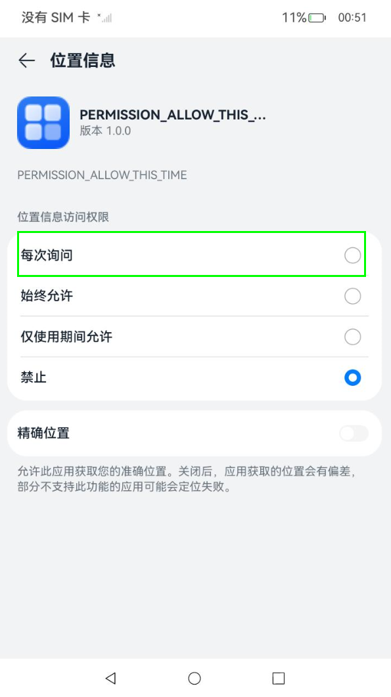

# 向用户申请单次授权

基于授权最小化原则，防止应用获取和滥用用户数据。针对部分应用敏感权限，在弹窗向用户申请授权时，新增“允许本次使用”的授权选项。

开发者在开发应用时，无需额外配置，仍然调用requestPermissionsFromUser()[向用户申请授权](request-user-authorization.md)。系统会根据该能力[支持的权限](#支持范围)，弹出对应的弹窗。

授权弹窗如下图所示：

<!--RP1-->

设置选项如下图所示：

路径：设置 > 隐私 > 权限管理 > 应用 > 目标应用 > 位置信息
<!--RP1End-->

## 支持范围

当前仅支持以下权限，当应用向用户申请这些权限时，弹窗将显示“允许本次使用”的选项；在设置中修改这些权限时，系统将显示“每次询问”的选项。

- 剪切板：["ohos.permission.READ_PASTEBOARD"](restricted-permissions.md#ohospermissionread_pasteboard)
- 模糊位置：["ohos.permission.APPROXIMATELY_LOCATION"](permissions-for-all-user.md#ohospermissionapproximately_location)
- 位置：["ohos.permission.LOCATION"](permissions-for-all-user.md#ohospermissionlocation)
- 后台位置：["ohos.permission.LOCATION_IN_BACKGROUND"](permissions-for-all-user.md#ohospermissionlocation_in_background)

## 使用限制

- 当用户点击“允许本次使用”按钮后，应用将获得临时权限。

  - 当应用切换至前台、应用展开卡片且处于当前屏幕可见即[卡片可见](../../form/arkts-ui-widget-lifecycle.md)或者[设置后台长时任务](../../task-management/continuous-task.md)的时候（当前仅支持定位导航长时任务），应用的临时权限会一直保持。

     其他情况下启动计时器，十秒后取消临时权限。若需再次获取，必须重新授予。

  - 当应用切到后台，开始十秒计时，如果在计时期间，应用处于卡片可见状态或者设置了后台长时任务，计时停止。
  
      当卡片不再可见或长时任务结束时，再次启动十秒计时，计时结束后，取消临时授权。

      <!--RP2-->
      如下图样例所示，相机应用处于卡片可见状态：

      
      <!--RP2End-->

- 当用户在权限设置中选择“每次询问”时，应用将获得模糊位置和位置临时权限。取消临时授权的操作与此相同。