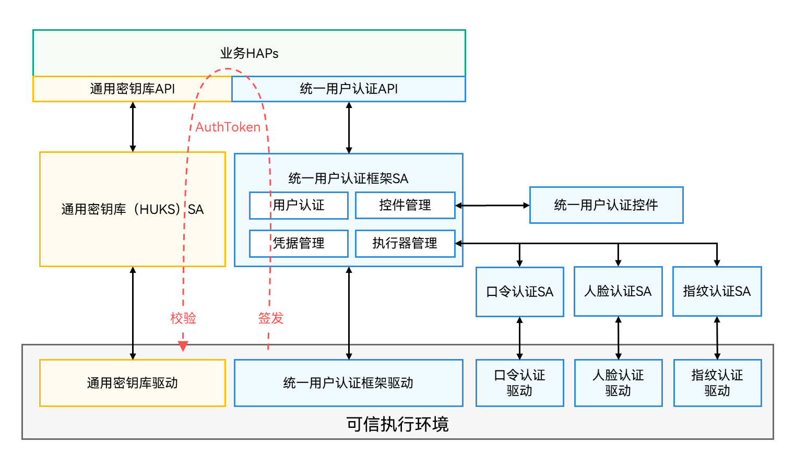

# 用户身份认证概述

统一用户认证框架提供了系统级用户身份认证功能，并提供了多设备统一的、集多种认证方式（人脸、指纹、口令）于一体的系统级用户身份认证控件。

用户向应用/系统服务请求访问某些个人数据或执行某些敏感操作时，应用/系统服务将调用系统用户身份认证控件对用户身份进行认证，认证通过后，才响应用户对于数据或敏感操作的执行请求。

用户身份认证可用于各种鉴权场景，如应用内帐号登录、支付认证等。

## 运作机制

统一用户认证框架架构如下图所示。

统一用户认证框架主要包括四个部分：

1. 统一用户认证API：提供归一化的系统用户身份认证能力调用接口。

2. 统一用户认证框架：包括框架层的SA和驱动，负责调度系统上的各种身份认证能力和用户认证控件，来完成业务通过统一用户认证API发起的用户认证请求。

3. 统一用户认证控件：实现了各种认证方式的用户身份认证交互界面，供统一身份认证框架调用。

4. 各种认证能力：包括口令认证、人脸认证和指纹认证，分别实现了基于锁屏口令、人脸和指纹认证用户身份的能力，供统一用户认证框架调度。

用户身份认证通过后，统一用户认证框架会在设备可信执行环境中签发用户身份认证通过证明，简称AuthToken。

从图的左侧，可以看到应用使用用户身份认证功能完成用户鉴权的过程：当应用需要调用通用密钥库服务中需用户授权才能访问的密钥时，应用可以将获取到的AuthToken随密钥调用请求一同提供给[通用密钥库服务](../UniversalKeystoreKit/huks-overview.md)，作为密钥二次访问控制的用户鉴权证明。通用密钥库服务在可信执行环境中校验了AuthToken的合法性和有效性后，便会响应业务请求，执行对应的密钥操作。

### AuthToken数据结构

| 字段 | 名称 | 内容 | 类型 | 说明 | 
| -------- | -------- | -------- | -------- | -------- |
| 明文段 | version | token版本号 | int32_t | 当前为2.0。 | 
| challenge | 认证随机挑战 | uint8[32] | 需要校验认证结果的业务方生成的一次性随机挑战。 | 
| time | 认证通过时戳 | uint64 | 认证通过时戳。 | 
| authTrustLevel | 认证可信等级 | uint32 | 见[认证可信等级划分原则](#认证可信等级划分原则)。 | 
| authType | 认证类型 | uint32 | 认证通过采用的认证类型，包括人脸、指纹、口令（特指锁屏密码认证）。 | 
| authMode | 操作类型 | uint32 | 操作类型：识别/认证。 | 
| securityLevel | token签发环境安全等级 | uint32 | token签发环境安全等级。 | 
| 密文段 | userId | 用户ID | uint64 | 系统在创建用户时给用户分配的ID。 | 
| secureUid | 安全用户ID | uint64 | 用户注册系统口令时为用户随机分配的ID，在用户删除口令时删除，变更口令时该ID不变。 | 
| enrolledId | 凭据注册ID | uint64 | 用户每录入一个凭据，该用户的该类型凭据的enrolledId便会更换一个随机值，删除凭据时该ID不变。 | 
| credentialId | 匹配上的凭据ID | uint64 | 随机分配给用户注册的人脸、指纹等凭据的ID。 | 
| 标签段 | tag | 密文段的TAG | uint8[16] | 密文字段采用AES-GCM加密生成的TAG。 | 
| iv | 密文段加密使用的IV | uint8[12] | 密文字段采用AES-GCM加密采用的随机IV。 | 
| sign | token的完整性保护签名 | uint8[32] | 用于整个AuthToken的完整性保护。 | 

### 认证可信等级划分原则

系统采用三种指标来衡量认证可信等级（AuthTrustLevel），具体认证可信等级如下表所示。

- FRR（False Rejection Rate）：将合法用户当做非法用户拒绝的概率。

- FAR（False Acceptance Rate）：将非法用户当做合法用户接受的概率，又称为误闯率。

- SAR（Spoof Acceptance Rate）：接受一个基于合法生物特征复制的、非活体的样本概率。

FAR越低，FRR越高，认证的安全性越高，但使用便捷性越差。

| 认证可信等级 | 认证能力指标 | 说明&amp;举例 | 典型应用场景 | 
| -------- | -------- | -------- | -------- |
| ATL4 | FRR=10%时，FAR≤0.0001%，SAR≤3% | 能高精度地识别用户个体，有很强的活体检测能力，如采用了安全键盘的6位及以上PIN码认证和有特殊安全增强的指纹与3D人脸认证。 | 小额支付 | 
| ATL3 | FRR=10%时，FAR≤0.002%，SAR≤7% | 能精确识别用户个体，有较强的活体检测能力，如有特殊安全增强的2D人脸认证。 | 设备解锁 | 
| ATL2 | FRR=10%时，FAR≤0.002%，7%&lt;SAR≤20% | 能精确识别用户个体，有一定的活体检测能力，如使用普通相机采集图像的2D人脸认证。 | 维持设备解锁状态 | 
| ATL1 | FRR=10%时，FAR≤1%，7%&lt;SAR≤20% | 能识别用户个体，有一定的活体检测能力，如声纹认证。 | 业务风控、精准推荐、个性化服务 | 
