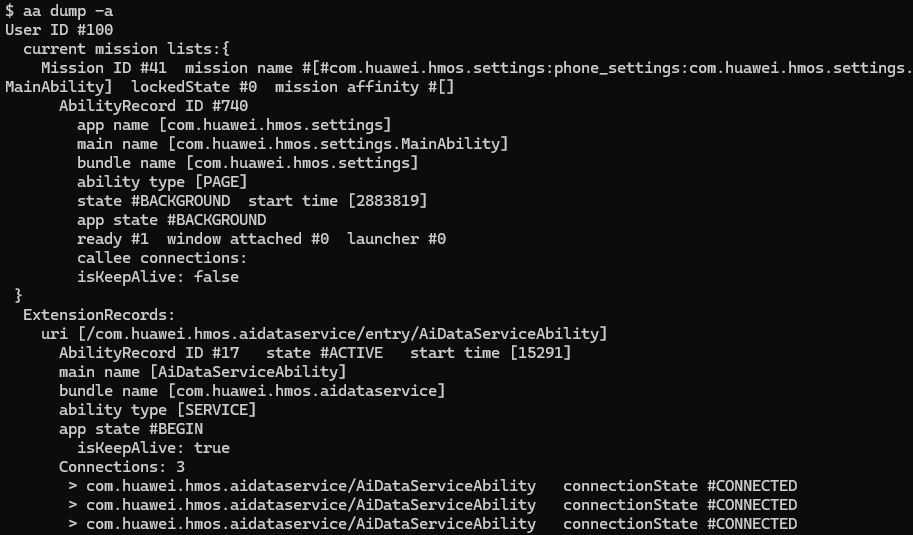

# aa工具


Ability assistant（Ability助手，简称为aa），是实现应用及测试用例启动功能的工具，为开发者提供基本的应用调试和测试能力，例如启动应用组件、强制停止进程、打印应用组件相关信息等。

> **说明：**
>
> 在使用本工具前，开发者需要先获取[hdc工具](../../device-dev/subsystems/subsys-toolchain-hdc-guide.md)，执行hdc shell。


- help
  用于显示aa相关的帮助信息。

  **返回值**：

  返回对应的帮助信息。

  **使用方法**：

  
  ```bash
  aa help
  ```


- start
  用于启动一个应用组件，目标组件可以是FA模型的PageAbility和ServiceAbility组件，也可以是Stage模型的UIAbility和ServiceExtensionAbility组件，且目标组件相应配置文件中的exported标签不能配置为false。

  | 参数 | 参数说明              |
  | -------- |-------------------|
  | -h/--help | 帮助信息。             |
  | -d | 可选参数，deviceId。    |
  | -a | 可选参数，abilityName。 |
  | -b | 可选参数，bundleName。  |
  | -U  | 可选参数，URI。         |
  | -A  | 可选参数，action。      |
  | -e  | 可选参数，entity。      |
  | -t  | 可选参数，type。        |
  | --pi  | 可选参数，整形类型键值对。     |
  | --pb  | 可选参数，布尔类型键值对。     |
  | --ps  | 可选参数，字符串类型键值对。    |
  | --psn | 可选参数，空字符串关键字。     |
  | -D | 可选参数，调试模式。        |

  **返回值**：

  当启动成功时，返回"start ability successfully."；当启动失败时，返回"error: failed to start ability."，同时会包含相应的失败信息。

  **使用方法**：

  
  ```bash
  # 显示启动Ability
  aa start [-d <deviceId>] -a <abilityName> -b <bundleName> [-D] [--pi <key> <integer-value>] \
    [--pb <key> <bool-value: true/false/t/f大小写不敏感] [--ps <key> <value>] [--psn <key>]
  
  # 隐式启动Ability。如果命中的参数都不填，会导致启动失败。
  aa start [-d <deviceId>] [-U <URI>] [-t <type>] [-A <action>] [-e <entity>] [-D] [--pi <key> <integer-value>] \
    [--pb <key> <bool-value: true/false/t/f大小写不敏感] [--ps <key> <value>] [--psn <key>]
  ```

- stop-service
  用于停止ServiceAbility。

  | 参数 | 参数说明 |
  | -------- | -------- |
  | -h/--help | 帮助信息。 |
  | -d | 可选参数，deviceId。 |
  | -a | 必选参数，abilityName。 |
  | -b | 必选参数，bundleName。 |

  **返回值**：

  当成功停止ServiceAbility时，返回"stop service ability successfully."；当停止失败时，返回"error: failed to stop service ability."。

  **使用方法**：

  
  ```bash
  aa stop-service [-d <deviceId>] -a <abilityName> -b <bundleName>
  ```

- dump
    用于打印应用组件的相关信息。
    | 参数 | 二级参数 | 参数说明 |
  | -------- | -------- | -------- |
  | -h/--help | - | 帮助信息。 |
  | -a/--all | - | 打印所有mission内的应用组件信息。 |
  | -l/--mission-list | type（缺省打印全部） | 服务侧为了方便管理任务链，内部维护了4种类型的任务链。<br/>可取值：<br/>-&nbsp;NORMAL：正常启动的任务链(比如A拉起B拉起C, 则对应的任务链是A->B->C)<br/>-&nbsp;DEFAULT_STANDARD：已经被破坏的任务链中的任务, 启动模式为`multiton`的任务被放到该任务链中, 这里面的任务之间没有关联关系<br/>-&nbsp;DEFAULT_SINGLE：已经被破坏的任务链中的任务, 启动模式为`singleton`的任务被放到该任务链中, 这里面的任务之间没有关联关系<br/>-&nbsp;LAUNCHER：launcher的任务链 |
  | -e/--extension | elementName | 打印扩展组件信息。 |
  | -u/--userId | UserId | 打印指定UserId的栈信息，需要和其他参数组合使用，例如aa&nbsp;dump&nbsp;-a&nbsp;-u&nbsp;100、aa&nbsp;dump&nbsp;-d&nbsp;-u&nbsp;100。 |
  | -d/--data | - | 打印DataAbility相关信息。 |
  | -i/--ability | AbilityRecord&nbsp;ID | 打印指定应用组件详细信息。 |
  | -c/--client | - | 打印应用组件详细信息，需要和其他参数组合使用，例如aa&nbsp;dump&nbsp;-a&nbsp;-c、aa&nbsp;dump&nbsp;-i&nbsp;21&nbsp;-c。 |

  **使用方法**：

  
  ```bash
  aa dump -a
  ```

  

  
  ```bash
  aa dump -l
  ```

  

  
  ```bash
  aa dump -i 12
  ```

  

- force-stop
  通过bundleName强制停止一个进程。

  **返回值**：

  当成功强制停止该进程时，返回"force stop process successfully."；当强制停止失败时，返回"error: failed to force stop process."。

  **使用方法**：

  
  ```bash
  aa force-stop <bundleName>
  ```
