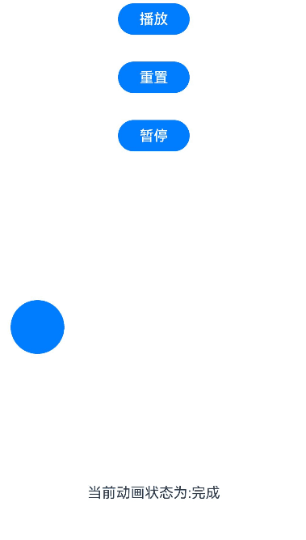

# 帧动画

通过返回应用onFrame逐帧回调的方式，让开发者在应用侧的每一帧都可以设置属性值，从而实现设置了该属性值对应组件的动画效果。接口的详细介绍请查看[@ohos.animator (动画)](../reference/apis-arkui/js-apis-animator.md)。

相比于属性动画，开发者可感知动画的过程，实时修改UI侧的值，具有事件可实时响应、可暂停的优点，但性能上不如属性动画。在属性动画符合要求时更推荐使用属性动画的接口实现，可参照[实现属性动画](./arkts-attribute-animation-apis.md)。


## 使用animator实现动画效果

使用如下步骤可以创建一个简单的animator，并且在每个帧回调中打印当前插值。

1. 引入相关依赖。

   ```ts
   import { AnimatorOptions, AnimatorResult } from '@kit.ArkUI';
   ```

2. 创建执行动画的对象。

   ```ts
   // 创建动画的初始参数
   let options: AnimatorOptions = {                        
      duration: 1500,                               
      easing: "friction",                        
      delay: 0,                           
      fill: "forwards",                                  
      direction: "normal",                                  
      iterations: 2,                                        
      // 动画onFrame 插值首帧值                                    
      begin: 200.0,                                         
      // 动画onFrame 插值尾帧值                                    
      end: 400.0                                            
   }; 
   let result: AnimatorResult = this.getUIContext().createAnimator(options);
      // 设置接收到帧时回调，动画播放过程中每帧会调用onFrame回调
       result.onFrame = (value: number) => {
       console.log("current value is :" + value);
   }
   ```

3. 播放动画。

   ```ts
   // 播放动画
   result.play();
   ```

4. 动画执行完成后手动释放AnimatorResult对象。

   ```ts
   // 播放动画
   result = undefined;
   ```

## 使用animator实现小球抛物运动

1. 引入相关依赖。

   ```ts
   import { AnimatorOptions, AnimatorResult } from '@kit.ArkUI';
   ```

2. 定义要做动画的组件。

   ```ts
   Button()
     .width(60)
     .height(60)
     .translate({ x: this.translateX, y: this.translateY })
   ```

3. 在onPageShow中创建AnimatorResult对象。

   ```ts
   onPageShow(): void {
       //创建animatorResult对象
       this.animatorOptions = this.getUIContext().createAnimator(options);
       this.animatorOptions.onFrame = (progress: number) => {
       this.translateX = progress;
       if (progress > this.topWidth && this.translateY < this.bottomHeight) {
          this.translateY = Math.pow(progress - this.topWidth, 2) * this.g;
       }
    }
    //动画取消时执行方法
    this.animatorOptions.onCancel = () => {
       this.animatorStatus = '取消';
    }
    //动画完成时执行方法
    this.animatorOptions.onFinish = () => {
       this.animatorStatus = '完成';
    }
    //动画重复播放时执行方法
    this.animatorOptions.onRepeat = () => {
       console.log("动画重复播放");
    }
   }
   ```

4. 定义动画播放，重置，暂停的按钮。

   ```ts
   Button('播放').onClick(() => {
     this.animatorOptions?.play();
     this.animatorStatus = '播放中'
   }).width(80).height(35)
   Button("重置").onClick(() => {
     this.translateX = 0;
     this.translateY = 0;
   }).width(80).height(35)
   Button("暂停").onClick(() => {
     this.animatorOptions?.pause();
     this.animatorStatus = '暂停'
   }).width(80).height(35)
   ```
5. 在页面结束生命周期回调中销毁动画。
   ```ts
   onPageHide(): void {
     this.animatorOptions = undefined;
   }
   ```

完整示例如下。

```ts
import { AnimatorOptions, AnimatorResult } from '@kit.ArkUI';

@Entry
@Component
struct Index {
  @State animatorOptions: AnimatorResult | undefined = undefined;
  @State animatorStatus: string = '创建';
  begin: number = 0;
  end: number = 300
  topWidth: number = 150;
  bottomHeight: number = 100;
  g: number = 0.18
  animatorOption: AnimatorOptions = {
    duration: 4000,
    delay: 0,
    easing: 'linear',
    iterations: 1,
    fill: "forwards",
    direction: 'normal',
    begin: this.begin,
    end: this.end
  };
  @State translateX: number = 0;
  @State translateY: number = 0;

  onPageShow(): void {
    this.animatorOptions = this.getUIContext().createAnimator(this.animatorOption)
    this.animatorOptions.onFrame = (progress: number) => {
      this.translateX = progress;
      if (progress > this.topWidth && this.translateY < this.bottomHeight) {
        this.translateY = Math.pow(progress - this.topWidth, 2) * this.g;
      }
    }
    this.animatorOptions.onCancel = () => {
      this.animatorStatus = '取消';
    }
    this.animatorOptions.onFinish = () => {
      this.animatorStatus = '完成';
    }
    this.animatorOptions.onRepeat = () => {
      console.log("动画重复播放");
    }
  }

  onPageHide(): void {
    this.animatorOptions = undefined;
  }

  build() {
    Column() {
      Column({ space: 30 }) {
        Button('播放').onClick(() => {
          this.animatorOptions?.play();
          this.animatorStatus = '播放中';
        }).width(80).height(35)
        Button("重置").onClick(() => {
          this.translateX = 0;
          this.translateY = 0;
        }).width(80).height(35)
        Button("暂停").onClick(() => {
          this.animatorOptions?.pause();
          this.animatorStatus = '暂停';
        }).width(80).height(35)
      }.width("100%").height('25%')

      Stack() {
        Button()
          .width(60)
          .height(60)
          .translate({ x: this.translateX, y: this.translateY })
      }
      .width("100%")
      .height('45%')
      .align(Alignment.Start)

      Text("当前动画状态为:" + this.animatorStatus)
    }.width("100%").height('100%')
  }
}
```

