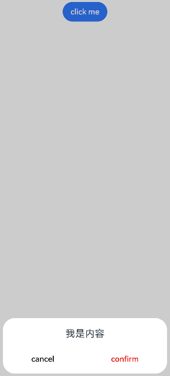

# 自定义弹窗（CustomDialog）


CustomDialog是自定义弹窗，可用于广告、中奖、警告、软件更新等与用户交互响应操作。开发者可以通过CustomDialogController类显示自定义弹窗。具体用法请参考[自定义弹窗](../reference/arkui-ts/ts-methods-custom-dialog-box.md)。


## 创建自定义弹窗

1. 使用\@CustomDialog装饰器装饰自定义弹窗。

2. \@CustomDialog装饰器用于装饰自定义弹框，此装饰器内进行自定义内容（也就是弹框内容）。

   ```ts
   @CustomDialog
   struct CustomDialogExample {
     controller: CustomDialogController = new CustomDialogController({
       builder: CustomDialogExample({}),
     })
   
     build() {
       Column() {
         Text('我是内容')
           .fontSize(20)
           .margin({ top: 10, bottom: 10 })
       }
     }
   }
   ```
   
3. 创建构造器，与装饰器呼应相连。

   ```ts
    @Entry
    @Component
    struct CustomDialogUser {
      dialogController: CustomDialogController = new CustomDialogController({
        builder: CustomDialogExample(),
      })
    }
   ```
   
4. 点击与onClick事件绑定的组件使弹窗弹出。

   ```ts
   @Entry
   @Component
   struct CustomDialogUser {
     dialogController: CustomDialogController = new CustomDialogController({
       builder: CustomDialogExample(),
     })
   
     build() {
       Column() {
         Button('click me')
           .onClick(() => {
             this.dialogController.open()
           })
       }.width('100%').margin({ top: 5 })
     }
   }
   ```
   
   


## 弹窗的交互

弹窗可用于数据交互，完成用户一系列响应操作。


1. 在\@CustomDialog装饰器内添加按钮，同时添加数据函数。

   ```ts
   @CustomDialog
   struct CustomDialogExample {
     cancel?: () => void
     confirm?: () => void
     controller: CustomDialogController
   
     build() {
       Column() {
         Text('我是内容').fontSize(20).margin({ top: 10, bottom: 10 })
         Flex({ justifyContent: FlexAlign.SpaceAround }) {
           Button('cancel')
             .onClick(() => {
               this.controller.close()
               if (this.cancel) {
                 this.cancel()
               }
             }).backgroundColor(0xffffff).fontColor(Color.Black)
           Button('confirm')
             .onClick(() => {
               this.controller.close()
               if (this.confirm) {
                 this.confirm()
               }
             }).backgroundColor(0xffffff).fontColor(Color.Red)
         }.margin({ bottom: 10 })
       }
     }
   }
   ```

2. 页面内需要在构造器内进行接收，同时创建相应的函数操作。

     ```ts
   @Entry
   @Component
   struct CustomDialogUser {
     dialogController: CustomDialogController = new CustomDialogController({
       builder: CustomDialogExample({
         cancel: this.onCancel,
         confirm: this.onAccept,
       }),
     })
   
     onCancel() {
       console.info('Callback when the first button is clicked')
     }
   
     onAccept() {
       console.info('Callback when the second button is clicked')
     }
   
     build() {
       Column() {
         Button('click me')
           .onClick(() => {
             this.dialogController.open()
           })
       }.width('100%').margin({ top: 5 })
     }
   }
   ```

      

## 弹窗的动画

弹窗通过定义openAnimation控制弹窗出现动画的持续时间，速度等参数。

```ts
@CustomDialog
struct CustomDialogExample {
  controller?: CustomDialogController

  build() {
    Column() {
      Text('Whether to change a text?').fontSize(16).margin({ bottom: 10 })
    }
  }
}

@Entry
@Component
struct CustomDialogUser {
  @State textValue: string = ''
  @State inputValue: string = 'click me'
  dialogController: CustomDialogController | null = new CustomDialogController({
    builder: CustomDialogExample(),
    openAnimation: {
      duration: 1200,
      curve: Curve.Friction,
      delay: 500,
      playMode: PlayMode.Alternate,
      onFinish: () => {
        console.info('play end')
      }
    },
    autoCancel: true,
    alignment: DialogAlignment.Bottom,
    offset: { dx: 0, dy: -20 },
    gridCount: 4,
    customStyle: false,
    backgroundColor: 0xd9ffffff,
    cornerRadius: 10,
  })

  // 在自定义组件即将析构销毁时将dialogControlle置空
  aboutToDisappear() {
    this.dialogController = null // 将dialogController置空
  }

  build() {
    Column() {
      Button(this.inputValue)
        .onClick(() => {
          if (this.dialogController != null) {
            this.dialogController.open()
          }
        }).backgroundColor(0x317aff)
    }.width('100%').margin({ top: 5 })
  }
}
```


## 完整示例

```ts
@CustomDialog
struct CustomDialogExample {
  cancel?: () => void
  confirm?: () => void
  controller: CustomDialogController

  build() {
    Column() {
      Text('我是内容').fontSize(20).margin({ top: 10, bottom: 10 })
      Flex({ justifyContent: FlexAlign.SpaceAround }) {
        Button('cancel')
          .onClick(() => {
            this.controller.close()
            if (this.cancel) {
              this.cancel()
            }
          }).backgroundColor(0xffffff).fontColor(Color.Black)
        Button('confirm')
          .onClick(() => {
            this.controller.close()
            if (this.confirm) {
              this.confirm()
            }
          }).backgroundColor(0xffffff).fontColor(Color.Red)
      }.margin({ bottom: 10 })
    }
  }
}

@Entry
@Component
struct CustomDialogUser {
  dialogController: CustomDialogController = new CustomDialogController({
    builder: CustomDialogExample({
      cancel: this.onCancel,
      confirm: this.onAccept,
    }),
  })

  onCancel() {
    console.info('Callback when the first button is clicked')
  }

  onAccept() {
    console.info('Callback when the second button is clicked')
  }

  build() {
    Column() {
      Button('click me')
        .onClick(() => {
          this.dialogController.open()
        })
    }.width('100%').margin({ top: 5 })
  }
}
```

## 相关实例

针对自定义弹窗开发，有以下相关实例可供参考：

- [自定义弹窗（ArkTS）（API9）](https://gitee.com/openharmony/codelabs/tree/master/ETSUI/CustomDialog)

- [构建多种样式弹窗（ArkTS）（API9）](https://gitee.com/openharmony/codelabs/tree/master/ETSUI/MultipleDialog)

- [目标管理（ArkTS）（API9）](https://gitee.com/openharmony/codelabs/tree/master/ETSUI/TargetManagement)