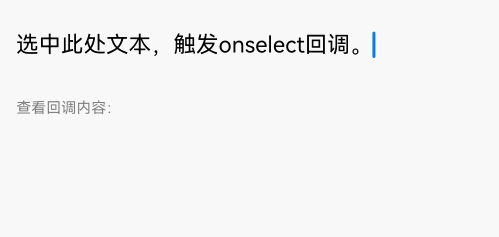
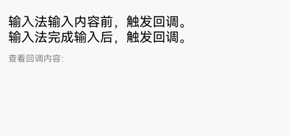
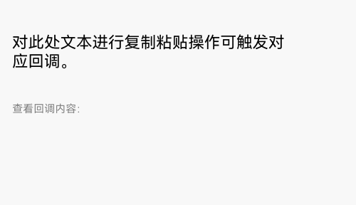
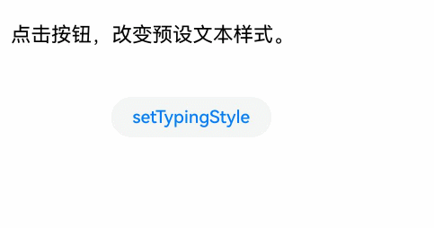
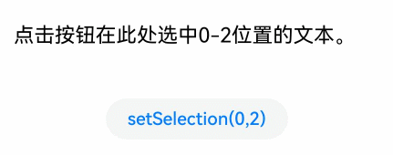
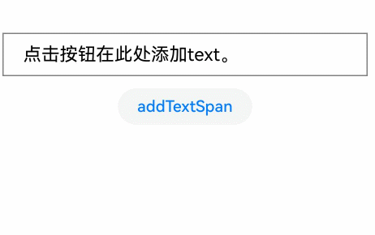
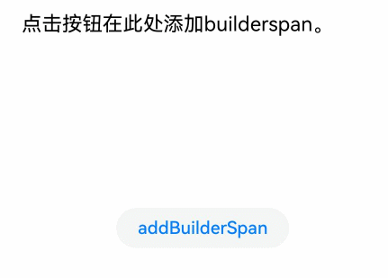
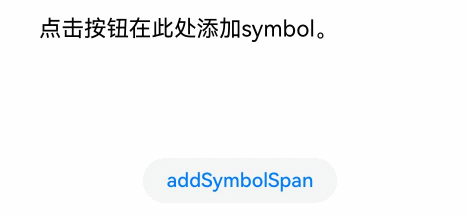

# 富文本（RichEditor）
RichEditor是支持图文混排和文本交互式编辑的组件，通常用于响应用户的对于图文混合内容的输入操作，例如可以输入图片的评论区。具体用法参考[RichEditor](../reference/apis-arkui/arkui-ts/ts-basic-components-richeditor.md)。

## 创建RichEditor组件
RichEditor通过调用接口来创建，可以创建以下两种类型：

### 创建不使用属性字符串构建的RichEditor组件
```ts
RichEditor(value: RichEditorOptions)
```
其中RichEditorOptions是富文本组件初始化选项。

```ts
controller: RichEditorController = new RichEditorController();
options: RichEditorOptions = { controller: this.controller };

RichEditor(this.options)
    .onReady(() => {
        this.controller.addTextSpan('创建不使用属性字符串构建的RichEditor组件。', {
            style: {
                fontColor: Color.Black,
                fontSize: 15
            }
        })
    })
```


### 创建使用属性字符串构建的RichEditor组件
```ts
RichEditor(options: RichEditorStyledStringOptions)
```

其中RichEditorStyledStringOptions是富文本组件初始化选项。属性字符串的使用方法请参考[属性字符串（StyledString/MutableStyledString）](arkts-styled-string.md)。

```ts
mutableStyledString: MutableStyledString = new MutableStyledString("创建使用属性字符串构建的RichEditor组件。",
    [{
        start: 0,
        length: 5,
        styledKey: StyledStringKey.FONT,
        styledValue: this.fontStyle
    }]);

controller: RichEditorStyledStringController = new RichEditorStyledStringController();
options: RichEditorStyledStringOptions = {controller: this.controller};

RichEditor(this.options)
    .onReady(() => {
        this.controller.setStyledString(this.mutableStyledString);
    })
```


## 设置属性

### 设置自定义选择菜单
  
通过[bindSelectionMenu](../reference/apis-arkui/arkui-ts/ts-basic-components-richeditor.md#bindselectionmenu)设置自定义选择菜单。

其中spanType是菜单的类型，默认值为文字类型；content是菜单的内容；responseType是菜单的响应类型，默认类型为长按；options是菜单的选项，可设置自定义选择菜单弹出或关闭时的回调。

自定义菜单超长时，建议内部嵌套Scroll组件使用，避免键盘被遮挡。

```ts
RichEditor(this.options)
    .onReady(() => {
        this.controller.addTextSpan('组件设置了自定义菜单，长按可触发。', {
            style: {
                fontColor: Color.Black,
                fontSize: 18
            }
        })
    })
    .bindSelectionMenu(RichEditorSpanType.TEXT, this.SystemMenu, ResponseType.LongPress, {
        onDisappear: () => {
            this.sliderShow = false
        }
    })
    .width(300)
    .height(300)

@Builder
SystemMenu() {
    Column() {
            Menu() {
                    if (this.controller) {
                        MenuItemGroup() {
                            MenuItem({
                                startIcon: this.theme.cutIcon,
                                content: "剪切",
                                labelInfo: "Ctrl+X",
                            })
                            MenuItem({
                                startIcon: this.theme.copyIcon,
                                content: "复制",
                                labelInfo: "Ctrl+C"
                            })
                            MenuItem({
                                startIcon: this.theme.pasteIcon,
                                content: "粘贴",
                                labelInfo: "Ctrl+V"
                            })
                        }
                    }
                }
                .radius(this.theme.containerBorderRadius)
                .clip(true)
                .backgroundColor(Color.White)
                .width(this.theme.defaultMenuWidth)
        }
        .width(this.theme.defaultMenuWidth)
}
```


### 设置输入框光标、手柄颜色
  
通过[caretColor](../reference/apis-arkui/arkui-ts/ts-basic-components-richeditor.md#caretcolor12)设置输入框光标、手柄颜色。

```ts
RichEditor(this.options)
    .onReady(() => {
        this.controller.addTextSpan('组件设置了光标手柄颜色。', {
            style: {
                fontColor: Color.Black,
                fontSize: 15
            }
        })
    })
    .caretColor(Color.Orange)
    .width(300)
    .height(300)
```


### 设置无输入时的提示文本
  
通过[placeholder](../reference/apis-arkui/arkui-ts/ts-basic-components-richeditor.md#placeholder12)设置无输入时的提示文本。
  
其中value为无输入时的提示文本；style为添加提示文本的字体样式，style缺省时默认跟随主题。

```ts
RichEditor(this.options)
    .placeholder("此处为提示文本...", {
        fontColor: Color.Gray,
        font: {
            size: 15,
            weight: FontWeight.Normal,
            family: "HarmonyOS Sans",
            style: FontStyle.Normal
        }
    })
    .width(300)
    .height(300)
```


更多属性使用请参考[RichEditor属性](../reference/apis-arkui/arkui-ts/ts-basic-components-richeditor.md#属性)。

## 添加事件
### 添加组件初始化完成后可触发的回调
  
通过[onReady](../reference/apis-arkui/arkui-ts/ts-basic-components-richeditor.md#onready)来添加组件初始化完成后可触发的回调。

其中callback是订阅富文本组件初始化完成的回调。

```ts
RichEditor(this.options)
    .onReady(() => {
        this.controller.addTextSpan('onReady回调内容是组件内预置文本。', {
            style: {
                fontColor: Color.Black,
                fontSize: 15
            }
        })
    })
```
  


### 添加组件内容被选中时可触发的回调
  
通过[onSelect](../reference/apis-arkui/arkui-ts/ts-basic-components-richeditor.md#onselect)来添加组件内容被选中时可触发的回调。

在callback中，[RichEditorSelection](../reference/apis-arkui/arkui-ts/ts-basic-components-richeditor.md#richeditorselection)为选中的所有内容信息。

触发该回调有两种方式：可通过鼠标左键按下选择，松开左键后触发回调，也可通过手指选择，松开手指触发回调。

```ts
RichEditor(this.options)
    .onReady(() => {
        this.controller.addTextSpan('选中此处文本，触发onselect回调。', {
            style: {
                fontColor: Color.Black,
                fontSize: 15
            }
        })
    })
    .onSelect((value: RichEditorSelection) => {
        this.controller1.addTextSpan(JSON.stringify(value), {
            style: {
                fontColor: Color.Gray,
                fontSize: 10
            }
        })
    })
    .width(300)
    .height(50)
Text('查看回调内容：').fontSize(10).fontColor(Color.Gray).width(300)
RichEditor(this.options1)
    .width(300)
    .height(70)
 ```



### 添加图文变化前和图文变化后可触发的回调

通过[onWillChange](../reference/apis-arkui/arkui-ts/ts-basic-components-richeditor.md#onwillchange12)添加图文变化前可触发的回调。通过[onDidChange](../reference/apis-arkui/arkui-ts/ts-basic-components-richeditor.md#ondidchange12)添加图文变化后可触发的回调。

onWillChange的callback中：[RichEditorChangeValue](../reference/apis-arkui/arkui-ts/ts-basic-components-richeditor.md#richeditorchangevalue12)为图文变化信息；boolean为true时，表示当前图文允许被更改。boolean为false时，表示当前图文不允许被更改。

onDidChange的callback中：[OnDidChangeCallback](../reference/apis-arkui/arkui-ts/ts-text-common.md#ondidchangecallback12)为图文变化前后的内容范围。

使用[RichEditorStyledStringOptions](../reference/apis-arkui/arkui-ts/ts-basic-components-richeditor.md#richeditorstyledstringoptions12)构建的RichEditor组件不支持这两种回调。

```ts
RichEditor(this.options)
    .onReady(() => {
        this.controller.addTextSpan('组件内图文变化前，触发回调。\n图文变化后，触发回调。', {
            style: {
                fontColor: Color.Black,
                fontSize: 15
            }
        })
    })
    .onWillChange((value: RichEditorChangeValue) => {
        this.controller1.addTextSpan('组件内图文变化前，触发回调：\n' + JSON.stringify(value), {
            style: {
                fontColor: Color.Gray,
                fontSize: 10
            }
        })
        return true;
    })
    .onDidChange((rangeBefore: TextRange, rangeAfter: TextRange) => {
        this.controller1.addTextSpan('\n图文变化后，触发回调：\nrangeBefore:' + JSON.stringify(rangeBefore) + '\nrangeAfter：' + JSON.stringify(rangeBefore), {
            style: {
                fontColor: Color.Gray,
                fontSize: 10
            }
        })
        return true;
    })
    .width(300)
    .height(50)
Text('查看回调内容：').fontSize(10).fontColor(Color.Gray).width(300)
RichEditor(this.options1)
    .width(300)
    .height(70)
```


### 添加输入法输入内容前和完成输入后可触发的回调
  
通过[aboutToIMEInput](../reference/apis-arkui/arkui-ts/ts-basic-components-richeditor.md#abouttoimeinput)添加输入法输入内容前可触发的回调。通过[onIMEInputComplete](../reference/apis-arkui/arkui-ts/ts-basic-components-richeditor.md#onimeinputcomplete)添加输入法完成输入后可触发的回调。

aboutToIMEInput的callback中：[RichEditorInsertValue](../reference/apis-arkui/arkui-ts/ts-basic-components-richeditor.md#richeditorinsertvalue)为输入法将要输入内容信息；boolean为true时，组件执行添加内容操作。boolean为false时，组件不执行添加内容操作。

onIMEInputComplete的callback中：[RichEditorTextSpanResult](../reference/apis-arkui/arkui-ts/ts-basic-components-richeditor.md#richeditortextspanresult)为输入法完成输入后的文本Span信息。

使用[RichEditorStyledStringOptions](../reference/apis-arkui/arkui-ts/ts-basic-components-richeditor.md#richeditorstyledstringoptions12)构建的RichEditor组件不支持这两种回调。

```ts
RichEditor(this.options)
          .onReady(() => {
            this.controller.addTextSpan('输入法输入内容前，触发回调。\n输入法完成输入后，触发回调。' , {
              style: {
                fontColor: Color.Black,
                fontSize: 15
              }
            })
          })
          .aboutToIMEInput((value: RichEditorInsertValue) => {
            this.controller1.addTextSpan('输入法输入内容前，触发回调：\n'+JSON.stringify(value), {
              style: {
                fontColor: Color.Gray,
                fontSize: 10
              }
            })
            return true;
          })
          .onIMEInputComplete((value: RichEditorTextSpanResult) => {
            this.controller1.addTextSpan('输入法完成输入后，触发回调：\n'+ JSON.stringify(value), {
              style: {
                fontColor: Color.Gray,
                fontSize: 10
              }
            })
            return true;
          })
          .width(300)
          .height(50)
Text('查看回调内容：').fontSize(10).fontColor(Color.Gray).width(300)
RichEditor(this.options1)
    .width(300)
    .height(70)
```



### 添加完成粘贴前可触发的回调
  
通过[onPaste](../reference/apis-arkui/arkui-ts/ts-basic-components-richeditor.md#onpaste11)添加完成粘贴前可触发的回调。

其中callback用于定义用户粘贴事件。

由于系统的默认粘贴，只支持纯文本的粘贴。所以开发者可以通过该方法，覆盖系统默认行为，实现图文的粘贴。

```ts
RichEditor(this.options)
    .onReady(() => {
        this.controller.addTextSpan('对此处文本进行复制粘贴操作可触发对应回调。', {
            style: {
                fontColor: Color.Black,
                fontSize: 15
            }
        })
    })
    .onPaste(() => {
        this.controller1.addTextSpan('触发onPaste回调\n', {
            style: {
                fontColor: Color.Gray,
                fontSize: 10
            }
        })
    })
    .width(300)
    .height(70)
```

### 添加完成剪切前可触发的回调

通过[onCut](../reference/apis-arkui/arkui-ts/ts-basic-components-richeditor.md#oncut12)添加完成粘贴前可触发的回调。

其中callback用于定义用户剪切事件。

由于系统的默认剪切行为，只支持纯文本的剪切。所以开发者可以通过该方法，覆盖系统默认行为，实现图文的剪切。

```ts
RichEditor(this.options)
    .onReady(() => {
        this.controller.addTextSpan('对此处文本进行复制粘贴操作可触发对应回调。', {
            style: {
                fontColor: Color.Black,
                fontSize: 15
            }
        })
    })
    .onCut(() => {
        this.controller1.addTextSpan('触发onCut回调\n', {
            style: {
                fontColor: Color.Gray,
                fontSize: 10
            }
        })
    })
    .width(300)
    .height(70)
```

### 添加完成复制前可触发的回调

通过[onCopy](../reference/apis-arkui/arkui-ts/ts-basic-components-richeditor.md#oncopy12)添加完成粘贴前可触发的回调。

其中callback用于定义用户复制事件。

由于系统的默认复制行为，只支持纯文本的复制。所以开发者可以通过该方法，覆盖系统默认行为，实现图文的复制。

```ts
RichEditor(this.options)
    .onReady(() => {
        this.controller.addTextSpan('对此处文本进行复制粘贴操作可触发对应回调。', {
            style: {
                fontColor: Color.Black,
                fontSize: 15
            }
        })
    })
    .onCopy(() => {
        this.controller1.addTextSpan('触发onCopy回调\n', {
            style: {
                fontColor: Color.Gray,
                fontSize: 10
            }
        })
    })
    .width(300)
    .height(70)
```




更多事件使用请参考[RichEditor事件](../reference/apis-arkui/arkui-ts/ts-basic-components-richeditor.md#事件)。

## 设置用户预设的样式

通过[setTypingStyle](../reference/apis-arkui/arkui-ts/ts-basic-components-richeditor.md#settypingstyle11)设置用户预设的样式。
  
其中value是预设样式。

```ts
RichEditor(this.options)
    .onReady(() => {
        this.controller.addTextSpan('点击按钮,改变组件预设样式。', {
            style: {
                fontColor: Color.Black,
                fontSize: 15
            }
        })
    })
    .width(300)
    .height(60)
Button('setTypingStyle', {
        buttonStyle: ButtonStyleMode.NORMAL
    })
    .height(30)
    .fontSize(13)
    .onClick(() => {
        this.controller.setTypingStyle({
            fontWeight: 'medium',
            fontColor: Color.Pink,
            fontSize: 15,
            fontStyle: FontStyle.Italic,
            decoration: {
                type: TextDecorationType.Underline,
                color: Color.Gray
            }
        })
    })
```



## 设置组件内的内容选中时部分背板高亮
  
通过[setSelection](../reference/apis-arkui/arkui-ts/ts-basic-components-richeditor.md#setselection11)设置组件内的内容选中时部分背板高亮。

其中selectionStart为选中开始位置，selectionEnd选中结束位置。当selectionStart和selectionEnd均为-1时表示全选。

当组件内未获焦出现光标时，调用该接口不产生选中效果。

```ts
RichEditor(this.options)
    .onReady(() => {
        this.controller.addTextSpan('点击按钮在此处选中0-2位置的文本。', {
            style: {
                fontColor: Color.Black,
                fontSize: 15
            }
        })
    })
    .width(300)
    .height(60)
Button('setSelection(0,2)', {
        buttonStyle: ButtonStyleMode.NORMAL
    })
    .height(30)
    .fontSize(13)
    .onClick(() => {
        this.controller.setSelection(0, 2)
    })
```



## 添加文本内容
  
除了直接在组件内输入内容，也可以通过[addTextSpan](../reference/apis-arkui/arkui-ts/ts-basic-components-richeditor.md#addtextspan)添加文本内容。

其中value是文本内容；options是文本选项，用于添加文本的偏移位置和文本样式信息（[RichEditorTextSpanOptions](../reference/apis-arkui/arkui-ts/ts-basic-components-richeditor.md#richeditortextspanoptions)）。

如果组件光标闪烁，插入后光标位置更新为新插入文本的后面。

```ts
RichEditor(this.options)
    .onReady(() => {
        this.controller.addTextSpan('点击按钮在此处添加text。', {
            style: {
                fontColor: Color.Black,
                fontSize: 15
            }
        })
    })
    .width(300)
    .height(100)
Button('addTextSpan', {
        buttonStyle: ButtonStyleMode.NORMAL
    })
    .height(30)
    .fontSize(13)
    .onClick(() => {
        this.controller.addTextSpan('新添加一段文字。')
    })
```



## 添加图片内容

通过[addImageSpan](../reference/apis-arkui/arkui-ts/ts-basic-components-richeditor.md#addimagespan)添加图片内容。
  
其中value是图片内容；options是图片选项，用于添加图片的偏移位置和图片样式信息（[RichEditorImageSpanOptions](../reference/apis-arkui/arkui-ts/ts-basic-components-richeditor.md#richeditorimagespanoptions)）。

添加图片内容，如果组件光标闪烁，插入后光标位置更新为新插入图片的后面。

```ts
RichEditor(this.options)
    .onReady(() => {
        this.controller.addTextSpan('点击按钮在此处添加image。', {
            style: {
                fontColor: Color.Black,
                fontSize: 15
            }
        })
    })
    .width(300)
    .height(100)
Button('addImageSpan', {
        buttonStyle: ButtonStyleMode.NORMAL
    })
    .height(30)
    .fontSize(13)
    .onClick(() => {
        this.controller.addImageSpan($r("app.media.startIcon"), {
            imageStyle: {
                size: ["57px", "57px"]
            }
        })
    })
```
  


## 添加@Builder装饰器修饰的内容
通过[addBuilderSpan](../reference/apis-arkui/arkui-ts/ts-basic-components-richeditor.md#addbuilderspan11)添加@Builder装饰器修饰的内容。
  
其中value是builder内容；options是builder选项，可通过[RichEditorBuilderSpanOptions](../reference/apis-arkui/arkui-ts/ts-basic-components-richeditor.md#richeditorbuilderspanoptions11)设置此builder在RichEditor中的index（一个文字为一个单位）。
  
```ts
@Builder
TextBuilder() {
    Row() {
            Image($r('app.media.startIcon')).width(50).height(50).margin(16)
            Column() {
                Text("文本文档.txt").fontWeight(FontWeight.Bold).fontSize(16)
                Text("123.45KB").fontColor('#8a8a8a').fontSize(12)
            }.alignItems(HorizontalAlign.Start)
        }.backgroundColor('#f4f4f4')
        .borderRadius("20")
        .width(220)
}

Button('addBuilderSpan', {
        buttonStyle: ButtonStyleMode.NORMAL
    })
    .height(30)
    .fontSize(13)
    .onClick(() => {
        this.my_builder = () => {
            this.TextBuilder()
        }
        this.controller.addBuilderSpan(this.my_builder)
    })
```
   

## 添加SymbolSpan内容
  
可通过[addSymbolSpan](../reference/apis-arkui/arkui-ts/ts-basic-components-richeditor.md#addsymbolspan11)添加SymbolSpan内容。

其中value是SymbolSpan组件内容；options是SymbolSpan组件选项，用于添加SymbolSpan组件的偏移位置和SymbolSpan组件样式信息（ [RichEditorSymbolSpanOptions](../reference/apis-arkui/arkui-ts/ts-basic-components-richeditor.md#richeditorsymbolspanoptions11) ）。

添加SymbolSpan内容，如果组件光标闪烁，插入后光标位置更新为新插入Symbol的后面。

SymbolSpan内容暂不支持手势、复制、拖拽处理。

```ts
RichEditor(this.options)
    .onReady(() => {
        this.controller.addTextSpan('点击按钮在此处添加symbol。', {
            style: {
                fontColor: Color.Black,
                fontSize: 15
            }
        })
    })
    .width(300)
    .height(100)
Button('addSymbolSpan', {
        buttonStyle: ButtonStyleMode.NORMAL
    })
    .height(30)
    .fontSize(13)
    .onClick(() => {
        this.controller.addSymbolSpan($r("sys.symbol.basketball_fill"), {
            style: {
                fontSize: 30
            }
        })
    })
```


## 获取组件内span信息
  
可通过[getSpans](../reference/apis-arkui/arkui-ts/ts-basic-components-richeditor.md#getspans)获取组件内span信息。

其中value是需要获取span范围。返回值为Array<[RichEditorTextSpanResult](../reference/apis-arkui/arkui-ts/ts-basic-components-richeditor.md#richeditortextspanresult) | [RichEditorImageSpanResult](../reference/apis-arkui/arkui-ts/ts-basic-components-richeditor.md#richeditorimagespanresult)>，是文本和图片Span信息。

```ts
RichEditor(this.options)
    .onReady(() => {
        this.controller.addTextSpan('点击按钮获取此处span信息。', {
            style: {
                fontColor: Color.Black,
                fontSize: 15
            }
        })
    })
    .width(300)
    .height(50)
Text('查看getSpans返回值：').fontSize(10).fontColor(Color.Gray).width(300)
RichEditor(this.options1)
    .width(300)
    .height(50)
Button('getSpans', {
        buttonStyle: ButtonStyleMode.NORMAL
    })
    .height(30)
    .fontSize(13)
    .onClick(() => {
        this.controller1.addTextSpan(JSON.stringify(this.controller.getSpans()), {
            style: {
                fontColor: Color.Gray,
                fontSize: 10
            }
        })

    })
```

<!--RP1--><!--RP1End-->