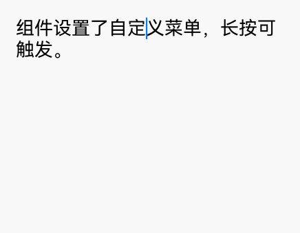
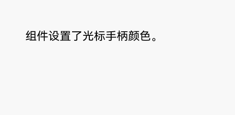
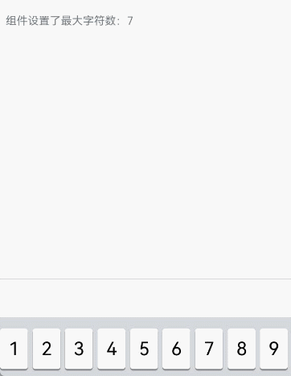
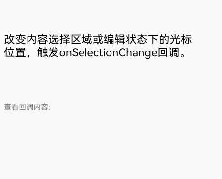
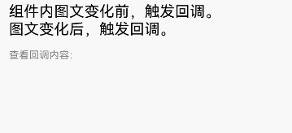
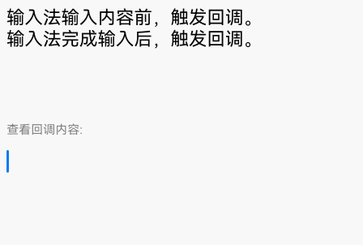
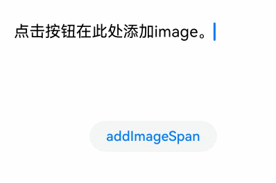
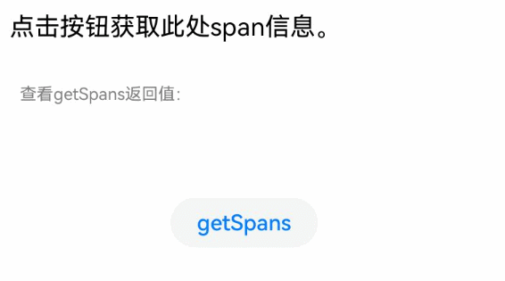

# 富文本（RichEditor）
RichEditor是支持图文混排和文本交互式编辑的组件，通常用于响应用户对图文混合内容的输入操作，例如可以输入图文的评论区。具体用法参考[RichEditor](../reference/apis-arkui/arkui-ts/ts-basic-components-richeditor.md)。

## 创建RichEditor组件
开发者可以创建[使用属性字符串](#创建使用属性字符串构建的richeditor组件)和[不使用属性字符串](#创建不使用属性字符串构建的richeditor组件)构建的RichEditor组件。

### 创建使用属性字符串构建的RichEditor组件
使用RichEditor(options: [RichEditorStyledStringOptions](../reference/apis-arkui/arkui-ts/ts-basic-components-richeditor.md#richeditorstyledstringoptions12))接口创建属性字符串构建的RichEditor组件，是基于属性字符串（[StyledString/MutableStyledString](arkts-styled-string.md)）构建的。这种构建方式开发者可以通过在应用侧持有属性字符串对象来管理数据，通过修改属性字符串对象的内容、样式，再传递给组件，即可实现对富文本组件内容的更新。

相比于使用controller提供的接口进行内容样式更新，使用起来更加灵活便捷。同时属性字符串对象可以设置到各类支持属性字符串的文本组件中，可以快速实现内容的迁移。

```ts
fontStyle: TextStyle = new TextStyle({
  fontColor: Color.Pink
});
// 定义字体样式对象

mutableStyledString: MutableStyledString = new MutableStyledString("创建使用属性字符串构建的RichEditor组件。",
  [{
    start: 0,
    length: 5,
    styledKey: StyledStringKey.FONT,
    styledValue: this.fontStyle
  }]);
// 创建属性字符串

controller: RichEditorStyledStringController = new RichEditorStyledStringController();
options: RichEditorStyledStringOptions = { controller: this.controller };

RichEditor(this.options)
  .onReady(() => {
    this.controller.setStyledString(this.mutableStyledString);
  })
```


### 创建不使用属性字符串构建的RichEditor组件
使用RichEditor(value: [RichEditorOptions](../reference/apis-arkui/arkui-ts/ts-basic-components-richeditor.md#richeditoroptions))接口创建非属性字符串构建的RichEditor组件，一般用于复杂内容场景，开发者通过RichEditorController提供的接口实现内容、样式的管理。

```ts
@Entry
@Component
struct create_rich_editor {
  controller: RichEditorController = new RichEditorController();
  options: RichEditorOptions = { controller: this.controller };

  build() {
    Column() {
      Column() {
        RichEditor(this.options)
          .onReady(() => {
            this.controller.addTextSpan('创建不使用属性字符串构建的RichEditor组件。', {
              style: {
                fontColor: Color.Black,
                fontSize: 15
              }
            })
          })
      }.width('100%')
    }.height('100%')
  }
}
```


## 设置属性

### 设置自定义选择菜单
通过[bindSelectionMenu](../reference/apis-arkui/arkui-ts/ts-basic-components-richeditor.md#bindselectionmenu)设置自定义选择菜单。

组件原本具有默认的文本选择菜单，包含复制、剪切和全选的功能。用户可使用该属性设定自定义菜单，例如翻译英文、加粗字体等丰富的菜单功能。

当自定义菜单超长时，建议内部嵌套Scroll组件使用，避免键盘被遮挡。

```ts
export interface SelectionMenuTheme {
  imageSize: number;
  buttonSize: number;
  menuSpacing: number;
  editorOptionMargin: number;
  expandedOptionPadding: number;
  defaultMenuWidth: number;
  imageFillColor: Resource;
  backGroundColor: Resource;
  iconBorderRadius: Resource;
  containerBorderRadius: Resource;
  cutIcon: Resource;
  copyIcon: Resource;
  pasteIcon: Resource;
  selectAllIcon: Resource;
  shareIcon: Resource;
  translateIcon: Resource;
  searchIcon: Resource;
  arrowDownIcon: Resource;
  iconPanelShadowStyle: ShadowStyle;
  iconFocusBorderColor: Resource;
}
// 自定义SelectionMenuTheme接口

export const defaultTheme: SelectionMenuTheme = {
  imageSize: 24,
  buttonSize: 48,
  menuSpacing: 8,
  editorOptionMargin: 1,
  expandedOptionPadding: 3,
  defaultMenuWidth: 256,
  imageFillColor: $r('sys.color.ohos_id_color_primary'),
  backGroundColor: $r('sys.color.ohos_id_color_dialog_bg'),
  iconBorderRadius: $r('sys.float.ohos_id_corner_radius_default_m'),
  containerBorderRadius: $r('sys.float.ohos_id_corner_radius_card'),
  cutIcon: $r("sys.media.ohos_ic_public_cut"),
  copyIcon: $r("sys.media.ohos_ic_public_copy"),
  pasteIcon: $r("sys.media.ohos_ic_public_paste"),
  selectAllIcon: $r("sys.media.ohos_ic_public_select_all"),
  shareIcon: $r("sys.media.ohos_ic_public_share"),
  translateIcon: $r("sys.media.ohos_ic_public_translate_c2e"),
  searchIcon: $r("sys.media.ohos_ic_public_search_filled"),
  arrowDownIcon: $r("sys.media.ohos_ic_public_arrow_down"),
  iconPanelShadowStyle: ShadowStyle.OUTER_DEFAULT_MD,
  iconFocusBorderColor: $r('sys.color.ohos_id_color_focused_outline'),
}
// 定义defaultTheme变量

RichEditor(this.options)
  .onReady(() => {
    this.controller.addTextSpan('组件设置了自定义菜单，长按可触发。', {
      style: {
        fontColor: Color.Black,
        fontSize: 18
      }
    })
  })
  .bindSelectionMenu(RichEditorSpanType.TEXT, this.SystemMenu, ResponseType.LongPress, {
    onDisappear: () => {
      this.sliderShow = false
    }
  })
// 绑定自定义菜单
  .width(300)
  .height(300)

@Builder
SystemMenu() {
  Column() {
    Menu() {
      if (this.controller) {
        MenuItemGroup() {
          MenuItem({
            startIcon: this.theme.cutIcon,
            content: "剪切",
            labelInfo: "Ctrl+X"
          })
          MenuItem({
            startIcon: this.theme.copyIcon,
            content: "复制",
            labelInfo: "Ctrl+C"
          })
          MenuItem({
            startIcon: this.theme.pasteIcon,
            content: "粘贴",
            labelInfo: "Ctrl+V"
          })
        }
      }
    }
    .radius(this.theme.containerBorderRadius)
    .clip(true)
    .backgroundColor(Color.White)
    .width(this.theme.defaultMenuWidth)
  }
  .width(this.theme.defaultMenuWidth)
}
```



### 设置输入框光标、手柄颜色
通过[caretColor](../reference/apis-arkui/arkui-ts/ts-basic-components-richeditor.md#caretcolor12)设置输入框光标、手柄颜色。

设置不同颜色的光标和手柄可以提高视觉辨识度，特别是在包含多个输入区域的复杂界面中，独特的光标颜色能帮助快速定位当前操作的输入区域。这一特性也可以提升用户体验，使光标颜色与应用页面整体的风格相协调。

```ts
RichEditor(this.options)
  .onReady(() => {
    this.controller.addTextSpan('组件设置了光标手柄颜色。', {
      style: {
        fontColor: Color.Black,
        fontSize: 15
      }
    })
  })
  .caretColor(Color.Orange)
  .width(300)
  .height(300)
```



### 设置无输入时的提示文本
通过[placeholder](../reference/apis-arkui/arkui-ts/ts-basic-components-richeditor.md#placeholder12)设置无输入时的提示文本。

例如，在用户登录界面采用提示文本，有助于用户区分用户名与密码的输入框。又如，在文本编辑框中，使用提示文本明确输入要求，如“限输入100字以内”，以此指导用户正确操作。

```ts
RichEditor(this.options)
  .placeholder("此处为提示文本...", {
    fontColor: Color.Gray,
    font: {
      size: 15,
      weight: FontWeight.Normal,
      family: "HarmonyOS Sans",
      style: FontStyle.Normal
    }
  })
  .width(300)
  .height(50)
```


### 设置最大行数
通过[maxLines](../reference/apis-arkui/arkui-ts/ts-basic-components-richeditor.md#maxlines18)设置富文本可显示的最大行数。

```ts
RichEditor(this.options)
  .onReady(() => {
    this.controller.addTextSpan('组件设置了最大行数\n超出内容将会以滚动显示\n超出1行\n超出2行\n超出3行\n超出4行', {
      style: {
        fontColor: Color.Black,
        fontSize: 15
      }
    })
  })
  .maxLines(2)
```


### 设置最大长度
通过[maxLength](../reference/apis-arkui/arkui-ts/ts-basic-components-richeditor.md#maxlength18)设置富文本的最大输入字符数。

```ts
RichEditor(this.options)
  .placeholder('组件设置了最大字符数：7')
  .onReady(() => {})
  .maxLength(7)
```



### 默认选中菜单
富文本中的文字被选中时会弹出包含剪切、复制、翻译、分享的菜单。

```ts
RichEditor(this.options)
  .onReady(() => {
    this.controller.addTextSpan('这是一段文本,用来展示选中菜单', {
      style: {
        fontColor: Color.Black,
        fontSize: 15
      }
    })
  })
```


更多属性使用请参考[RichEditor属性](../reference/apis-arkui/arkui-ts/ts-basic-components-richeditor.md#属性)。

## 添加事件

### 添加组件初始化完成后可触发的回调
通过[onReady](../reference/apis-arkui/arkui-ts/ts-basic-components-richeditor.md#onready)来添加组件初始化完成后可触发的回调。

该回调可以用于执行一些组件的初始化逻辑。例如在使用富文本组件展示新闻的场景中，可以在该回调中从服务器获取图文数据，并将其添加到组件中，从而实现进入应用页面后即呈现完整新闻内容的功能。

```ts
RichEditor(this.options)
  .onReady(() => {
    this.controller.addTextSpan('onReady回调内容是组件内预置文本。', {
      style: {
        fontColor: Color.Black,
        fontSize: 15
      }
    })
  })
```


### 添加组件内容选择区域或编辑状态下光标位置改变时可触发的回调
通过[onSelectionChange](../reference/apis-arkui/arkui-ts/ts-basic-components-richeditor.md#onselectionchange12)来添加组件内容选择区域或编辑状态下光标位置改变时可触发的回调。

该回调可用于实时监听组件内容选中区域变化，例如实现实时更新工具栏状态（显示字体、段落格式等）、统计选中内容长度或生成选中内容摘要。实时响应选中状态，动态联动交互元素，提升富文本编辑的操作反馈体验和功能的灵活性。

```ts
RichEditor(this.options)
  .onReady(() => {
    this.controller.addTextSpan('改变内容选择区域或编辑状态下的光标位置，触发onSelectionChange回调。', {
      style: {
        fontColor: Color.Black,
        fontSize: 15
      }
    })
  })
  .onSelectionChange((value: RichEditorRange) => {
    this.controller1.addTextSpan("\n" + "触发了onSelectionChange回调，起始范围信息为：(" + value.start + "," +
    value.end + ")", {
      style: {
        fontColor: Color.Gray,
        fontSize: 10
      }
    })
  })
  .width(300)
  .height(50)
Text('查看回调内容：').fontSize(10).fontColor(Color.Gray).width(300)
RichEditor(this.options1)
  .width(300)
  .height(70)
```



### 添加图文变化前和图文变化后可触发的回调
通过[onWillChange](../reference/apis-arkui/arkui-ts/ts-basic-components-richeditor.md#onwillchange12)添加图文变化前可触发的回调。此回调适用于用户实时数据校验与提醒，例如在用户输入文本时，可在回调内实现对输入内容的检测，若检测到敏感词汇，应立即弹出提示框。此外，它还适用于实时字数统计与限制，对于有字数限制的输入场景，可在回调中实时统计用户输入的字数，并在接近字数上限时提供相应的提示。

通过[onDidChange](../reference/apis-arkui/arkui-ts/ts-basic-components-richeditor.md#ondidchange12)添加图文变化后可触发的回调。此回调适用于内容保存与同步，例如在用户完成内容编辑后，可使用该回调自动将最新内容保存至本地或同步至服务器。此外，它还适用于内容状态更新与渲染，例如在待办事项列表应用中，用户编辑富文本格式的待办事项描述后，可使用该回调更新待办事项在列表中的显示样式。

使用[RichEditorStyledStringOptions](../reference/apis-arkui/arkui-ts/ts-basic-components-richeditor.md#richeditorstyledstringoptions12)构建的RichEditor组件不支持上述两种回调。

```ts
RichEditor(this.options)
  .onReady(() => {
    this.controller.addTextSpan('组件内图文变化前，触发回调。\n图文变化后，触发回调。', {
      style: {
        fontColor: Color.Black,
        fontSize: 15
      }
    })
  })
  .onWillChange((value: RichEditorChangeValue) => {
    this.controller1.addTextSpan('组件内图文变化前，触发回调：\n' + JSON.stringify(value), {
      style: {
        fontColor: Color.Gray,
        fontSize: 10
      }
    })
    return true;
  })
  .onDidChange((rangeBefore: TextRange, rangeAfter: TextRange) => {
    this.controller1.addTextSpan('\n图文变化后，触发回调：\nrangeBefore:' + JSON.stringify(rangeBefore) +
      '\nrangeAfter：' + JSON.stringify(rangeBefore), {
      style: {
        fontColor: Color.Gray,
        fontSize: 10
      }
    })
    return true;
  })
  .width(300)
  .height(50)
Text('查看回调内容：').fontSize(10).fontColor(Color.Gray).width(300)
RichEditor(this.options1)
  .width(300)
  .height(70)
```



### 添加输入法输入内容前和完成输入后可触发的回调
在添加输入法输入内容前，可以通过[aboutToIMEInput](../reference/apis-arkui/arkui-ts/ts-basic-components-richeditor.md#abouttoimeinput)触发回调。在输入法完成输入后，可以通过[onDidIMEInput](../reference/apis-arkui/arkui-ts/ts-basic-components-richeditor.md#ondidimeinput12)触发回调。

这两种回调机制适用于文本上屏过程的业务逻辑处理。例如：在用户输入的文本上屏前，利用回调提供联想词汇，在用户完成输入后，执行自动化纠错或格式转换。两种回调的时序依次为：aboutToIMEInput、onDidIMEInput。

使用[RichEditorStyledStringOptions](../reference/apis-arkui/arkui-ts/ts-basic-components-richeditor.md#richeditorstyledstringoptions12)构建的组件并不支持上述两种回调功能。

```ts
RichEditor(this.options)
  .onReady(() => {
    this.controller.addTextSpan('输入法输入内容前，触发回调。\n输入法完成输入后，触发回调。', {
      style: {
        fontColor: Color.Black,
        fontSize: 15
      }
    })
  })
  .aboutToIMEInput((value: RichEditorInsertValue) => {
    this.controller1.addTextSpan('输入法输入内容前，触发aboutToIMEInput回调：\n' + JSON.stringify(value), {
      style: {
        fontColor: Color.Gray,
        fontSize: 10
      }
    })
    return true;
  })
  .onDidIMEInput((value: TextRange) => {
    this.controller1.addTextSpan('输入法完成输入后，触发onDidIMEInput回调：\n' + JSON.stringify(value), {
      style: {
        fontColor: Color.Gray,
        fontSize: 10
      }
    })
        })
  .width(300)
  .height(50)
Text('查看回调内容：').fontSize(10).fontColor(Color.Gray).width(300)
RichEditor(this.options1)
  .width(300)
  .height(70)
```



### 添加完成粘贴前可触发的回调
通过[onPaste](../reference/apis-arkui/arkui-ts/ts-basic-components-richeditor.md#onpaste11)回调，来添加粘贴前要处理的流程。

此回调适用于内容格式的处理。例如，当用户复制包含HTML标签的文本时，可在回调中编写代码，将其转换为富文本组件所支持的格式，同时剔除不必要的标签或仅保留纯文本内容。

由于组件默认的粘贴行为仅限于纯文本，无法处理图片粘贴，开发者可利用此方法实现图文并茂的粘贴功能，从而替代组件原有的粘贴行为。

```ts
RichEditor(this.options)
  .onReady(() => {
    this.controller.addTextSpan('对此处文本进行复制粘贴操作可触发对应回调。', {
      style: {
        fontColor: Color.Black,
        fontSize: 15
      }
    })
  })
  .onPaste(() => {
    this.controller1.addTextSpan('触发onPaste回调\n', {
      style: {
        fontColor: Color.Gray,
        fontSize: 10
      }
    })
  })
  .width(300)
  .height(70)
```

### 添加完成剪切前可触发的回调
通过[onCut](../reference/apis-arkui/arkui-ts/ts-basic-components-richeditor.md#oncut12)回调，来添加剪切前要处理的流程。

此回调功能适用于数据处理与存储。例如，当用户从富文本组件中剪切内容时，可在回调中执行将被剪切的内容进行临时存储的操作，确保后续的粘贴操作能够准确无误地还原内容。

由于组件默认的剪切行为仅限于纯文本，无法处理图片剪切，开发者可利用此方法实现图文并茂的剪切功能，从而替代组件原有的剪切行为。

```ts
RichEditor(this.options)
  .onReady(() => {
    this.controller.addTextSpan('对此处文本进行复制粘贴操作可触发对应回调。', {
      style: {
        fontColor: Color.Black,
        fontSize: 15
      }
    })
  })
  .onCut(() => {
    this.controller1.addTextSpan('触发onCut回调\n', {
      style: {
        fontColor: Color.Gray,
        fontSize: 10
      }
    })
  })
  .width(300)
  .height(70)
```

### 添加完成复制前可触发的回调
通过[onCopy](../reference/apis-arkui/arkui-ts/ts-basic-components-richeditor.md#oncopy12)回调，来添加复制前要处理的流程。

此回调适用于内容的备份与共享，例如在用户复制内容时，可在回调中执行以下操作：将复制的内容及其格式信息保存至本地备份文件夹，或自动生成一段包含复制内容及产品购买链接的分享文案，以方便用户进行粘贴和分享。

组件默认的复制行为仅限于纯文本，无法处理图。开发者可利用此方法实现图文并茂的复制功能，替代组建的默认行为。

```ts
RichEditor(this.options)
  .onReady(() => {
    this.controller.addTextSpan('对此处文本进行复制粘贴操作可触发对应回调。', {
      style: {
        fontColor: Color.Black,
        fontSize: 15
      }
    })
  })
  .onCopy(() => {
    this.controller1.addTextSpan('触发onCopy回调\n', {
      style: {
        fontColor: Color.Gray,
        fontSize: 10
      }
    })
  })
  .width(300)
  .height(70)
```


更多事件使用请参考[RichEditor事件](../reference/apis-arkui/arkui-ts/ts-basic-components-richeditor.md#事件)。

## 设置用户预设的文本样式
通过[setTypingStyle](../reference/apis-arkui/arkui-ts/ts-basic-components-richeditor.md#settypingstyle11)设置用户预设的文本样式。

此接口可用于个性化的写作体验，例如可以使用此接口让输入的不同层级标题自动应用相应格式（如一级、二级标题）。

```ts
RichEditor(this.options)
  .onReady(() => {
    this.controller.addTextSpan('点击按钮，改变预设文本样式。', {
      style: {
        fontColor: Color.Black,
        fontSize: 15
      }
    })
  })
  .width(300)
  .height(60)
Button('setTypingStyle', {
  buttonStyle: ButtonStyleMode.NORMAL
})
  .height(30)
  .fontSize(13)
  .onClick(() => {
    this.controller.setTypingStyle({
      fontWeight: 'medium',
      fontColor: Color.Pink,
      fontSize: 15,
      fontStyle: FontStyle.Italic,
      decoration: {
        type: TextDecorationType.Underline,
        color: Color.Gray
      }
    })
  })
```


## 设置组件内的内容选中时部分背板高亮
通过[setSelection](../reference/apis-arkui/arkui-ts/ts-basic-components-richeditor.md#setselection11)设置组件内的内容选中时部分背板高亮。

此接口可用于实现文本聚焦效果，例如当用户点击某个文本段落的标题或摘要时，可通过该接口自动选中并高亮出对应正文内容。

当组件内未获焦出现光标时，调用该接口不产生选中效果。

```ts
RichEditor(this.options)
  .onReady(() => {
    this.controller.addTextSpan('点击按钮在此处选中0-2位置的文本。', {
      style: {
        fontColor: Color.Black,
        fontSize: 15
      }
    })
  })
  .width(300)
  .height(60)
Button('setSelection(0,2)', {
  buttonStyle: ButtonStyleMode.NORMAL
})
  .height(30)
  .fontSize(13)
  .onClick(() => {
    this.controller.setSelection(0, 2)
  })
```


## 添加文本内容
除了直接在组件内输入内容，也可以通过[addTextSpan](../reference/apis-arkui/arkui-ts/ts-basic-components-richeditor.md#addtextspan)添加文本内容。

此接口可以实现文本样式多样化，例如创建混合样式文本。

如果组件是获焦状态，有光标在闪烁，那么通过addTextSpan添加文本内容后，光标位置会更新，在新添加文本内容的右侧闪烁。

```ts
RichEditor(this.options)
  .onReady(() => {
    this.controller.addTextSpan('点击按钮在此处添加text。', {
      style: {
        fontColor: Color.Black,
        fontSize: 15
      }
    })
  })
  .width(300)
  .height(100)
Button('addTextSpan', {
  buttonStyle: ButtonStyleMode.NORMAL
})
  .height(30)
  .fontSize(13)
  .onClick(() => {
    this.controller.addTextSpan('新添加一段文字。')
  })
```


## 添加图片内容
通过[addImageSpan](../reference/apis-arkui/arkui-ts/ts-basic-components-richeditor.md#addimagespan)添加图片内容。

此接口可用于内容丰富与可视化展示，例如在新闻中加入图片，在文档中加入数据可视化图形等。

如果组件是获焦状态，有光标在闪烁，那么通过addImageSpan添加图片内容后，光标位置会更新，在新添加图片内容的右侧闪烁。

```ts
RichEditor(this.options)
  .onReady(() => {
    this.controller.addTextSpan('点击按钮在此处添加image。', {
      style: {
        fontColor: Color.Black,
        fontSize: 15
      }
    })
  })
  .width(300)
  .height(100)
Button('addImageSpan', {
  buttonStyle: ButtonStyleMode.NORMAL
})
  .height(30)
  .fontSize(13)
  .onClick(() => {
    this.controller.addImageSpan($r("app.media.startIcon"), {
      imageStyle: {
        size: ["57px", "57px"]
      }
    })
  })
```



## 添加@Builder装饰器修饰的内容
通过[addBuilderSpan](../reference/apis-arkui/arkui-ts/ts-basic-components-richeditor.md#addbuilderspan11)添加@Builder装饰器修饰的内容。

此接口可用于自定义复杂组件的嵌入，例如在组件内加入自定义图表。

该接口内可通过[RichEditorBuilderSpanOptions](../reference/apis-arkui/arkui-ts/ts-basic-components-richeditor.md#richeditorbuilderspanoptions11)设置在组件中添加builder的位置，省略或者为异常值时，则添加builder到所有内容的最后位置。

```ts
private my_builder: CustomBuilder = undefined

@Builder
TextBuilder() {
  Row() {
    Image($r('app.media.startIcon')).width(50).height(50).margin(16)
    Column() {
      Text("文本文档.txt").fontWeight(FontWeight.Bold).fontSize(16)
      Text("123.45KB").fontColor('#8a8a8a').fontSize(12)
    }.alignItems(HorizontalAlign.Start)
  }.backgroundColor('#f4f4f4')
  .borderRadius("20")
  .width(220)
}

Button('addBuilderSpan', {
  buttonStyle: ButtonStyleMode.NORMAL
})
  .height(30)
  .fontSize(13)
  .onClick(() => {
    this.my_builder = () => {
      this.TextBuilder()
    }
    this.controller.addBuilderSpan(this.my_builder)
  })
```
   

## 添加SymbolSpan内容
可通过[addSymbolSpan](../reference/apis-arkui/arkui-ts/ts-basic-components-richeditor.md#addsymbolspan11)添加Symbol内容。此接口可用于特殊符号添加与展示，例如在编辑学术论文时，此接口可用于添加各种数学符号。

添加Symbol内容时，如果组件是获焦状态，有光标在闪烁，则插入Symbol后光标位置更新为新插入Symbol的右侧。
Symbol内容暂不支持手势、复制、拖拽处理。

```ts
RichEditor(this.options)
  .onReady(() => {
    this.controller.addTextSpan('点击按钮在此处添加symbol。', {
      style: {
        fontColor: Color.Black,
        fontSize: 15
      }
    })
  })
  .width(300)
  .height(100)
Button('addSymbolSpan', {
  buttonStyle: ButtonStyleMode.NORMAL
})
  .height(30)
  .fontSize(13)
  .onClick(() => {
    this.controller.addSymbolSpan($r("sys.symbol.basketball_fill"), {
      style: {
        fontSize: 30
      }
    })
  })
```


## 获取组件内图文信息
可通过[getSpans](../reference/apis-arkui/arkui-ts/ts-basic-components-richeditor.md#getspans)获取组件内所有图文内容的信息，包括图文的内容、id、样式、位置等信息。获取内容位置信息后，可对指定范围内容进行样式的更新。

此接口适用于已有的内容样式获取与检查，例如在模板应用场景下，可利用此接口获取文本样式。此外，它还适用于内容解析与处理，例如在文本分析应用中，此接口能够获取特定范围内的文本信息。

```ts
controller: RichEditorController = new RichEditorController();
options: RichEditorOptions = { controller: this.controller }
controller1: RichEditorController = new RichEditorController();
options1: RichEditorOptions = { controller: this.controller1 }
// 创建两个富文本组件

RichEditor(this.options)
  .onReady(() => {
    this.controller.addTextSpan('点击按钮获取此处span信息。', {
      style: {
        fontColor: Color.Black,
        fontSize: 15
      }
    })
  })
  .width(300)
  .height(50)
Text('查看getSpans返回值：').fontSize(10).fontColor(Color.Gray).width(300)
RichEditor(this.options1)
  .width(300)
  .height(50)
Button('getSpans', {
  buttonStyle: ButtonStyleMode.NORMAL
})
  .height(30)
  .fontSize(13)
  .onClick(() => {
    this.controller1.addTextSpan(JSON.stringify(this.controller.getSpans()), {
      style: {
        fontColor: Color.Gray,
        fontSize: 10
      }
    })
  })
```

<!--RP1--><!--RP1End-->