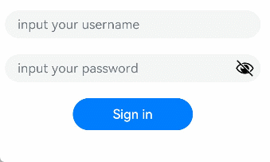

# 文本输入（TextInput/TextArea）


TextInput、TextArea是输入框组件，通常用于响应用户的输入操作，比如评论区的输入、聊天框的输入、表格的输入等，也可以结合其它组件构建功能页面，例如登录注册页面。具体用法请参考[TextInput](../reference/arkui-ts/ts-basic-components-textinput.md)、[TextArea](../reference/arkui-ts/ts-basic-components-textarea.md)。


## 创建输入框

TextInput为单行输入框、TextArea为多行输入框。通过以下接口来创建。

```ts
TextInput(value?:{placeholder?: ResourceStr, text?: ResourceStr, controller?: TextInputController})
```

```ts
TextArea(value?:{placeholder?: ResourceStr, text?: ResourceStr, controller?: TextAreaController})
```

- 单行输入框

  ```ts
  TextInput()
  ```

  


- 多行输入框

  ```ts
  TextArea()
  ```

  

  多行输入框文字超出一行时会自动折行。


  ```ts
  TextArea({text:"我是TextArea我是TextArea我是TextArea我是TextArea"}).width(300)
  ```

  


## 设置输入框类型

TextInput有9种可选类型，分别为Normal基本输入模式、Password密码输入模式、Email邮箱地址输入模式、Number纯数字输入模式、PhoneNumber电话号码输入模式、USER_NAME用户名输入模式、NEW_PASSWORD新密码输入模式、NUMBER_PASSWORD纯数字密码输入模式、SCREEN_LOCK_PASSWORD锁屏应用密码输入模式、NUMBER_DECIMAL带小数点的数字输入模式。通过type属性进行设置：


- 基本输入模式（默认类型）

  ```ts
  TextInput()
    .type(InputType.Normal)
  ```

  

- 密码输入模式

  ```ts
  TextInput()
    .type(InputType.Password)
  ```

  


## 自定义样式

- 设置无输入时的提示文本。
  TextInput({placeholder:'我是提示文本'})


  ```ts
  TextInput({placeholder:'我是提示文本'})
  ```

  


- 设置输入框当前的文本内容。

  ```ts
  TextInput({placeholder:'我是提示文本',text:'我是当前文本内容'})
  ```

  

- 添加backgroundColor改变输入框的背景颜色。

  ```ts
  TextInput({placeholder:'我是提示文本',text:'我是当前文本内容'})
    .backgroundColor(Color.Pink)
  ```

  

  更丰富的样式可以结合[通用属性](../reference/arkui-ts/ts-universal-attributes-size.md)实现。


## 添加事件

文本框主要用于获取用户输入的信息，把信息处理成数据进行上传，绑定onChange事件可以获取输入框内改变的内容。用户也可以使用通用事件来进行相应的交互操作。


```ts
TextInput()
  .onChange((value: string) => {
    console.info(value);
  })
  .onFocus(() => {
    console.info('获取焦点');
  })
```


## 场景示例

在登录/注册页面，用户进行登录或注册。

```ts
@Entry
@Component
struct TextInputSample {
  build() {
    Column() {
      TextInput({ placeholder: 'input your username' }).margin({ top: 20 })
        .onSubmit((EnterKeyType)=>{
          console.info(EnterKeyType+'输入法回车键的类型值')
        })
      TextInput({ placeholder: 'input your password' }).type(InputType.Password).margin({ top: 20 })
        .onSubmit((EnterKeyType)=>{
          console.info(EnterKeyType+'输入法回车键的类型值')
        })
      Button('Sign in').width(150).margin({ top: 20 })
    }.padding(20)
  }
}
```





## 相关实例

针对文本输入开发，有以下相关实例可供参考：

- [简易计算器（ArkTS）（API9）](https://gitee.com/openharmony/codelabs/tree/master/ETSUI/SimpleCalculator)