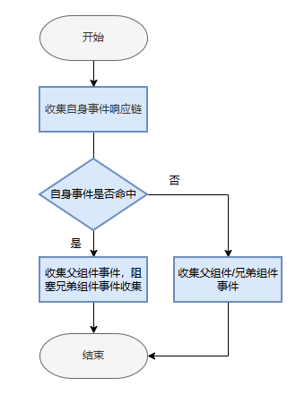
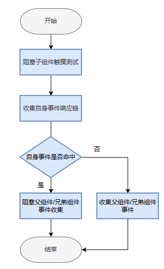
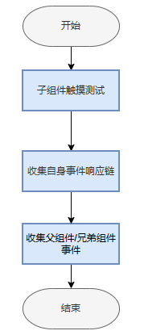

# 事件分发

## 概述

事件分发是指ArkUI收到用户操作生成的触控事件后，通过触摸测试，将触控事件分发至各个组件形成事件的过程。

触控事件按照输入设备类型可以划分为finger（手指在屏幕滑动）、mouse（鼠标操作）、touchpad（触控板操作）、pen（手写笔在屏幕滑动）、joystick（手柄操作）等；按照事件类型可以划分为按下、移动、滚动等；系统会根据触控事件的坐标、类型等信息，结合UI布局，将事件发送给对应UI组件。多个事件可以组合触发手势或其他功能，如长按、点击、拖拽。

## 触摸测试

触摸测试是指当ArkUI收到了Touch类触控事件或者Mouse类触控事件的起始事件（如手指或者鼠标光标按下时生成的事件），基于所收到的事件的坐标，进行组件响应区域的测试判定并收集事件响应链的过程。

开发者可以通过设置以下属性影响触摸测试流程：

- hitTestBehavior：触摸测试控制

- interceptTouch：事件自定义拦截

- responseRegion：触摸热区设置

- enabled：禁用控制

- 安全组件

- 其他属性设置：透明度/组件下线

### 触摸测试基本流程

  

触摸测试的基本流程如下：接收到起始事件后，系统将自上而下、自右向左遍历组件树，收集每个组件上绑定的手势和事件，然后将这些信息逐级向上冒泡至父组件进行整合，最终构建完整的事件响应链。

如图所示，当起始事件被分发至组件时，组件会收集自身绑定的手势与事件，随后将收集结果传递给父组件，直至达到根节点。若组件透明、已从组件树中移除，或事件坐标不在组件响应热区范围内，将不会触发收集过程，父组件接收的反馈为空。除此之外，所有组件均会执行手势与事件的收集，并将结果反馈给父组件。

### 触摸测试控制

在组件上绑定[触摸测试控制](../reference/apis-arkui/arkui-ts/ts-universal-attributes-hit-test-behavior.md)时，可能影响兄弟节点和父子节点的触摸测试。子组件对父组件的触摸测试影响程度取决于最后一个未被阻塞触摸测试的子组件状态。

开发者可以通过配置触摸测试控制，来实现阻塞组件自身或其他组件的触摸测试。

- HitTestMode.Default：默认不配hitTestBehavior属性，自身如果命中会阻塞兄弟组件，但是不阻塞子组件。

  

- HitTestMode.None：自身不接收事件，但不会阻塞兄弟组件或子组件继续做触摸测试。

  

- HitTestMode.Block：阻塞子组件的触摸测试，如果自身触摸测试命中，会阻塞兄弟组件及父组件的触摸测试。

  

- HitTestMode.Transparent：自身进行触摸测试，同时不阻塞兄弟组件及父组件。

  

### 自定义事件拦截

当用户执行按下操作时，将触发组件上绑定的[自定义事件拦截](../reference/apis-arkui/arkui-ts/ts-universal-attributes-on-touch-intercept.md)的回调。开发者可根据应用状态，动态调整组件的hitTestBehavior属性，进而影响触控测试的流程。

### 禁用控制

设置了[禁用控制](../reference/apis-arkui/arkui-ts/ts-universal-attributes-enable.md)的组件及其子组件不会发起触摸测试过程，而是直接返回组件的父组件继续触摸测试。

### 触摸热区设置

[触摸热区设置](../reference/apis-arkui/arkui-ts/ts-universal-attributes-touch-target.md)会影响触屏/鼠标类的触摸测试。根据[触摸测试的基本流程](#触摸测试基本流程)，仅当事件的坐标命中组件的触摸热区时，该组件绑定的手势和事件才会被收集并进入事件响应链。开发者可以通过调整组件的触摸热区来控制触摸测试流程。若触摸热区被设置为0，或定义为不可触控区域，事件将直接回传给父节点，以进行后续的触摸测试。

### 安全组件

ArkUI包含的安全组件有：[使用粘贴组件](../security/AccessToken/pastebutton.md)、[使用保存组件](../security/AccessToken/savebutton.md)等。

安全组件当前对触摸测试影响：如果有组件的[z序](../reference/apis-arkui/arkui-ts/ts-universal-attributes-z-order.md)比安全组件的z序靠前，且遮盖安全组件，则安全组件事件直接返回到父节点继续触摸测试。

## 事件响应链的收集

事件响应链为触摸测试的结果。ArkUI事件响应链收集，遵循右子树（按组件布局的先后层级）优先的后序遍历。伪代码实现为：

```
foreach((item, node.rbegin(),node.rend())=> {
    item.TouchTest();
})
node.collectEvent()
```

事件响应链收集举例：按下图的组件树，hitTestBehavior属性均为默认，用户点按的动作如果发生在组件5上，则最终收集到的响应链，以及先后关系是5，3，1。

因为组件3的hitTestBehavior属性为Default，收集到事件后会阻塞兄弟节点，所以没有收集组件1的左子树。

  
