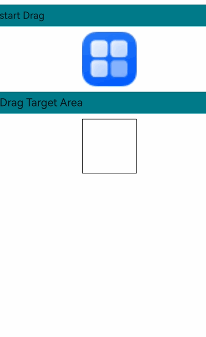
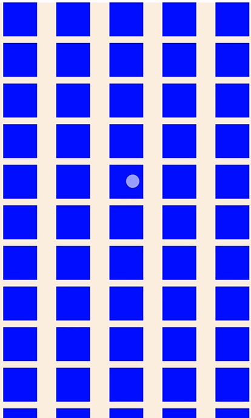
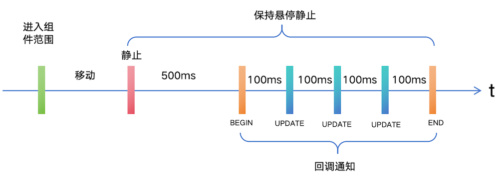
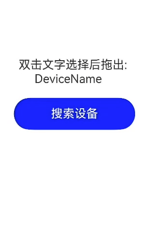

# 拖拽事件

拖拽事件提供了一种通过鼠标或手势触屏传递数据的机制，即从一个组件位置拖出（drag）数据并将其拖入（drop）到另一个组件位置，以触发响应。在这一过程中，拖出方提供数据，而拖入方负责接收和处理数据。这一操作使用户能够便捷地移动、复制或删除指定内容。

## 基本概念

* 拖拽操作：在可响应拖出的组件上长按并滑动以触发拖拽行为，当用户释放手指或鼠标时，拖拽操作即告结束。
* 拖拽背景（背板）：用户拖动数据时的形象化表示。开发者可以通过[onDragStart](../reference/apis-arkui/arkui-ts/ts-universal-events-drag-drop.md#ondragstart)的[CustomerBuilder](../reference/apis-arkui/arkui-ts/ts-types.md#custombuilder8)或[DragItemInfo](../reference/apis-arkui/arkui-ts/ts-universal-events-drag-drop.md#dragiteminfo说明)进行设置，也可以通过[dragPreview](../reference/apis-arkui/arkui-ts/ts-universal-attributes-drag-drop.md#dragpreview11)通用属性进行自定义。
* 拖拽内容：被拖动的数据，使用UDMF统一API [UnifiedData](../reference/apis-arkdata/js-apis-data-unifiedDataChannel.md#unifieddata) 进行封装，确保数据的一致性和安全性。
* 拖出对象：触发拖拽操作并提供数据的组件，通常具有响应拖拽的特性。
* 拖入目标：可接收并处理拖动数据的组件，能够根据拖入的数据执行相应的操作。
* 拖拽点：鼠标或手指与屏幕的接触位置，用于判断是否进入组件范围。判定依据是接触点是否位于组件的范围内。

## 拖拽流程

拖拽流程包含手势拖拽流程和鼠标拖拽流程，有助于开发者理解回调事件触发的时机。

### ​手势拖拽流程

对于手势长按触发拖拽的场景，ArkUI在发起拖拽前会校验当前组件是否具备拖拽功能。对于具备默认可拖出能力的组件（[Search](../reference/apis-arkui/arkui-ts/ts-basic-components-search.md)、[TextInput](../reference/apis-arkui/arkui-ts/ts-basic-components-textinput.md)、[TextArea](../reference/apis-arkui/arkui-ts/ts-basic-components-textarea.md)、[RichEditor](../reference/apis-arkui/arkui-ts/ts-basic-components-richeditor.md)、[Text](../reference/apis-arkui/arkui-ts/ts-basic-components-text.md)、[Image](../reference/apis-arkui/arkui-ts/ts-basic-components-image.md)、[Hyperlink](../reference/apis-arkui/arkui-ts/ts-container-hyperlink.md)）需要判断是否设置了[draggable](../reference/apis-arkui/arkui-ts/ts-universal-attributes-drag-drop.md#draggable)为true（系统通过[系统资源](../quick-start/resource-categories-and-access.md#系统资源)初始化默认可拖出组件的[draggable](../reference/apis-arkui/arkui-ts/ts-universal-attributes-drag-drop.md#draggable)属性默认值）。其他组件则需额外确认是否已设置onDragStart回调函数。在满足上述条件后，长按时间达到或超过500ms即可触发拖拽，而长按800ms时，系统开始执行预览图的浮起动效。若与Menu功能结合使用，并通过isShow控制其显示与隐藏，建议避免在用户操作800ms后才控制菜单显示，此举可能引发非预期的行为。

手势拖拽（手指/手写笔）触发拖拽流程：


### ​鼠标拖拽流程

鼠标拖拽操作遵循即拖即走的模式，当鼠标左键在可拖拽的组件上按下并移动超过1vp时，即可触发拖拽功能。

当前不仅支持应用内部的拖拽，还支持跨应用的拖拽操作。为了帮助开发者更好地感知拖拽状态并调整系统默认的拖拽行为，ArkUI提供了多个回调事件，具体详情如下：

| **回调事件** | **说明**|
| ---------------- | ------------------------|
| [onDragStart](../reference/apis-arkui/arkui-ts/ts-universal-events-drag-drop.md#ondragstart) | 拖出的组件产生拖出动作时，该回调触发。<br>该回调可以感知拖拽行为的发起，开发者可以在onDragStart方法中设置拖拽过程中传递的数据，并自定义拖拽的背板图像。建议开发者采用pixelmap的方式来返回背板图像，避免使用customBuilder，因为后者可能会带来额外的性能开销。|
| [onDragEnter](../reference/apis-arkui/arkui-ts/ts-universal-events-drag-drop.md#ondragenter) | 当拖拽操作的拖拽点进入组件的范围时，如果该组件监听了[onDrop](../reference/apis-arkui/arkui-ts/ts-universal-events-drag-drop.md#ondrop)事件，此回调将会被触发。|
| [onDragMove](../reference/apis-arkui/arkui-ts/ts-universal-events-drag-drop.md#ondragmove) | 当拖拽点在组件范围内移动时，如果该组件监听了onDrop事件，此回调将会被触发。<br>在这一过程中，可以通过调用[DragEvent](../reference/apis-arkui/arkui-ts/ts-universal-events-drag-drop.md#dragevent7)中的setResult方法来影响系统在部分场景下的外观表现：<br>1. 设置DragResult.DROP\_ENABLED。<br>2. 设置DragResult.DROP\_DISABLED。|
| [onDragLeave](../reference/apis-arkui/arkui-ts/ts-universal-events-drag-drop.md#ondragleave) | 当拖拽点移出组件范围时，如果该组件监听了onDrop事件，此回调将会被触发。<br>在以下两种情况下，系统默认不会触发onDragLeave事件：<br>1. 父组件移动到子组件。<br>2. 目标组件与当前组件布局有重叠。<br>API version 12开始可通过[UIContext](../reference/apis-arkui/js-apis-arkui-UIContext.md)中的[setDragEventStrictReportingEnabled](../reference/apis-arkui/js-apis-arkui-UIContext.md#setdrageventstrictreportingenabled12)方法严格触发onDragLeave事件。|
| [onDrop](../reference/apis-arkui/arkui-ts/ts-universal-events-drag-drop.md#ondrop) | 当用户在组件范围内释放拖拽操作时，此回调会被触发。开发者需在此回调中通过DragEvent的setResult方法来设置拖拽结果，否则在拖出方组件的onDragEnd方法中，通过getResult方法获取的将只是默认的处理结果DragResult.DRAG\_FAILED。<br>此回调是开发者干预系统默认拖入处理行为的关键点，系统会优先执行开发者定义的onDrop回调。通过在onDrop回调中调用setResult方法，开发者可以告知系统如何处理被拖拽的数据。<br>1. 设置 DragResult.DRAG\_SUCCESSFUL，数据完全由开发者自己处理，系统不进行处理。<br>2. 设置DragResult.DRAG\_FAILED，数据不再由系统继续处理。<br>3. 设置DragResult.DRAG\_CANCELED，系统也不需要进行数据处理。<br>4. 设置DragResult.DROP\_ENABLED或DragResult.DROP\_DISABLED会被忽略，等同于设置DragResult.DRAG\_SUCCESSFUL。|
| [onDragEnd](../reference/apis-arkui/arkui-ts/ts-universal-events-drag-drop.md#ondragend10) | 当用户释放拖拽时，拖拽活动终止，发起拖出动作的组件将触发该回调函数。|
| [onPreDrag](../reference/apis-arkui/arkui-ts/ts-universal-events-drag-drop.md#onpredrag12) | 当触发拖拽事件的不同阶段时，绑定此事件的组件会触发该回调函数。<br>开发者可利用此方法，在拖拽开始前的不同阶段，根据[PreDragStatus](../reference/apis-arkui/arkui-ts/ts-universal-events-drag-drop.md#predragstatus12枚举说明)枚举准备相应数据。<br>1. ACTION\_DETECTING\_STATUS：拖拽手势启动阶段。按下50ms时触发。<br>2. READY\_TO\_TRIGGER\_DRAG\_ACTION：拖拽准备完成，可发起拖拽阶段。按下500ms时触发。<br>3. PREVIEW\_LIFT\_STARTED：拖拽浮起动效发起阶段。按下800ms时触发。<br>4. PREVIEW\_LIFT\_FINISHED：拖拽浮起动效结束阶段。浮起动效完全结束时触发。<br>5. PREVIEW\_LANDING\_STARTED：拖拽落回动效发起阶段。落回动效发起时触发。<br>6. PREVIEW\_LANDING\_FINISHED：拖拽落回动效结束阶段。落回动效结束时触发。<br>7. ACTION\_CANCELED\_BEFORE\_DRAG：拖拽浮起落位动效中断。已满足READY_TO_TRIGGER_DRAG_ACTION状态后，未达到动效阶段，手指抬起时触发。|

[DragEvent](../reference/apis-arkui/arkui-ts/ts-universal-events-drag-drop.md#dragevent7)支持的get方法可用于获取拖拽行为的详细信息，下表展示了在相应的拖拽回调中，这些get方法是否能够返回有效数据。
| 回调事件 | onDragStart | onDragEnter | onDragMove | onDragLeave | onDrop | onDragEnd |
| - | - | - | - | - | - | - |
| getData         |—|—|—|—| 支持 |—|
| getSummary      |—| 支持 | 支持 | 支持 | 支持 |—|
| getResult       |—|—|—|—|—| 支持 |
| getPreviewRect  |—|—|—|—| 支持 |—|
| getVelocity/X/Y |—| 支持 | 支持 | 支持 | 支持 |—|
| getWindowX/Y    | 支持 | 支持 | 支持 | 支持 | 支持 |—|
| getDisplayX/Y   | 支持 | 支持 | 支持 | 支持 | 支持 |—|
| getX/Y          | 支持 | 支持 | 支持 | 支持 | 支持 |—|
| behavior        |—|—|—|—|—| 支持 |

[DragEvent](../reference/apis-arkui/arkui-ts/ts-universal-events-drag-drop.md#dragevent7)支持相关set方法向系统传递信息，这些信息部分会影响系统对UI或数据的处理方式。下表列出了set方法应该在回调的哪个阶段执行才会被系统接受并处理。
| 回调事件 | onDragStart | onDragEnter | onDragMove | onDragLeave | onDrop |
| - | - | - | - | - | - |
| useCustomDropAnimation |—|—|—|—| 支持 |
| setData                | 支持 |—|—|—|—|
| setResult              | 支持，可通过set failed或cancel来阻止拖拽发起 | 支持，不作为最终结果传递给onDragEnd | 支持，不作为最终结果传递给onDragEnd | 支持，不作为最终结果传递给onDragEnd  | 支持，作为最终结果传递给onDragEnd |
| behavior               |—| 支持 | 支持 | 支持 | 支持 |

## 拖拽背板图

在拖拽移动过程中显示的背板图并非组件本身，而是表示用户拖动的数据，开发者可将其设定为任意可显示的图像。具体而言，onDragStart回调中返回的customBuilder或pixelmap可以用于设置拖拽移动过程中的背板图，而浮起图则默认采用组件本身的截图。dragpreview属性中设定的customBuilder或pixelmap可以用于配置浮起和拖拽过程的背板图。若开发者未配置背板图，系统将自动采用组件本身的截图作为拖拽和浮起时的背板图。

拖拽背板图当前支持设置透明度、圆角、阴影和模糊，具体用法见[拖拽控制](../reference/apis-arkui/arkui-ts/ts-universal-attributes-drag-drop.md)。


**约束限制：**

* 对于容器组件，如果内部内容通过position、offset等接口使得绘制区域超出了容器组件范围，则系统截图无法截取到范围之外的内容。此种情况下，如果一定要浮起，即拖拽背板能够包含范围之外的内容，则可考虑通过扩大容器范围或自定义方式实现。
* 不论是使用自定义builder或是系统默认截图方式，截图都暂时无法应用[scale](../reference/apis-arkui/arkui-ts/ts-universal-attributes-transformation.md#scale)、[rotate](../reference/apis-arkui/arkui-ts/ts-universal-attributes-transformation.md#rotate)等图形变换效果。

## 使用拖拽能力

### 通用拖拽适配

如下以[Image](../reference/apis-arkui/arkui-ts/ts-basic-components-image.md)组件为例，介绍组件拖拽开发的基本步骤，以及开发中需要注意的事项。

1. 组件使能拖拽。

   设置draggable属性为true，并配置onDragStart回调函数。在回调函数中，可通过UDMF（用户数据管理框架）设置拖拽的数据，并返回自定义的拖拽背景图像。

    ```ts
    import { unifiedDataChannel, uniformTypeDescriptor } from '@kit.ArkData';

    Image($r('app.media.app_icon'))
        .width(100)
        .height(100)
        .draggable(true)
        .onDragStart((event) => {
            let data: unifiedDataChannel.Image = new unifiedDataChannel.Image();
            data.imageUri = 'common/pic/img.png';
            let unifiedData = new unifiedDataChannel.UnifiedData(data);
            event.setData(unifiedData);

            let dragItemInfo: DragItemInfo = {
            pixelMap: this.pixmap,
            extraInfo: "this is extraInfo",
            };
            // onDragStart回调函数中返回自定义拖拽背板图
            return dragItemInfo;
        })
    ```

   手势场景触发的拖拽功能依赖于底层绑定的长按手势。如果开发者在可拖拽组件上也绑定了长按手势，这将与底层的长按手势产生冲突，进而导致拖拽操作失败。为解决此类问题，可以采用并行手势的方案，具体如下。

    ```ts
    .parallelGesture(LongPressGesture().onAction(() => {
       this.getUIContext().getPromptAction().showToast({ duration: 100, message: 'Long press gesture trigger' });
    }))
    ```

2. 自定义拖拽背板图。
   
   可以通过在长按50ms时触发的回调中设置[onPreDrag](../reference/apis-arkui/arkui-ts/ts-universal-events-drag-drop.md#onpredrag12)回调函数，来提前准备自定义拖拽背板图的pixmap。
   
    ```ts
    .onPreDrag((status: PreDragStatus) => {
        if (preDragStatus == PreDragStatus.ACTION_DETECTING_STATUS) {
            this.getComponentSnapshot();
        }
    })
    ```
   
   pixmap的生成可以调用[this.getUIContext().getComponentSnapshot().createFromBuilder()](../reference/apis-arkui/js-apis-arkui-componentSnapshot.md#componentsnapshotcreatefrombuilderdeprecated)来实现。

      ```ts
      @Builder
      pixelMapBuilder() {
          Column() {
            Image($r('app.media.startIcon'))
              .width(120)
              .height(120)
              .backgroundColor(Color.Yellow)
          }
        }
        private getComponentSnapshot(): void {
        this.getUIContext().getComponentSnapshot().createFromBuilder(()=>{this.pixelMapBuilder()},
        (error: Error, pixmap: image.PixelMap) => {
            if(error){
              console.log("error: " + JSON.stringify(error))
              return;
            }
            this.pixmap = pixmap;
        })
      }
      ```

3. 若开发者需确保触发[onDragLeave](../reference/apis-arkui/arkui-ts/ts-universal-events-drag-drop.md#ondragleave)事件，应通过调用[setDragEventStrictReportingEnabled](../reference/apis-arkui/js-apis-arkui-UIContext.md#setdrageventstrictreportingenabled12)方法进行设置。

    ```ts
    import { UIAbility } from '@kit.AbilityKit';
    import { window, UIContext } from '@kit.ArkUI';

    export default class EntryAbility extends UIAbility {
      onWindowStageCreate(windowStage: window.WindowStage): void {
        windowStage.loadContent('pages/Index', (err, data) => {
          if (err.code) {
            return;
          }
          windowStage.getMainWindow((err, data) => {
            if (err.code) {
              return;
            }
            let windowClass: window.Window = data;
            let uiContext: UIContext = windowClass.getUIContext();
            uiContext.getDragController().setDragEventStrictReportingEnabled(true);
          });
        });
      }
    }
    ```

4. 拖拽过程显示角标样式。

   通过设置[allowDrop](../reference/apis-arkui/arkui-ts/ts-universal-attributes-drag-drop.md#allowdrop)来定义接收的数据类型，这将影响角标显示。当拖拽的数据符合定义的允许落入的数据类型时，显示“COPY”角标。当拖拽的数据类型不在允许范围内时，显示“FORBIDDEN”角标。若未设置allowDrop，则显示“MOVE”角标。以下代码示例表示仅接收UnifiedData中定义的HYPERLINK和PLAIN\_TEXT类型数据，其他类型数据将被禁止落入。

    ```ts
    .allowDrop([uniformTypeDescriptor.UniformDataType.HYPERLINK, uniformTypeDescriptor.UniformDataType.PLAIN_TEXT])
    ```

   在实现onDrop回调的情况下，还可以通过在onDragMove中设置[DragResult](../reference/apis-arkui/arkui-ts/ts-universal-events-drag-drop.md#dragresult10枚举说明)为DROP_ENABLED，并将[DragBehavior](../reference/apis-arkui/arkui-ts/ts-universal-events-drag-drop.md#dragbehavior10)设置为COPY或MOVE，以此来控制角标显示。如下代码将移动时的角标强制设置为“MOVE”。

    ```ts
    .onDragMove((event) => {
        event.setResult(DragResult.DROP_ENABLED);
        event.dragBehavior = DragBehavior.MOVE;
    })
    ```

5. 拖拽数据的接收。

   需要设置onDrop回调函数，并在回调函数中处理拖拽数据，显示设置拖拽结果。

    ```ts
    .onDrop((dragEvent?: DragEvent) => {
        // 获取拖拽数据
        this.getDataFromUdmf((dragEvent as DragEvent), (event: DragEvent) => {
        let records: Array<unifiedDataChannel.UnifiedRecord> = event.getData().getRecords();
        let rect: Rectangle = event.getPreviewRect();
        this.imageWidth = Number(rect.width);
        this.imageHeight = Number(rect.height);
        this.targetImage = (records[0] as unifiedDataChannel.Image).imageUri;
        this.imgState = Visibility.None；
        // 显式设置result为successful，则将该值传递给拖出方的onDragEnd
        event.setResult(DragResult.DRAG_SUCCESSFUL);
    })
    ```

   数据的传递是通过UDMF实现的，在数据较大时可能存在时延，因此在首次获取数据失败时建议加1500ms的延迟重试机制。

    ```ts
    getDataFromUdmfRetry(event: DragEvent, callback: (data: DragEvent) => void) {
       try {
         let data: UnifiedData = event.getData();
         if (!data) {
           return false;
         }
         let records: Array<unifiedDataChannel.UnifiedRecord> = data.getRecords();
         if (!records || records.length <= 0) {
           return false;
         }
         callback(event);
         return true;
       } catch (e) {
         console.log("getData failed, code: " + (e as BusinessError).code + ", message: " + (e as BusinessError).message);
         return false;
       }
    }

    getDataFromUdmf(event: DragEvent, callback: (data: DragEvent) => void) {
      if (this.getDataFromUdmfRetry(event, callback)) {
        return;
      }
      setTimeout(() => {
        this.getDataFromUdmfRetry(event, callback);
      }, 1500);
    }
    ```

6. 拖拽发起方可以通过设置onDragEnd回调感知拖拽结果。

    ```ts
    import { promptAction } from '@kit.ArkUI';

    .onDragEnd((event) => {
        // onDragEnd里取到的result值在接收方onDrop设置
      if (event.getResult() === DragResult.DRAG_SUCCESSFUL) {
        this.getUIContext().getPromptAction().showToast({ duration: 100, message: 'Drag Success' });
      } else if (event.getResult() === DragResult.DRAG_FAILED) {
        this.getUIContext().getPromptAction().showToast({ duration: 100, message: 'Drag failed' });
      }
    })
    ```

**完整示例：**

```ts
import { unifiedDataChannel, uniformTypeDescriptor } from '@kit.ArkData';
import { promptAction } from '@kit.ArkUI';
import { BusinessError } from '@kit.BasicServicesKit';
import { image } from '@kit.ImageKit';

@Entry
@Component
struct Index {
  @State targetImage: string = '';
  @State imageWidth: number = 100;
  @State imageHeight: number = 100;
  @State imgState: Visibility = Visibility.Visible;
  @State pixmap: image.PixelMap|undefined = undefined

  @Builder
  pixelMapBuilder() {
    Column() {
      Image($r('app.media.startIcon'))
        .width(120)
        .height(120)
        .backgroundColor(Color.Yellow)
    }
  }

  getDataFromUdmfRetry(event: DragEvent, callback: (data: DragEvent) => void) {
    try {
      let data: UnifiedData = event.getData();
      if (!data) {
        return false;
      }
      let records: Array<unifiedDataChannel.UnifiedRecord> = data.getRecords();
      if (!records || records.length <= 0) {
        return false;
      }
      callback(event);
      return true;
    } catch (e) {
      console.log("getData failed, code: " + (e as BusinessError).code + ", message: " + (e as BusinessError).message);
      return false;
    }
  }
  // 获取UDMF数据，首次获取失败后添加1500ms延迟重试机制
  getDataFromUdmf(event: DragEvent, callback: (data: DragEvent) => void) {
    if (this.getDataFromUdmfRetry(event, callback)) {
      return;
    }
    setTimeout(() => {
      this.getDataFromUdmfRetry(event, callback);
    }, 1500);
  }
  // 调用componentSnapshot中的createFromBuilder接口截取自定义builder的截图
  private getComponentSnapshot(): void {
    this.getUIContext().getComponentSnapshot().createFromBuilder(()=>{this.pixelMapBuilder()},
      (error: Error, pixmap: image.PixelMap) => {
        if(error){
          console.log("error: " + JSON.stringify(error))
          return;
        }
        this.pixmap = pixmap;
      })
  }
  // 长按50ms时提前准备自定义截图的pixmap
  private PreDragChange(preDragStatus: PreDragStatus): void {
    if (preDragStatus == PreDragStatus.ACTION_DETECTING_STATUS) {
      this.getComponentSnapshot();
    }
  }

  build() {
    Row() {
      Column() {
        Text('start Drag')
          .fontSize(18)
          .width('100%')
          .height(40)
          .margin(10)
          .backgroundColor('#008888')
        Row() {
          Image($r('app.media.app_icon'))
            .width(100)
            .height(100)
            .draggable(true)
            .margin({ left: 15 })
            .visibility(this.imgState)
            // 绑定平行手势，可同时触发应用自定义长按手势
            .parallelGesture(LongPressGesture().onAction(() => {
              this.getUIContext().getPromptAction().showToast({ duration: 100, message: 'Long press gesture trigger' });
            }))
            .onDragStart((event) => {
              let data: unifiedDataChannel.Image = new unifiedDataChannel.Image();
              data.imageUri = 'common/pic/img.png';
              let unifiedData = new unifiedDataChannel.UnifiedData(data);
              event.setData(unifiedData);

              let dragItemInfo: DragItemInfo = {
                pixelMap: this.pixmap,
                extraInfo: "this is extraInfo",
              };
              return dragItemInfo;
            })
              // 提前准备拖拽自定义背板图
            .onPreDrag((status: PreDragStatus) => {
              this.PreDragChange(status);
            })
            .onDragEnd((event) => {
              // onDragEnd里取到的result值在接收方onDrop设置
              if (event.getResult() === DragResult.DRAG_SUCCESSFUL) {
                this.getUIContext().getPromptAction().showToast({ duration: 100, message: 'Drag Success' });
              } else if (event.getResult() === DragResult.DRAG_FAILED) {
                this.getUIContext().getPromptAction().showToast({ duration: 100, message: 'Drag failed' });
              }
            })
        }

        Text('Drag Target Area')
          .fontSize(20)
          .width('100%')
          .height(40)
          .margin(10)
          .backgroundColor('#008888')
        Row() {
          Image(this.targetImage)
            .width(this.imageWidth)
            .height(this.imageHeight)
            .draggable(true)
            .margin({ left: 15 })
            .border({ color: Color.Black, width: 1 })
            // 控制角标显示类型为MOVE，即不显示角标
            .onDragMove((event) => {
              event.setResult(DragResult.DROP_ENABLED)
              event.dragBehavior = DragBehavior.MOVE
            })
            .allowDrop([uniformTypeDescriptor.UniformDataType.IMAGE])
            .onDrop((dragEvent?: DragEvent) => {
              // 获取拖拽数据
              this.getDataFromUdmf((dragEvent as DragEvent), (event: DragEvent) => {
                let records: Array<unifiedDataChannel.UnifiedRecord> = event.getData().getRecords();
                let rect: Rectangle = event.getPreviewRect();
                this.imageWidth = Number(rect.width);
                this.imageHeight = Number(rect.height);
                this.targetImage = (records[0] as unifiedDataChannel.Image).imageUri;
                this.imgState = Visibility.None;
                // 显式设置result为successful，则将该值传递给拖出方的onDragEnd
                event.setResult(DragResult.DRAG_SUCCESSFUL);
              })
            })
        }
      }
      .width('100%')
      .height('100%')
    }
    .height('100%')
  }
}

```


### 多选拖拽适配

从API version 12开始，[Grid](../reference/apis-arkui/arkui-ts/ts-container-grid.md)组件和[List](../reference/apis-arkui/arkui-ts/ts-container-list.md)组件中的GridItem和ListItem组件支持多选与拖拽功能。目前，仅支持onDragStart的触发方式。

以下以Grid为例，详细介绍实现多选拖拽的基本步骤，以及在开发过程中需要注意的事项。

1. 组件多选拖拽使能。

   创建GridItem子组件并绑定onDragStart回调函数。同时设置GridItem组件的状态为可选中。

    ```ts
    Grid() {
      ForEach(this.numbers, (idx: number) => {
        GridItem() {
          Column()
            .backgroundColor(Color.Blue)
            .width(50)
            .height(50)
            .opacity(1.0)
            .id('grid'+idx)
        }
        .onDragStart(()=>{})
        .selectable(true)
      }, (idx: string) => idx)
    }
    ```

   多选拖拽功能默认处于关闭状态。若要启用此功能，需在[dragPreviewOptions](../reference/apis-arkui/arkui-ts/ts-universal-attributes-drag-drop.md#dragpreviewoptions11)接口的DragInteractionOptions参数中，将isMultiSelectionEnabled设置为true，以表明当前组件支持多选。此外，DragInteractionOptions还包含defaultAnimationBeforeLifting参数，用于控制组件浮起前的默认效果。将该参数设置为true，组件在浮起前将展示一个默认的缩小动画效果。

    ```ts
    .dragPreviewOptions({isMultiSelectionEnabled:true,defaultAnimationBeforeLifting:true})
    ```

   为了确保选中状态，应将GridItem子组件的selected属性设置为true。例如，可以通过调用[onClick](../reference/apis-arkui/arkui-ts/ts-universal-events-click.md#onclick)来设置特定组件为选中状态。

    ```ts
    .selected(this.isSelectedGrid[idx])
    .onClick(()=>{
        this.isSelectedGrid[idx] = !this.isSelectedGrid[idx]
    })
    ```

2. 优化多选拖拽性能。

   在多选拖拽操作中，当多选触发聚拢动画效果时，系统会截取当前屏幕内显示的选中组件图像。如果选中组件数量过多，可能会造成较高的性能消耗。为了优化性能，多选拖拽功能支持从dragPreview中获取截图，用以实现聚拢动画效果，从而有效节省系统资源。

    ```ts
    .dragPreview({
        pixelMap:this.pixmap
    })
    ```

   截图的获取可以在选中组件时通过调用[this.getUIContext().getComponentSnapshot().get()](../reference/apis-arkui/js-apis-arkui-componentSnapshot.md#componentsnapshotgetdeprecated)方法获取。以下示例通过获取组件对应id的方法进行截图。

    ```ts
    @State previewData: DragItemInfo[] = []
    @State isSelectedGrid: boolean[] = []
    .onClick(()=>{
        this.isSelectedGrid[idx] = !this.isSelectedGrid[idx]
        if (this.isSelectedGrid[idx]) {
            let gridItemName = 'grid' + idx
            this.getUIContext().getComponentSnapshot().get(gridItemName, (error: Error, pixmap: image.PixelMap)=>{
                this.pixmap = pixmap
                this.previewData[idx] = {
                    pixelMap:this.pixmap
                }
            })
        }
    })
    ```

3. 多选显示效果。

    通过[stateStyles](../reference/apis-arkui/arkui-ts/ts-universal-attributes-polymorphic-style.md#statestyles)可以设置选中态和非选中态的显示效果，方便区分。

    ```ts
    @Styles
    normalStyles(): void{
      .opacity(1.0)
    }

    @Styles
    selectStyles(): void{
      .opacity(0.4)
    }

    .stateStyles({
      normal : this.normalStyles,
      selected: this.selectStyles
    })
    ```

4. 适配数量角标。

    多选拖拽的数量角标当前需要应用使用dragPreviewOptions中的numberBadge参数设置，开发者需要根据当前选中的节点数量来设置数量角标。

    ```ts
    @State numberBadge: number = 0;

    .onClick(()=>{
        this.isSelectedGrid[idx] = !this.isSelectedGrid[idx]
        if (this.isSelectedGrid[idx]) {
          this.numberBadge++;
        } else {
          this.numberBadge--;
      }
    })
    // 多选场景右上角数量角标需要应用设置numberBadge参数
    .dragPreviewOptions({numberBadge: this.numberBadge})
    ```

**完整示例：**

```ts
import { image } from '@kit.ImageKit';

@Entry
@Component
struct GridEts {
  @State pixmap: image.PixelMap|undefined = undefined
  @State numbers: number[] = []
  @State isSelectedGrid: boolean[] = []
  @State previewData: DragItemInfo[] = []
  @State numberBadge: number = 0;

  @Styles
  normalStyles(): void{
    .opacity(1.0)
  }

  @Styles
  selectStyles(): void{
    .opacity(0.4)
  }

  onPageShow(): void {
    let i: number = 0
    for(i=0;i<100;i++){
      this.numbers.push(i)
      this.isSelectedGrid.push(false)
      this.previewData.push({})
    }
  }

  @Builder
  RandomBuilder(idx: number) {
    Column()
      .backgroundColor(Color.Blue)
      .width(50)
      .height(50)
      .opacity(1.0)
  }

  build() {
    Column({ space: 5 }) {
      Grid() {
        ForEach(this.numbers, (idx: number) => {
          GridItem() {
            Column()
              .backgroundColor(Color.Blue)
              .width(50)
              .height(50)
              .opacity(1.0)
              .id('grid'+idx)
          }
          .dragPreview(this.previewData[idx])
          .selectable(true)
          .selected(this.isSelectedGrid[idx])
          // 设置多选显示效果
          .stateStyles({
            normal : this.normalStyles,
            selected: this.selectStyles
          })
          .onClick(()=>{
            this.isSelectedGrid[idx] = !this.isSelectedGrid[idx]
            if (this.isSelectedGrid[idx]) {
              this.numberBadge++;
              let gridItemName = 'grid' + idx
              // 选中状态下提前调用componentSnapshot中的get接口获取pixmap
              this.getUIContext().getComponentSnapshot().get(gridItemName, (error: Error, pixmap: image.PixelMap)=>{
                this.pixmap = pixmap
                this.previewData[idx] = {
                  pixelMap:this.pixmap
                }
              })
            } else {
              this.numberBadge--;
            }
          })
          // 使能多选拖拽，右上角数量角标需要应用设置numberBadge参数
          .dragPreviewOptions({numberBadge: this.numberBadge},{isMultiSelectionEnabled:true,defaultAnimationBeforeLifting:true})
          .onDragStart(()=>{
          })
        }, (idx: string) => idx)
      }
      .columnsTemplate('1fr 1fr 1fr 1fr 1fr')
      .columnsGap(5)
      .rowsGap(10)
      .backgroundColor(0xFAEEE0)
    }.width('100%').margin({ top: 5 })
  }
}
```


### 适配自定义落位动效

当开发者需要实现自定义落位动效时，可以禁用系统的默认动效。从API version 18开始，ArkUI提供了[executeDropAnimation](../reference/apis-arkui/arkui-ts/ts-universal-events-drag-drop.md#executedropanimation18)接口，用于自定义落位动效。以下以Image组件为例，详细介绍使用[executeDropAnimation](../reference/apis-arkui/arkui-ts/ts-universal-events-drag-drop.md#executedropanimation18)接口的基本步骤，以及开发过程中需要注意的事项。

1. 组件拖拽设置。
   设置draggable为true，并配置onDragStart，onDragEnd等回调函数。
    ```ts
    Image($r('app.media.app_icon'))
      .width(100)
      .height(100)
      .draggable(true)
      .margin({ left: 15 ,top: 40})
      .visibility(this.imgState)
      .onDragStart((event) => {})
      .onDragEnd((event) => {})
    ```
2. 设置自定义动效。

   自定义落位动效通过[animateTo](../reference/apis-arkui/js-apis-arkui-UIContext.md#animateto)接口设置动画相关的参数来实现。例如，可以改变组件的大小。

    ```ts
      customDropAnimation = () => {
        this.getUIContext().animateTo({ duration: 1000, curve: Curve.EaseOut, playMode: PlayMode.Normal }, () => {
          this.imageWidth = 200;
          this.imageHeight = 200;
          this.imgState = Visibility.None;
        })
      }
    ```

3. 拖拽落位适配动效。

   设置onDrop回调函数，接收拖拽数据。拖拽落位动效通过[executeDropAnimation](../reference/apis-arkui/arkui-ts/ts-universal-events-drag-drop.md#executedropanimation18)函数执行，设置[useCustomDropAnimation](../reference/apis-arkui/arkui-ts/ts-universal-events-drag-drop.md#dragevent7)为true禁用系统默认动效。

    ```ts
      Column() {
        Image(this.targetImage)
          .width(this.imageWidth)
          .height(this.imageHeight)
      }
      .draggable(true)
      .margin({ left: 15 })
      .border({ color: Color.Black, width: 1 })
      .allowDrop([udmfType.UniformDataType.IMAGE])
      .onDrop((dragEvent: DragEvent) => {
        let records: Array<unifiedDataChannel.UnifiedRecord> = dragEvent.getData().getRecords();
        let rect: Rectangle = dragEvent.getPreviewRect();
        this.imageWidth = Number(rect.width);
        this.imageHeight = Number(rect.height);
        this.targetImage = (records[0] as udmf.Image).imageUri;
        dragEvent.useCustomDropAnimation = true;
        dragEvent.executeDropAnimation(this.customDropAnimation)
      })
    ```

**完整示例：**

```ts
import { unifiedDataChannel, uniformTypeDescriptor } from '@kit.ArkData';
import { promptAction } from '@kit.ArkUI';


@Entry
@Component
struct DropAnimationExample {
  @State targetImage: string = '';
  @State imageWidth: number = 100;
  @State imageHeight: number = 100;
  @State imgState: Visibility = Visibility.Visible;

  customDropAnimation =
    () => {
      this.getUIContext().animateTo({ duration: 1000, curve: Curve.EaseOut, playMode: PlayMode.Normal }, () => {
        this.imageWidth = 200;
        this.imageHeight = 200;
        this.imgState = Visibility.None;
      })
    }

  build() {
    Row() {
      Column() {
        Image($r('app.media.app_icon'))
          .width(100)
          .height(100)
          .draggable(true)
          .margin({ left: 15 ,top: 40})
          .visibility(this.imgState)
          .onDragStart((event) => {
          })
          .onDragEnd((event) => {
            if (event.getResult() === DragResult.DRAG_SUCCESSFUL) {
              console.log('Drag Success');
            } else if (event.getResult() === DragResult.DRAG_FAILED) {
              console.log('Drag failed');
            }
          })
      }.width('45%')
      .height('100%')
      Column() {
        Text('Drag Target Area')
          .fontSize(20)
          .width(180)
          .height(40)
          .textAlign(TextAlign.Center)
          .margin(10)
          .backgroundColor('rgb(240,250,255)')
        Column() {
          Image(this.targetImage)
            .width(this.imageWidth)
            .height(this.imageHeight)
        }
        .draggable(true)
        .margin({ left: 15 })
        .border({ color: Color.Black, width: 1 })
        .allowDrop([uniformTypeDescriptor.UniformDataType.IMAGE])
        .onDrop((dragEvent: DragEvent) => {
          let records: Array<unifiedDataChannel.UnifiedRecord> = dragEvent.getData().getRecords();
          let rect: Rectangle = dragEvent.getPreviewRect();
          this.imageWidth = Number(rect.width);
          this.imageHeight = Number(rect.height);
          this.targetImage = (records[0] as unifiedDataChannel.Image).imageUri;
          dragEvent.useCustomDropAnimation = true;
          dragEvent.executeDropAnimation(this.customDropAnimation)
        })
        .width(this.imageWidth)
        .height(this.imageHeight)
      }.width('45%')
      .height('100%')
      .margin({ left: '5%' })
    }
    .height('100%')
  }
}
```


### 处理大批量数据

当多选拖拽的数量较多或者拖拽数据量较大时，在拖拽过程中统一处理数据可能会影响拖拽功能的体验。以下以Grid组件为例，详细介绍在大批量数据拖拽过程中数据的推荐处理方式，以及在开发中需要注意的事项。

1. 组件多选拖拽设置。

   创建GridItem子组件，并设置其状态为可选中。再设置多选拖拽功能isMultiSelectionEnabled为true，最后设置选中状态用作区分是否选中。

    ```ts
    Grid() {
      ForEach(this.numbers, (idx: number) => {
        GridItem() {
          Column()
            .backgroundColor(Color.Blue)
            .width(50)
            .height(50)
            .opacity(1.0)
            .id('grid'+idx)
        }
        .dragPreview(this.previewData[idx])
        .dragPreviewOptions({numberBadge: this.numberBadge},{isMultiSelectionEnabled:true,defaultAnimationBeforeLifting:true})
        .selectable(true)
        .selected(this.isSelectedGrid[idx])
        .stateStyles({
          normal : this.normalStyles,
          selected: this.selectStyles
        })
        .onClick(() => {
          this.isSelectedGrid[idx] = !this.isSelectedGrid[idx];
        })
      }, (idx: string) => idx)
    }
    ```

   多选拖拽的数据数量过多可能影响拖拽的体验，推荐多选拖拽最大多选数量为500。

    ```ts
    onPageShow(): void {
      let i: number = 0
      for(i=0;i<500;i++){
        this.numbers.push(i)
        this.isSelectedGrid.push(false)
        this.previewData.push({})
      }
    }
    ```
2. 多选拖拽选中时添加数据。

   当数据量较大时，建议在选择数据时通过[addRecord](../reference/apis-arkdata/js-apis-data-unifiedDataChannel.md#addrecord)添加数据记录，以避免在拖拽过程中集中添加数据而导致显著的性能消耗。

    ```ts
    .onClick(()=>{
      this.isSelectedGrid[idx] = !this.isSelectedGrid[idx];
      if (this.isSelectedGrid[idx]) {
        let data: UDC.Image = new UDC.Image();
        data.uri = '/resource/image.jpeg';
        if (!this.unifiedData) {
          this.unifiedData = new UDC.UnifiedData(data);
        }
        this.unifiedData.addRecord(data);
        this.numberBadge++;
        let gridItemName = 'grid' + idx;
        // 选中状态下提前调用componentSnapshot中的get接口获取pixmap
        this.getUIContext().getComponentSnapshot().get(gridItemName, (error: Error, pixmap: image.PixelMap)=>{
          this.pixmap = pixmap;
          this.previewData[idx] = {
            pixelMap:this.pixmap
          }
        })
      } else {
        this.numberBadge--;
        for (let i=0; i<this.isSelectedGrid.length; i++) {
          if (this.isSelectedGrid[i] === true) {
            this.isSelectedGrid[i] = true;
            let data: UDC.Image = new UDC.Image();
            data.uri = '/resource/image.jpeg';
            if (!this.unifiedData) {
              this.unifiedData = new UDC.UnifiedData(data);
            }
            this.unifiedData.addRecord(data);
          }
        }
      }
    })
    ```

3. 拖拽数据提前准备。

   在onPreDrag中可以提前接收到准备发起拖拽的信号。若数据量较大，此时可以事先准备数据。

    ```ts
    .onPreDrag((status: PreDragStatus) => {
      if (status == PreDragStatus.PREPARING_FOR_DRAG_DETECTION) {
        this.loadData()
      }
    })
    ```

4. 数据准备未完成时设置主动阻塞拖拽。

   在发起拖拽时，应判断数据是否已准备完成。若数据未准备完成，则需向系统发出[WAITTING](../reference/apis-arkui/js-apis-arkui-dragController.md#dragstartrequeststatus18)信号。此时，若手指做出移动手势，背板图将停留在原地，直至应用发出READY信号或超出主动阻塞的最大限制时间（5s）。若数据已准备完成，则可直接将数据设置到[dragEvent](../reference/apis-arkui/arkui-ts/ts-universal-events-drag-drop.md#dragevent7)中。此外，在使用主动阻塞功能时，需保存当前的dragEvent，并在数据准备完成时进行数据设置；在非主动阻塞场景下，不建议保存当前的dragEvent。

    ```ts
    .onDragStart((event: DragEvent) => {
      this.dragEvent = event;
      if (this.finished == false) {
        this.getUIContext().getDragController().notifyDragStartRequest(dragController.DragStartRequestStatus.WAITING);
      } else {
        event.setData(this.unifiedData);
      }
    })
    ```

**完整示例：**

```ts
import { image } from '@kit.ImageKit';
import { unifiedDataChannel as UDC } from '@kit.ArkData';
import { dragController } from '@kit.ArkUI';

@Entry
@Component
struct GridEts {
  @State pixmap: image.PixelMap|undefined = undefined
  @State numbers: number[] = []
  @State isSelectedGrid: boolean[] = []
  @State previewData: DragItemInfo[] = []
  @State numberBadge: number = 0;
  unifiedData: UnifiedData|undefined = undefined;
  timeout: number = 1
  finished: boolean = false;
  dragEvent: DragEvent|undefined;

  @Styles
  normalStyles(): void{
    .opacity(1.0)
  }

  @Styles
  selectStyles(): void{
    .opacity(0.4)
  }

  onPageShow(): void {
    let i: number = 0
    for(i=0;i<500;i++){
      this.numbers.push(i)
      this.isSelectedGrid.push(false)
      this.previewData.push({})
    }
  }

  loadData() {
    this.timeout = setTimeout(() => {
      //数据准备完成后的状态
      if (this.dragEvent) {
        this.dragEvent.setData(this.unifiedData);
      }
      this.getUIContext().getDragController().notifyDragStartRequest(dragController.DragStartRequestStatus.READY);
      this.finished = true;
    }, 4000);
  }

  @Builder
  RandomBuilder(idx: number) {
    Column()
      .backgroundColor(Color.Blue)
      .width(50)
      .height(50)
      .opacity(1.0)
  }

  build() {
    Column({ space: 5 }) {
      Button('全选')
        .onClick(() => {
          for (let i=0;i<this.isSelectedGrid.length;i++) {
            if (this.isSelectedGrid[i] === false) {
              this.numberBadge++;
              this.isSelectedGrid[i] = true;
              let data: UDC.Image = new UDC.Image();
              data.uri = '/resource/image.jpeg';
              if (!this.unifiedData) {
                this.unifiedData = new UDC.UnifiedData(data);
              }
              this.unifiedData.addRecord(data);
              let gridItemName = 'grid' + i;
              // 选中状态下提前调用componentSnapshot中的get接口获取pixmap
              this.getUIContext().getComponentSnapshot().get(gridItemName, (error: Error, pixmap: image.PixelMap)=>{
                this.pixmap = pixmap
                this.previewData[i] = {
                  pixelMap:this.pixmap
                }
              })
            }
          }
        })
      Grid() {
        ForEach(this.numbers, (idx: number) => {
          GridItem() {
            Column()
              .backgroundColor(Color.Blue)
              .width(50)
              .height(50)
              .opacity(1.0)
              .id('grid'+idx)
          }
          .dragPreview(this.previewData[idx])
          .selectable(true)
          .selected(this.isSelectedGrid[idx])
          // 设置多选显示效果
          .stateStyles({
            normal : this.normalStyles,
            selected: this.selectStyles
          })
          .onClick(()=>{
            this.isSelectedGrid[idx] = !this.isSelectedGrid[idx];
            if (this.isSelectedGrid[idx]) {
              let data: UDC.Image = new UDC.Image();
              data.uri = '/resource/image.jpeg';
              if (!this.unifiedData) {
                this.unifiedData = new UDC.UnifiedData(data);
              }
              this.unifiedData.addRecord(data);
              this.numberBadge++;
              let gridItemName = 'grid' + idx;
              // 选中状态下提前调用componentSnapshot中的get接口获取pixmap
              this.getUIContext().getComponentSnapshot().get(gridItemName, (error: Error, pixmap: image.PixelMap)=>{
                this.pixmap = pixmap;
                this.previewData[idx] = {
                  pixelMap:this.pixmap
                }
              })
            } else {
              this.numberBadge--;
              for (let i=0; i<this.isSelectedGrid.length; i++) {
                if (this.isSelectedGrid[i] === true) {
                  this.isSelectedGrid[i] = true;
                  let data: UDC.Image = new UDC.Image();
                  data.uri = '/resource/image.jpeg';
                  if (!this.unifiedData) {
                    this.unifiedData = new UDC.UnifiedData(data);
                  }
                  this.unifiedData.addRecord(data);
                }
              }
            }
          })
          .onPreDrag((status: PreDragStatus) => {
            // 1.长按时通知，350ms回调
            if (status == PreDragStatus.PREPARING_FOR_DRAG_DETECTION) {
              // 2.用户按住一段时间，还没有松手，有可能会拖拽，此时可准备数据
              this.loadData()
            } else if (status == PreDragStatus.ACTION_CANCELED_BEFORE_DRAG) {
              // 3.用户停止拖拽交互，取消数据准备(模拟方法：定时器取消)
              clearTimeout(this.timeout);
            }
          })
          // >=500ms,移动超过10vp触发
          .onDragStart((event: DragEvent) => {
            this.dragEvent = event;
            if (this.finished == false) {
              this.getUIContext().getDragController().notifyDragStartRequest(dragController.DragStartRequestStatus.WAITING);
            } else {
              event.setData(this.unifiedData);
            }
          })
          .onDragEnd(() => {
            this.finished = false;
          })
          .dragPreviewOptions({numberBadge: this.numberBadge},{isMultiSelectionEnabled:true,defaultAnimationBeforeLifting:true})
        }, (idx: string) => idx)
      }
      .columnsTemplate('1fr 1fr 1fr 1fr 1fr')
      .columnsGap(5)
      .rowsGap(10)
      .backgroundColor(0xFAEEE0)
    }.width('100%').margin({ top: 5 })
  }
}
```


## 支持悬停检测
Spring Loading，即拖拽悬停检测（又叫弹簧加载）是拖拽操作的一项增强功能，允许用户在拖动过程中通过悬停在目标上自动触发视图跳转，提供了使用的便利性。建议在所有支持页面切换的区域均实现该功能。

以下为常见的适合支持该功能的场景：

- 在文件管理器中，拖动文件并悬停在文件夹上时，文件夹可以自动打开。
- 在桌面启动器中，拖动文件并悬停在应用程序图标上时，应用程序可以自动打开。

除了实现视图切换跳转功能，该能力也可用于特定视图的激活。例如，在用户将一段文本拖拽至按钮上停留后，可激活一个文本输入框。用户随后可将所拖拽文本移动至该输入框上方释放，触发搜索结果展示，实现单手高效完成整个操作。


### 触发原理

要实现这些能力，需要在组件上注册onDragSpringLoading接口，并传入一个用于处理拖拽悬停触发通知的回调。使用该接口后，该组件将如同注册了onDrop接口的组件一样，成为一个可拖入目标，并且遵循与onDrop相同的命中检测规则，即：在悬停位置下方，仅有一个组件可以接收拖拽事件响应，并且总是首个被检测到的组件

Spring Loading的整个过程包含三个阶段：悬停检测 -> 回调通知 -> 结束。在结束之前，如果用户重新开始移动，会自动中断Spring Loading，并通知应用取消。如果在悬停检测期间移动，且尚未进入Spring Loading状态，则不会触发取消通知。



应用通过回调接收当前的状态，动态改变UI显示，从而达到用户提醒的效果。

| 状态   | 含义                                                                                              | 建议处理方式                                                                               |
| :----- | :------------------------------------------------------------------------------------------------ | :----------------------------------------------------------------------------------------- |
| BEGIN  | 用户已经在本组件上方悬停不动维持了一段时间，开始进入 Spring Loading 状态                          | 修改背景色或改变组件尺寸，强化提醒用户继续保持悬停不动。                                   |
| UPDATE | 用户继续维持不动，系统周期性下发刷新通知，默认3次                                                 | 通过通知中携带的sequence是否为奇偶数，来决定是否重置UI显示，以此达到周期性变化的提醒效果。 |
| END    | 用户已保持悬停不动足够多的时间，整个Spring Loading检测与触发完整结束                              | 进行页面跳转或视图切换。                                                                   |
| CANCEL | 悬停进入BEGIN状态后，用户重新移动或其他情况打断了悬停检测，无法再进行整个Spring Loading状态的触发 | 重置和恢复UI显示，取消视图切换相关的状态和逻辑。                                           |

>**说明**
>
>1. 在同一个组件内持续保持不动，整个Spring Loading仅会触发一轮，不会重复触发，直到拖离当前组件后再重新进入。
>2. 同一个组件上即可以实现Spring Loading，也可以实现onDrop/onDragEnter等拖拽事件。


### 触发自定义

可以自定义修改Spring Loading检测参数，动态决定是否继续触发。

1.触发参数自定义

  onDragSpringLoading接口还提供了一个可选参数configuration供应用自定义静止检测时长以及触发间隔与次数等配置，可以通过此参数来个性化定义Spring   Loading触发条件。但绝大数多情况下，不需要进行修改，使用系统默认配置即可。
  
  configuration参数必须在检测开始前准备就绪。系统一旦启动Spring Loading检测过程，将不再从该参数读取配置。然而，可以通过回调中传入的context对象中的updateCon  figuration方法动态更新配置。此动态更新仅对当前触发有效，不会影响通过configuration的配置。
  
  推荐使用默认配置，或通过onDragSpringLoading接口的configuration配置固定参数。在绝大多数情况下，无需在Spring   Loading过程中动态修改这些检测参数。但若需针对不同的拖拽数据类型提供不同的用户提示效果，则可考虑使用此功能。

  >**说明**
  >
  >不要设置过长的时间间隔和过多的触发次数，这对于用户提醒通常没有意义。

2.动态终止

  当系统检测到用户悬停足够时长，回调onDragSpringLoading接口设置到回调函数时，有机会决定即将出现的Spring Loading通知是否继续，这发生在需要观察用户拖拽的数据类型并与自身业务逻辑结合的情况下。

  以下是一段伪代码示例：
  ```typescript
    .onDragSpringLoading((context: DragSpringLoadingContext)=>{
      // 检查当前的状态
      if (context.state == DragSpringLoadingState.BEGIN) {
        // 检查用户所拖拽的数据类型是否自己能够处理的
        boolean isICanHandle = false;
        let dataSummary = context?.dragInfos?.dataSummary;
        if (dataSummary != undefined) {
          for (const [type, size] of dataSummary) {
            if (type === "general.plain-text") { // 只能处理纯文本类型
              isICanHandle = true;
              break;
            }
          }
        }
        // 如果数据无法处理，直接终止Spring Loading
        if (!isICanHandle) {
          context.abort();
          return;
        }
      }
    })
  ```

3.禁用Spring Loading

  如果不再需要该组件上响应任何Spring Loading事件，则可以通过传递null给onDragSpringLoading来明确关闭响应。

  ```typescript
    .onDragSpringLoading(null)
  ```

### 实现示例

下面通过实现搜索设备的简单示例来展示如何通过`onDragSpringLoading`实现提醒和视图切换。

1.准备一些组件

  为了简化示例，准备一个可拖出文字的组件以供用户拖出待搜索的文字，并添加一个按钮控件，用于响应Spring Loading来进一步激活视图。被激活的视图通过`bindSheet`实现，内部配置有一个输入框控件用于接收拖拽文本，以及一个文本组件用于展示搜索结果。

  ```typescript
    build() {
      Column() {
        Column() {
          Text('双击文字选择后拖出: \n     DeviceName')
            .fontSize(30)
            .copyOption(CopyOptions.InApp) // 开启copyOption之后，文本组件即可支持选择内容进行拖拽
        }.padding({bottom:30})
  
        Button('搜索设备').width('80%').height('80vp').fontSize(30)
          .bindSheet($$this.isShowSheet, this.SheetBuilder(), {
            detents: [SheetSize.MEDIUM, SheetSize.LARGE, 600],
            preferType: SheetType.BOTTOM,
            title: { title: '搜索设备' },
          })
      }.width('100%').height('100%')
      .justifyContent(FlexAlign.Center)
    }
  ```
2.实现SheetBuilder

  实现半模态弹框的UI界面。

  ```typescript
    @Builder
    SheetBuilder() {
      Column() {
        // 输入框
        TextInput({placeholder: '拖入此处'})
          .width('80%').borderWidth(1).borderColor(Color.Black)
          .onChange((value: string)=>{
            if (value.length == 0) {
              this.isSearchDone = false;
              return;
            }
            // 此处简化处理，直接显示固定搜索结果
            this.isSearchDone = true;
        })
        if (this.isSearchDone) {
          Text(this.searchResult).fontSize(30)
        }
      }.width('100%').height('100%')
    }
  ```

3.为Button控件添加进入和离开的响应

  为了达到提醒效果，为目标组件也增加`onDragEnter`和`onDragLeave`的处理。当用户拖拽文字进入到组件范围时，变化背景色，以提醒用户在此处停留。

  ```typescript
    .onDragEnter(()=>{
      // 当用户拖拽进入按钮范围，即提醒用户，此处可处理数据
      this.buttonBackgroundColor = this.reminderColor
    })
    .onDragLeave(()=>{
      // 当用户拖拽离开按钮范围，恢复UI
      this.buttonBackgroundColor = this.normalColor
    })
  ```

4.实现Spring Loading响应

  实现一个Spring Loading的响应函数，处理所有状态，如下：

  ```typescript
  handleSpringLoading(context: dragController.SpringLoadingContext) {
      // BEGIN 状态时检查拖拽数据类型
      if (context.state == dragController.DragSpringLoadingState.BEGIN) {
        // 进行必要判断，决定是否要终止触发
        return;
      }
      if (context.state == dragController.DragSpringLoadingState.UPDATE) {
        // 刷新提醒
        return;
      }
      // 处理Spring Loading结束，触发视图切换
      if (context.state == dragController.DragSpringLoadingState.END) {
        // 视图激活或跳转
        return;
      }
      // 处理CANCEL状态，复原UI
      if (context.state == dragController.DragSpringLoadingState.CANCEL) {
        // 恢复状态与UI
        return;
      }
    }
  ```

**完整代码如下**

  ```typescript
  import { dragController } from '@kit.ArkUI';
  import { unifiedDataChannel, uniformTypeDescriptor } from '@kit.ArkData';
  
  @Entry
  @ComponentV2
  struct Index {
    @Local isShowSheet: boolean = false;
    private searchResult: string = '搜索结果：\n  设备 1\n  设备 2\n  设备 3\n  ... ...';
    @Local isSearchDone: boolean = false;
    private  reminderColor: Color = Color.Green;
    private normalColor: Color = Color.Blue;
    @Local buttonBackgroundColor: Color = this.normalColor;
  
    @Builder
    SheetBuilder() {
      Column() {
        // 输入框
        TextInput({placeholder: '拖入此处'})
          .width('80%').borderWidth(1).borderColor(Color.Black).padding({bottom: 5})
          .onChange((value: string)=>{
            if (value.length == 0) {
              this.isSearchDone = false;
              return;
            }
            // 此处简化处理，直接显示固定搜索结果
            this.isSearchDone = true;
          })
        if (this.isSearchDone) {
          Text(this.searchResult).fontSize(20).textAlign(TextAlign.Start).width('80%')
        }
      }.width('100%').height('100%')
    }
  
    // 检查拖拽数据类型是否包含所希望的plain-text
    checkDataType(dataSummary: unifiedDataChannel.Summary | undefined): boolean {
      let summary = dataSummary?.summary;
      if (summary == undefined) {
        return false;
      }
  
      let dataSummaryObjStr: string = JSON.stringify(summary);
      let dataSummaryArray: Array<Array<string>> = JSON.parse(dataSummaryObjStr);
      let isDataTypeMatched: boolean = false;
      dataSummaryArray.forEach((record: Array<string>) => {
        if (record[0] == 'general.plain-text') {
          isDataTypeMatched = true;
        }
      });
      return isDataTypeMatched;
    }
  
    // 处理BEGIN状态
    handleBeginState(context: dragController.SpringLoadingContext): boolean {
      // 检查用户所拖拽的数据类型是否自己能够处理的
      if (this.checkDataType(context?.dragInfos?.dataSummary)) {
        return true;
      }
      // 如果数据无法处理，直接终止Spring Loading
      context.abort();
      return false;
    }
  
    // Spring Loading处理入口
    handleSpringLoading(context: dragController.SpringLoadingContext) {
      // BEGIN 状态时检查拖拽数据类型
      if (context.state == dragController?.DragSpringLoadingState.BEGIN) {
        if (this.handleBeginState(context)) {
          // 我们已经在onDragEnter时刷新了提醒色，进入Spring Loading状态时，恢复UI，提醒用户继续保持不动
          this.buttonBackgroundColor = this.normalColor;
        }
        return;
      }
      if (context.state == dragController?.DragSpringLoadingState.UPDATE) {
        // 奇数次UPDATE通知刷新提醒UI，偶数次复原UI
        if (context.currentNotifySequence % 2 != 0) {
          this.buttonBackgroundColor = this.reminderColor;
        } else {
          this.buttonBackgroundColor = this.normalColor;
        }
        return;
      }
      // 处理Spring Loading结束，触发视图切换
      if (context.state == dragController?.DragSpringLoadingState.END) {
        this.isShowSheet = true;
        return;
      }
      // 处理CANCEL状态，复原UI
      if (context.state == dragController?.DragSpringLoadingState.CANCEL) {
        this.buttonBackgroundColor = this.normalColor;
        return;
      }
    }
  
    build() {
      Column() {
        Column() {
          Text('双击文字选择后拖出: \n     DeviceName')
            .fontSize(30)
            .copyOption(CopyOptions.InApp) // 开启copyOption之后，文本组件即可支持选择内容进行拖拽
        }.padding({bottom:30})
  
        Button('搜索设备').width('80%').height('80vp').fontSize(30)
          .bindSheet($$this.isShowSheet, this.SheetBuilder(), {
            detents: [SheetSize.MEDIUM, SheetSize.LARGE, 600],
            preferType: SheetType.BOTTOM,
            title: { title: '搜索设备' },
          })
          .allowDrop([uniformTypeDescriptor.UniformDataType.PLAIN_TEXT])
          .backgroundColor(this.buttonBackgroundColor)
          .onDragEnter(()=>{
            // 当用户拖拽进入按钮范围，即提醒用户，此处是可以处理数据的
            this.buttonBackgroundColor = this.reminderColor
          })
          .onDragLeave(()=>{
            // 当用户拖拽离开按钮范围，恢复UI
            this.buttonBackgroundColor = this.normalColor
          })
          .onDragSpringLoading((context: dragController.SpringLoadingContext)=>{
            this.handleSpringLoading(context);
          })
      }.width('100%').height('100%')
      .justifyContent(FlexAlign.Center)
    }
  }
```

**运行效果**



<!--RP1--><!--RP1End-->