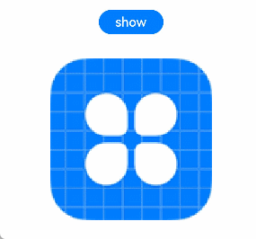
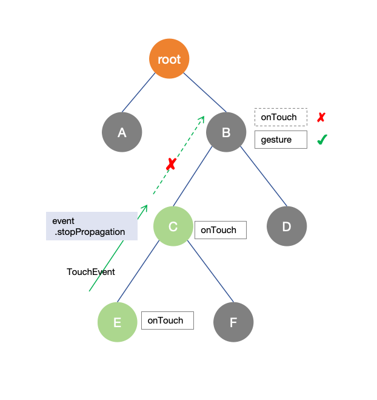
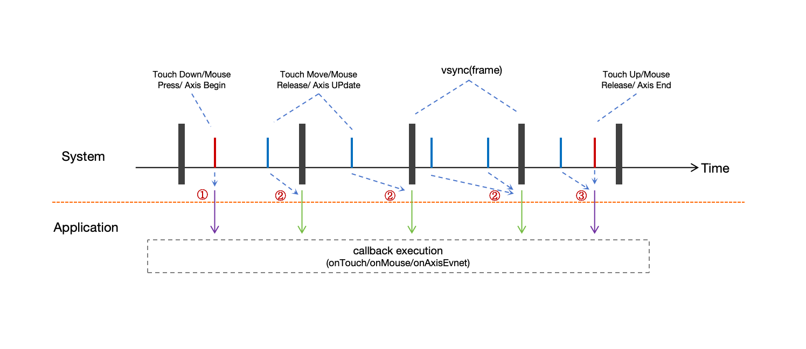
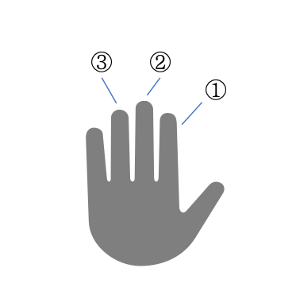

# 触屏事件


触屏事件指当手指/手写笔在组件上按下、滑动、抬起时触发的回调事件。包括[点击事件](#点击事件)、[拖拽事件](arkts-common-events-drag-event.md)和[触摸事件](#触摸事件)。


**图1**  触摸事件原理


## 点击事件

点击事件是指通过手指或手写笔完成一次按压和抬起的动作。发生点击事件时，会触发以下回调函数：


```ts
onClick(event: (event?: ClickEvent) => void)
```


event参数提供点击事件相对于窗口或组件的坐标位置，以及发生点击的事件源。


  例如通过按钮的点击事件控制图片的显示和隐藏。

```ts
@Entry
@Component
struct IfElseTransition {
  @State flag: boolean = true;
  @State btnMsg: string = 'show';

  build() {
    Column() {
      Button(this.btnMsg).width(80).height(30).margin(30)
        .onClick(() => {
          if (this.flag) {
            this.btnMsg = 'hide';
          } else {
            this.btnMsg = 'show';
          }
          // 点击Button控制Image的显示和消失
          this.flag = !this.flag;
        })
      if (this.flag) {
        Image($r('app.media.icon')).width(200).height(200)
      }
    }.height('100%').width('100%')
  }
}
```
**图2**  通过按钮的点击事件控制图片的显示和隐藏





## 触摸事件

当手指或手写笔在组件上触碰时，会触发不同动作所对应的事件响应，包括按下（Down）、滑动（Move）、抬起（Up）事件：


```ts
onTouch(event: (event?: TouchEvent) => void)
```

- event.type为TouchType.Down：表示手指按下。

- event.type为TouchType.Up：表示手指抬起。

- event.type为TouchType.Move：表示手指按住移动。

- event.type为TouchType.Cancel：表示打断取消当前手指操作。

触摸事件可以同时多指触发，通过event参数可获取触发的手指位置、手指唯一标志、当前发生变化的手指和输入的设备源等信息。


```ts
// xxx.ets
@Entry
@Component
struct TouchExample {
  @State text: string = '';
  @State eventType: string = '';

  build() {
    Column() {
      Button('Touch').height(40).width(100)
        .onTouch((event?: TouchEvent) => {
          if(event){
            if (event.type === TouchType.Down) {
              this.eventType = 'Down';
            }
            if (event.type === TouchType.Up) {
              this.eventType = 'Up';
            }
            if (event.type === TouchType.Move) {
              this.eventType = 'Move';
            }
            this.text = 'TouchType:' + this.eventType + '\nDistance between touch point and touch element:\nx: '
            + event.touches[0].x + '\n' + 'y: ' + event.touches[0].y + '\nComponent globalPos:('
            + event.target.area.globalPosition.x + ',' + event.target.area.globalPosition.y + ')\nwidth:'
            + event.target.area.width + '\nheight:' + event.target.area.height
          }
        })
      Button('Touch').height(50).width(200).margin(20)
        .onTouch((event?: TouchEvent) => {
          if(event){
            if (event.type === TouchType.Down) {
              this.eventType = 'Down';
            }
            if (event.type === TouchType.Up) {
              this.eventType = 'Up';
            }
            if (event.type === TouchType.Move) {
              this.eventType = 'Move';
            }
            this.text = 'TouchType:' + this.eventType + '\nDistance between touch point and touch element:\nx: '
            + event.touches[0].x + '\n' + 'y: ' + event.touches[0].y + '\nComponent globalPos:('
            + event.target.area.globalPosition.x + ',' + event.target.area.globalPosition.y + ')\nwidth:'
            + event.target.area.width + '\nheight:' + event.target.area.height
          }
        })
      Text(this.text)
    }.width('100%').padding(30)
  }
}
```


## 阻止冒泡

基础事件在响应链上的传递遵循冒泡机制，即最内层组件优先处理，再逐层往父组件传递该事件，任意一层组件可主动终止本次事件的继续传递，即终止冒泡。但需要注意的是，终止冒泡并不会中断父组件对手势的响应处理。

stopPropagation可终止冒泡。如下图所示，以Touch事件为例，当一个Touch事件传递至C节点时，如果调用了该事件上的stopPropagation接口，则B节点和root节点将不再接收到此事件，但B节点上的手势对象仍能接收和处理该Touch事件。



> **说明：**
>
> stopPropagation干预事件冒泡时，应注意对同一事件的不同类型（如Down/Move/Up）采用一致的规则，避免上层节点仅接收到部分类型事件，导致事件不闭环的情况，例如B节点仅接收到Down事件，而未接收到Up事件，这会影响B节点上的事件完整性（对于指向性按下操作类交互产生的事件，确保事件的完整性是必要的）。

以下是一个简单示例，实现了只要点击在子组件区域内，就阻止父组件接收触摸事件：

```typescript
@Entry
@ComponentV2
struct Index {
  
  build() {
    RelativeContainer() {
      Column() { // 父组件
        Text("  如果点中了我，就阻止父组件收到触摸事件  ")
          .fontColor(Color.White)
          .height("40%")
          .width("80%")
          .backgroundColor(Color.Brown)
          .alignSelf(ItemAlign.Center)
          .padding(10)
          .margin(20)
          .onTouch((event:TouchEvent)=>{
            event.stopPropagation() // 子组件优先接收到触摸事件后，阻止父组件接收事件
          })
      }
      .justifyContent(FlexAlign.End)
      .backgroundColor(Color.Green)
      .height('100%')
      .width('100%')
      .onTouch((event:TouchEvent)=>{
        console.log("touch event received on parent")
      })
    }
    .height('100%')
    .width('100%')
  }
}
```

> **说明：**
>
> 对事件的冒泡进行控制不会影响手势对触摸事件的接收与处理，因此需要分别考虑这两者。


## 重采样与历史点

基础事件的上报频率与具体的输入设备类型有关，但一般频率都是非常高的，如触屏一般每5~7ms即上报一个点，而对于一些高精度鼠标，上报频率最高可达到每1ms上报一次；由于对输入事件的响应是为了UI界面的变化来产生对用户操作的响应，因此将如此之高的基础事件上报给应用，多数情况下是冗余的，为此系统会对两帧之间所收到的基础事件进行重采样，只在帧内上报一次给应用，重采样是针对每个触点单独进行的，不同触点会单独进行重采样。



- 按下时产生的事件会立即上报给应用；
- 帧内的move报点并不会立即下发，而是会在送显帧到来时重采样合并后上报；
- 抬起时产生的事件会立即上报给应用，并在上报之前先将还未处理的move事件上报；

重采样会合并同一个触点在同一帧内多次上报的move事件，并通过算法尽可能计算出一个合适的坐标上报给应用，因此经过重采样后的坐标信息，与底层设备真实上报的点会存在细微的差异，这些差异是有益的，经过重采样后的点通常具备更好的平顺性。

重采样之前的所有原始点信息也都保留下来上报给了应用，如果需要直接处理它们，则可通过`getHistoricalPoints(): Array`来获取。

以下是一个简单示例：

```typescript
@Entry
@ComponentV2
struct Index {
  build() {
    RelativeContainer() {
      Column()
        .backgroundColor(Color.Green)
        .height('100%')
        .width('100%')
        .onTouch((event: TouchEvent) => {
          // 从event中获取历史点
          let allHistoricalPoints = event.getHistoricalPoints();
          if (allHistoricalPoints.length != 0) {
            for (const point of allHistoricalPoints) {
              console.log("historical point: [" + point.touchObject.windowX + ", " + point.touchObject.windowY + "]")
            }
          }
        })
    }
    .height('100%')
    .width('100%')
  }
}
```

## 多指信息

在支持多指触控的触屏设备上，上报的事件中同时包含了窗口所有按压手指的信息，可以通过**touchs**获取，如下：

```typescript
@Entry
@ComponentV2
struct Index {
  private currentFingerCount: number = 0
  private allFingerIds: number[] = []

  build() {
    RelativeContainer() {
      Column()
        .backgroundColor(Color.Green)
        .height('100%')
        .width('100%')
        .onTouch((event: TouchEvent) => {
          if (event.source != SourceType.TouchScreen) {
            return;
          }
          // clear数组
          this.allFingerIds.splice(0, this.allFingerIds.length)
          // 从event中获取所有触点信息
          let allFingers = event.touches;
          if (allFingers.length > 0 && this.currentFingerCount == 0) {
            // 第1根手指按下
            console.log("fingers start to press down")
            this.currentFingerCount = allFingers.length
          }
          if (allFingers.length != 0) {
            for (const finger of allFingers) {
              this.allFingerIds.push(finger.id)
            }
            console.log("current all fingers : " + this.allFingerIds.toString())
          }
          if (event.type == TouchType.Up && event.touches.length == 1) {
            // 所有手指都已抬起
            console.log("all fingers already up")
            this.currentFingerCount = 0
          }
        })
    }
    .height('100%')
    .width('100%')
  }
}
```

不同触点通过id区分，id按照接触屏幕的顺序依次递增，与物理上的触点（手指）并无严格顺序对应关系。并且这些触点在**touchs**数组中并非按照编号大小顺序排列，请不要依赖顺序进行访问，另外，直到所有触点全部离开屏幕之前，期间抬起的触点对应的编号，会在有触点按下时自动复用。

以下是上面的示例在如下操作序列时产生的日志输出情况：



按下手指① -> 按下手指② -> 按下手指③ -> 抬起手指② -> 抬起手指③ -> 按下手指② -> 抬起手指① -> 抬起手指③

```
  fingers start to press down   // 按下手指①
  current all fingers: 0
  ... ...
  current all fingers: 0,1      // 按下手指②
  ... ...
  current all fingers: 0,1,2    // 按下手指③
  ... ...
  current all fingers: 0,2      // 抬起手指②
  ... ...
  current all fingers: 0        // 抬起手指③
  ... ...
  current all fingers: 0,1      // 按下手指③
  ... ...
  current all fingers: 1        // 抬起手指①
  ... ...
  all fingers already up        // 抬起手指③
```


## 触控笔

触控笔操作触摸屏与通过手指操作类似，都会产生触摸事件，可以通过sourceTool进行区分。而对于一些主动式电容笔，上报的触摸事件中，还会包含笔接触屏幕时的夹角信息，可参考[BaseEvent](../reference/apis-arkui/arkui-ts/ts-gesture-customize-judge.md#baseevent对象说明8)。

- tiltX：触控笔在设备平面上的投影与设备平面X轴的夹角。
- tiltY：触控笔在设备平面上的投影与设备平面Y轴的夹角。
- rollAngle：触控笔与设备平面的夹角。


## 相关实例

针对触屏事件开发，有以下相关实例可供参考：

- [ArkTS组件集（ArkTS）（Full SDK）（API10）](https://gitee.com/openharmony/applications_app_samples/tree/master/code/UI/ArkTsComponentCollection/ComponentCollection)

<!--RP1--><!--RP1End-->