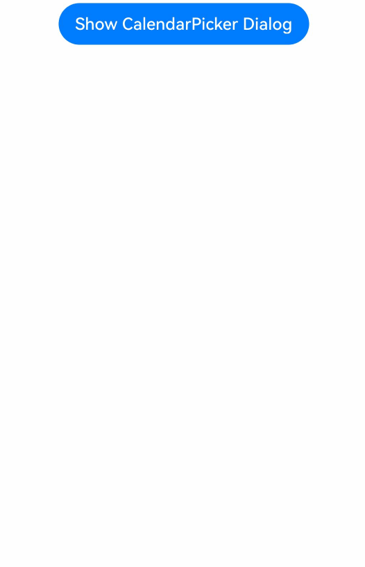

# 固定样式弹出框

固定样式弹出框采用固定的布局格式，这使得开发者无需关心具体的显示布局细节，只需输入所需显示的文本内容，从而简化了使用流程，提升了便捷性。

## 使用约束

- 可以通过调用UIContext或getUIContext，在非UI页面或某些异步回调中使用本文中的接口。CalendarPickerDialog当前不支持此操作。

- 操作菜单 (showActionMenu)、对话框 (showDialog)需先使用UIContext中的[getPromptAction()](../reference/apis-arkui/js-apis-arkui-UIContext.md#getpromptaction)方法获取到PromptAction对象，再通过该对象调用对应方法。

- 列表选择弹出框 (ActionSheet)、警告弹出框 (AlertDialog)、选择器弹出框 (PickerDialog)中除CalendarPickerDialog都需先使用ohos.window中的[getUIContext()](../reference/apis-arkui/arkts-apis-window-Window.md#getuicontext10)方法获取UIContext实例，再通过此实例调用对应方法。或者可以通过自定义组件内置方法[getUIContext()](../reference/apis-arkui/arkui-ts/ts-custom-component-api.md#getuicontext)获取。

操作菜单 (showActionMenu)、对话框 (showDialog)、列表选择弹出框 (ActionSheet)、警告弹出框 (AlertDialog)可以设置isModal为false变成非模态弹窗。

## 操作菜单 (showActionMenu)

操作菜单通过UIContext中的getPromptAction方法获取到PromptAction对象，再通过该对象调用[showActionMenu](../reference/apis-arkui/js-apis-arkui-UIContext.md#showactionmenu11)接口实现，支持在回调或开发者自定义类中使用。

创建并显示操作菜单后，菜单的响应结果会异步返回选中按钮在buttons数组中的索引。

```ts
import { PromptAction } from '@kit.ArkUI';

let uiContext = this.getUIContext();
let promptAction: PromptAction = uiContext.getPromptAction();
try {
  promptAction.showActionMenu({
    title: 'showActionMenu Title Info',
    buttons: [
      {
        text: 'item1',
        color: '#666666'
      },
      {
        text: 'item2',
        color: '#000000'
      },
    ]
  })
    .then(data => {
      console.info('showActionMenu success, click button: ' + data.index);
    })
    .catch((err: Error) => {
      console.error('showActionMenu error: ' + err);
    })
} catch (error) {
}
```


## 对话框 (showDialog)

对话框通过UIContext中的getPromptAction方法获取到PromptAction对象，再通过该对象调用[showDialog](../reference/apis-arkui/js-apis-arkui-UIContext.md#showdialog)接口实现，支持在回调或开发者自定义类中使用。

创建并显示对话框，对话框响应后异步返回选中按钮在buttons数组中的索引。

```ts
// xxx.ets
import { PromptAction } from '@kit.ArkUI';

let uiContext = this.getUIContext();
let promptAction: PromptAction = uiContext.getPromptAction();
try {
  promptAction.showDialog({
    title: 'showDialog Title Info',
    message: 'Message Info',
    buttons: [
      {
        text: 'button1',
        color: '#000000'
      },
      {
        text: 'button2',
        color: '#000000'
      }
    ]
  }, (err, data) => {
    if (err) {
      console.error('showDialog err: ' + err);
      return;
    }
    console.info('showDialog success callback, click button: ' + data.index);
  });
} catch (error) {
}
```


## 选择器弹窗 (PickerDialog)

选择器弹窗通常用于在用户进行某些操作（如点击按钮）时显示特定的信息或选项。

### 生命周期

弹窗提供了生命周期函数，用于通知用户该弹窗的生命周期。
生命周期的触发顺序可参考各组件API。

| 名称            |类型| 说明                       |
| ----------------- | ------ | ---------------------------- |
| onDidAppear    | () => void  | 弹窗弹出时的事件回调。  |
| onDidDisappear |() => void  | 弹窗消失时的事件回调。  |
| onWillAppear    | () => void | 弹窗显示动效前的事件回调。 |
| onWillDisappear | () => void | 弹窗退出动效前的事件回调。 |

### 日历选择器弹窗 (CalendarPickerDialog)

日历选择器弹窗提供日历视图，包含年、月和星期信息，通过[CalendarPickerDialog](../reference/apis-arkui/arkui-ts/ts-methods-calendarpicker-dialog.md)接口实现。开发者可调用show函数，定义并弹出日历选择器弹窗。

日历选择器弹窗的弹出依赖UI的执行上下文，不可在[UI上下文不明确](./arkts-global-interface.md)的地方使用，具体约束参见[UIContext](../reference/apis-arkui/js-apis-arkui-UIContext.md#uicontext)说明。

通过配置 acceptButtonStyle、cancelButtonStyle可以实现自定义按钮样式。

```ts
// xxx.ets
@Entry
@Component
struct CalendarPickerDialogExample {
  private selectedDate: Date = new Date('2024-04-23');

  build() {
    Column() {
      Button("Show CalendarPicker Dialog")
        .margin(20)
        .onClick(() => {
          console.info("CalendarDialog.show")
          CalendarPickerDialog.show({
            selected: this.selectedDate,
            acceptButtonStyle: {
              fontColor: '#2787d9',
              fontSize: '16fp',
              backgroundColor: '#f7f7f7',
              borderRadius: 10
            },
            cancelButtonStyle: {
              fontColor: Color.Red,
              fontSize: '16fp',
              backgroundColor: '#f7f7f7',
              borderRadius: 10
            },
            onAccept: (date: Date)=>{
              // 当弹出框再次弹出时显示选中的是上一次确定的日期
              this.selectedDate = date;
            }
          })
        })
    }.width('100%')
  }
}
```



### 日期滑动选择器弹窗 (DatePickerDialog)

开发者可以利用指定的日期范围，创建日期滑动选择器弹窗，将日期信息清晰地展示在弹出的窗口上。

日期滑动选择器弹窗通过UIContext中的[showDatePickerDialog](../reference/apis-arkui/js-apis-arkui-UIContext.md#showdatepickerdialog)接口实现。

弹窗中配置lunarSwitch、showTime为true时，会展示切换农历的开关和时间，当checkbox被选中时，会显示农历。当按下确定按钮时，弹窗会通过onDateAccept返回目前所选中的日期。如需弹窗再次弹出时显示选中的是上一次确定的日期，就要在回调中重新给selectTime进行赋值。

```ts
@Entry
@Component
struct DatePickerDialogExample {
  @State selectTime: Date = new Date('2023-12-25T08:30:00');

  build() {
    Column() {
      Button('showDatePickerDialog')
        .margin(30)
        .onClick(() => {
          this.getUIContext().showDatePickerDialog({
            start: new Date("2000-1-1"),
            end: new Date("2100-12-31"),
            selected: this.selectTime,
            lunarSwitch: true,
            showTime: true,
            onDateAccept: (value: Date) => {
              this.selectTime = value;
              console.info("DatePickerDialog:onAccept()" + JSON.stringify(value));
            },
          });
        })
    }.width('100%').margin({ top: 5 })
  }
}

```


该示例通过配置disappearTextStyle、textStyle、selectedTextStyle、acceptButtonStyle、cancelButtonStyle实现了自定义文本以及按钮样式。

```ts
@Entry
@Component
struct DatePickerDialogExample {
  @State selectTime: Date = new Date('2023-12-25T08:30:00');

  build() {
    Column() {
      Button('showDatePickerDialog')
        .margin(30)
        .onClick(() => {
          this.getUIContext().showDatePickerDialog({
            start: new Date("2000-1-1"),
            end: new Date("2100-12-31"),
            selected: this.selectTime,
            textStyle: { color: '#2787d9', font: { size: '14fp', weight: FontWeight.Normal } },
            selectedTextStyle: { color: '#004aaf', font: { size: '18fp', weight: FontWeight.Regular } },
            acceptButtonStyle: {
              fontColor: '#2787d9',
              fontSize: '16fp',
              backgroundColor: '#f7f7f7',
              borderRadius: 10
            },
            cancelButtonStyle: {
              fontColor: Color.Red,
              fontSize: '16fp',
              backgroundColor: '#f7f7f7',
              borderRadius: 10
            }
          })
        })
    }.width('100%').margin({ top: 5 })
  }
}
```


### 时间滑动选择器弹窗 (TimePickerDialog)

开发者可根据24小时的时间区间，创建时间滑动选择器弹窗，将时间信息清晰地展示在弹出的窗口上。

时间滑动选择器弹窗通过UIContext中的[showTimePickerDialog](../reference/apis-arkui/js-apis-arkui-UIContext.md#showtimepickerdialog)接口实现。

该示例通过配置disappearTextStyle、textStyle、selectedTextStyle、acceptButtonStyle、cancelButtonStyle实现了自定义文本以及按钮样式。

```ts
// xxx.ets

@Entry
@Component
struct TimePickerDialogExample {
  @State selectTime: Date = new Date('2023-12-25T08:30:00');

  build() {
    Column() {
      Button('showTimePickerDialog')
        .margin(30)
        .onClick(() => {
          this.getUIContext().showTimePickerDialog({
            selected: this.selectTime,
            textStyle: { color: '#2787d9', font: { size: '14fp', weight: FontWeight.Normal } },
            selectedTextStyle: { color: '#004aaf', font: { size: '18fp', weight: FontWeight.Regular } },
            acceptButtonStyle: {
              fontColor: '#2787d9',
              fontSize: '16fp',
              backgroundColor: '#f7f7f7',
              borderRadius: 10
            },
            cancelButtonStyle: {
              fontColor: Color.Red,
              fontSize: '16fp',
              backgroundColor: '#f7f7f7',
              borderRadius: 10
            }
          });
        })
    }.width('100%').margin({ top: 5 })
  }
}

```


### 文本滑动选择器弹窗 (TextPickerDialog)

开发者可根据指定的选择范围，创建文本滑动选择器弹窗，将文本信息清晰地展示在弹出的窗口上。

文本滑动选择器弹窗通过UIContext中的[showTextPickerDialog](../reference/apis-arkui/js-apis-arkui-UIContext.md#showtextpickerdialog)接口实现。

该示例通过设置range的参数类型为TextCascadePickerRangeContent[]，实现3列文本选择器弹窗。当按下确定按钮时，弹窗会通过onAccept返回目前所选中文本和索引值。如需弹窗再次弹出时显示选中的是上一次确定的文本，就要在回调中重新给select进行赋值。

```ts
@Entry
@Component
struct TextPickerDialogExample {
  private fruits: TextCascadePickerRangeContent[] = [
    {
      text: '辽宁省',
      children: [{ text: '沈阳市', children: [{ text: '沈河区' }, { text: '和平区' }, { text: '浑南区' }] },
        { text: '大连市', children: [{ text: '中山区' }, { text: '金州区' }, { text: '长海县' }] }]
    },
    {
      text: '吉林省',
      children: [{ text: '长春市', children: [{ text: '南关区' }, { text: '宽城区' }, { text: '朝阳区' }] },
        { text: '四平市', children: [{ text: '铁西区' }, { text: '铁东区' }, { text: '梨树县' }] }]
    },
    {
      text: '黑龙江省',
      children: [{ text: '哈尔滨市', children: [{ text: '道里区' }, { text: '道外区' }, { text: '南岗区' }] },
        { text: '牡丹江市', children: [{ text: '东安区' }, { text: '西安区' }, { text: '爱民区' }] }]
    }
  ];
  private select : number  = 0;
  build() {
    Column() {
      Button('showTextPickerDialog')
        .margin(30)
        .onClick(() => {
          this.getUIContext().showTextPickerDialog({
            range: this.fruits,
            selected: this.select,
            onAccept: (value: TextPickerResult) => {
              this.select = value.index as number
            }
          });
        })
    }.width('100%').margin({ top: 5 })
  }
}
```


## 列表选择弹窗 (ActionSheet)

列表选择器弹窗适用于呈现多个操作选项，尤其当界面中仅需展示操作列表而无其他内容时。

列表选择器弹窗通过UIContext中的[showActionSheet](../reference/apis-arkui/js-apis-arkui-UIContext.md#showactionsheet)接口实现。

该示例通过配置width、height、transition等接口，定义了弹窗的样式以及弹出动效。

```ts
@Entry
@Component
struct showActionSheetExample {
  build() {
    Column() {
      Button('showActionSheet')
        .margin(30)
        .onClick(() => {
          this.getUIContext().showActionSheet({
            title: 'ActionSheet title',
            message: 'message',
            autoCancel: false,
            width: 300,
            height: 300,
            cornerRadius: 20,
            borderWidth: 1,
            borderStyle: BorderStyle.Solid,
            borderColor: Color.Blue,
            backgroundColor: Color.White,
            transition: TransitionEffect.asymmetric(TransitionEffect.OPACITY
              .animation({ duration: 3000, curve: Curve.Sharp })
              .combine(TransitionEffect.scale({ x: 1.5, y: 1.5 }).animation({ duration: 3000, curve: Curve.Sharp })),
              TransitionEffect.OPACITY.animation({ duration: 100, curve: Curve.Smooth })
                .combine(TransitionEffect.scale({ x: 0.5, y: 0.5 }).animation({ duration: 100, curve: Curve.Smooth }))),
            confirm: {
              value: 'Confirm button',
              action: () => {
                console.info('Get Alert Dialog handled');
              }
            },
            alignment: DialogAlignment.Center,
            sheets: [
              {
                title: 'apples',
                action: () => {
                }
              },
              {
                title: 'bananas',
                action: () => {
                }
              },
              {
                title: 'pears',
                action: () => {
                  console.log('pears');
                }
              }
            ]
          });
        })
    }.width('100%').margin({ top: 5 })
  }
}
```


## 警告弹窗 (AlertDialog)

向用户提问或得到用户的许可时，使用警告弹窗。

* 警告弹窗用来提示重要信息，但会中断当前任务，尽量提供必要的信息和有用的操作。
* 避免仅使用警告弹窗提供信息，用户不喜欢被信息丰富但不可操作的警告打断。

警告弹窗通过UIContext中的[showAlertDialog](../reference/apis-arkui/js-apis-arkui-UIContext.md#showalertdialog)接口实现。

该示例通过配置width、height、transition等接口，定义了多个按钮弹窗的样式以及弹出动效。

```ts
@Entry
@Component
struct showAlertDialogExample {
  build() {
    Column() {
      Button('showAlertDialog')
        .margin(30)
        .onClick(() => {
          this.getUIContext().showAlertDialog(
            {
              title: 'title',
              message: 'text',
              autoCancel: true,
              alignment: DialogAlignment.Center,
              offset: { dx: 0, dy: -20 },
              gridCount: 3,
              transition: TransitionEffect.asymmetric(TransitionEffect.OPACITY
                .animation({ duration: 3000, curve: Curve.Sharp })
                .combine(TransitionEffect.scale({ x: 1.5, y: 1.5 }).animation({ duration: 3000, curve: Curve.Sharp })),
                TransitionEffect.OPACITY.animation({ duration: 100, curve: Curve.Smooth })
                  .combine(TransitionEffect.scale({ x: 0.5, y: 0.5 })
                    .animation({ duration: 100, curve: Curve.Smooth }))),
              buttons: [{
                value: 'cancel',
                action: () => {
                  console.info('Callback when the first button is clicked');
                }
              },
                {
                  enabled: true,
                  defaultFocus: true,
                  style: DialogButtonStyle.HIGHLIGHT,
                  value: 'ok',
                  action: () => {
                    console.info('Callback when the second button is clicked');
                  }
                }],
            }
          );
        })
    }.width('100%').margin({ top: 5 })
  }
}
```


