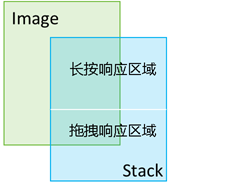

# 手势拦截

手势拦截主要用于确保手势按需执行，有效解决手势冲突问题。典型应用场景包括：嵌套滚动、通过过滤组件响应手势的范围来优化交互体验。手势拦截主要采用[手势触发控制](#手势触发控制)和[手势响应控制](#手势响应控制)两种方式实现。

## 手势触发控制

手势触发控制是指在系统判定阈值已满足的条件下，应用可自行判断是否应拦截手势，使手势操作失败。

**图1** 手势触发控制流程图


手势触发控制涉及以下接口。

| **接口** | **说明** |
| ------- | -------------- |
|[onGestureJudgeBegin](../reference/apis-arkui/arkui-ts/ts-gesture-customize-judge.md#ongesturejudgebegin)|用于手势拦截，是通用事件。在手势满足系统触发阈值场景下，回调给应用判断是否拦截手势。|
|[onGestureRecognizerJudgeBegin](../reference/apis-arkui/arkui-ts/ts-gesture-blocking-enhancement.md#ongesturerecognizerjudgebegin)|用于手势拦截、获取手势识别器和设置手势识别器开闭状态。是onGestureJudgeBegin接口的能力扩展，可以代替onGestureJudgeBegin接口。<br>获取手势识别器时，会获取一次交互中手势响应链上的所有手势识别器，以及当前即将触发成功的手势识别器，此时可以设置手势的激活状态。|

以下示例中，Image和Stack两个组件位于同一区域。长按Stack组件的上半部分可触发挂载在Stack组件上的长按手势，长按Stack组件的下半部分则会响应Image组件的拖拽操作。

**图2** 示例图



1. Image组件设置拖拽。

   ```ts
   Image($r('sys.media.ohos_app_icon'))
     .draggable(true)
     .onDragStart(()=>{
       promptAction.showToast({ message: "Drag 下半区蓝色区域，Image响应" });
     })
     .width('200vp').height('200vp')
   ```

2. Stack组件设置手势。

   ```ts
   Stack() {}
     .width('200vp')
     .height('200vp')
     .hitTestBehavior(HitTestMode.Transparent)
     .gesture(GestureGroup(GestureMode.Parallel,
       LongPressGesture()
         .onAction((event: GestureEvent) => {
           promptAction.showToast({ message: "LongPressGesture 长按上半区 红色区域，红色区域响应" });
         })
         .tag("longpress")
     ))
   ```

3. Stack组件设置拦截。

   ```ts
   .onGestureJudgeBegin((gestureInfo: GestureInfo, event: BaseGestureEvent) => {
     // 如果是长按类型手势，判断点击的位置是否在上半区
     if (gestureInfo.type == GestureControl.GestureType.LONG_PRESS_GESTURE) {
       if (event.fingerList.length > 0 && event.fingerList[0].localY < 100) {
         return GestureJudgeResult.CONTINUE;
       } else {
         return GestureJudgeResult.REJECT;
       }
     }
     return GestureJudgeResult.CONTINUE;
   })
   ```

4. 代码完整示例。

   ```ts
   import { promptAction } from '@kit.ArkUI';
   
   @Entry
   @Component
   struct Index {
     scroller: Scroller = new Scroller();
   
     build() {
       Scroll(this.scroller) {
         Column({ space: 8 }) {
           Text("包括上下两层组件，上层组件绑定长按手势，下层组件绑定拖拽。其中上层组件下半区域绑定手势拦截，使该区域响应下层拖拽手势。").width('100%').fontSize(20).fontColor('0xffdd00')
           Stack({ alignContent: Alignment.Center }) {
             Column() {
               // 模拟上半区和下半区
               Stack().width('200vp').height('100vp').backgroundColor(Color.Red)
               Stack().width('200vp').height('100vp').backgroundColor(Color.Blue)
             }.width('200vp').height('200vp')
             // Stack的下半区是绑定了拖动手势的图像区域。
             Image($r('sys.media.ohos_app_icon'))
               .draggable(true)
               .onDragStart(()=>{
                 promptAction.showToast({ message: "Drag 下半区蓝色区域，Image响应" });
               })
               .width('200vp').height('200vp')
             // Stack的上半区是绑定了长按手势的浮动区域。
             Stack() {
             }
             .width('200vp')
             .height('200vp')
             .hitTestBehavior(HitTestMode.Transparent)
             .gesture(GestureGroup(GestureMode.Parallel,
               LongPressGesture()
                 .onAction((event: GestureEvent) => {
                   promptAction.showToast({ message: "LongPressGesture 长按上半区 红色区域，红色区域响应" });
                 })
                 .tag("longpress")
             ))
             .onGestureJudgeBegin((gestureInfo: GestureInfo, event: BaseGestureEvent) => {
               // 如果是长按类型手势，判断点击的位置是否在上半区
               if (gestureInfo.type == GestureControl.GestureType.LONG_PRESS_GESTURE) {
                 if (event.fingerList.length > 0 && event.fingerList[0].localY < 100) {
                   return GestureJudgeResult.CONTINUE;
                 } else {
                   return GestureJudgeResult.REJECT;
                 }
               }
               return GestureJudgeResult.CONTINUE;
             })
           }.width('100%')
         }.width('100%')
       }
     }
   }
   ```

## 手势响应控制

手势响应控制指的是手势已经成功识别，但是开发者仍然可以通过调用API接口控制手势回调是否能够响应。

**图3** 手势响应控制流程图


手势响应控制的前提是手势识别成功，如果手势不成功则不会产生手势回调响应。

1. 业务手势作业流：指真正触发UI变化的业务手势，比如使页面滚动的PanGesture，触发点击的TapGesture等。

2. 监听手势作业流：指在监听手势运行的过程中，应根据上下文的业务状态变化动态控制手势识别器的开闭，例如判断组件嵌套滚动过程中是否已滑至边缘。这一监听事件可借助一个使用[并行手势绑定方式](arkts-gesture-events-binding.md#parallelgesture并行手势绑定方法)的PanGesture实现，或者采用Touch事件来完成。

3. 设置手势并行：此步骤并非必需，典型场景是在嵌套滚动中，设置外部组件的滚动手势与内部的滚动手势并行。

4. 动态开闭手势：指通过手势识别器的setEnable方法，控制手势是否响应用户回调。

手势响应控制涉及以下接口。

| **接口** | **说明** |
| ------- | -------------- |
|[shouldBuiltInRecognizerParallelWith](../reference/apis-arkui/arkui-ts/ts-gesture-blocking-enhancement.md#shouldbuiltinrecognizerparallelwith)|用于设置系统组件内置手势与其他手势并行。|
|[onGestureRecognizerJudgeBegin](../reference/apis-arkui/arkui-ts/ts-gesture-blocking-enhancement.md#ongesturerecognizerjudgebegin)|用于手势拦截，获取手势识别器，初始化手势识别器开闭状态。|
|[parallelGesture](arkts-gesture-events-binding.md#parallelgesture并行手势绑定方法)|可使开发者定义的手势，与比他优先级高的手势并行。|

以下示例是两个Scroll组件的嵌套滚动场景，使用手势控制的api去控制外部组件和内部组件的嵌套滚动联动。

1. 使用shouldBuiltInRecognizerParallelWith接口设置外部Scroll组件的PanGesture手势与内部Scroll组件的PanGesture手势并行。

   ```ts
   .shouldBuiltInRecognizerParallelWith((current: GestureRecognizer, others: Array<GestureRecognizer>) => {
     for (let i = 0; i < others.length; i++) {
       let target = others[i].getEventTargetInfo();
       if (target.getId() == "inner" && others[i].isBuiltIn() && others[i].getType() == GestureControl.GestureType.PAN_GESTURE) { // 找到将要组成并行手势的识别器
         this.currentRecognizer = current; // 保存当前组件的识别器
         this.childRecognizer = others[i]; // 保存将要组成并行手势的识别器
         return others[i]; // 返回和当前手势将要组成并行手势的识别器
       }
     }
     return undefined;
   })
   ```

2. 使用onGestureRecognizerJudgeBegin接口获取到Scroll组件的PanGesture手势识别器，同时根据内外Scroll组件的边界条件，设置内外手势的开闭状态。

   ```ts
   .onGestureRecognizerJudgeBegin((event: BaseGestureEvent, current: GestureRecognizer, others: Array<GestureRecognizer>) => { // 在识别器即将要成功时，根据当前组件状态，设置识别器使能状态        
     let target = current.getEventTargetInfo();
     if (target.getId() == "outer" && current.isBuiltIn() && current.getType() == GestureControl.GestureType.PAN_GESTURE) {
       for (let i = 0; i < others.length; i++) {
         let target = others[i].getEventTargetInfo() as ScrollableTargetInfo;
         if (target instanceof ScrollableTargetInfo && target.getId() == "inner") { // 找到响应链上对应并行的识别器
           let panEvent = event as PanGestureEvent;
           this.childRecognizer.setEnabled(true);
           this.currentRecognizer.setEnabled(false);
           if (target.isEnd()) { // 根据当前组件状态以及移动方向动态控制识别器使能状态
             if (panEvent && panEvent.offsetY < 0) {
               this.childRecognizer.setEnabled(false);
               this.currentRecognizer.setEnabled(true);
             }
           } else if (target.isBegin()) {
             if (panEvent.offsetY > 0) {
               this.childRecognizer.setEnabled(false);
               this.currentRecognizer.setEnabled(true);
             }
           }
         }
       }
     }
     return GestureJudgeResult.CONTINUE;
   })
   ```

3. 设置监听手势，监听Scroll组件状态，动态调整手势开闭状态，控制手势回调是否触发，从而控制Scroll是否滚动。

   ```ts
   .parallelGesture( // 绑定一个Pan手势作为动态控制器
     PanGesture()
       .onActionUpdate((event: GestureEvent)=>{
         if (this.childRecognizer.getState() != GestureRecognizerState.SUCCESSFUL || this.currentRecognizer.getState() != GestureRecognizerState.SUCCESSFUL) { // 如果识别器状态不是SUCCESSFUL，则不做控制
           return;
         }
         let target = this.childRecognizer.getEventTargetInfo() as ScrollableTargetInfo;
         let currentTarget = this.currentRecognizer.getEventTargetInfo() as ScrollableTargetInfo;
         if (target instanceof ScrollableTargetInfo && currentTarget instanceof ScrollableTargetInfo) {
           this.childRecognizer.setEnabled(true);
           this.currentRecognizer.setEnabled(false);
           if (target.isEnd()) { // 在移动过程中实时根据当前组件状态，控制识别器的开闭状态
             if ((event.offsetY - this.lastOffset) < 0) {
               this.childRecognizer.setEnabled(false);
               if (currentTarget.isEnd()) {
                 this.currentRecognizer.setEnabled(false);
               } else {
                 this.currentRecognizer.setEnabled(true);
               }
             }
           } else if (target.isBegin()) {
             if ((event.offsetY - this.lastOffset) > 0) {
               this.childRecognizer.setEnabled(false);
               if (currentTarget.isBegin()) {
                 this.currentRecognizer.setEnabled(false);
               } else {
                 this.currentRecognizer.setEnabled(true);
               }
             }
           }
         }
         this.lastOffset = event.offsetY
     })
   )
   ```

4. 代码完整示例。

   ```ts
   // xxx.ets
   @Entry
   @Component
   struct FatherControlChild {
     scroller: Scroller = new Scroller();
     scroller2: Scroller = new Scroller();
     private arr: number[] = [0, 1, 2, 3, 4, 5, 6, 7, 8, 9];
     private childRecognizer: GestureRecognizer = new GestureRecognizer();
     private currentRecognizer: GestureRecognizer = new GestureRecognizer();
     private lastOffset: number = 0;
   
     build() {
       Stack({ alignContent: Alignment.TopStart }) {
         Scroll(this.scroller) { // 外部滚动容器
           Column() {
             Text("Scroll Area")
               .width('90%')
               .height(150)
               .backgroundColor(0xFFFFFF)
               .borderRadius(15)
               .fontSize(16)
               .textAlign(TextAlign.Center)
               .margin({ top: 10 })
             Scroll(this.scroller2) { // 内部滚动容器
               Column() {
                 Text("Scroll Area2")
                   .width('90%')
                   .height(150)
                   .backgroundColor(0xFFFFFF)
                   .borderRadius(15)
                   .fontSize(16)
                   .textAlign(TextAlign.Center)
                   .margin({ top: 10 })
                 Column() {
                   ForEach(this.arr, (item: number) => {
                     Text(item.toString())
                       .width('90%')
                       .height(150)
                       .backgroundColor(0xFFFFFF)
                       .borderRadius(15)
                       .fontSize(16)
                       .textAlign(TextAlign.Center)
                       .margin({ top: 10 })
                   }, (item: string) => item)
                 }.width('100%')
               }
             }
             .id("inner")
             .width('100%')
             .height(800)
           }.width('100%')
         }
         .id("outer")
         .height(600)
         .scrollable(ScrollDirection.Vertical) // 滚动方向纵向
         .scrollBar(BarState.On) // 滚动条常驻显示
         .scrollBarColor(Color.Gray) // 滚动条颜色
         .scrollBarWidth(10) // 滚动条宽度
         .edgeEffect(EdgeEffect.None)
         .shouldBuiltInRecognizerParallelWith((current: GestureRecognizer, others: Array<GestureRecognizer>) => {
           for (let i = 0; i < others.length; i++) {
             let target = others[i].getEventTargetInfo();
             if (target.getId() == "inner" && others[i].isBuiltIn() && others[i].getType() == GestureControl.GestureType.PAN_GESTURE) { // 找到将要组成并行手势的识别器
               this.currentRecognizer = current; // 保存当前组件的识别器
               this.childRecognizer = others[i]; // 保存将要组成并行手势的识别器
               return others[i]; // 返回和当前手势将要组成并行手势的识别器
             }
           }
           return undefined;
         })
         .onGestureRecognizerJudgeBegin((event: BaseGestureEvent, current: GestureRecognizer, others: Array<GestureRecognizer>) => { // 在识别器即将要成功时，根据当前组件状态，设置识别器使能状态        
           let target = current.getEventTargetInfo();
           if (target.getId() == "outer" && current.isBuiltIn() && current.getType() == GestureControl.GestureType.PAN_GESTURE) {
             for (let i = 0; i < others.length; i++) {
               let target = others[i].getEventTargetInfo() as ScrollableTargetInfo;
               if (target instanceof ScrollableTargetInfo && target.getId() == "inner") { // 找到响应链上对应并行的识别器
                 let panEvent = event as PanGestureEvent;
                 this.childRecognizer.setEnabled(true);
                 this.currentRecognizer.setEnabled(false);
                 if (target.isEnd()) { // 根据当前组件状态以及移动方向动态控制识别器使能状态
                   if (panEvent && panEvent.offsetY < 0) {
                     this.childRecognizer.setEnabled(false);
                     this.currentRecognizer.setEnabled(true);
                   }
                 } else if (target.isBegin()) {
                   if (panEvent.offsetY > 0) {
                     this.childRecognizer.setEnabled(false);
                     this.currentRecognizer.setEnabled(true);
                   }
                 }
               }
             }
           }
           return GestureJudgeResult.CONTINUE;
         })
         .parallelGesture( // 绑定一个Pan手势作为动态控制器
           PanGesture()
             .onActionUpdate((event: GestureEvent)=>{
               if (this.childRecognizer.getState() != GestureRecognizerState.SUCCESSFUL || this.currentRecognizer.getState() != GestureRecognizerState.SUCCESSFUL) { // 如果识别器状态不是SUCCESSFUL，则不做控制
                 return;
               }
               let target = this.childRecognizer.getEventTargetInfo() as ScrollableTargetInfo;
               let currentTarget = this.currentRecognizer.getEventTargetInfo() as ScrollableTargetInfo;
               if (target instanceof ScrollableTargetInfo && currentTarget instanceof ScrollableTargetInfo) {
                 this.childRecognizer.setEnabled(true);
                 this.currentRecognizer.setEnabled(false);
                 if (target.isEnd()) { // 在移动过程中实时根据当前组件状态，控制识别器的开闭状态
                   if ((event.offsetY - this.lastOffset) < 0) {
                     this.childRecognizer.setEnabled(false);
                     if (currentTarget.isEnd()) {
                       this.currentRecognizer.setEnabled(false);
                     } else {
                       this.currentRecognizer.setEnabled(true);
                     }
                   }
                 } else if (target.isBegin()) {
                   if ((event.offsetY - this.lastOffset) > 0) {
                     this.childRecognizer.setEnabled(false)
                     if (currentTarget.isBegin()) {
                       this.currentRecognizer.setEnabled(false);
                     } else {
                       this.currentRecognizer.setEnabled(true);
                     }
                   }
                 }
               }
               this.lastOffset = event.offsetY;
             })
         )
       }.width('100%').height('100%').backgroundColor(0xDCDCDC)
     }
   }
   ```