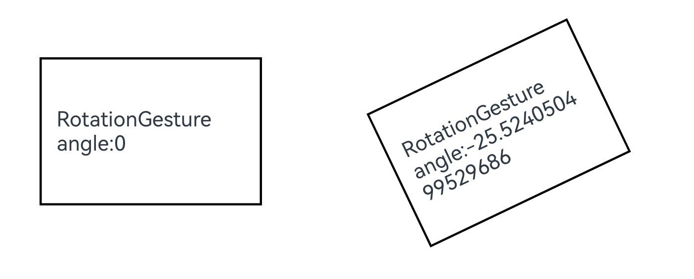

# 单一手势


## 点击手势（TapGesture）


```ts
TapGesture(value?:{count?:number; fingers?:number})
```


点击手势支持单次点击和多次点击，拥有两个可选参数：


- count：声明该点击手势识别的连续点击次数。默认值为1，若设置小于1的非法值会被转化为默认值。如果配置多次点击，上一次抬起和下一次按下的超时时间为300毫秒。

- fingers：用于声明触发点击的手指数量，最小值为1，最大值为10，默认值为1。当配置多指时，若第一根手指按下300毫秒内未有足够的手指数按下则手势识别失败。
    以在Text组件上绑定双击手势（count值为2的点击手势）为例：

  ```ts
  // xxx.ets
  @Entry
  @Component
  struct Index {
    @State value: string = "";
    
    build() {
      Column() {
        Text('Click twice').fontSize(28)
          .gesture(
            // 绑定count为2的TapGesture
            TapGesture({ count: 2 })
              .onAction((event: GestureEvent|undefined) => {
              if(event){
                this.value = JSON.stringify(event.fingerList[0]);
              }
              }))
        Text(this.value)
      }
      .height(200)
      .width(250)
      .padding(20)
      .border({ width: 3 })
      .margin(30)
    }
  }
  ```

  


## 长按手势（LongPressGesture）


```ts
LongPressGesture(value?:{fingers?:number; repeat?:boolean; duration?:number})
```


长按手势用于触发长按手势事件，拥有三个可选参数：


- fingers：用于声明触发长按手势所需要的最少手指数量，最小值为1，最大值为10，默认值为1。

- repeat：用于声明是否连续触发事件回调，默认值为false。

- duration：用于声明触发长按所需的最短时间，单位为毫秒，默认值为500。


以在Text组件上绑定可以重复触发的长按手势为例：


```ts
// xxx.ets
@Entry
@Component
struct Index {
  @State count: number = 0;

  build() {
    Column() {
      Text('LongPress OnAction:' + this.count).fontSize(28)
        .gesture(
          // 绑定可以重复触发的LongPressGesture
          LongPressGesture({ repeat: true })
           .onAction((event: GestureEvent|undefined) => {
              if(event){
                if (event.repeat) {
                  this.count++;
                }
              }
            })
            .onActionEnd(() => {
              this.count = 0;
            })
        )
    }
    .height(200)
    .width(250)
    .padding(20)
    .border({ width: 3 })
    .margin(30)
  }
}
```


## 拖动手势（PanGesture）


```ts
PanGesture(value?:{ fingers?:number; direction?:PanDirection; distance?:number})
```


拖动手势用于触发拖动手势事件，滑动达到最小滑动距离（默认值为5vp）时拖动手势识别成功，拥有三个可选参数：


- fingers：用于声明触发拖动手势所需要的最少手指数量，最小值为1，最大值为10，默认值为1。

- direction：用于声明触发拖动的手势方向，此枚举值支持逻辑与（&amp;）和逻辑或（|）运算。默认值为Pandirection.All。

- distance：用于声明触发拖动的最小拖动识别距离，单位为vp，默认值为5。


以在Text组件上绑定拖动手势为例，可以通过在拖动手势的回调函数中修改组件的布局位置信息来实现组件的拖动：


```ts
// xxx.ets
@Entry
@Component
struct Index {
  @State offsetX: number = 0;
  @State offsetY: number = 0;
  @State positionX: number = 0;
  @State positionY: number = 0;

  build() {
    Column() {
      Text('PanGesture Offset:\nX: ' + this.offsetX + '\n' + 'Y: ' + this.offsetY)
        .fontSize(28)
        .height(200)
        .width(300)
        .padding(20)
        .border({ width: 3 })
          // 在组件上绑定布局位置信息
        .translate({ x: this.offsetX, y: this.offsetY, z: 0 })
        .gesture(
          // 绑定拖动手势
          PanGesture()
           .onActionStart((event: GestureEvent|undefined) => {
              console.info('Pan start');
            })
              // 当触发拖动手势时，根据回调函数修改组件的布局位置信息
            .onActionUpdate((event: GestureEvent|undefined) => {
              if(event){
                this.offsetX = this.positionX + event.offsetX;
                this.offsetY = this.positionY + event.offsetY;
              }
            })
            .onActionEnd(() => {
              this.positionX = this.offsetX;
              this.positionY = this.offsetY;
            })
        )
    }
    .height(200)
    .width(250)
  }
}
```


>**说明：**
>
>大部分可滑动组件，如List、Grid、Scroll、Tab等组件是通过PanGesture实现滑动，在组件内部的子组件绑定[拖动手势（PanGesture）](#拖动手势pangesture)或者[滑动手势（SwipeGesture）](#滑动手势swipegesture)会导致手势竞争。
>
>当在子组件绑定PanGesture时，在子组件区域进行滑动仅触发子组件的PanGesture。如果需要父组件响应，需要通过修改手势绑定方法或者子组件向父组件传递消息进行实现，或者通过修改父子组件的PanGesture参数distance使得拖动更灵敏。当子组件绑定SwipeGesture时，由于PanGesture和SwipeGesture触发条件不同，需要修改PanGesture和SwipeGesture的参数以达到所需效果。


## 捏合手势（PinchGesture）


```ts
PinchGesture(value?:{fingers?:number; distance?:number})
```


捏合手势用于触发捏合手势事件，拥有两个可选参数：


- fingers：用于声明触发捏合手势所需要的最少手指数量，最小值为2，最大值为5，默认值为2。

- distance：用于声明触发捏合手势的最小距离，单位为vp，默认值为5。


以在Column组件上绑定三指捏合手势为例，可以通过在捏合手势的函数回调中获取缩放比例，实现对组件的缩小或放大：


```ts
// xxx.ets
@Entry
@Component
struct Index {
  @State scaleValue: number = 1;
  @State pinchValue: number = 1;
  @State pinchX: number = 0;
  @State pinchY: number = 0;

  build() {
    Column() {
      Column() {
        Text('PinchGesture scale:\n' + this.scaleValue)
        Text('PinchGesture center:\n(' + this.pinchX + ',' + this.pinchY + ')')
      }
      .height(200)
      .width(300)
      .border({ width: 3 })
      .margin({ top: 100 })
      // 在组件上绑定缩放比例，可以通过修改缩放比例来实现组件的缩小或者放大
      .scale({ x: this.scaleValue, y: this.scaleValue, z: 1 })
      .gesture(
        // 在组件上绑定三指触发的捏合手势
        PinchGesture({ fingers: 3 })
          .onActionStart((event: GestureEvent|undefined) => {
            console.info('Pinch start');
          })
            // 当捏合手势触发时，可以通过回调函数获取缩放比例，从而修改组件的缩放比例
          .onActionUpdate((event: GestureEvent|undefined) => {
            if(event){
              this.scaleValue = this.pinchValue * event.scale;
              this.pinchX = event.pinchCenterX;
              this.pinchY = event.pinchCenterY;
            }
          })
          .onActionEnd(() => {
            this.pinchValue = this.scaleValue;
            console.info('Pinch end');
          })
      )
    }
  }
}
```


## 旋转手势（RotationGesture）


```ts
RotationGesture(value?:{fingers?:number; angle?:number})
```


旋转手势用于触发旋转手势事件，拥有两个可选参数：


- fingers：用于声明触发旋转手势所需要的最少手指数量，最小值为2，最大值为5，默认值为2。

- angle：用于声明触发旋转手势的最小改变度数，单位为deg，默认值为1。


以在Text组件上绑定旋转手势实现组件的旋转为例，可以通过在旋转手势的回调函数中获取旋转角度，从而实现组件的旋转：


```ts
// xxx.ets
@Entry
@Component
struct Index {
  @State angle: number = 0;
  @State rotateValue: number = 0;

  build() {
    Column() {
      Text('RotationGesture angle:' + this.angle).fontSize(28)
        // 在组件上绑定旋转布局，可以通过修改旋转角度来实现组件的旋转
        .rotate({ angle: this.angle })
        .gesture(
          RotationGesture()
           .onActionStart((event: GestureEvent|undefined) => {
              console.info('RotationGesture is onActionStart');
            })
              // 当旋转手势生效时，通过旋转手势的回调函数获取旋转角度，从而修改组件的旋转角度
            .onActionUpdate((event: GestureEvent|undefined) => {
              if(event){
                this.angle = this.rotateValue + event.angle;
              }
              console.info('RotationGesture is onActionEnd');
            })
              // 当旋转结束抬手时，固定组件在旋转结束时的角度
            .onActionEnd(() => {
              this.rotateValue = this.angle;
              console.info('RotationGesture is onActionEnd');
            })
            .onActionCancel(() => {
              console.info('RotationGesture is onActionCancel');
            })
        )
        .height(200)
        .width(300)
        .padding(20)
        .border({ width: 3 })
        .margin(100)
    }
  }
}
```





## 滑动手势（SwipeGesture）


```ts
SwipeGesture(value?:{fingers?:number; direction?:SwipeDirection; speed?:number})
```


滑动手势用于触发滑动事件，当滑动速度大于100vp/s时可以识别成功，拥有三个可选参数：


- fingers：用于声明触发滑动手势所需要的最少手指数量，最小值为1，最大值为10，默认值为1。

- direction：用于声明触发滑动手势的方向，此枚举值支持逻辑与（&amp;）和逻辑或（|）运算。默认值为SwipeDirection.All。

- speed：用于声明触发滑动的最小滑动识别速度，单位为vp/s，默认值为100。


以在Column组件上绑定滑动手势实现组件的旋转为例：


```ts
// xxx.ets
@Entry
@Component
struct Index {
  @State rotateAngle: number = 0;
  @State speed: number = 1;

  build() {
    Column() {
      Column() {
        Text("SwipeGesture speed\n" + this.speed)
        Text("SwipeGesture angle\n" + this.rotateAngle)
      }
      .border({ width: 3 })
      .width(300)
      .height(200)
      .margin(100)
      // 在Column组件上绑定旋转，通过滑动手势的滑动速度和角度修改旋转的角度
      .rotate({ angle: this.rotateAngle })
      .gesture(
        // 绑定滑动手势且限制仅在竖直方向滑动时触发
        SwipeGesture({ direction: SwipeDirection.Vertical })
          // 当滑动手势触发时，获取滑动的速度和角度，实现对组件的布局参数的修改
          .onAction((event: GestureEvent|undefined) => {
            if(event){
              this.speed = event.speed;
              this.rotateAngle = event.angle;
            }
          })
      )
    }
  }
}
```


>**说明：**
>
>当SwipeGesture和PanGesture同时绑定时，若二者是以默认方式或者互斥方式进行绑定时，会发生竞争。SwipeGesture的触发条件为滑动速度达到100vp/s，PanGesture的触发条件为滑动距离达到5vp，先达到触发条件的手势触发。可以通过修改SwipeGesture和PanGesture的参数以达到不同的效果。
