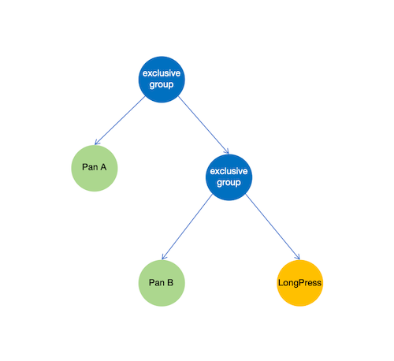
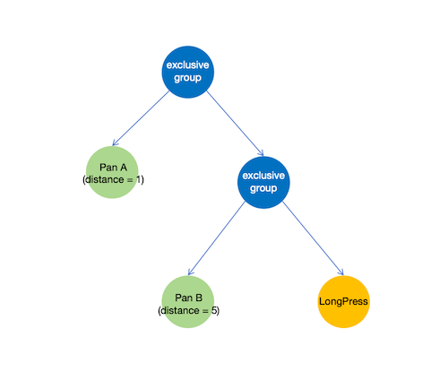
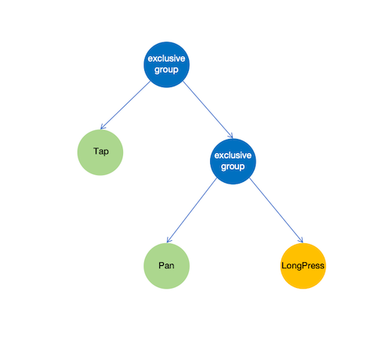

# 添加手势响应

当用户的操作符合某个手势的特征时，系统会将其识别为该手势，这一过程称为手势识别。为了响应某一个手势，需在组件上添加对应的手势对象，以便系统可以收集并进行处理。

## 基本手势类型及特点

| 手势                                                                                                                                                     | 操作特征                                                                                      | 触发方式举例                                                                                                                     |
| ------------------------------------------------------------------------------------------------------------------------------------------------------------ | ------------------------------------------------------------------------------------------------- | ------------------------------------------------------------------------------------------------------------------------------------ |
| [TapGesture](../reference/apis-arkui/arkui-ts/ts-basic-gestures-tapgesture.md)             | 点击（按下在较短时间内抬起，默认300ms）                                                           | 手指或触控笔点击触屏；按下鼠标左键并松开、单指点击触控板。                                                                           |
| [LongPressGesture](../reference/apis-arkui/arkui-ts/ts-basic-gestures-longpressgesture.md) | 长按（按下后维持一段时间）                                                                        | 手指或触控笔长按触屏、长按鼠标左键、单指长按触控板。                                                                                 |
| [PanGesture](../reference/apis-arkui/arkui-ts/ts-basic-gestures-pangesture.md)             | 滑动（按下后开始移动）                                                                            | 手指或触控笔点击触屏后移动、按下鼠标左键后移动、单指点击触控板后移动、鼠标指针指向可滑动组件后滚动鼠标滚轮、双指并拢在触控板上滑动。 |
| [PinchGesture](../reference/apis-arkui/arkui-ts/ts-basic-gestures-pinchgesture.md)         | 捏合（双指按下后向内捏合或向外扩大）                                                              | 双指在触屏上捏合、双指在触控板上捏合、鼠标指针指向可响应捏合手势的组件时，按下物理键盘ctrl键的同时，滚动鼠标滚轮。                   |
| [RotationGesture](../reference/apis-arkui/arkui-ts/ts-basic-gestures-rotationgesture.md)   | 旋转（双指按下后旋转双指）                                                                        | 双指在触屏上旋转。                                                                                                                   |
| [SwipeGesture](../reference/apis-arkui/arkui-ts/ts-basic-gestures-swipegesture.md)         | 快滑，与Pan的区别：swipe手势是以离手时的速度为判定条件；而pan是以位移距离为判定条件，跟手触发； | 单指在触屏上快速滑动、双指在触控板上快速滑动、快速滑动鼠标滚轮。                                                                     |

## 手势响应规则

基本规则：
- 基于从点下那一刻的位置所命中的控件上收集到的手势为基础。
- 同等条件的手势子组件优先于父组件得到响应。
- 不同条件的手势，先成功（条件达成）的先响应。
- 如果不存在并行手势，则当有一个手势成功时，其他手势在本次操作过程中都不会再有成功的机会。
- 并行的手势在子组件上的同类型手势成功时，父组件上的同类型手势也会成功。
- 组件内置手势（系统默认绑定）的响应优先级高于开发者绑定的同类型手势，除非开发者使用priority绑定方式。

以下通过几个场景来说明上述规则。

**场景1:**

Pan A与Pan B为相同阈值条件的滑动手势，Pan B为子组件上的，因此优先级高于父组件上的Pan A，Pan B优先响应成功；

**场景2:**

Pan A与 Pan B为不同阈值条件的滑动手势，Pan B为子组件上的，优先级高于父组件上的Pan A，但由于Pan A的阈值小，因此在相同的报点序列情况下，Pan A会优先判定成功；但要注意的是，如果移动速度特别快，那么同一个报点的间距可能都可以使Pan A和Pan B成功，那么这时候就会是Pan B竞争成功，因为是B先处理报点。

**场景3:**

以实际操作能够响应的手势为准；
比如，如果用户在未达成Pan手势的阈值范围内抬手，则Tap成功；

## 干预手势处理

系统对手势的识别仍然是以[触摸测试](./arkts-interaction-basic-principles.md#触摸测试)为前提，因此对于可用于干预基础事件处理的方式，都可以应用到对手势处理的干预上，除此之外还有以下方式可以使用：

| 方式               | 功能                                                             | 对应API                                                                                                                                        | 说明                                                                                                                                                                                                                                                                                                                                                                                                                                                                                                                                                                                                                                                                                                                                                                                                                                                                                                                                           |
| ------------------ | ---------------------------------------------------------------- | ---------------------------------------------------------------------------------------------------------------------------------------------- | ---------------------------------------------------------------------------------------------------------------------------------------------------------------------------------------------------------------------------------------------------------------------------------------------------------------------------------------------------------------------------------------------------------------------------------------------------------------------------------------------------------------------------------------------------------------------------------------------------------------------------------------------------------------------------------------------------------------------------------------------------------------------------------------------------------------------------------------------------------------------------------------------------------------------------------------------- |
| 自定义手势判定     | 在系统判定手势要成功时，给与应用对这个手势是否能成功的裁决机会   | [onGestureJudgeBegin](../reference/apis-arkui/arkui-ts/ts-gesture-customize-judge.md#ongesturejudgebegin)                                      | 所绑定的组件上某个手势将要被系统判定为成功时，系统会回调该方法，给与应用机会来自主决定，该手势能不能成功，如果应用通过该方法返回拒绝，那么系统将会判定该手势失败，进而可以留给其他手势成功的机会。                                                                                                                                                                                                                                                                                                                                                                                                                                                                                                                                                                                                                                                                                                                                             |
| 自定义手势判定增强 | 在系统判定手势要成功时，给与应用对这个手势是否能成功的裁决机会。 | [onGestureRecognizerJudgeBegin](../reference/apis-arkui/arkui-ts/ts-gesture-blocking-enhancement.md#ongesturerecognizerjudgebegin13)           | 1. 同onGestureJudgeBegin，都是当所绑定的组件上某个手势将要被系统判定为成功时触发。 2. 该回调的优先级高于onGestureJudgeBegin，当绑定该方法时，onGestureJudgeBegin的绑定会失效。                                                                                                                                                                                                                                                                                                                                                                                                                                                                                                                                                                                                                                                                                                                                                             |
| 手势并行动态控制   | 控制父子(祖先与子孙)组件之间的PAN手势的联动关系，实现嵌套滚动。  | [shouldBuiltInRecognizerParallelWith](../reference/apis-arkui/arkui-ts/ts-gesture-blocking-enhancement.md#shouldbuiltinrecognizerparallelwith) | 1. 当用户按下，系统开始收集当前位置下所有需要参与手势处理的手势对象时触发。 2. 回调触发时，会将当前组件上的内置系统手势（当前只支持pan手势），以及系统在当前组件之前所已经收集到的同类型的手势对象（Pan手势），这些手势是一个数组，这些手势一般来自于子组件，因此其得到响应的优先级是比当前组件上的同类型手势要高的。普通情况下，当前组件上的手势是竞争不过子组件的手势的。 3. 而这个回调方法，就是给与应用机会，让应用可以强制指定自己身上的这个低优先级的同类别手势（pan手势）与子组件上的高优先级的同类别手势进行并行，也就是子组件上的同类别高优先级手势成功的时候，自己的也能被成功，从而得到响应。 4. 返回的手势对象中提供了控制手势响应使能的接口，因此在手势产生了并行之后，应用就可以自主控制两个并行手势的响应行为，从而达成嵌套滚动的效果（一个先滑，滑到底再触发另一个继续滑）。 **说明：** 因此在使用时，要注意所绑定的组件是具有系统内置手势（如list，swiper），否则使用该方法并没有作用，也没有意义。 |

