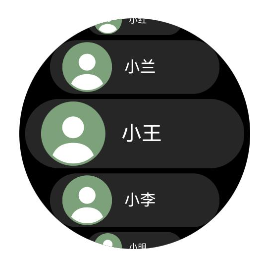
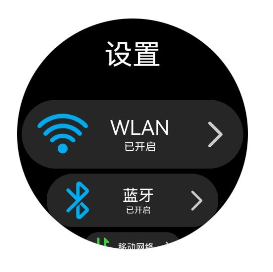
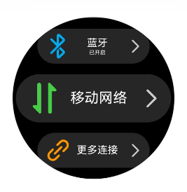
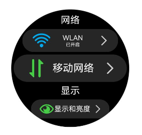
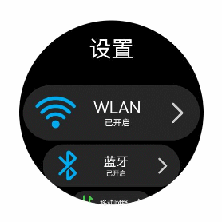
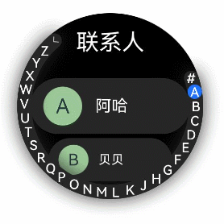
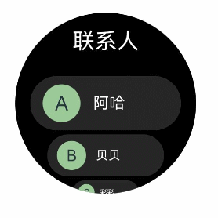

# 弧形列表 (ArcList)（圆形屏幕推荐使用）

弧形列表是一种专为穿戴设备圆形屏幕设计的特殊列表，它能够以结构化、可滚动的形式高效展示信息。具体用法可参考[ArcList](../reference/apis-arkui/arkui-ts/ts-container-arclist.md)。

使用弧形列表可以通过在[ArcList](../reference/apis-arkui/arkui-ts/ts-container-arclist.md)组件中按垂直方向线性排列子组件[ArcListItem](../reference/apis-arkui/arkui-ts/ts-container-arclistitem.md)，可以为弧形列表中的每一项提供独立视图。此外，可以使用[循环渲染](../quick-start/arkts-rendering-control-foreach.md)来迭代一组列表项，或结合任意数量的单个视图与[ForEach](../quick-start/arkts-rendering-control-foreach.md)结构，构建复杂的弧形列表。[ArcList](../reference/apis-arkui/arkui-ts/ts-container-arclist.md)组件支持多种[渲染控制](../quick-start/arkts-rendering-control-overview.md)方式，包括条件渲染、循环渲染和懒加载，以生成子组件。

## 创建弧形列表

[ArcList](../reference/apis-arkui/arkui-ts/ts-container-arclist.md)可通过调用以下接口来创建。

```ts
ArcList() {
  ArcListItem() {
    // ...
  }
  ArcListItem() {
    // ...
  }
  // ...
}
```

>**说明：**
>
>[ArcList](../reference/apis-arkui/arkui-ts/ts-container-arclist.md)的子组件必须是[ArcListItem](../reference/apis-arkui/arkui-ts/ts-container-arclistitem.md)，[ArcListItem](../reference/apis-arkui/arkui-ts/ts-container-arclistitem.md)必须配合[ArcList](../reference/apis-arkui/arkui-ts/ts-container-arclist.md)来使用。

## 在弧形列表中显示数据

弧形列表视图垂直展示项目集合，当列表项超出屏幕范围时，提供滚动功能，这使得它非常适合展示大型数据集合。在最简单的弧形列表形式中，[ArcList](../reference/apis-arkui/arkui-ts/ts-container-arclist.md)静态创建其列表项[ArcListItem](../reference/apis-arkui/arkui-ts/ts-container-arclistitem.md)的内容。

```ts
// xxx.ets
import { ArcList, ArcListItem, ArcListAttribute, ArcListItemAttribute, LengthMetrics } from "@kit.ArkUI";

@Entry
@Component
struct ArcListExample {
  build() {
    ArcList({ initialIndex: 2 }) {
      ArcListItem() {
        Row() {
          Image($r("app.media.wlan")).width("99px").height("99px")
            .borderRadius("50px").margin({ left: 7 })
          Column() {
            Text("WLAN").fontSize("38px").fontColor("#FFFFFFFF")
            Text("已开启").fontSize("20px").fontColor("#FFFFFFFF")
          }.width("190px")

          Image($r("app.media.ic_settings_arrow")).width("92px").height("92px")
            .borderRadius("50px")
        }
      }
      .borderRadius("65px")
      .width("414px")
      .height("129px")
      .backgroundColor("#26FFFFFF")

      ArcListItem() {
        Row() {
          Image($r("app.media.blueTooth")).width("99px").height("99px")
            .borderRadius("50px").margin({ left: 7 })
          Column() {
            Text("蓝牙").fontSize("38px").fontColor("#FFFFFFFF")
            Text("已开启").fontSize("20px").fontColor("#FFFFFFFF")
          }.width("190px")
          
          Image($r("app.media.ic_settings_arrow")).width("92px").height("92px")
            .borderRadius("50px")
        }
      }
      .borderRadius("65px")
      .width("414px")
      .height("129px")
      .backgroundColor("#26FFFFFF")

      ArcListItem() {
        Row() {
          Image($r("app.media.mobileData")).width("99px").height("99px")
            .borderRadius("50px").margin({ left: 7 })
          Column() {
            Text("移动网络").fontSize("38px").fontColor("#FFFFFFFF")
          }.width("190px")

          Image($r("app.media.ic_settings_arrow")).width("92px").height("92px")
            .borderRadius("50px")
        }
      }
      .borderRadius("65px")
      .width("414px")
      .height("129px")
      .backgroundColor("#26FFFFFF")

      ArcListItem() {
        Row() {
          Image($r("app.media.ic_settings_more_connections")).width("99px").height("99px")
            .borderRadius("50px").margin({ left: 7 })
          Column() {
            Text("更多连接").fontSize("38px").fontColor("#FFFFFFFF")
          }.width("190px")

          Image($r("app.media.ic_settings_arrow")).width("92px").height("92px")
            .borderRadius("50px")
        }
      }
      .borderRadius("65px")
      .width("414px")
      .height("129px")
      .backgroundColor("#26FFFFFF")

      ArcListItem() {
        Row() {
          Image($r("app.media.displayAndBrightness")).width("99px").height("99px")
            .borderRadius("50px").margin({ left: 7 })
          Column() {
            Text("显示和亮度").fontSize("38px").fontColor("#FFFFFFFF")
          }.width("190px")

          Image($r("app.media.ic_settings_arrow")).width("92px").height("92px")
            .borderRadius("50px")
        }
      }
      .borderRadius("65px")
      .width("414px")
      .height("129px")
      .backgroundColor("#26FFFFFF")
    }
    .width("466px")
    .height("466px")
    .space(LengthMetrics.px(10))
    .borderRadius("233px")
    .backgroundColor(Color.Black)
  }
}
```

  **图1** 显示弧形列表数据


## 迭代弧形列表内容

通常，应用会通过数据集合动态创建列表。采用[循环渲染](../quick-start/arkts-rendering-control-foreach.md)的方式，可以从数据源中迭代获取数据，在每次迭代过程中创建相应的组件，从而降低代码的复杂度。

ArkTS通过[ForEach](../quick-start/arkts-rendering-control-foreach.md)提供了组件的循环渲染能力。以简单的联系人列表为例，将联系人名称和头像数据以Contact类结构存储到contacts数组中，使用[ForEach](../quick-start/arkts-rendering-control-foreach.md)中嵌套的[ArcListItem](../reference/apis-arkui/arkui-ts/ts-container-arclistitem.md)来代替多个平铺的、内容相似的[ArcListItem](../reference/apis-arkui/arkui-ts/ts-container-arclistitem.md)，从而减少重复代码，使代码更加简洁高效。

```ts
// xxx.ets
import { ArcList, ArcListAttribute, ArcListItemAttribute, ArcListItem, LengthMetrics } from '@kit.ArkUI';
import { util } from '@kit.ArkTS';

class Contact {
  key: string = util.generateRandomUUID(true);
  name: string;
  icon: Resource;

  constructor(name: string, icon: Resource) {
    this.name = name;
    this.icon = icon;
  }
}

@Entry
@Component
struct SimpleContacts {
  private contacts: Array<object> = [
    new Contact('小红', $r("app.media.ic_contact")),
    new Contact('小兰', $r("app.media.ic_contact")),
    new Contact('小王', $r("app.media.ic_contact")),
    new Contact('小李', $r("app.media.ic_contact")),
    new Contact('小明', $r("app.media.ic_contact"))
  ]

  build() {
    ArcList({ initialIndex: 2 }) {
      ForEach(this.contacts, (item: Contact) => {
        ArcListItem() {
          Row() {
            Image(item.icon)
              .width(40)
              .height(40)
              .margin(10)
              .backgroundColor("#FF9CC998")
              .borderRadius(20)
            Text(item.name).fontSize("38px").fontColor("#FFFFFFFF")
          }
          .width('100%')
          .justifyContent(FlexAlign.Start)
        }
        .borderRadius("65px")
        .width("410px")
        .height('130px')
        .backgroundColor("#26FFFFFF")
      }, (item: Contact) => JSON.stringify(item))
    }
    .space(LengthMetrics.px(10))
    .width('466px')
    .height('466px')
    .borderRadius('233px')
    .backgroundColor(Color.Black)
  }
}
```

  **图2** 迭代弧形列表内容



## 自定义弧形列表样式

### 自定义弧形列表标题

可以通过[header](../reference/apis-arkui/arkui-ts/ts-container-arclist.md#arklistoptions)参数为弧形列表添加自定义标题。

1. 首先，需要构造自定义标题组件customHeader。

   ```ts
   @Builder
   function customHeader() {
     Column() {
       Text("设置")
         .fontColor("#FFFFFFFF")
         .fontSize('19fp')
     }
   }
   ```

2. 由于[header](../reference/apis-arkui/arkui-ts/ts-container-arclist.md#arklistoptions)参数的类型是[ComponentContent](../reference/apis-arkui/js-apis-arkui-ComponentContent.md)，所以需要对自定义标题组件进行封装。

   ```ts
   context: UIContext = this.getUIContext();
   arcListHeader: ComponentContent<Object> = new ComponentContent(this.context, wrapBuilder(customHeader));
   ```

3. 最后，通过[header](../reference/apis-arkui/arkui-ts/ts-container-arclist.md#arklistoptions)参数将arcListHeader设置到弧形列表中。

   ```ts
   ArcList({header: this.arcListHeader}) {
     ArcListItem() {
       // ...
     }
     ArcListItem() {
       // ...
     }
     // ...
   }
   ```

  **图3** 自定义弧形列表标题



### 设置弧形列表项间距

在初始化列表时，若需在列表项之间添加间距，可以通过[space](../reference/apis-arkui/arkui-ts/ts-container-arclist.md#space)属性实现。例如，为在每个列表项的垂直方向上增加30px的间距。

```ts
ArcList() {
  // ...
}
.space(LengthMetrics.px(30))
```

  **图4** 设置弧形列表项间距



### 列表项关闭自动缩放

在弧形列表中，列表项默认具有在接近上下两端时自动缩放的效果。然而，在某些情况下，可能不希望有这种缩放效果。此时，可以通过设置[ArcListItem](../reference/apis-arkui/arkui-ts/ts-container-arclistitem.md)的[autoScale](../reference/apis-arkui/arkui-ts/ts-container-arclistitem.md#autoscale)属性为false来禁用该效果。例如，如图5所示，“网络”和“显示”两个列表项，在关闭了自动缩放属性后，无论它们所处的位置如何，都不会出现缩放效果。

```ts
ArcListItem() {
  // ...
}
.autoScale(false)
```

  **图5** 列表项关闭自动缩放



### 添加内置滚动条

当列表项的高度超过屏幕高度时，弧形列表能够沿垂直方向滚动。若用户需要快速定位，可拖动滚动条以迅速滑动列表，如图6所示。

在使用[ArcList](../reference/apis-arkui/arkui-ts/ts-container-arclist.md)组件时，可以通过[scrollBar](../reference/apis-arkui/arkui-ts/ts-container-arclist.md#scrollbar)属性来控制弧形列表滚动条的显示。scrollBar的取值类型为[BarState](../reference/apis-arkui/arkui-ts/ts-appendix-enums.md#barstate)，当设置为BarState.Auto时，表示滚动条将按需显示。在这种模式下，当用户触摸到滚动条区域时，滚动条会显示出来，支持上下拖拽以快速浏览内容，且在拖拽过程中滚动条会变粗。若用户不进行任何操作，滚动条将在2秒后自动消失。此外，还可以通过[scrollBarWidth](../reference/apis-arkui/arkui-ts/ts-container-arclist.md#scrollbarwidth)属性来设置滚动条在按压状态下的宽度，以及通过[scrollBarColor](../reference/apis-arkui/arkui-ts/ts-container-arclist.md#scrollbarcolor)属性来设置滚动条的颜色。

```ts
ArcList() {
  // ...
}
.scrollBar(BarState.Auto)
.scrollBarWidth(LengthMetrics.px(10))
.scrollBarColor(ColorMetrics.resourceColor(Color.White))
```

  **图6** 弧形列表的内置滚动条 


### 添加外置滚动条ArcScrollBar

弧形列表[ArcList](../reference/apis-arkui/arkui-ts/ts-container-arclist.md)可与[ArcScrollBar](../reference/apis-arkui/arkui-ts/ts-basic-components-arcscrollbar.md)组件配合使用，为弧形列表添加外部滚动条。两者通过绑定同一个[Scroller](../reference/apis-arkui/arkui-ts/ts-container-scroll.md#scroller)滚动滚动控制器对象实现联动。

1. 首先，需要创建一个[Scroller](../reference/apis-arkui/arkui-ts/ts-container-scroll.md#scroller)类型的对象arcListScroller。

   ```ts
   private arcListScroller: Scroller = new Scroller();
   ```

2. 然后，弧形列表通过[scroller](../reference/apis-arkui/arkui-ts/ts-container-arclist.md#arklistoptions)参数绑定滚动控制器。

   ```ts
   // 将arcListScroller用于初始化ArcList组件的scroller参数，完成arcListScroller与弧形列表的绑定。
   ArcList({ scroller: this.arcListScroller }) {
   // ...
   }
   ```

3. 最后，弧形滚动条通过[scroller](../reference/apis-arkui/arkui-ts/ts-basic-components-arcscrollbar.md#arcscrollbaroptions)参数绑定滚动控制器。

   ```ts
   // 将arcListScroller用于初始化ArcScrollBar组件的scroller参数，完成arcListScroller与滚动条的绑定。
   ArcScrollBar({ scroller: this.arcListScroller })
   ```

  **图7** 弧形列表的外置滚动条 



>**说明：**
>
>弧形滚动条组件[ArcScrollBar](../reference/apis-arkui/arkui-ts/ts-basic-components-arcscrollbar.md)，还可配合其他可滚动组件使用，如[List](../reference/apis-arkui/arkui-ts/ts-container-list.md)、[Grid](../reference/apis-arkui/arkui-ts/ts-container-grid.md)、[Scroll](../reference/apis-arkui/arkui-ts/ts-container-scroll.md)。

## 与弧形索引条ArcAlphabetIndexer联动

许多应用需要监测列表的滚动位置变动并作出响应，或通过调整滚动位置实现列表的快速定位。例如，在联系人列表滚动时，当列表滚动至不同首字母开头的联系人，外部索引条应更新至相应的字母位置。当用户选择外部索引条上的索引项时，列表应跳转至对应位置。为此，需使用弧形索引条组件[ArcAlphabetIndexer](../reference/apis-arkui/arkui-ts/ts-container-arc-alphabet-indexer.md)。

如图8所示，当列表从联系人A滚动到联系人B时，外侧索引条也需要同步从选中A状态变成选中B状态，此场景可以通过监听[ArcList](../reference/apis-arkui/arkui-ts/ts-container-arclist.md)组件的[onScrollIndex](../reference/apis-arkui/arkui-ts/ts-container-arclist.md#onscrollindex)事件来实现；当点击索引项C时，列表也需要跳转到联系人C，此场景可以通过监听[ArcAlphabetIndexer](../reference/apis-arkui/arkui-ts/ts-container-arc-alphabet-indexer.md)的[onSelect](../reference/apis-arkui/arkui-ts/ts-container-arc-alphabet-indexer.md#onselect)事件来实现。

在列表滚动时，根据列表此时所在的索引值位置firstIndex，重新计算字母索引条对应字母的位置selectedIndex。由于[ArcAlphabetIndexer](../reference/apis-arkui/arkui-ts/ts-container-arc-alphabet-indexer.md)组件通过[selected](../reference/apis-arkui/arkui-ts/ts-container-arc-alphabet-indexer.md#selected)属性设置了选中项索引值，当selectedIndex变化时会触发[ArcAlphabetIndexer](../reference/apis-arkui/arkui-ts/ts-container-arc-alphabet-indexer.md)组件重新渲染，从而显示为选中对应字母的状态。

在选中索引项时，根据此时选中项的索引值index，重新计算列表联系人对应的位置，然后通过列表绑定的滚动控制器arcListScroller的[scrollToIndex](../reference/apis-arkui/arkui-ts/ts-container-scroll.md#scrolltoindex)方法控制列表跳转到对应的联系人位置。弧形列表[ArcList](../reference/apis-arkui/arkui-ts/ts-container-arclist.md)可通过[scroller](../reference/apis-arkui/arkui-ts/ts-container-arclist.md#arklistoptions)参数绑定[Scroller](../reference/apis-arkui/arkui-ts/ts-container-scroll.md#scroller)（滚动控制器）。

```ts
const alphabets = ['#', 'A', 'B', 'C', 'D', 'E', 'F', 'G', 'H', 'I', 'J', 'K',
  'L', 'M', 'N', 'O', 'P', 'Q', 'R', 'S', 'T', 'U', 'V', 'W', 'X', 'Y', 'Z'];
@Entry
@Component
struct ContactsArcList {
  // 索引条选中项索引
  @State selectedIndex: number = 0;
  // 列表绑定的滚动控制器
  private arcListScroller: Scroller = new Scroller();

  build() {
    Stack({ alignContent: Alignment.End }) {
      ArcList({ scroller: this.arcListScroller }) {
        // ...
      }
      .onScrollIndex((firstIndex: number) => {
        // 根据列表滚动到的索引值，重新计算对应索引条的位置this.selectedIndex
        this.selectedIndex = firstIndex + 1;
      })

      // 弧形索引条组件
      ArcAlphabetIndexer({ arrayValue: alphabets })
        .selected(this.selectedIndex)
        .onSelect((index: number) => {
          // 选中索引项后，列表跳转到相应位置
          this.selectedIndex = index
          this.scrollerForList.scrollToIndex(this.selectedIndex - 1)
        })
    }
  }
}
```

  **图8** 弧形列表与弧形索引条联动



## 响应列表项侧滑

[ArcListItem](../reference/apis-arkui/arkui-ts/ts-container-arclistitem.md)的[swipeAction](../reference/apis-arkui/arkui-ts/ts-container-arclistitem.md#swipeaction)属性可用于实现列表项的左右滑动功能。[swipeAction](../reference/apis-arkui/arkui-ts/ts-container-arclistitem.md#swipeaction)属性方法初始化时存在必填[SwipeActionOptions](../reference/apis-arkui/arkui-ts/ts-container-listitem.md#swipeactionoptions9对象说明)参数start和end。其中，start表示设置列表项右滑时起始端滑出的组件，end表示设置列表项左滑时尾端滑出的组件。

在联系人列表中，end参数表示设置[ArcListItem](../reference/apis-arkui/arkui-ts/ts-container-arclistitem.md)左滑时尾端划出自定义组件，即删除按钮。在初始化end方法时，将滑动列表项的索引传入删除按钮组件，当用户点击删除按钮时，可以根据数据索引来删除列表项对应的数据，从而实现侧滑删除功能。

1. 首先，实现尾端滑出组件的构建。
   ```ts
   @Builder 
   itemEnd(item: Contact) {
     // 构建尾端滑出组件
     Button({ type: ButtonType.Circle }) {
       Image($r('app.media.ic_public_delete_filled'))
         .width(20)
         .height(20)
     }
     .backgroundColor(Color.Black)
     .onClick(() => {
       animateTo({
         duration: 1000,
         curve: Curve.Smooth,
         iterations: 1,
         playMode: PlayMode.Normal,
       }, () => {
         // this.contacts为列表数据源，可根据实际场景构造，indexOf方法可获取将被删除数据在数据源中的索引
         let index = this.contacts.indexOf(item)
         // 从数据源删除指定数据项
         this.contacts.splice(index, 1)
       })
     })
   }
   ```

2. 然后，绑定[swipeAction](../reference/apis-arkui/arkui-ts/ts-container-arclistitem.md#swipeaction)属性到可左滑的ArcListItem上。

   ```ts
   // 构建ArcList时，通过ForEach基于数据源this.contacts循环渲染ArcListItem
   ArcListItem() {
     // ...
   }
   .swipeAction({
     end: {
       // item为该列表项在数据源this.contacts中对应的数据
       builder: () => { this.itemEnd(item) }
     }
   }) // 设置侧滑属性
   ```

  **图9** 侧滑删除列表项



## 处理长列表

[循环渲染](../quick-start/arkts-rendering-control-foreach.md)适用于短列表，当构建具有大量列表项的长列表时，如果直接采用循环渲染方式，会一次性加载所有的列表元素，会导致页面启动时间过长，影响用户体验。因此，推荐使用[数据懒加载](../quick-start/arkts-rendering-control-lazyforeach.md)（LazyForEach）方式实现按需迭代加载数据，从而提升列表性能。关于长列表按需加载优化的具体实现可参考[数据懒加载](../quick-start/arkts-rendering-control-lazyforeach.md)章节中的示例。

当使用懒加载方式渲染列表时，为了减少列表滑动时出现白块，[ArcList](../reference/apis-arkui/arkui-ts/ts-container-arclist.md)组件提供了[cachedCount](../reference/apis-arkui/arkui-ts/ts-container-arclist.md#cachedcount)属性，该属性用于设置列表项缓存数，只在懒加载[LazyForEach](../quick-start/arkts-rendering-control-lazyforeach.md)中生效。

```ts
ArcList() {
  // ...
}.cachedCount(3)
```

>**说明：**
>
>- cachedCount的增加会增大UI的CPU、内存开销。使用时需要根据实际情况，综合性能和用户体验进行调整。
>
>- 列表使用数据懒加载时，除了显示区域的列表项和前后缓存的列表项，其他列表项会被销毁。

## 响应旋转表冠

手表设备上弧形列表在获焦的情况下可对旋转表冠做出响应，用户可通过旋转表冠的操作滑动列表，浏览列表项数据。弧形列表可通过下列[焦点控制](../reference/apis-arkui/arkui-ts/ts-universal-attributes-focus.md)相关属性成为所在页面的默认焦点。

```ts
ArcList() {
  // ...
}
// 设置弧形列表支持获焦
.focusable(true)
// 设置弧形列表支持点击获焦
.focusOnTouch(true)
// 设置弧形列表为所在页面上的默认焦点
.defaultFocus(true)
```

还可以通过[digitalCrownSensitivity](../reference/apis-arkui/arkui-ts/ts-container-arclist.md#digitalcrownsensitivity)属性设置表冠响应事件的灵敏度，以应对不同量级的列表项数据。列表项数据较多时可以设置更高的响应事件灵敏度，数据较少时可以设置较低的响应事件灵敏度。

```ts
ArcList() {
  // ...
}
.digitalCrownSensitivity(CrownSensitivity.MEDIUM)
```