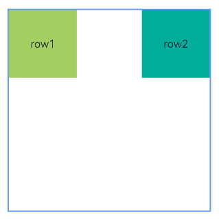

# 相对布局（RelativeContainer）


## 概述

[RelativeContainer](../reference/arkui-ts/ts-container-relativecontainer.md)为采用相对布局的容器，支持容器内部的子元素设置相对位置关系。子元素支持指定兄弟元素作为锚点，也支持指定父容器作为锚点，基于锚点做相对位置布局。下图是一个RelativeContainer的概念图，图中的虚线表示位置的依赖关系。


  **图1** 相对布局示意图  


子元素并不完全是上图中的依赖关系。比如，Item4可以以Item2为依赖锚点，也可以以RelativeContainer父容器为依赖锚点。


## 基本概念

- 锚点：通过锚点设置当前元素基于哪个元素确定位置。

- 对齐方式：通过对齐方式，设置当前元素是基于锚点的上中下对齐，还是基于锚点的左中右对齐。


## 设置依赖关系


### 锚点设置

锚点设置是指设置子元素相对于父元素或兄弟元素的位置依赖关系。在水平方向上，可以设置left、middle、right的锚点。在竖直方向上，可以设置top、center、bottom的锚点。为了明确定义锚点，必须为RelativeContainer及其子元素设置ID，用于指定锚点信息。ID默认为“__container__”，其余子元素的ID通过id属性设置。未设置ID的子元素在RelativeContainer中不会显示。

>**说明：**
>
>在使用锚点时要注意子元素的相对位置关系，避免出现错位或遮挡的情况。

- RelativeContainer父组件为锚点，__container__代表父容器的ID。

  ```ts
  let AlignRus:Record<string,Record<string,string|VerticalAlign|HorizontalAlign>> = {
    'top': { 'anchor': '__container__', 'align': VerticalAlign.Top },
    'left': { 'anchor': '__container__', 'align': HorizontalAlign.Start }
  }
  let AlignRue:Record<string,Record<string,string|VerticalAlign|HorizontalAlign>> = {
    'top': { 'anchor': '__container__', 'align': VerticalAlign.Top },
    'right': { 'anchor': '__container__', 'align': HorizontalAlign.End }
  }
  let Mleft:Record<string,number> = { 'left': 20 }
  let BWC:Record<string,number|string> = { 'width': 2, 'color': '#6699FF' }
  RelativeContainer() {
    Row().width(100).height(100)
      .backgroundColor("#FF3333")
      .alignRules(AlignRus)
      .id("row1")

    Row().width(100).height(100)
      .backgroundColor("#FFCC00")
      .alignRules(AlignRue)
      .id("row2")
  }.width(300).height(300)
  .margin(Mleft)
  .border(BWC)
  ```

  

- 以兄弟元素为锚点。

  ```ts
  let AlignRus:Record<string,Record<string,string|VerticalAlign|HorizontalAlign>> = {
    'top': { 'anchor': '__container__', 'align': VerticalAlign.Top },
    'left': { 'anchor': '__container__', 'align': HorizontalAlign.Start }
  }
  let RelConB:Record<string,Record<string,string|VerticalAlign|HorizontalAlign>> = {
    'top': { 'anchor': 'row1', 'align': VerticalAlign.Bottom },
    'left' : { 'anchor': 'row1', 'align': HorizontalAlign.Start }
  }
  let Mleft:Record<string,number> = { 'left': 20 }
  let BWC:Record<string,number|string> = { 'width': 2, 'color': '#6699FF' }
  RelativeContainer() {
    Row().width(100).height(100)
      .backgroundColor("#FF3333")
      .alignRules(AlignRus)
      .id("row1")

    Row().width(100).height(100)
      .backgroundColor("#FFCC00")
      .alignRules(RelConB)
      .id("row2")
  }.width(300).height(300)
  .margin(Mleft)
  .border(BWC)
  ```

  


### 设置相对于锚点的对齐位置

设置了锚点之后，可以通过align设置相对于锚点的对齐位置。

在水平方向上，对齐位置可以设置为HorizontalAlign.Start、HorizontalAlign.Center、HorizontalAlign.End。


在竖直方向上，对齐位置可以设置为VerticalAlign.Top、VerticalAlign.Center、VerticalAlign.Bottom。


## 场景实例

相对布局内的子元素相对灵活，只要在RelativeContainer容器内，均可以通过alignRules进行相应的位置移动。


```ts
@Entry
@Component
struct Index {
  build() {
    Row() {
      RelativeContainer() {
        Row()
          .width(100)
          .height(100)
          .backgroundColor('#FF3333')
          .alignRules({
            top: { anchor: '__container__', align: VerticalAlign.Top },  //以父容器为锚点，竖直方向顶头对齐
            middle: { anchor: '__container__', align: HorizontalAlign.Center }  //以父容器为锚点，水平方向居中对齐
          })
          .id('row1')  //设置锚点为row1

        Row() {
          Image($r('app.media.icon'))
        }
        .height(100).width(100)
        .alignRules({
          top: { anchor: 'row1', align: VerticalAlign.Bottom },  //以row1组件为锚点，竖直方向低端对齐
          left: { anchor: 'row1', align: HorizontalAlign.Start }  //以row1组件为锚点，水平方向开头对齐
        })
        .id('row2')  //设置锚点为row2

        Row()
          .width(100)
          .height(100)
          .backgroundColor('#FFCC00')
          .alignRules({
            top: { anchor: 'row2', align: VerticalAlign.Top }
          })
          .id('row3')  //设置锚点为row3

        Row()
          .width(100)
          .height(100)
          .backgroundColor('#FF9966')
          .alignRules({
            top: { anchor: 'row2', align: VerticalAlign.Top },
            left: { anchor: 'row2', align: HorizontalAlign.End },
          })
          .id('row4')  //设置锚点为row4

        Row()
          .width(100)
          .height(100)
          .backgroundColor('#FF66FF')
          .alignRules({
            top: { anchor: 'row2', align: VerticalAlign.Bottom },
            middle: { anchor: 'row2', align: HorizontalAlign.Center }
          })
          .id('row5')  //设置锚点为row5
      }
      .width(300).height(300)
      .border({ width: 2, color: '#6699FF' })
    }
    .height('100%').margin({ left: 30 })
  }
}
```


