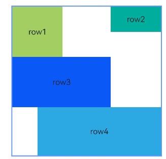
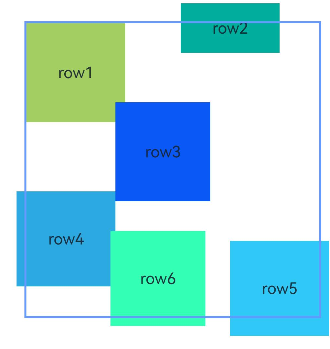

# 相对布局 (RelativeContainer)


## 概述

在应用的开发过程中，经常需要设计复杂界面，此时涉及到多个相同或不同组件之间的嵌套。如果布局组件嵌套深度过深，或者嵌套组件数过多，会带来额外的开销。如果在布局的方式上进行优化，就可以有效的提升性能，减少时间开销。<!--Del-->请参考[优化布局时间](../performance/reduce-view-nesting-levels.md)了解RelativeContainer相对于List，在布局时间上的性能提升。<!--DelEnd-->

RelativeContainer为采用相对布局的容器，支持容器内部的子元素设置相对位置关系，适用于界面复杂场景的情况，对多个子组件进行对齐和排列。子元素支持指定兄弟元素作为锚点，也支持指定父容器作为锚点，基于锚点做相对位置布局。下图是一个RelativeContainer的概念图，图中的虚线表示位置的依赖关系。


  **图1** 相对布局示意图  


子元素并不完全是上图中的依赖关系。比如，Item4可以以Item2为依赖锚点，也可以以RelativeContainer父容器为依赖锚点。


## 基本概念

- 锚点：通过锚点设置当前元素基于哪个元素确定位置。

- 对齐方式：通过对齐方式，设置当前元素是基于锚点的上中下对齐，还是基于锚点的左中右对齐。


## 设置依赖关系


### 锚点设置

锚点设置是指设置子元素相对于父元素或兄弟元素的位置依赖关系。在水平方向上，可以设置left、middle、right的锚点。在竖直方向上，可以设置top、center、bottom的锚点。
为了明确定义锚点，必须为RelativeContainer及其子元素设置ID，用于指定锚点信息。ID默认为“__container__”，其余子元素的ID通过id属性设置。未设置ID的子元素在RelativeContainer中不会显示。互相依赖，环形依赖时容器内子组件全部不绘制。同方向上两个以上位置设置锚点，但锚点位置逆序时此子组件大小为0，即不绘制。

>**说明：**
>
>在使用锚点时要注意子元素的相对位置关系，避免出现错位或遮挡的情况。

- RelativeContainer父组件为锚点，__container__代表父容器的ID。

  ```ts
  let AlignRus:Record<string,Record<string,string|VerticalAlign|HorizontalAlign>> = {
    'top': { 'anchor': '__container__', 'align': VerticalAlign.Top },
    'left': { 'anchor': '__container__', 'align': HorizontalAlign.Start }
  }
  let AlignRue:Record<string,Record<string,string|VerticalAlign|HorizontalAlign>> = {
    'top': { 'anchor': '__container__', 'align': VerticalAlign.Top },
    'right': { 'anchor': '__container__', 'align': HorizontalAlign.End }
  }
  let Mleft:Record<string,number> = { 'left': 20 }
  let BWC:Record<string,number|string> = { 'width': 2, 'color': '#6699FF' }
  RelativeContainer() {
    Row().width(100).height(100)
      .backgroundColor("#FF3333")
      .alignRules(AlignRus)
      .id("row1")

    Row().width(100).height(100)
      .backgroundColor("#FFCC00")
      .alignRules(AlignRue)
      .id("row2")
  }.width(300).height(300)
  .margin(Mleft)
  .border(BWC)
  ```

  

- 以兄弟元素为锚点。

  ```ts
  let AlignRus:Record<string,Record<string,string|VerticalAlign|HorizontalAlign>> = {
    'top': { 'anchor': '__container__', 'align': VerticalAlign.Top },
    'left': { 'anchor': '__container__', 'align': HorizontalAlign.Start }
  }
  let RelConB:Record<string,Record<string,string|VerticalAlign|HorizontalAlign>> = {
    'top': { 'anchor': 'row1', 'align': VerticalAlign.Bottom },
    'left' : { 'anchor': 'row1', 'align': HorizontalAlign.Start }
  }
  let Mleft:Record<string,number> = { 'left': 20 }
  let BWC:Record<string,number|string> = { 'width': 2, 'color': '#6699FF' }
  RelativeContainer() {
    Row().width(100).height(100)
      .backgroundColor("#FF3333")
      .alignRules(AlignRus)
      .id("row1")

    Row().width(100).height(100)
      .backgroundColor("#FFCC00")
      .alignRules(RelConB)
      .id("row2")
  }.width(300).height(300)
  .margin(Mleft)
  .border(BWC)
  ```

  

- 子组件锚点可以任意选择，但需注意不要相互依赖。

  ```ts

  @Entry
  @Component
  struct Index {
    build() {
      Row() {

        RelativeContainer() {
          Row().width(100).height(100)
            .backgroundColor('#ff3339ff')
            .alignRules({
              top: {anchor: "__container__", align: VerticalAlign.Top},
              left: {anchor: "__container__", align: HorizontalAlign.Start}
            })
            .id("row1")

          Row().width(100)
            .backgroundColor('#ff298e1e')
            .alignRules({
              top: {anchor: "__container__", align: VerticalAlign.Top},
              right: {anchor: "__container__", align: HorizontalAlign.End},
              bottom: {anchor: "row1", align: VerticalAlign.Center},
            })
            .id("row2")

          Row().height(100)
            .backgroundColor('#ffff6a33')
            .alignRules({
              top: {anchor: "row1", align: VerticalAlign.Bottom},
              left: {anchor: "row1", align: HorizontalAlign.Start},
              right: {anchor: "row2", align: HorizontalAlign.Start}
            })
            .id("row3")

          Row()
            .backgroundColor('#ffff33fd')
            .alignRules({
              top: {anchor: "row3", align: VerticalAlign.Bottom},
              left: {anchor: "row1", align: HorizontalAlign.Center},
              right: {anchor: "row2", align: HorizontalAlign.End},
              bottom: {anchor: "__container__", align: VerticalAlign.Bottom}
            })
            .id("row4")

        }
        .width(300).height(300)
        .margin({left: 50})
        .border({width:2, color: "#6699FF"})
      }
      .height('100%')
    }
  }

  ```
  

### 设置相对于锚点的对齐位置

设置了锚点之后，可以通过align设置相对于锚点的对齐位置。

在水平方向上，对齐位置可以设置为HorizontalAlign.Start、HorizontalAlign.Center、HorizontalAlign.End。


在竖直方向上，对齐位置可以设置为VerticalAlign.Top、VerticalAlign.Center、VerticalAlign.Bottom。


### 子组件位置偏移

子组件经过相对位置对齐后，位置可能还不是目标位置，开发者可根据需要进行额外偏移设置offset。

  ```ts

  @Entry
  @Component
  struct Index {
    build() {
      Row() {

        RelativeContainer() {
          Row().width(100).height(100)
            .backgroundColor("#FF3333")
            .alignRules({
              top: {anchor: "__container__", align: VerticalAlign.Top},
              left: {anchor: "__container__", align: HorizontalAlign.Start}
            })
            .id("row1")

          Row().width(100)
            .backgroundColor("#FFCC00")
            .alignRules({
              top: {anchor: "__container__", align: VerticalAlign.Top},
              right: {anchor: "__container__", align: HorizontalAlign.End},
              bottom: {anchor: "row1", align: VerticalAlign.Center},
            })
            .offset({
              x:-40,
              y:-20
            })
            .id("row2")

          Row().height(100)
            .backgroundColor("#FF6633")
            .alignRules({
              top: {anchor: "row1", align: VerticalAlign.Bottom},
              left: {anchor: "row1", align: HorizontalAlign.End},
              right: {anchor: "row2", align: HorizontalAlign.Start}
            })
            .offset({
              x:-10,
              y:-20
            })
            .id("row3")

          Row()
            .backgroundColor("#FF9966")
            .alignRules({
              top: {anchor: "row3", align: VerticalAlign.Bottom},
              bottom: {anchor: "__container__", align: VerticalAlign.Bottom},
              left: {anchor: "__container__", align: HorizontalAlign.Start},
              right: {anchor: "row1", align: HorizontalAlign.End}
            })
            .offset({
              x:-10,
              y:-30
            })
            .id("row4")

          Row()
            .backgroundColor("#FF66FF")
            .alignRules({
              top: {anchor: "row3", align: VerticalAlign.Bottom},
              bottom: {anchor: "__container__", align: VerticalAlign.Bottom},
              left: {anchor: "row2", align: HorizontalAlign.Start},
              right: {anchor: "row2", align: HorizontalAlign.End}
            })
            .offset({
              x:10,
              y:20
            })
            .id("row5")

          Row()
            .backgroundColor('#ff33ffb5')
            .alignRules({
              top: {anchor: "row3", align: VerticalAlign.Bottom},
              bottom: {anchor: "row4", align: VerticalAlign.Bottom},
              left: {anchor: "row3", align: HorizontalAlign.Start},
              right: {anchor: "row3", align: HorizontalAlign.End}
            })
            .offset({
              x:-15,
              y:10
            })
            .backgroundImagePosition(Alignment.Bottom)
            .backgroundImageSize(ImageSize.Cover)
            .id("row6")
        }
        .width(300).height(300)
        .margin({left: 50})
        .border({width:2, color: "#6699FF"})
      }
      .height('100%')
    }
  }

  ```
  

## 多种组件的对齐布局

Row、Column、Flex、Stack等多种布局组件，可按照RelativeContainer组件规则进行对其排布。

  ```ts

  @Entry
  @Component
  struct Index {
    @State value: number = 0
    build() {
      Row() {

        RelativeContainer() {
          Row().width(100).height(100)
            .backgroundColor('#ff33ffcc')
            .alignRules({
              top: {anchor: "__container__", align: VerticalAlign.Top},
              left: {anchor: "__container__", align: HorizontalAlign.Start}
            })
            .id("row1")

          Column().width('50%').height(30).backgroundColor(0xAFEEEE)
            .alignRules({
              top: {anchor: "__container__", align: VerticalAlign.Top},
              left: {anchor: "__container__", align: HorizontalAlign.Center}
            }).id("row2")

          Flex({ direction: FlexDirection.Row }) {
            Text('1').width('20%').height(50).backgroundColor(0xF5DEB3)
            Text('2').width('20%').height(50).backgroundColor(0xD2B48C)
            Text('3').width('20%').height(50).backgroundColor(0xF5DEB3)
            Text('4').width('20%').height(50).backgroundColor(0xD2B48C)
          }
          .padding(10)
          .backgroundColor('#ffedafaf')
          .alignRules({
            top: {anchor: "row2", align: VerticalAlign.Bottom},
            left: {anchor: "__container__", align: HorizontalAlign.Start},
            bottom: {anchor: "__container__", align: VerticalAlign.Center},
            right: {anchor: "row2", align: HorizontalAlign.Center}
          })
          .id("row3")

          Stack({ alignContent: Alignment.Bottom }) {
            Text('First child, show in bottom').width('90%').height('100%').backgroundColor(0xd2cab3).align(Alignment.Top)
            Text('Second child, show in top').width('70%').height('60%').backgroundColor(0xc1cbac).align(Alignment.Top)
          }
          .margin({ top: 5 })
          .alignRules({
            top: {anchor: "row3", align: VerticalAlign.Bottom},
            left: {anchor: "__container__", align: HorizontalAlign.Start},
            bottom: {anchor: "__container__", align: VerticalAlign.Bottom},
            right: {anchor: "row3", align: HorizontalAlign.End}
          })
          .id("row4")

        }
        .width(300).height(300)
        .margin({left: 50})
        .border({width:2, color: "#6699FF"})
      }
      .height('100%')
    }
  }

  ```
  

## 组件尺寸

子组件尺寸大小不会受到相对布局规则的影响。若子组件某个方向上设置两个或以上alignRules时最好不设置此方向尺寸大小，否则对齐规则确定的组件尺寸与开发者设置的尺寸可能产生冲突。

  ```ts

  @Entry
  @Component
  struct Index {
    build() {
      Row() {

        RelativeContainer() {
          Row().width(100).height(100)
            .backgroundColor("#FF3333")
            .alignRules({
              top: {anchor: "__container__", align: VerticalAlign.Top},
              left: {anchor: "__container__", align: HorizontalAlign.Start}
            })
            .id("row1")

          Row().width(100)
            .backgroundColor("#FFCC00")
            .alignRules({
              top: {anchor: "__container__", align: VerticalAlign.Top},
              right: {anchor: "__container__", align: HorizontalAlign.End},
              bottom: {anchor: "row1", align: VerticalAlign.Center},
            })
            .id("row2")

          Row().height(100)
            .backgroundColor("#FF6633")
            .alignRules({
              top: {anchor: "row1", align: VerticalAlign.Bottom},
              left: {anchor: "row1", align: HorizontalAlign.End},
              right: {anchor: "row2", align: HorizontalAlign.Start}
            })
            .id("row3")

          Row()
            .backgroundColor("#FF9966")
            .alignRules({
              top: {anchor: "row3", align: VerticalAlign.Bottom},
              bottom: {anchor: "__container__", align: VerticalAlign.Bottom},
              left: {anchor: "__container__", align: HorizontalAlign.Start},
              right: {anchor: "row1", align: HorizontalAlign.End}
            })
            .id("row4")

          Row()
            .backgroundColor("#FF66FF")
            .alignRules({
              top: {anchor: "row3", align: VerticalAlign.Bottom},
              bottom: {anchor: "__container__", align: VerticalAlign.Bottom},
              left: {anchor: "row2", align: HorizontalAlign.Start},
              right: {anchor: "row2", align: HorizontalAlign.End}
            })
            .id("row5")

          Row()
            .backgroundColor('#ff33ffb5')
            .alignRules({
              top: {anchor: "row3", align: VerticalAlign.Bottom},
              bottom: {anchor: "row4", align: VerticalAlign.Bottom},
              left: {anchor: "row3", align: HorizontalAlign.Start},
              right: {anchor: "row3", align: HorizontalAlign.End}
            })
            .id("row6")
            .backgroundImagePosition(Alignment.Bottom)
            .backgroundImageSize(ImageSize.Cover)
        }
        .width(300).height(300)
        .margin({left: 50})
        .border({width:2, color: "#6699FF"})
      }
      .height('100%')
    }
  }

  ```
  
