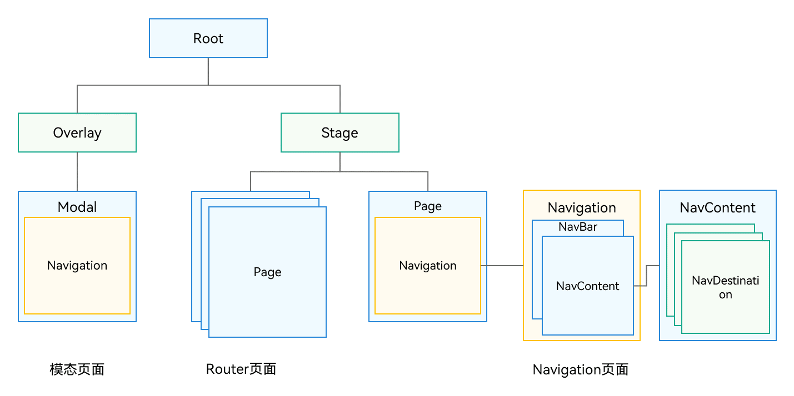

# 组件导航和页面路由概述

页面是指由布局、组件、交互逻辑等构成的可视化交互单元，承载着特定功能逻辑与信息展示，是用户与应用进行操作交互的核心界面载体。一个完整的应用往往由多个页面组成，组件导航（Navigation）和页面路由（@ohos.router）均提供了应用内的页面跳转能力。

- 在组件导航（Navigation）框架下，“页面”通过NavDestination组件承载，特指一个NavDestination组件包含的内容。
- 在页面路由（@ohos.router）框架下，“页面”特指@Entry装饰的自定义组件。

相较而言，组件导航（Navigation）将页面放在Navigation组件内部进行跳转，具备更强的一次开发多端部署能力，可以进行更加灵活的页面栈操作，同时支持更丰富的动效和生命周期。因此，推荐使用组件导航（Navigation）来实现页面跳转以及组件内的跳转，以获得更佳的使用体验。

## 架构差异

从ArkUI组件树层级上来看，原先由Router管理的page在页面栈管理节点stage的下面。Navigation作为导航容器组件，可以挂载在单个page节点下，也可以叠加、嵌套。Navigation管理了标题栏、内容区和工具栏，内容区用于显示用户自定义页面的内容，并支持页面的路由能力。Navigation的这种设计上有如下优势：

1. 接口上显式区分标题栏、内容区和工具栏，实现更加灵活的管理和UX动效能力；

2. 显式提供路由容器概念，由开发者决定路由容器的位置，支持在全模态、半模态、弹窗中显示；

3. 整合UX设计和一次开发多端部署能力，默认提供统一的标题显示、页面切换和单双栏适配能力；

4. 基于通用[UIBuilder](../ui/state-management/arkts-builder.md)能力，由开发者决定页面别名和页面UI对应关系，提供更加灵活的页面配置能力；

5. 基于组件属性动效和共享元素动效能力，将页面切换动效转换为组件属性动效实现，提供更加丰富和灵活的切换动效；

6. 开放了页面栈对象，开发者可以继承，能更好的管理页面显示。

## 能力对比

| 业务场景                                      | Navigation                            | Router                                 |
| --------------------------------------------- | ------------------------------------- | -------------------------------------- |
| 一次开发多端部署能力                                      | 支持，Auto模式自适应单栏跟双栏显示    | 不支持                                 |
| 跳转指定页面                                  | pushPath & pushDestination            | pushUrl & pushNameRoute                |
| 跳转HSP中页面                                 | 支持                                  | 支持                                   |
| 跳转HAR中页面                                 | 支持                                  | 支持                                   |
| 跳转传参                                      | 支持                                  | 支持                                   |
| 获取指定页面参数                              | 支持                                  | 不支持                                 |
| 传参类型                                      | 传参为对象形式                        | 传参为对象形式，对象中暂不支持方法变量 |
| 跳转结果回调                                  | 支持                                  | 支持                                   |
| 跳转单例页面                                  | 支持                                  | 支持                                   |
| 页面返回                                      | 支持                                  | 支持                                   |
| 页面返回传参                                  | 支持                                  | 支持                                   |
| 返回指定路由                                  | 支持                                  | 支持                                   |
| 页面返回弹窗                                  | 支持，通过路由拦截实现                | showAlertBeforeBackPage                |
| 路由替换                                      | replacePath & replacePathByName       | replaceUrl & replaceNameRoute          |
| 路由栈清理                                    | clear                                 | clear                                  |
| 清理指定路由                                  | removeByIndexes & removeByName        | 不支持                                 |
| 转场动画                                      | 支持                                  | 支持                                   |
| 自定义转场动画                                | 支持                                  | 支持，动画类型受限                     |
| 屏蔽转场动画                                  | 支持全局和单次                        | 支持，设置pageTransition方法duration为0 |
| geometryTransition共享元素动画                | 支持（NavDestination之间共享）        | 不支持                                 |
| 页面生命周期监听                              | UIObserver.on('navDestinationUpdate') | UIObserver.on('routerPageUpdate')      |
| 获取页面栈对象                                | 支持                                  | 不支持                                 |
| 路由拦截                                      | 支持通过setInterception做路由拦截       | 不支持                                 |
| 路由栈信息查询                                | 支持                                  | getState() & getLength()               |
| 路由栈move操作                                | moveToTop & moveIndexToTop            | 不支持                                 |
| 沉浸式页面                                    | 支持                                  | 不支持，需通过window配置               |
| 设置页面标题栏（titlebar）和工具栏（toolbar） | 支持                                  | 不支持                                 |
| 模态嵌套路由                                  | 支持                                  | 不支持                                 |