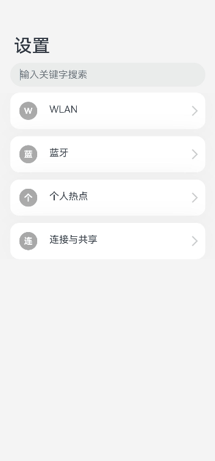

# 导航转场


导航转场是页面的路由转场方式，也就是一个界面消失，另外一个界面出现的动画效果。导航转场的动画效果开发者也可以自定义。


导航转场推荐使用[Navigation](../reference/apis-arkui/arkui-ts/ts-basic-components-navigation.md)组件实现，可搭配[NavDestination](../reference/apis-arkui/arkui-ts/ts-basic-components-navdestination.md)组件实现导航功能。


完整的代码示例和效果如下。


```ts
@Component
export struct MyCommonPage {
  @Consume('pathInfos') pathInfos: NavPathStack;
  name: String = '';
  @State value: String = '';

  build() {
    NavDestination() {
      Column() {
        Text(`${this.name}设置页面`)
          .width('100%')
          .fontSize(20)
          .fontColor(0x333333)
          .textAlign(TextAlign.Center)
          .textShadow({ radius: 2, offsetX: 4, offsetY: 4, color: 0x909399 })
          .padding({ top: 30 })
        Text(`${JSON.stringify(this.value)}`)
          .width('100%')
          .fontSize(18)
          .fontColor(0x666666)
          .textAlign(TextAlign.Center)
          .padding({ top: 45 })
        Button('返回')
          .width('50%')
          .height(40)
          .margin({ top: 50 })
          .onClick(() => {
            this.pathInfos.pop();
          })
      }
      .size({ width: '100%', height: '100%' })
    }.title(`${this.name}`)
  }
}

@Component
export struct MySharePage {
  @Consume('pathInfos') pathInfos: NavPathStack;
  name: String = '';
  private listArray: Array<string> = ['投屏', '打印', 'VPN', '私人DNS', 'NFC'];

  build() {
    NavDestination() {
      Column() {
        List({ space: 12, initialIndex: 0 }) {
          ForEach(this.listArray, (item: string) => {
            ListItem() {
              Row() {
                Row() {
                  Text(`${item.slice(0, 1)}`)
                    .fontColor(Color.White)
                    .fontSize(14)
                    .fontWeight(FontWeight.Bold)
                }
                .width(30)
                .height(30)
                .backgroundColor('#a8a8a8')
                .margin({ right: 20 })
                .borderRadius(20)
                .justifyContent(FlexAlign.Center)

                Column() {
                  Text(item)
                    .fontSize(16)
                    .margin({ bottom: 5 })
                }
                .alignItems(HorizontalAlign.Start)

                Blank()

                Row()
                  .width(12)
                  .height(12)
                  .margin({ right: 15 })
                  .border({
                    width: { top: 2, right: 2 },
                    color: 0xcccccc
                  })
                  .rotate({ angle: 45 })
              }
              .borderRadius(15)
              .shadow({ radius: 100, color: '#ededed' })
              .width('90%')
              .alignItems(VerticalAlign.Center)
              .padding({ left: 15, top: 15, bottom: 15 })
              .backgroundColor(Color.White)
            }
            .width('100%')
            .onClick(() => {
              this.pathInfos.pushPathByName(`${item}`, '页面设置参数')
            })
          }, (item: string): string => item)
        }
        .listDirection(Axis.Vertical)
        .edgeEffect(EdgeEffect.Spring)
        .sticky(StickyStyle.Header)
        .width('100%')
      }
      .size({ width: '100%', height: '100%' })
    }.title(`${this.name}`)
  }
}

@Entry
@Component
struct NavigationDemo {
  @Provide('pathInfos') pathInfos: NavPathStack = new NavPathStack();
  private listArray: Array<string> = ['WLAN', '蓝牙', '个人热点', '连接与共享'];

  // Navigation的navDestination属性方法设置的构造函数，在路由栈变化时触发该构建数创建新的路由页面
  @Builder
  PageMap(name: string, param: string) {
    if (new RegExp('共享').test(name)) {
      MySharePage({ name: name })
    } else {
      MyCommonPage({ name: name, value: param })
    }
  }

  build() {
    Column() {
      Navigation(this.pathInfos) {
        TextInput({ placeholder: '输入关键字搜索' })
          .width('90%')
          .height(40)
          .margin({ bottom: 10 })

        // 通过List定义导航的一级界面
        List({ space: 12, initialIndex: 0 }) {
          ForEach(this.listArray, (item: string) => {
            ListItem() {
              Row() {
                Row() {
                  Text(`${item.slice(0, 1)}`)
                    .fontColor(Color.White)
                    .fontSize(14)
                    .fontWeight(FontWeight.Bold)
                }
                .width(30)
                .height(30)
                .backgroundColor('#a8a8a8')
                .margin({ right: 20 })
                .borderRadius(20)
                .justifyContent(FlexAlign.Center)

                Column() {
                  Text(item)
                    .fontSize(16)
                    .margin({ bottom: 5 })
                }
                .alignItems(HorizontalAlign.Start)

                Blank()

                Row()
                  .width(12)
                  .height(12)
                  .margin({ right: 15 })
                  .border({
                    width: { top: 2, right: 2 },
                    color: 0xcccccc
                  })
                  .rotate({ angle: 45 })
              }
              .borderRadius(15)
              .shadow({ radius: 100, color: '#ededed' })
              .width('90%')
              .alignItems(VerticalAlign.Center)
              .padding({ left: 15, top: 15, bottom: 15 })
              .backgroundColor(Color.White)
            }
            .width('100%')
            .onClick(() => {
              this.pathInfos.pushPathByName(`${item}`, '详情页面参数')
            })
          }, (item: string): string => item)
        }
        .listDirection(Axis.Vertical)
        .edgeEffect(EdgeEffect.Spring)
        .sticky(StickyStyle.Header)
        .chainAnimation(false)
        .width('100%')
      }
      .navDestination(this.PageMap)
      .width('100%')
      .mode(NavigationMode.Auto)
      .title('设置') // 设置标题文字
    }
    .size({ width: '100%', height: '100%' })
    .backgroundColor(0xf4f4f5)
  }
}
```




