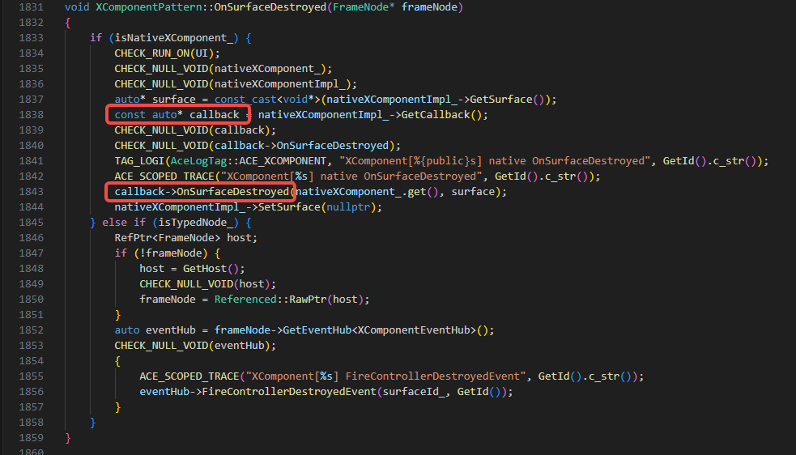

# 稳定性问题

## 1.OH_NativeXComponent_Callback的Use-After-Free问题

### 问题现象

应用崩溃

### 问题影响

必现/不可恢复/闪退

### 典型案例

#### 典型堆栈：

libace_compatible.z.so栈最后一帧为XComponentPattern的OnSurfaceCreated、OnSurfaceChanged、OnSurfaceDestroyed、DispatchTouchEvent
比较常见的是#00为一个异常的地址，且最后几位和Reason后面的地址内容一致，说明某个函数指针有问题，导致执行它的时候跑到了这个异常地址。

```
Reason:Signal:SIGSEGV(SEGV_ACCERR)@0x0000005c5f09a280 

#00 pc 0000000000ac9280 [anon:native_heap:jemalloc]
#01 pc 0000000002615120 /system/lib64/platformsdk/libace_compatible.z.so(OHOS::Ace::NG::XComponentPattern::OnSurfaceDestroyed()+468)
#02 pc 0000000002614b18 /system/lib64/platformsdk/libace_compatible.z.so(OHOS::Ace::NG::XComponentPattern::OnDetachFromFrameNode(OHOS::Ace::NG::FrameNode*)+88)
#03 pc 0000000000875294 /system/lib64/platformsdk/libace_compatible.z.so(OHOS::Ace::NG::FrameNode::~FrameNode()+264)
```

#### 问题原因：

XComponentPattern里面的上述四个回调是存在OH_NativeXComponent_Callback里面的，且使用裸指针管理，这些回调的生命周期实际是应用控制的。如果应用提前将回调销毁了，就会导致对应的裸指针指向的内存非法，引起Use-After-Free问题。


### 接口文档

[https://gitee.com/openharmony/docs/blob/master/zh-cn/application-dev/reference/apis-arkui/_o_h___native_x_component.md
](https://gitee.com/openharmony/docs/blob/master/zh-cn/application-dev/reference/apis-arkui/_o_h___native_x_component.md
)

### 最佳实践

onSurfaceDestroy回调是XComponentPattern销毁时调用的最后一个回调，该回调执行完表示组件已经销毁。所以需要应用保证onSurfaceDestroy回调执行前需要保证这些回调是有效的。


## 2.OH_NativeXComponent的Use-After-Free问题

### 典型案例

#### 典型堆栈：

接近栈顶的位置为libace_ndk.z.so(OH_NativeXComponent::XXX，且下一帧为应用的so的堆栈。

```
#00 pc 00000000000c8b3c /system/lib64/libc++.so(std::__h::basic_string<char, std::__h::char_traits<char>, std::__h::allocator<char>>::basic_string(std::__h::basic_string<char, std::__h::char_traits<char>, std::__h::allocator<char>> const&)+16)
#01 pc 0000000000034f64 /system/lib64/libace_ndk.z.so(OH_NativeXComponent::GetXComponentId(char*, unsigned long*)+76)
#02 pc 00000000000867c0 /data/storage/el1/bundle/libs/arm64/librenderer.so
```

#### 问题原因：

OH_NativeXComponent是使用裸指针管理的，应用侧持有它的裸指针，如果在它的生命周期结束后，仍然调用它相关的接口，会导致uaf问题。

### 接口文档

[https://gitee.com/openharmony/docs/blob/master/zh-cn/application-dev/reference/apis-arkui/_o_h___native_x_component.md](https://gitee.com/openharmony/docs/blob/master/zh-cn/application-dev/reference/apis-arkui/_o_h___native_x_component.md)

### 最佳实践

系统会通过onSurfaceDestroy回调通知应用OH_NativeXComponent已经销毁，需要应用保证在onSurfaceDestroy回调执行完后不能再调用OH_NativeXComponent相关接口。


## 3、system/lib64/platformsdk/libace_network.z.so等锁

### 问题现象

应用崩溃

### 问题影响

必现/不可恢复/闪退

### 典型案例

#### 典型堆栈：

```
#00 pc 00000000001b5904 /system/lib/ld-musl-aarch64.so.1(__timedwait_cp+192)
#01 pc 00000000001b7908 /system/lib/ld-musl-aarch64.so.1(__pthread_cond_timedwait+188)
#02 pc 00000000000c11c0 /system/lib64/libc++.so(std::__h::condition_variable::__do_timed_wait(std::__h::unique_lock<std::__h::mutex>&, std::__h::chrono::time_point<std::__h::chrono::system_clock, std::__h::chrono::duration<long long, std::__h::ratio<1l, 1000000000l>>>)+108)
#03 pc 0000000000019ed0 /system/lib64/platformsdk/libace_network.z.so(std::__h::cv_status std::__h::condition_variable::wait_for<long long, std::__h::ratio<1l, 1000000000l>>(std::__h::unique_lock<std::__h::mutex>&, std::__h::chrono::duration<long long, std::__h::ratio<1l, 1000000000l>> const&)+92)
#04 pc 0000000000019e5c /system/lib64/platformsdk/libace_network.z.so
#05 pc 000000000001bc10 /system/lib64/platformsdk/libace_network.z.so(OHOS::Ace::DownloadManagerImpl::HandleDownloadResult(bool, OHOS::Ace::DownloadCallback&&, std::__h::shared_ptr<OHOS::Ace::DownloadCondition> const&, int, std::__h::basic_string<char, std::__h::char_traits<char>, std::__h::allocator<char>> const&)+248)
#06 pc 0000000000018564 /system/lib64/platformsdk/libace_network.z.so(OHOS::Ace::DownloadManagerImpl::DownloadSync(OHOS::Ace::DownloadCallback&&, std::__h::basic_string<char, std::__h::char_traits<char>, std::__h::allocator<char>> const&, int, int)+1096)
#07 pc 000000000096f4a8 /system/lib64/platformsdk/libace_compatible.z.so(OHOS::Ace::NG::ImageLoadingContext::PerformDownload()+448)
```

#### 问题原因：

应用设置了对网络图片进行同步下载的接口（syncLoad），系统就会在主线程进行图片加载，如果是网络不好的情况下，可能造成任务阻塞。

### 接口文档

[https://gitee.com/openharmony/docs/blob/master/zh-cn/application-dev/reference/apis-arkui/arkui-ts/ts-basic-components-image.md#syncload8](https://gitee.com/openharmony/docs/blob/master/zh-cn/application-dev/reference/apis-arkui/arkui-ts/ts-basic-components-image.md#syncload8)

### 最佳实践

网络图片不要使用设置syncLoad=true


## 4、TaskExecutor::PostSyncTask

### 问题现象

应用崩溃

### 问题影响

必现/不可恢复/闪退

### 典型案例

#### 典型堆栈：

在非主线程出现如下堆栈

```
#00 pc 00000000001b9a7c /system/lib/ld-musl-aarch64.so.1(__timedwait_cp+148)
#01 pc 00000000001bbacc /system/lib/ld-musl-aarch64.so.1(pthread_cond_timedwait+168)
#02 pc 00000000000c115c /system/lib64/libc++.so(std::__h::condition_variable::wait(std::__h::unique_lock<std::__h::mutex>&)+20)
#03 pc 00000000000c1d1c /system/lib64/libc++.so(std::__h::__assoc_sub_state::__sub_wait(std::__h::unique_lock<std::__h::mutex>&)+48)
#04 pc 0000000000baf2e4 /system/lib64/platformsdk/libace_compatible.z.so(std::__h::__assoc_state<int>::copy()+64)
#05 pc 0000000000baf0e0 /system/lib64/platformsdk/libace_compatible.z.so(OHOS::Ace::CancelableCallback<void ()>::WaitUntilComplete(std::__h::chrono::duration<long long, std::__h::ratio<1l, 1000l>>)+120)
#06 pc 0000000000baed68 /system/lib64/platformsdk/libace_compatible.z.so
#07 pc 0000000000bae640 /system/lib64/platformsdk/libace_compatible.z.so(OHOS::Ace::TaskExecutor::PostSyncTask(std::__h::function<void ()>&&, OHOS::Ace::TaskExecutor::TaskType, std::__h::basic_string<char, std::__h::char_traits<char>, std::__h::allocator<char>> const&, OHOS::Ace::PriorityType) const+220)
#08 pc 000000000107d9d0 /system/lib64/platformsdk/libace_compatible.z.so
```

#### 问题原因：

这个说明正在往主线程抛同步任务，需要等待主线程执行完该任务才能执行后续的逻辑，这种只需要看主线程在做什么任务就可以了，一般是有个大粒度任务在主线程执行导致的，与该堆栈完全没有关系。

### 最佳实践

该堆栈也经常出现在多个进程ipc互锁的过程，这里只是互锁的一个环，而且是不可打破的，需要从其他角度去打破互锁环。


## 5、initializeConsume 的 missing @Provide问题

### 问题现象

应用崩溃

### 问题影响

必现/不可恢复/闪退

### 典型案例


#### 问题原因：

报错发生在@Consume初始化的阶段，原因是@Consume初始化的时候仅能通过key来匹配对应的@Provide变量进行初始化。当没有找到对应的@Provide的时候就会有这个报错。


### 接口文档

[https://gitee.com/openharmony/docs/blob/master/zh-cn/application-dev/ui/state-management/arkts-new-Provider-and-Consumer.md](https://gitee.com/openharmony/docs/blob/master/zh-cn/application-dev/ui/state-management/arkts-new-Provider-and-Consumer.md)

### 最佳实践

需要排查组件树，对于@Provide和@Consume来说，@Provide装饰的变量是在祖先组件中，可以理解为被“提供”给后代的状态变量。@Consume装饰的变量是在后代组件中，去“消费（绑定）”祖先组件提供的变量。如果@Consume绑定key的@Provide在其祖先组件中没有被定义就会有上述报错。应该从用法的角度来进行排查。


## 6、SynchedPropertyTwoWayPU 的 is not callable 问题

### 问题现象

应用崩溃

### 问题影响

必现/不可恢复/闪退

### 典型案例


#### 问题原因：

报错发生在@Link初始化的阶段，原因是@link初始化的时候会把自己注册给父组件调用父组件的addSubscriber，如果此时数据源的类型和@Link不是完全一致（T:T），或者使用了常量去初始化@Link这个方法就无法调用到，导致这个报错


### 接口文档

[https://gitee.com/openharmony/docs/blob/master/zh-cn/application-dev/ui/state-management/arkts-link.md](https://gitee.com/openharmony/docs/blob/master/zh-cn/application-dev/ui/state-management/arkts-link.md)

### 最佳实践

需要排查@Link的数据源是否是状态变量，类型是否和@link一致，用例详见：


## 7、addProvidedVar 的 duplicate @Provide property with name xxxxx问题
### 问题现象

应用崩溃

### 问题影响

必现/不可恢复/闪退

### 典型案例


#### 问题原因：

报错发生在@Provide初始化的阶段，原因是@Provide重写需要声明allowOverride，当声明时别名和属性名都可以被Override。如果没有声明出现了重复的别名或者属性名，就会报错


### 接口文档

[https://gitee.com/openharmony/docs/blob/master/zh-cn/application-dev/ui/state-management/arkts-new-Provider-and-Consumer.md](https://gitee.com/openharmony/docs/blob/master/zh-cn/application-dev/ui/state-management/arkts-new-Provider-and-Consumer.md)

### 最佳实践

需要排查@Provide是否使用了允许重写的声明（allowOverride），如果没有使用，则这样使用是不合规的，只有声明之后才会允许重写，并且子组件的@Consume会根绝别名或者属性名找到并使用距离他最近的父节点上的@Provide值。