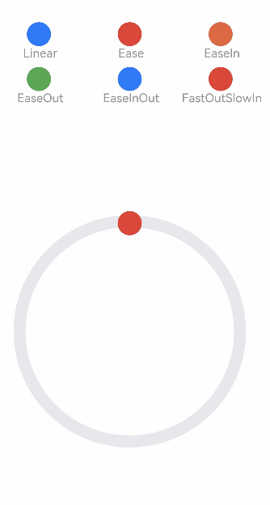

# 传统曲线

传统曲线基于数学公式，创造形状符合开发者预期的动画曲线。以三阶贝塞尔曲线为代表，通过调整曲线控制点，可以改变曲线形状，从而带来缓入、缓出等动画效果。对于同一条传统曲线，由于不具备物理含义，其形状不会因为用户行为发生任何改变，缺少物理动画的自然感和生动感。建议优先采用物理曲线创建动画，将传统曲线作为辅助用于极少数必要场景中。


ArkUI提供了贝塞尔曲线、阶梯曲线等传统曲线接口，开发者可参照[插值计算](../reference/apis/js-apis-curve.md)进行查阅。


传统曲线的示例和效果如下：


```ts
class MyCurve {
  public title: string;
  public curve: Curve;
  public color: Color | string;

  constructor(title: string, curve: Curve, color: Color | string = '') {
    this.title = title;
    this.curve = curve;
    this.color = color;
  }
}

const myCurves: MyCurve[] = [
  new MyCurve(' Linear', Curve.Linear, '#317AF7'),
  new MyCurve(' Ease', Curve.Ease, '#D94838'),
  new MyCurve(' EaseIn', Curve.EaseIn, '#DB6B42'),
  new MyCurve(' EaseOut', Curve.EaseOut, '#5BA854'),
  new MyCurve(' EaseInOut', Curve.EaseInOut, '#317AF7'),
  new MyCurve(' FastOutSlowIn', Curve.FastOutSlowIn, '#D94838')
]

@Entry
@Component
export struct CurveDemo {
  @State dRotate: number = 0; // 旋转角度

  build() {
    Column() {
      // 曲线图例
      Grid() {
        ForEach(myCurves, (item: MyCurve) => {
          GridItem() {
            Column() {
              Row()
                .width(30)
                .height(30)
                .borderRadius(15)
                .backgroundColor(item.color)
              Text(item.title)
                .fontSize(15)
                .fontColor(0x909399)
            }
            .width('100%')
          }
        })
      }
      .columnsTemplate('1fr 1fr 1fr')
      .rowsTemplate('1fr 1fr 1fr 1fr 1fr')
      .padding(10)
      .width('100%')
      .height(300).margin({top:50})

      Stack() {
        // 摆动管道
        Row()
          .width(290)
          .height(290)
          .border({
            width: 15,
            color: 0xE6E8EB,
            radius: 145
          })

        ForEach(myCurves, (item: MyCurve) => {
          // 小球
          Column() {
            Row()
              .width(30)
              .height(30)
              .borderRadius(15)
              .backgroundColor(item.color)
          }
          .width(20)
          .height(300)
          .rotate({ angle: this.dRotate })
          .animation({ duration: 2000, iterations: -1, curve: item.curve, delay: 100 })
        })
      }
      .width('100%')
      .height(200)
      .onClick(() => {
        this.dRotate ? null : this.dRotate = 360;
      })
    }
    .width('100%')
  }
}
```




