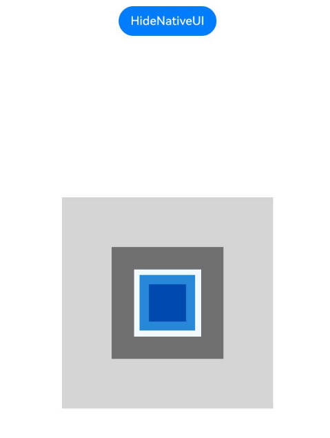

# 自定义绘制

## 自定义绘制内容

当监听到注册的事件为绘制类型时，可通过自定义绘制功能执行绘制逻辑，自定义绘制的内容。
> **说明：**
> - 在事件注册过程中，需将事件注册为绘制事件（如ARKUI_NODE_CUSTOM_EVENT_ON_DRAW），通过查阅[ArkUI_NodeCustomEventType](../reference/apis-arkui/capi-native-node-h.md#arkui_nodecustomeventtype)枚举值，获取事件类型及含义。
> 
> - 若需实现自定义绘制逻辑，应自定义UserData，并在事件注册时进行传递。

- 自定义节点的创建，通过ArkUI_NativeNodeAPI_1的create接口，传入ARKUI_NODE_CUSTOM创建自定义节点。
    ```c++
    auto customNode = nodeAPI->createNode(ARKUI_NODE_CUSTOM);
    ```

- 在事件注册时将自定义节点、事件类型（例如ARKUI_NODE_CUSTOM_EVENT_ON_FOREGROUND_DRAW，获取NDK接口支持的事件类型范围可通过查询[ArkUI_NodeCustomEventType](../reference/apis-arkui/capi-native-node-h.md#arkui_nodecustomeventtype)枚举值）、事件ID和UserData作为参数传入。
    ```c++
    //UserData
    struct A {
        int32_t a =6;
        bool flag = true;
        ArkUI_NodeHandle node;
    };
    A *a = new A;
    a->node = customNode;
    nodeAPI->registerNodeCustomEvent(customNode,ARKUI_NODE_CUSTOM_EVENT_ON_FOREGROUND_DRAW,1,a);
    nodeAPI->registerNodeCustomEventReceiver([](ArkUI_NodeCustomEvent *event) {
    //事件回调函数逻辑
    });
    ```

- 在回调函数中，获取自定义事件的事件类型（通过[OH_ArkUI_NodeCustomEvent_GetEventType](../reference/apis-arkui/capi-native-node-h.md#oh_arkui_nodecustomevent_geteventtype)）、事件ID（通过[OH_ArkUI_NodeCustomEvent_GetEventTargetId](../reference/apis-arkui/capi-native-node-h.md#oh_arkui_nodecustomevent_geteventtargetid)获取）、UserData（通过[OH_ArkUI_NodeCustomEvent_GetUserData](../reference/apis-arkui/capi-native-node-h.md#oh_arkui_nodecustomevent_getuserdata)获取）进行判断，以执行不同的逻辑。

    ```c++
    auto type = OH_ArkUI_NodeCustomEvent_GetEventType(event);
    auto targetId = OH_ArkUI_NodeCustomEvent_GetEventTargetId(event);
    auto userData =reinterpret_cast<A *>( OH_ArkUI_NodeCustomEvent_GetUserData(event));
    ```

- [OH_ArkUI_NodeCustomEvent_GetDrawContextInDraw](../reference/apis-arkui/capi-native-node-h.md#oh_arkui_nodecustomevent_getdrawcontextindraw)通过自定义组件事件获取绘制上下文，并将其传入 [OH_ArkUI_DrawContext_GetCanvas](../reference/apis-arkui/capi-native-type-h.md#oh_arkui_drawcontext_getcanvas)中以获取绘制canvas指针，该指针随后转换为OH_Drawing_Canvas指针进行绘制。
    ```c++
    //获取自定义事件绘制的上下文。
    auto *drawContext = OH_ArkUI_NodeCustomEvent_GetDrawContextInDraw(event);
    //获取绘制canvas指针。
    auto *canvas1 = OH_ArkUI_DrawContext_GetCanvas(drawContext);
    //转换为OH_Drawing_Canvas指针进行绘制。
    OH_Drawing_Canvas *canvas = reinterpret_cast<OH_Drawing_Canvas *>(canvas1);
    //绘制逻辑。
    int32_t width = 1000;
    int32_t height = 1000;
    auto path = OH_Drawing_PathCreate();
    OH_Drawing_PathMoveTo(path, width / 4, height / 4);
    OH_Drawing_PathLineTo(path, width * 3 / 4, height * 3 / 4);
    OH_Drawing_PathLineTo(path, width * 3 / 4, height * 3 / 4);
    OH_Drawing_PathLineTo(path, width * 3 / 4, height * 3 / 4);
    OH_Drawing_PathLineTo(path, width * 3 / 4, height * 3 / 4);
    OH_Drawing_PathClose(path);
    auto pen = OH_Drawing_PenCreate();
    OH_Drawing_PenSetWidth(pen, 10);
    OH_Drawing_PenSetColor(pen, OH_Drawing_ColorSetArgb(0xFF, 0xFF, 0x00, 0x00));
    OH_Drawing_CanvasAttachPen(canvas, pen);
    OH_Drawing_CanvasDrawPath(canvas, path);
    ```
**完整示例：** 
   
```c++
ArkUI_NodeHandle test(ArkUI_NativeNodeAPI_1 *nodeAPI) {
    //创建节点
    auto column = nodeAPI->createNode(ARKUI_NODE_COLUMN);
    auto customNode = nodeAPI->createNode(ARKUI_NODE_CUSTOM);
    ArkUI_NumberValue value[] = {480};
    ArkUI_AttributeItem item = {value, 1};
    //属性设置
    nodeAPI->setAttribute(column, NODE_WIDTH, &item);
    value[0].i32 = 720;
    nodeAPI->setAttribute(column, NODE_HEIGHT, &item);
    ArkUI_NumberValue NODE_WIDTH_value[] = {200};
    ArkUI_AttributeItem NODE_WIDTH_Item[] = {NODE_WIDTH_value, 1};
    ArkUI_NumberValue NODE_HEIGHT_value[] = {200};
    ArkUI_AttributeItem NODE_HEIGHT_Item[] = {NODE_HEIGHT_value, 1};
    ArkUI_NumberValue NODE_BACKGROUND_COLOR_item_value[] = {{.u32 = 0xFFFFFF00}};
    ArkUI_AttributeItem NODE_BACKGROUND_COLOR_Item[] = {NODE_BACKGROUND_COLOR_item_value, 1};
    //自定义UserData。
    struct A {
        int32_t a =6;
        bool flag = true;
        ArkUI_NodeHandle node;
    };
    A *a = new A;
    a->node = customNode;
    nodeAPI->setAttribute(customNode, NODE_WIDTH, NODE_WIDTH_Item);
    nodeAPI->setAttribute(customNode, NODE_HEIGHT, NODE_HEIGHT_Item);
    nodeAPI->setAttribute(customNode, NODE_BACKGROUND_COLOR, NODE_BACKGROUND_COLOR_Item);
    //进行事件注册
    nodeAPI->registerNodeCustomEvent(customNode,ARKUI_NODE_CUSTOM_EVENT_ON_FOREGROUND_DRAW,1,a);
    //事件回调函数的编写
    nodeAPI->registerNodeCustomEventReceiver([](ArkUI_NodeCustomEvent *event) {
        //获取自定义事件的相关信息。
        auto type = OH_ArkUI_NodeCustomEvent_GetEventType(event);
        auto targetId = OH_ArkUI_NodeCustomEvent_GetEventTargetId(event);
        auto userData =reinterpret_cast<A *>( OH_ArkUI_NodeCustomEvent_GetUserData(event));
        if (type == ARKUI_NODE_CUSTOM_EVENT_ON_FOREGROUND_DRAW && targetId == 1 && userData->flag) {
            //获取自定义事件绘制的上下文。
            auto *drawContext = OH_ArkUI_NodeCustomEvent_GetDrawContextInDraw(event);
            //获取绘制canvas指针。
            auto *canvas1 = OH_ArkUI_DrawContext_GetCanvas(drawContext);
            //转换为OH_Drawing_Canvas指针进行绘制。
            OH_Drawing_Canvas *canvas = reinterpret_cast<OH_Drawing_Canvas *>(canvas1);
            int32_t width = 1000;
            int32_t height = 1000;
            auto path = OH_Drawing_PathCreate();
            OH_Drawing_PathMoveTo(path, width / 4, height / 4);
            OH_Drawing_PathLineTo(path, width * 3 / 4, height * 3 / 4);
            OH_Drawing_PathLineTo(path, width * 3 / 4, height * 3 / 4);
            OH_Drawing_PathLineTo(path, width * 3 / 4, height * 3 / 4);
            OH_Drawing_PathLineTo(path, width * 3 / 4, height * 3 / 4);
            OH_Drawing_PathClose(path);
            auto pen = OH_Drawing_PenCreate();
            OH_Drawing_PenSetWidth(pen, 10);
            OH_Drawing_PenSetColor(pen, OH_Drawing_ColorSetArgb(0xFF, 0xFF, 0x00, 0x00));
            OH_Drawing_CanvasAttachPen(canvas, pen);
            OH_Drawing_CanvasDrawPath(canvas, path);
        }
    });
    //自定义节点上树
    nodeAPI->addChild(column, customNode);
    return column;
    }
```


## 自定义绘制前景背景

以下示例创建了一个自定义绘制组件，该绘制组件能够绘制自定义矩形，同时可以自定义绘制前景和背景，并使用[自定义布局容器](ndk-build-custom-components.md#自定义布局容器)进行布局排布。

1. 按照[自定义布局容器](ndk-build-custom-components.md#自定义布局容器)章节准备前置工程。

2. 创建自定义绘制组件封装对象。
```c
// ArkUICustomNode.h
// 自定义绘制组件示例

#ifndef MYAPPLICATION_ARKUICUSTOMNODE_H
#define MYAPPLICATION_ARKUICUSTOMNODE_H

#include <native_drawing/drawing_brush.h>
#include <native_drawing/drawing_canvas.h>
#include <native_drawing/drawing_path.h>

#include "ArkUINode.h"

namespace NativeModule {

class ArkUICustomNode : public ArkUINode {
public:
    // 使用自定义组件类型ARKUI_NODE_CUSTOM创建组件。
    ArkUICustomNode()
        : ArkUINode((NativeModuleInstance::GetInstance()->GetNativeNodeAPI())->createNode(ARKUI_NODE_CUSTOM)) {
        // 注册自定义事件监听器。
        nativeModule_->addNodeCustomEventReceiver(handle_, OnStaticCustomEvent);
        // 声明自定义事件并转递自身作为自定义数据。
        nativeModule_->registerNodeCustomEvent(handle_, ARKUI_NODE_CUSTOM_EVENT_ON_DRAW_FRONT, 0, this);        
        nativeModule_->registerNodeCustomEvent(handle_, ARKUI_NODE_CUSTOM_EVENT_ON_DRAW, 0, this);
        nativeModule_->registerNodeCustomEvent(handle_, ARKUI_NODE_CUSTOM_EVENT_ON_DRAW_BEHIND , 0, this);
        
    }

    ~ArkUICustomNode() override {
        // 反注册自定义事件监听器。
        nativeModule_->removeNodeCustomEventReceiver(handle_, OnStaticCustomEvent);
        // 取消声明自定义事件。
        nativeModule_->unregisterNodeCustomEvent(handle_, ARKUI_NODE_CUSTOM_EVENT_ON_DRAW_FRONT);        
        nativeModule_->unregisterNodeCustomEvent(handle_, ARKUI_NODE_CUSTOM_EVENT_ON_DRAW);
        nativeModule_->unregisterNodeCustomEvent(handle_, ARKUI_NODE_CUSTOM_EVENT_ON_DRAW_BEHIND);
    }

private:
    static void OnStaticCustomEvent(ArkUI_NodeCustomEvent *event) {
        // 获取组件实例对象，调用相关实例方法。
        auto customNode = reinterpret_cast<ArkUICustomNode *>(OH_ArkUI_NodeCustomEvent_GetUserData(event));
        auto type = OH_ArkUI_NodeCustomEvent_GetEventType(event);
        switch (type) {
        case ARKUI_NODE_CUSTOM_EVENT_ON_DRAW_BEHIND:
            customNode->OnDrawBehind(event);
            break;
        case ARKUI_NODE_CUSTOM_EVENT_ON_DRAW:
            customNode->OnDraw(event);
            break;
        case ARKUI_NODE_CUSTOM_EVENT_ON_DRAW_FRONT:
            customNode->OnDrawFront(event);
            break;    
        default:
            break;
        }
    }

    // 自定义绘制逻辑。
    void OnDrawBehind(ArkUI_NodeCustomEvent *event) {
        auto drawContext = OH_ArkUI_NodeCustomEvent_GetDrawContextInDraw(event);
        // 获取图形绘制对象。
        auto drawCanvas = reinterpret_cast<OH_Drawing_Canvas *>(OH_ArkUI_DrawContext_GetCanvas(drawContext));
        // 获取组件大小。
        auto size = OH_ArkUI_DrawContext_GetSize(drawContext);
        // 绘制自定义内容。
        auto path = OH_Drawing_PathCreate();
        OH_Drawing_PathMoveTo(path, size.width / 5, size.height / 5);
        OH_Drawing_PathLineTo(path, size.width * 4 / 5, size.height / 5);
        OH_Drawing_PathLineTo(path, size.width * 4 / 5, size.height * 4 / 5);
        OH_Drawing_PathLineTo(path, size.width / 5, size.height * 4 / 5);
        OH_Drawing_PathLineTo(path, size.width / 5, size.height / 5);
        OH_Drawing_PathClose(path);
        auto brush = OH_Drawing_BrushCreate();
        OH_Drawing_BrushSetColor(brush, 0xFFF0FAFF);// 蓝白色
        OH_Drawing_CanvasAttachBrush(drawCanvas, brush);
        OH_Drawing_CanvasDrawPath(drawCanvas, path);
        // 释放资源
        OH_Drawing_BrushDestroy(brush);
        OH_Drawing_PathDestroy(path);
    }
    
    void OnDraw(ArkUI_NodeCustomEvent *event) {
        auto drawContext = OH_ArkUI_NodeCustomEvent_GetDrawContextInDraw(event);
        // 获取图形绘制对象。
        auto drawCanvas = reinterpret_cast<OH_Drawing_Canvas *>(OH_ArkUI_DrawContext_GetCanvas(drawContext));
        // 获取组件大小。
        auto size = OH_ArkUI_DrawContext_GetSize(drawContext);
        // 绘制自定义内容。
        auto path = OH_Drawing_PathCreate();
        OH_Drawing_PathMoveTo(path, size.width / 4, size.height / 4);
        OH_Drawing_PathLineTo(path, size.width * 3 / 4, size.height / 4);
        OH_Drawing_PathLineTo(path, size.width * 3 / 4, size.height * 3 / 4);
        OH_Drawing_PathLineTo(path, size.width / 4, size.height * 3 / 4);
        OH_Drawing_PathLineTo(path, size.width / 4, size.height / 4);
        OH_Drawing_PathClose(path);
        auto brush = OH_Drawing_BrushCreate();
        OH_Drawing_BrushSetColor(brush, 0xff2787D9);// 浅蓝色
        OH_Drawing_CanvasAttachBrush(drawCanvas, brush);
        OH_Drawing_CanvasDrawPath(drawCanvas, path);
        // 释放资源
        OH_Drawing_BrushDestroy(brush);
        OH_Drawing_PathDestroy(path);
    }
    
    void OnDrawFront(ArkUI_NodeCustomEvent *event) {
        auto drawContext = OH_ArkUI_NodeCustomEvent_GetDrawContextInDraw(event);
        // 获取图形绘制对象。
        auto drawCanvas = reinterpret_cast<OH_Drawing_Canvas *>(OH_ArkUI_DrawContext_GetCanvas(drawContext));
        // 获取组件大小。
        auto size = OH_ArkUI_DrawContext_GetSize(drawContext);
        // 绘制自定义内容。
        auto path = OH_Drawing_PathCreate();
        OH_Drawing_PathMoveTo(path, size.width / 3, size.height / 3);
        OH_Drawing_PathLineTo(path, size.width * 2 / 3, size.height / 3);
        OH_Drawing_PathLineTo(path, size.width * 2 / 3, size.height * 2 / 3);
        OH_Drawing_PathLineTo(path, size.width / 3, size.height * 2 / 3);
        OH_Drawing_PathLineTo(path, size.width / 3, size.height / 3);
        OH_Drawing_PathClose(path);
        auto brush = OH_Drawing_BrushCreate();
        OH_Drawing_BrushSetColor(brush, 0xFF004AAF);// 深蓝色
        OH_Drawing_CanvasAttachBrush(drawCanvas, brush);
        OH_Drawing_CanvasDrawPath(drawCanvas, path);
        // 释放资源
        OH_Drawing_BrushDestroy(brush);
        OH_Drawing_PathDestroy(path);
    }
};

} // namespace NativeModule

#endif // MYAPPLICATION_ARKUICUSTOMNODE_H
```

3. 使用自定义绘制组件和自定义容器创建示例界面
```c
// 自定义NDK接口入口组件。

#include <arkui/native_node_napi.h>
#include <arkui/native_type.h>
#include <js_native_api.h>

#include "NativeEntry.h"
#include "ArkUICustomContainerNode.h"
#include "ArkUICustomNode.h"

// 全局环境变量声明
static napi_env g_env = nullptr;

namespace NativeModule {

napi_value CreateNativeRoot(napi_env env, napi_callback_info info) {
    size_t argc = 1;
    napi_value args[1] = {nullptr};

    napi_get_cb_info(env, info, &argc, args, nullptr, nullptr);

    // 获取NodeContent
    ArkUI_NodeContentHandle contentHandle;
    OH_ArkUI_GetNodeContentFromNapiValue(env, args[0], &contentHandle);
    NativeEntry::GetInstance()->SetContentHandle(contentHandle);

    // 创建自定义容器和自定义绘制组件。
    auto node = std::make_shared<ArkUICustomContainerNode>();
    node->SetBackgroundColor(0xFFD5D5D5);// 浅灰色
    auto customNode = std::make_shared<ArkUICustomNode>();
    customNode->SetBackgroundColor(0xFF707070);// 深灰色
    customNode->SetWidth(150);
    customNode->SetHeight(150);
    node->AddChild(customNode);

    // 保持Native侧对象到管理类中，维护生命周期。
    NativeEntry::GetInstance()->SetRootNode(node);
    g_env = env;
    return nullptr;
}

napi_value DestroyNativeRoot(napi_env env, napi_callback_info info) {
    // 从管理类中释放Native侧对象。
    NativeEntry::GetInstance()->DisposeRootNode();
    return nullptr;
}

} // namespace NativeModule
```
