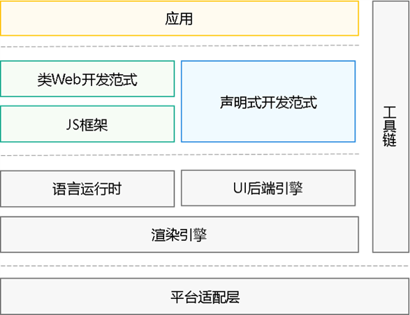

# 方舟开发框架（ArkUI）概述

方舟开发框架（简称ArkUI）为应用的UI开发提供了完整的基础设施，包括简洁的UI语法、丰富的UI功能（组件、布局、动画以及交互事件），以及实时界面预览工具等，可以支持开发者进行可视化界面开发。

## 基本概念

- **UI：** 即用户界面。开发者可以将应用的用户界面设计为多个功能页面，每个页面进行单独的文件管理，并通过[页面路由](arkts-routing.md)API完成页面间的调度管理如跳转、回退等操作，以实现应用内的功能解耦。

- **组件：** UI构建与显示的最小单位，如列表、网格、按钮、单选框、进度条、文本等。开发者通过多种组件的组合，构建出满足自身应用诉求的完整界面。

## 两种开发范式

针对不同的应用场景及技术背景，方舟开发框架提供了两种开发范式，分别是[基于ArkTS的声明式开发范式](arkts-ui-development-overview.md)（简称“声明式开发范式”）和[兼容JS的类Web开发范式](../ui/ui-js-overview.md)（简称“类Web开发范式”）。

- **声明式开发范式**：采用基于TypeScript声明式UI语法扩展而来的[ArkTS语言](../quick-start/arkts-get-started.md)，从组件、动画和状态管理三个维度提供UI绘制能力。

- **类Web开发范式**：采用经典的HML、CSS、JavaScript三段式开发方式，即使用HML标签文件搭建布局、使用CSS文件描述样式、使用JavaScript文件处理逻辑。该范式更符合于Web前端开发者的使用习惯，便于快速将已有的Web应用改造成方舟开发框架应用。

在开发一款新应用时，推荐采用声明式开发范式来构建UI，主要基于以下几点考虑：

- **开发效率：** 声明式开发范式更接近自然语义的编程方式，开发者可以直观地描述UI，无需关心如何实现UI绘制和渲染，开发高效简洁。

- **应用性能：** 如下图所示，两种开发范式的UI后端引擎和语言运行时是共用的，但是相比类Web开发范式，声明式开发范式无需JS框架进行页面DOM管理，渲染更新链路更为精简，占用内存更少，应用性能更佳。

- **发展趋势**：声明式开发范式后续会作为主推的开发范式持续演进，为开发者提供更丰富、更强大的能力。

  **图1** 方舟开发框架示意图  

  

## 不同应用类型支持的开发范式

根据所选用[应用模型](../application-models/application-model-composition.md)（Stage模型、FA模型）和页面形态（应用或服务的普通页面、卡片）的不同，对应支持的UI开发范式也有所差异，详见下表。

  **表1** 支持的UI开发范式

| 应用模型        | 页面形态     | 支持的UI开发范式                |
| ----------- | -------- | ------------------------ |
| Stage模型（推荐） | 应用或服务的页面 | 声明式开发范式（推荐）              |
|             | 卡片       | 声明式开发范式（推荐） 类Web开发范式 |
| FA模型        | 应用或服务的页面 | 声明式开发范式 类Web开发范式     |
|             | 卡片       | 类Web开发范式                 |
