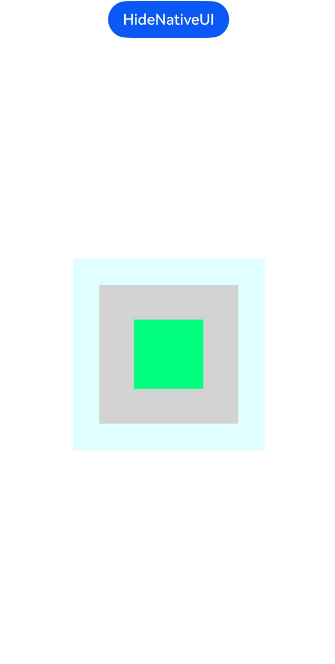

# 构建自定义组件
<!--Kit: ArkUI-->
<!--Subsystem: ArkUI-->
<!--Owner: @xiang-shouxing-->
<!--Designer: @xiang-shouxing-->
<!--Tester: @sally__-->

ArkUI开发框架在NDK接口提供了自定义UI组件的能力，这些能力包括自定义测算，自定义布局和自定义绘制。开发者通过注册相关自定义回调事件接入ArkUI开发框架的布局渲染流程，这些事件需要使用[registerNodeCustomEvent](../reference/apis-arkui/capi-arkui-nativemodule-arkui-nativenodeapi-1.md#registernodecustomevent)来进行声明，并通过[addNodeCustomEventReceiver](../reference/apis-arkui/capi-arkui-nativemodule-arkui-nativenodeapi-1.md#addnodecustomeventreceiver)函数添加组件自定义事件的监听器，在该监听器的回调函数中处理相关自定义测算，自定义布局和自定义绘制逻辑。


> **说明：**
>
> - 自定义组件事件注册需要[addNodeCustomEventReceiver](../reference/apis-arkui/capi-arkui-nativemodule-arkui-nativenodeapi-1.md#addnodecustomeventreceiver)声明监听器注册和[registerNodeCustomEvent](../reference/apis-arkui/capi-arkui-nativemodule-arkui-nativenodeapi-1.md#registernodecustomevent)声明需要的自定义事件类型，监听器只能监听已声明的事件。
> 
> - 需要关注事件的反注册逻辑，如在组件销毁前调用[removeNodeCustomEventReceiver](../reference/apis-arkui/capi-arkui-nativemodule-arkui-nativenodeapi-1.md#removenodecustomeventreceiver)移除事件监听器，[unregisterNodeCustomEvent](../reference/apis-arkui/capi-arkui-nativemodule-arkui-nativenodeapi-1.md#unregisternodecustomevent)通知ArkUI框架已监听的自定义组件事件不再需要监听。
> 
> - [addNodeCustomEventReceiver](../reference/apis-arkui/capi-arkui-nativemodule-arkui-nativenodeapi-1.md#addnodecustomeventreceiver)可以添加多个函数指针，每个函数指针都会在对应事件触发时触发，对应的[removeNodeCustomEventReceiver](../reference/apis-arkui/capi-arkui-nativemodule-arkui-nativenodeapi-1.md#removenodecustomeventreceiver)需要传递对应的函数指针用于移除监听。
> 
> - [registerNodeCustomEventReceiver](../reference/apis-arkui/capi-arkui-nativemodule-arkui-nativenodeapi-1.md#registernodecustomeventreceiver)是全局监听函数，不同于[addNodeCustomEventReceiver](../reference/apis-arkui/capi-arkui-nativemodule-arkui-nativenodeapi-1.md#addnodecustomeventreceiver)，[registerNodeCustomEventReceiver](../reference/apis-arkui/capi-arkui-nativemodule-arkui-nativenodeapi-1.md#registernodecustomeventreceiver)能够监听所有Native组件的自定义事件触发，但只能传递一个函数指针，多次调用使用最后一次的函数指针进行回调，释放时使用unregisterNodeCustomEventReceiver进行反注册。
> 
> - 自定义组件相关接口（[measureNode](../reference/apis-arkui/capi-arkui-nativemodule-arkui-nativenodeapi-1.md#measurenode)、[layoutNode](../reference/apis-arkui/capi-arkui-nativemodule-arkui-nativenodeapi-1.md#layoutnode)、[setMeasuredSize](../reference/apis-arkui/capi-arkui-nativemodule-arkui-nativenodeapi-1.md#setmeasuredsize)、[setLayoutPosition](../reference/apis-arkui/capi-arkui-nativemodule-arkui-nativenodeapi-1.md#setlayoutposition)）仅允许在对应的自定义事件（[ARKUI_NODE_CUSTOM_EVENT_ON_MEASURE、ARKUI_NODE_CUSTOM_EVENT_ON_LAYOUT](../reference/apis-arkui/capi-native-node-h.md#arkui_nodecustomeventtype)）回调中使用。


## 自定义布局容器

以下示例创建了一个自定义容器，该容器将子组件最大值加上额外边距作为自身大小，同时对子组件进行居中排布。

**图1** 自定义容器组件


1. 按照[接入ArkTS页面](ndk-access-the-arkts-page.md)创建前置工程。

2. 创建自定义容器组件封装对象。
   ```c
   // ArkUICustomContainerNode.h
   // 自定义容器组件示例
   
   #ifndef MYAPPLICATION_ARKUICUSTOMCONTAINERNODE_H
   #define MYAPPLICATION_ARKUICUSTOMCONTAINERNODE_H
   
   #include "ArkUINode.h"
   
   namespace NativeModule {
   
   class ArkUICustomContainerNode : public ArkUINode {
   public:
       // 使用自定义组件类型ARKUI_NODE_CUSTOM创建组件。
       ArkUICustomContainerNode()
           : ArkUINode((NativeModuleInstance::GetInstance()->GetNativeNodeAPI())->createNode(ARKUI_NODE_CUSTOM)) {
           // 注册自定义事件监听器。
           nativeModule_->addNodeCustomEventReceiver(handle_, OnStaticCustomEvent);
           // 声明自定义事件并传递自身作为自定义数据。
           nativeModule_->registerNodeCustomEvent(handle_, ARKUI_NODE_CUSTOM_EVENT_ON_MEASURE, 0, this);
           nativeModule_->registerNodeCustomEvent(handle_, ARKUI_NODE_CUSTOM_EVENT_ON_LAYOUT, 0, this);
       }
   
       ~ArkUICustomContainerNode() override {
           // 反注册自定义事件监听器。
           nativeModule_->removeNodeCustomEventReceiver(handle_, OnStaticCustomEvent);
           // 取消声明自定义事件。
           nativeModule_->unregisterNodeCustomEvent(handle_, ARKUI_NODE_CUSTOM_EVENT_ON_MEASURE);
           nativeModule_->unregisterNodeCustomEvent(handle_, ARKUI_NODE_CUSTOM_EVENT_ON_LAYOUT);
       }
   
       void SetPadding(int32_t padding) {
           padding_ = padding;
           // 自定义属性事件更新需要主动调用标记脏区接口。
           nativeModule_->markDirty(handle_, NODE_NEED_MEASURE);
       }
   
   private:
       static void OnStaticCustomEvent(ArkUI_NodeCustomEvent *event) {
           // 获取组件实例对象，调用相关实例方法。
           auto customNode = reinterpret_cast<ArkUICustomContainerNode *>(OH_ArkUI_NodeCustomEvent_GetUserData(event));
           auto type = OH_ArkUI_NodeCustomEvent_GetEventType(event);
           switch (type) {
           case ARKUI_NODE_CUSTOM_EVENT_ON_MEASURE:
               customNode->OnMeasure(event);
               break;
           case ARKUI_NODE_CUSTOM_EVENT_ON_LAYOUT:
               customNode->OnLayout(event);
               break;
           default:
               break;
           }
       }
   
       // 自定义测算逻辑。
       void OnMeasure(ArkUI_NodeCustomEvent *event) {
           auto layoutConstrain = OH_ArkUI_NodeCustomEvent_GetLayoutConstraintInMeasure(event);
           // 创建子节点布局限制，复用父组件布局中的百分比参考值。
           auto childLayoutConstrain = OH_ArkUI_LayoutConstraint_Copy(layoutConstrain);
           OH_ArkUI_LayoutConstraint_SetMaxHeight(childLayoutConstrain, 1000);
           OH_ArkUI_LayoutConstraint_SetMaxWidth(childLayoutConstrain, 1000);
           OH_ArkUI_LayoutConstraint_SetMinHeight(childLayoutConstrain, 0);
           OH_ArkUI_LayoutConstraint_SetMinWidth(childLayoutConstrain, 0);
   
           // 测算子节点获取子节点最大值。
           auto totalSize = nativeModule_->getTotalChildCount(handle_);
           int32_t maxWidth = 0;
           int32_t maxHeight = 0;
           for (uint32_t i = 0; i < totalSize; i++) {
               auto child = nativeModule_->getChildAt(handle_, i);
               // 调用测算接口测算Native组件。
               nativeModule_->measureNode(child, childLayoutConstrain);
               auto size = nativeModule_->getMeasuredSize(child);
               if (size.width > maxWidth) {
                   maxWidth = size.width;
               }
               if (size.height > maxHeight) {
                   maxHeight = size.height;
               }
           }
           // 自定义测算为所有子节点大小加固定边距。
           nativeModule_->setMeasuredSize(handle_, maxWidth + 2 * padding_, maxHeight + 2 * padding_);
       }
   
       void OnLayout(ArkUI_NodeCustomEvent *event) {
           // 获取父组件期望位置并设置。
           auto position = OH_ArkUI_NodeCustomEvent_GetPositionInLayout(event);
           nativeModule_->setLayoutPosition(handle_, position.x, position.y);
   
           // 设置子组件居中对齐。
           auto totalSize = nativeModule_->getTotalChildCount(handle_);
           auto selfSize = nativeModule_->getMeasuredSize(handle_);
           for (uint32_t i = 0; i < totalSize; i++) {
               auto child = nativeModule_->getChildAt(handle_, i);
               // 获取子组件大小。
               auto childSize = nativeModule_->getMeasuredSize(child);
               // 布局子组件位置。
               nativeModule_->layoutNode(child, (selfSize.width - childSize.width) / 2,
                                         (selfSize.height - childSize.height) / 2);
           }
       }
   
       int32_t padding_ = 100;
   };
   
   } // namespace NativeModule
   
   #endif // MYAPPLICATION_ARKUICUSTOMCONTAINERNODE_H
   ```

3. 使用自定义容器创建带文本的示例界面，并沿用[定时器模块相关简单实现](ndk-embed-arkts-components.md)。
   ```c
   // 自定义NDK接口入口。
   
   #include "NativeEntry.h"
   
   #include "ArkUICustomContainerNode.h"
   #include "ArkUITextNode.h"
   #include "UITimer.h"
   
   #include <arkui/native_node_napi.h>
   #include <arkui/native_type.h>
   #include <js_native_api.h>
   
   namespace NativeModule {
   namespace {
   napi_env g_env;
   } // namespace
   
   napi_value CreateNativeRoot(napi_env env, napi_callback_info info) {
       size_t argc = 1;
       napi_value args[1] = {nullptr};
   
       napi_get_cb_info(env, info, &argc, args, nullptr, nullptr);
   
       // 获取NodeContent
       ArkUI_NodeContentHandle contentHandle;
       OH_ArkUI_GetNodeContentFromNapiValue(env, args[0], &contentHandle);
       NativeEntry::GetInstance()->SetContentHandle(contentHandle);
   
       // 创建自定义容器和文本组件。
       auto node = std::make_shared<ArkUICustomContainerNode>();
       node->SetBackgroundColor(0xFFE0FFFF);
       auto textNode = std::make_shared<ArkUITextNode>();
       textNode->SetTextContent("CustomContainer Example");
       textNode->SetFontSize(16);
       textNode->SetBackgroundColor(0xFFfffacd);
       textNode->SetTextAlign(ARKUI_TEXT_ALIGNMENT_CENTER);
       node->AddChild(textNode);
       CreateNativeTimer(env, textNode.get(), 1, [](void *userData, int32_t count) {
           auto textNode = reinterpret_cast<ArkUITextNode *>(userData);
           textNode->SetFontColor(0xFF00FF7F);
       });
   
       // 保持Native侧对象到管理类中，维护生命周期。
       NativeEntry::GetInstance()->SetRootNode(node);
       g_env = env;
       return nullptr;
   }
   
   napi_value DestroyNativeRoot(napi_env env, napi_callback_info info) {
       // 从管理类中释放Native侧对象。
       NativeEntry::GetInstance()->DisposeRootNode();
       return nullptr;
   }
   
   } // namespace NativeModule
   ```


## 自定义绘制组件

以下示例创建了一个自定义绘制组件，该绘制组件能够绘制自定义矩形，并使用上述自定义容器进行布局排布。

**图2** 自定义绘制组件
 


1. 按照[自定义布局容器](#自定义布局容器)章节准备前置工程。

2. 创建自定义绘制组件封装对象。
   ```c
   // ArkUICustomNode.h
   // 自定义绘制组件示例
   
   #ifndef MYAPPLICATION_ARKUICUSTOMNODE_H
   #define MYAPPLICATION_ARKUICUSTOMNODE_H
   
   #include <native_drawing/drawing_brush.h>
   #include <native_drawing/drawing_canvas.h>
   #include <native_drawing/drawing_path.h>
   
   #include "ArkUINode.h"
   
   namespace NativeModule {
   
   class ArkUICustomNode : public ArkUINode {
   public:
       // 使用自定义组件类型ARKUI_NODE_CUSTOM创建组件。
       ArkUICustomNode()
           : ArkUINode((NativeModuleInstance::GetInstance()->GetNativeNodeAPI())->createNode(ARKUI_NODE_CUSTOM)) {
           // 注册自定义事件监听器。
           nativeModule_->addNodeCustomEventReceiver(handle_, OnStaticCustomEvent);
           // 声明自定义事件并传递自身作为自定义数据。
           nativeModule_->registerNodeCustomEvent(handle_, ARKUI_NODE_CUSTOM_EVENT_ON_DRAW, 0, this);
       }
   
       ~ArkUICustomNode() override {
           // 反注册自定义事件监听器。
           nativeModule_->removeNodeCustomEventReceiver(handle_, OnStaticCustomEvent);
           // 取消声明自定义事件。
           nativeModule_->unregisterNodeCustomEvent(handle_, ARKUI_NODE_CUSTOM_EVENT_ON_DRAW);
       }
   
       void SetRectColor(uint32_t color) {
           color_ = color;
           // 自定义绘制属性变更需要主动通知框架。
           nativeModule_->markDirty(handle_, NODE_NEED_RENDER);
       }
   
   private:
       static void OnStaticCustomEvent(ArkUI_NodeCustomEvent *event) {
           // 获取组件实例对象，调用相关实例方法。
           auto customNode = reinterpret_cast<ArkUICustomNode *>(OH_ArkUI_NodeCustomEvent_GetUserData(event));
           auto type = OH_ArkUI_NodeCustomEvent_GetEventType(event);
           switch (type) {
           case ARKUI_NODE_CUSTOM_EVENT_ON_DRAW:
               customNode->OnDraw(event);
               break;
           default:
               break;
           }
       }
   
       // 自定义绘制逻辑。
       void OnDraw(ArkUI_NodeCustomEvent *event) {
           auto drawContext = OH_ArkUI_NodeCustomEvent_GetDrawContextInDraw(event);
           // 获取图形绘制对象。
           auto drawCanvas = reinterpret_cast<OH_Drawing_Canvas *>(OH_ArkUI_DrawContext_GetCanvas(drawContext));
           // 获取组件大小。
           auto size = OH_ArkUI_DrawContext_GetSize(drawContext);
           // 绘制自定义内容。
           auto path = OH_Drawing_PathCreate();
           OH_Drawing_PathMoveTo(path, size.width / 4, size.height / 4);
           OH_Drawing_PathLineTo(path, size.width * 3 / 4, size.height / 4);
           OH_Drawing_PathLineTo(path, size.width * 3 / 4, size.height * 3 / 4);
           OH_Drawing_PathLineTo(path, size.width / 4, size.height * 3 / 4);
           OH_Drawing_PathLineTo(path, size.width / 4, size.height / 4);
           OH_Drawing_PathClose(path);
           auto brush = OH_Drawing_BrushCreate();
           OH_Drawing_BrushSetColor(brush, color_);
           OH_Drawing_CanvasAttachBrush(drawCanvas, brush);
           OH_Drawing_CanvasDrawPath(drawCanvas, path);
           // 释放资源
           OH_Drawing_BrushDestroy(brush);
           OH_Drawing_PathDestroy(path);
       }
   
       uint32_t color_ = 0xFFFFE4B5;
   };
   
   } // namespace NativeModule
   
   #endif // MYAPPLICATION_ARKUICUSTOMNODE_H
   ```

3. 使用自定义绘制组件和自定义容器创建示例界面，并沿用[定时器模块相关简单实现](ndk-embed-arkts-components.md)。
   ```c
   // 自定义NDK接口入口组件。
   
   #include "NativeEntry.h"
   
   #include "ArkUICustomContainerNode.h"
   #include "ArkUICustomNode.h"
   #include "UITimer.h"
   
   #include <arkui/native_node_napi.h>
   #include <arkui/native_type.h>
   #include <js_native_api.h>
   
   namespace NativeModule {
   namespace {
   napi_env g_env;
   } // namespace
   
   napi_value CreateNativeRoot(napi_env env, napi_callback_info info) {
       size_t argc = 1;
       napi_value args[1] = {nullptr};
   
       napi_get_cb_info(env, info, &argc, args, nullptr, nullptr);
   
       // 获取NodeContent
       ArkUI_NodeContentHandle contentHandle;
       OH_ArkUI_GetNodeContentFromNapiValue(env, args[0], &contentHandle);
       NativeEntry::GetInstance()->SetContentHandle(contentHandle);
   
       // 创建自定义容器和自定义绘制组件。
       auto node = std::make_shared<ArkUICustomContainerNode>();
       node->SetBackgroundColor(0xFFE0FFFF);
       auto customNode = std::make_shared<ArkUICustomNode>();
       customNode->SetBackgroundColor(0xFFD3D3D3);
       customNode->SetWidth(150);
       customNode->SetHeight(150);
       node->AddChild(customNode);
       CreateNativeTimer(env, customNode.get(), 1, [](void *userData, int32_t count) {
           auto customNode = reinterpret_cast<ArkUICustomNode *>(userData);
           customNode->SetRectColor(0xFF00FF7F);
       });
   
       // 保持Native侧对象到管理类中，维护生命周期。
       NativeEntry::GetInstance()->SetRootNode(node);
       g_env = env;
       return nullptr;
   }
   
   napi_value DestroyNativeRoot(napi_env env, napi_callback_info info) {
       // 从管理类中释放Native侧对象。
       NativeEntry::GetInstance()->DisposeRootNode();
       return nullptr;
   }
   
   } // namespace NativeModule
   
   ```
