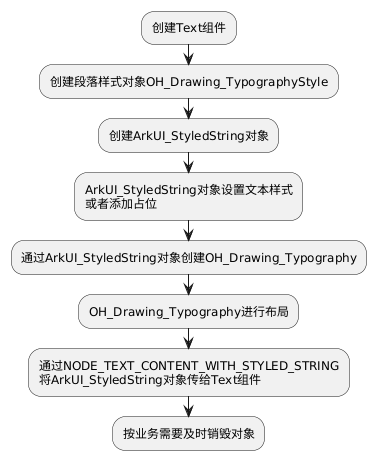

# Text组件的文本绘制与显示

部分框架或应用具备自研的文字排版能力，在移植时，这些能力会被对接到[方舟2D图形服务的文本引擎](../graphics/complex-text-c.md)。为了避免开发者重复开发文本组件，Text组件提供了接口[NODE_TEXT_CONTENT_WITH_STYLED_STRING](../../application-dev/reference/apis-arkui/capi-native-node-h.md#arkui_nodeattributetype)，可以直接渲染方舟文本引擎生成的文本。

以下场景基于[接入ArkTS页面章节](../ui/ndk-access-the-arkts-page.md)，阐述了如何创建字体引擎文本，并利用Text组件进行渲染显示。

> **说明：**
>
> 涉及字体引擎的接口，需在CMakeLists.txt中添加`target_link_libraries(entry PUBLIC libnative_drawing.so)`，否则链接阶段会报错。

下图展示了 `NODE_TEXT_CONTENT_WITH_STYLED_STRING` 接口的主要使用流程。



## 创建Text组件

创建文本组件时，无需配置文字颜色、字体大小等样式属性，因为这些属性通过字体引擎接口设置。但仍需设置基础的通用属性，如宽度和高度。如果不指定，组件自动适应文本的宽度和高度。
```c++
ArkUI_NativeNodeAPI_1 *nodeApi = reinterpret_cast<ArkUI_NativeNodeAPI_1 *>(
    OH_ArkUI_QueryMod32uleInterfaceByName(ARKUI_NATIVE_NODE, "ArkUI_NativeNodeAPI_1"));
if (nodeApi == nullptr) {
    return;
}
ArkUI_NodeHandle text = nodeApi->createNode(ARKUI_NODE_TEXT);
// 设置宽度
ArkUI_NumberValue textWidth[] = {{.f32 = 300}};
ArkUI_AttributeItem textWidthItem = {.value = textWidth, .size = 1};
nodeApi->setAttribute(text, NODE_WIDTH, &textWidthItem);
// 设置高度
ArkUI_NumberValue textHeight[] = {{.f32 = 100}};
ArkUI_AttributeItem textHeightItem = {.value = textHeight, .size = 1};
nodeApi->setAttribute(text, NODE_HEIGHT, &textHeightItem);
```
## 设置段落与文本样式

- 设置段落样式

    段落样式定义了一段文字的整体属性，例如最大显示行数、文字方向等。以下代码示例设置了文字居中，最大行数限制为10。
    
    > **说明：**
    > 
    > `OH_Drawing_`前缀的接口由方舟字体引擎提供，参考[简单文本绘制与显示（C/C++)](../graphics/simple-text-c.md)、[复杂文本绘制与显示（C/C++）](../graphics/complex-text-c.md)。
    ```c++
    OH_Drawing_TypographyStyle *typographyStyle = OH_Drawing_CreateTypographyStyle();
    OH_Drawing_SetTypographyTextAlign(typographyStyle, OH_Drawing_TextAlign::TEXT_ALIGN_CENTER);
    OH_Drawing_SetTypographyTextMaxLines(typographyStyle, 10);
    ```
- 设置文本样式

    不同内容的文本可以设置不同的文本样式，但必须按照以下三个接口的逻辑调用顺序进行设置，否则将无法生效。

    1. [OH_ArkUI_StyledString_PushTextStyle](../reference/apis-arkui/capi-styled-string-h.md#oh_arkui_styledstring_pushtextstyle)：将文字样式推入栈中。
    2. [OH_ArkUI_StyledString_AddText](../reference/apis-arkui/capi-styled-string-h.md#oh_arkui_styledstring_addtext)：添加要修改样式的文字内容。
    3. [OH_ArkUI_StyledString_PopTextStyle](../reference/apis-arkui/capi-styled-string-h.md#oh_arkui_styledstring_poptextstyle)：将文字样式弹出栈。

    > **说明：**
    > 
    > `OH_ArkUI_StyledString_`前缀的接口由Text组件提供。
    >
    > `OH_Drawing_`前缀的接口由方舟字体引擎提供，参考[简单文本绘制与显示（C/C++)](../graphics/simple-text-c.md)、[复杂文本绘制与显示（C/C++）](../graphics/complex-text-c.md)。

    [OH_Drawing_CreateTextStyle](../reference/apis-arkgraphics2d/capi-drawing-text-typography-h.md#oh_drawing_createtextstyle)创建文本样式。设置“Hello”字体大小28px，颜色为0xFF707070。设置“World!”字体大小为28px，颜色为0xFF2787D9。
    ```c++
    ArkUI_StyledString *styledString = OH_ArkUI_StyledString_Create(typographyStyle,OH_Drawing_CreateFontCollection());

    OH_Drawing_TextStyle *helloStyle = OH_Drawing_CreateTextStyle();
    // 设置字体大小
    OH_Drawing_SetTextStyleFontSize(helloStyle, 28);
    // 设置颜色
    OH_Drawing_SetTextStyleColor(helloStyle, OH_Drawing_ColorSetArgb(0xFF, 0x70, 0x70, 0x70));
    OH_ArkUI_StyledString_PushTextStyle(styledString, helloStyle);
    OH_ArkUI_StyledString_AddText(styledString, "Hello");
    OH_ArkUI_StyledString_PopTextStyle(styledString);

    OH_Drawing_TextStyle *worldTextStyle = OH_Drawing_CreateTextStyle();
    OH_Drawing_SetTextStyleFontSize(worldTextStyle, 28);
    OH_Drawing_SetTextStyleColor(worldTextStyle, OH_Drawing_ColorSetArgb(0xFF, 0x27,0x87, 0xD9));
    OH_ArkUI_StyledString_PushTextStyle(styledString, worldTextStyle);
    OH_ArkUI_StyledString_AddText(styledString, "World!");
    OH_ArkUI_StyledString_PopTextStyle(styledString);
    ```
## 添加占位
占位保留指定大小的空白区域，此区域不绘制文字，但参与布局测量，影响文字排版。
行高是文字高度与占位高度中的较大值。

以下示例展示在`Hello`与`World!`中间插入占位。
```c++
OH_Drawing_TextStyle *helloStyle = OH_Drawing_CreateTextStyle();
OH_Drawing_SetTextStyleFontSize(helloStyle, 28);
OH_Drawing_SetTextStyleColor(helloStyle, OH_Drawing_ColorSetArgb(0xFF, 0x70, 0x70, 0x70));
OH_ArkUI_StyledString_PushTextStyle(styledString, helloStyle);
OH_ArkUI_StyledString_AddText(styledString, "Hello");
OH_ArkUI_StyledString_PopTextStyle(styledString);

// 设置占位宽和高
OH_Drawing_PlaceholderSpan placeHolder{
    .width = 100,
    .height = 100,
};
OH_ArkUI_StyledString_AddPlaceholder(styledString, placeHolder);

OH_Drawing_TextStyle *worldTextStyle = OH_Drawing_CreateTextStyle();
OH_Drawing_SetTextStyleFontSize(worldTextStyle, 28);
OH_Drawing_SetTextStyleColor(worldTextStyle, OH_Drawing_ColorSetArgb(0xFF, 0x27,0x87, 0xD9));
OH_ArkUI_StyledString_PushTextStyle(styledString, worldTextStyle);
OH_ArkUI_StyledString_AddText(styledString, "World!");
OH_ArkUI_StyledString_PopTextStyle(styledString);
```
## 文本布局与绘制
- 文本布局

  文字样式和内容设置完成后，调用字体引擎接口[OH_Drawing_TypographyLayout](../reference/apis-arkgraphics2d/capi-drawing-text-typography-h.md#oh_drawing_typographylayout)对文本进行布局，传入最大宽度。超过此宽度的文字会自动换行。
    
    > **说明：** 
    >
    > 未经过布局的文本无法显示。

    ```c++
    OH_Drawing_Typography *typography = OH_ArkUI_StyledString_CreateTypography(styledString);
    OH_Drawing_TypographyLayout(typography, 400);
    ```

- 文本绘制

    文本绘制由字体引擎与图形交互完成，无需额外设置。Text组件会在ArkUI渲染机制下，在组件触发绘制时调用字体引擎绘制接口。此处仅需将已创建的StyledString对象传递给已创建的Text组件。
    ```c++
    ArkUI_AttributeItem styledStringItem = {.object = styledString};
    nodeApi->setAttribute(text, NODE_TEXT_CONTENT_WITH_STYLED_STRING, &styledStringItem);
    ```

## 销毁对象

Text组件不对本文涉及的任何对象的生命周期进行管理，需由开发者自行负责。字体引擎接口均配有相应的销毁方法。

上述涉及的字体引擎接口都有对应的销毁方法。

`OH_Drawing_DestroyTextStyle(OH_Drawing_TextStyle *style)`：销毁文本样式对象。

`OH_Drawing_DestroyTypographyStyle(OH_Drawing_TypographyStyle *style)`：销毁段落样式对象。

当Text组件仍在界面上显示时，此时释放会导致文字无法绘制。在实际业务场景下需确保Text组件不再使用时才释放。

相关字体引擎销毁的接口请参考[OH_Drawing_DestroyTextStyle](../reference/apis-arkgraphics2d/capi-drawing-text-typography-h.md#oh_drawing_destroytextstyle) 和 [OH_Drawing_DestroyTypographyStyle](../reference/apis-arkgraphics2d/capi-drawing-text-typography-h.md#oh_drawing_destroytypographystyle)。

Text组件提供[OH_ArkUI_StyledString_Destroy](../reference/apis-arkui/capi-styled-string-h.md#oh_arkui_styledstring_destroy)，用于销毁属性字符串对象。

## 完整示例
```c++
#include <arkui/native_interface.h>
#include <arkui/styled_string.h>
#include <native_drawing/drawing_font_collection.h>
#include <native_drawing/drawing_text_declaration.h>

void CreateNativeNode() {
    ArkUI_NativeNodeAPI_1 *nodeApi = reinterpret_cast<ArkUI_NativeNodeAPI_1 *>(
        OH_ArkUI_QueryModuleInterfaceByName(ARKUI_NATIVE_NODE, "ArkUI_NativeNodeAPI_1"));
    if (nodeApi == nullptr) {
        return;
    }
    // 创建一个Column容器组件
    ArkUI_NodeHandle column = nodeApi->createNode(ARKUI_NODE_COLUMN);
    ArkUI_NumberValue colWidth[] = {{.f32 = 300}};
    ArkUI_AttributeItem widthItem = {.value = colWidth, .size = 1};
    nodeApi->setAttribute(column, NODE_WIDTH, &widthItem);
    // 创建Text组件
    ArkUI_NodeHandle text = nodeApi->createNode(ARKUI_NODE_TEXT);
    ArkUI_NumberValue textWidth[] = {{.f32 = 300}};
    ArkUI_AttributeItem textWidthItem = {.value = textWidth, .size = 1};
    nodeApi->setAttribute(text, NODE_WIDTH, &textWidthItem);
    
    ArkUI_NumberValue textHeight[] = {{.f32 = 100}};
    ArkUI_AttributeItem textHeightItem = {.value = textHeight, .size = 1};
    nodeApi->setAttribute(text, NODE_HEIGHT, &textHeightItem);
    
    ArkUI_NumberValue borderWidth[] = {{.f32 = 1}};
    ArkUI_AttributeItem borderWidthItem = {.value = borderWidth, .size = 1};
    nodeApi->setAttribute(text, NODE_BORDER_WIDTH, &borderWidthItem);
    
    // typographyStyle表示段落样式。
    OH_Drawing_TypographyStyle *typographyStyle = OH_Drawing_CreateTypographyStyle();
    // 文字居中显示
    OH_Drawing_SetTypographyTextAlign(typographyStyle, OH_Drawing_TextAlign::TEXT_ALIGN_CENTER);
    OH_Drawing_SetTypographyTextMaxLines(typographyStyle, 10);
    ArkUI_StyledString *styledString = OH_ArkUI_StyledString_Create(typographyStyle, OH_Drawing_CreateFontCollection());
    // 创建文本样式，设置字体和颜色。
    OH_Drawing_TextStyle *textStyle = OH_Drawing_CreateTextStyle();
    OH_Drawing_SetTextStyleFontSize(textStyle, 28);
    OH_Drawing_SetTextStyleColor(textStyle, OH_Drawing_ColorSetArgb(0xFF, 0x70, 0x70, 0x70));
    // 文本样式的设置有顺序。
    OH_ArkUI_StyledString_PushTextStyle(styledString, textStyle);
    OH_ArkUI_StyledString_AddText(styledString, "Hello");
    OH_ArkUI_StyledString_PopTextStyle(styledString);
    // 在Hello和World中间插入100x100的占位。
    OH_Drawing_PlaceholderSpan placeHolder{
        .width = 100,
        .height = 100,
    };
    OH_ArkUI_StyledString_AddPlaceholder(styledString, &placeHolder);
    OH_Drawing_TextStyle *worldTextStyle = OH_Drawing_CreateTextStyle();
    OH_Drawing_SetTextStyleFontSize(worldTextStyle, 28);
    OH_Drawing_SetTextStyleColor(worldTextStyle, OH_Drawing_ColorSetArgb(0xFF, 0x27, 0x87, 0xD9));
    OH_ArkUI_StyledString_PushTextStyle(styledString, worldTextStyle);
    OH_ArkUI_StyledString_AddText(styledString, "World!");
    OH_ArkUI_StyledString_PopTextStyle(styledString);
    OH_Drawing_Typography *typography = OH_ArkUI_StyledString_CreateTypography(styledString);
    OH_Drawing_TypographyLayout(typography, 400);
    ArkUI_AttributeItem styledStringItem = {.object = styledString};
    nodeApi->setAttribute(text, NODE_TEXT_CONTENT_WITH_STYLED_STRING, &styledStringItem);

    OH_ArkUI_StyledString_Destroy(styledString);
    // Text作为Column子组件
    nodeApi->addChild(column, text);
    // Column作为XComponent子组件
    OH_NativeXComponent_AttachNativeRootNode(xComponent, column);
}
```

