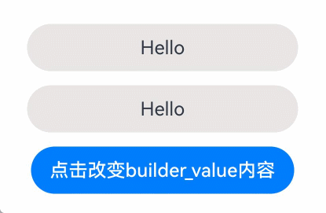
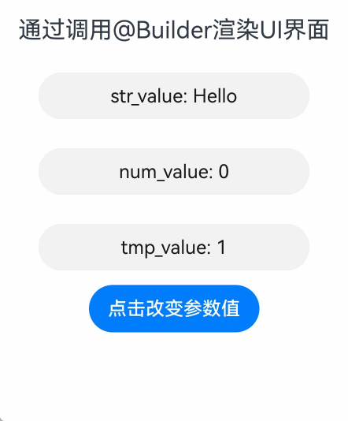
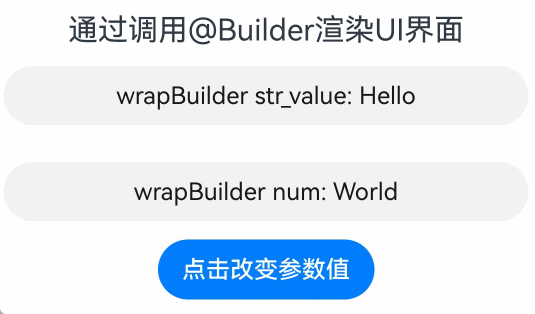
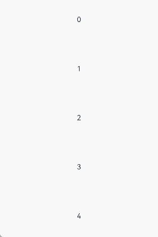
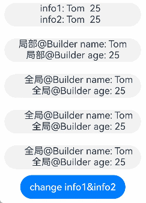

# \@Builder装饰器：自定义构建函数

ArkUI提供轻量的UI元素复用机制\@Builder，其内部UI结构固定，仅与使用方进行数据传递。开发者可将重复使用的UI元素抽象成函数，在build函数中调用。

\@Builder装饰的函数也称为“自定义构建函数”。

在阅读本文档前，建议提前阅读：[基本语法概述](./arkts-basic-syntax-overview.md)、[声明式UI描述](./arkts-declarative-ui-description.md)、[自定义组件-创建自定义组件](./arkts-create-custom-components.md)。

@Builder装饰器和@Component装饰器的区别：

1. @Builder装饰器用于封装可复用的UI结构，通过提取重复的布局代码提高开发效率。该装饰器严格禁止在其内部定义状态变量或使用生命周期函数，必须通过参数传递的方式与调用方完成数据交互。

2. 在ArkUI框架中，@Component装饰器作为封装复杂UI组件的核心机制，允许开发者通过组合多个基础组件来构建可复用的复合界面。该装饰器不仅支持内部状态变量的定义，还能完整管理组件的生命周期。

> **说明：**
>
> 从API version 9开始，该装饰器支持在ArkTS卡片中使用。
>
> 从API version 11开始，该装饰器支持在原子化服务中使用。

## 装饰器使用说明

\@Builder装饰器有两种使用方式，分别是定义在自定义组件内部的[私有自定义构建函数](#私有自定义构建函数)和定义在全局的[全局自定义构建函数](#全局自定义构建函数)。

### 私有自定义构建函数

定义语法：

```ts
@Entry
@Component
struct BuilderDemo {
  @Builder
  showTextBuilder() {
    // @Builder装饰此函数，使其能以链式调用的方式配置并构建Text组件
    Text('Hello World')
      .fontSize(30)
      .fontWeight(FontWeight.Bold)
  }
  @Builder
  showTextValueBuilder(param: string) {
    Text(param)
      .fontSize(30)
      .fontWeight(FontWeight.Bold)
  }
  build() {
    Column() {
      // 无参数
      this.showTextBuilder()
      // 有参数
      this.showTextValueBuilder('Hello @Builder')
    }
  }
}
```

使用方法：

- 允许在自定义组件内定义一个或多个@Builder函数，该函数被认为是该组件的私有、特殊类型的成员函数。

- 私有自定义构建函数允许在自定义组件内、build函数和其他自定义构建函数中调用。

- 在自定义组件中，`this`指代当前所属组件，组件的状态变量可在自定义构建函数内访问。建议通过`this`访问组件的状态变量，而不是通过参数传递。

### 全局自定义构建函数

定义语法：

```ts
@Builder
function showTextBuilder() {
  Text('Hello World')
    .fontSize(30)
    .fontWeight(FontWeight.Bold)
}
@Entry
@Component
struct BuilderDemo {
  build() {
    Column() {
      showTextBuilder()
    }
  }
}
```

- 如果不涉及组件状态变化，建议使用全局的自定义构建函数。

- 全局自定义构建函数允许在build函数和其他自定义构建函数中调用。

## 参数传递规则

自定义构建函数的参数传递有[按值传递](#按值传递参数)和[按引用传递](#按引用传递参数)两种，均需遵守以下规则：

- 参数的类型必须与参数声明的类型一致，不允许undefined、null和返回undefined、null的表达式。

- 在@Builder装饰的函数内部，不允许改变参数值。

- \@Builder内UI语法遵循[UI语法规则](arkts-create-custom-components.md#build函数)。

- 只有当传入一个参数且该参数直接传入对象字面量时，才会按引用传递，其他传递方式均为按值传递。

### 按值传递参数

调用\@Builder装饰的函数默认按值传递。当传递的参数为状态变量时，状态变量的改变不会引起\@Builder函数内的UI刷新。所以当使用状态变量的时候，推荐使用[按引用传递](#按引用传递参数)。

```ts
@Builder function overBuilder(paramA1: string) {
  Row() {
    Text(`UseStateVarByValue: ${paramA1} `)
  }
}
@Entry
@Component
struct Parent {
  @State label: string = 'Hello';
  build() {
    Column() {
      overBuilder(this.label)
    }
  }
}
```

### 按引用传递参数

按引用传递参数时，传递的参数可为状态变量，且状态变量的改变会引起\@Builder函数内的UI刷新。

```ts
class Tmp {
  paramA1: string = '';
}

@Builder function overBuilder(params: Tmp) {
  Row() {
    Text(`UseStateVarByReference: ${params.paramA1} `)
  }
}
@Entry
@Component
struct Parent {
  @State label: string = 'Hello';
  build() {
    Column() {
      // 在父组件中调用overBuilder组件时，
      // 把this.label通过引用传递的方式传给overBuilder组件。
      overBuilder({ paramA1: this.label })
      Button('Click me').onClick(() => {
        // 单击Click me后，UI文本从Hello更改为ArkUI。
        this.label = 'ArkUI';
      })
    }
  }
}
```

## 限制条件

1. \@Builder装饰的函数内部不允许修改参数值，否则框架会抛出运行时错误。但开发者可以在使用@Builder的自定义组件中改变其参数。请参考[在@Builder装饰的函数内部修改入参内容](#在builder装饰的函数内部修改入参内容)。

2. \@Builder按引用传递且仅传入一个参数时，才会触发动态渲染UI。请参考[按引用传递参数](#按引用传递参数)。

3. 如果\@Builder传入的参数是两个或两个以上，不会触发动态渲染UI。请参考[@Builder存在两个或者两个以上参数](#builder存在两个或者两个以上参数)。

4. \@Builder传入的参数中同时包含按值传递和按引用传递，不会触发动态渲染UI。请参考[@Builder存在两个或者两个以上参数](#builder存在两个或者两个以上参数)。

5. \@Builder的参数必须按照对象字面量的形式，把所需属性一一传入，才会触发动态渲染UI。请参考[@Builder存在两个或者两个以上参数](#builder存在两个或者两个以上参数)。


## 使用场景

### 自定义组件内使用自定义构建函数

创建私有的`@Builder`函数，在`Column`中使用`this.builder()`调用。通过`aboutToAppear`生命周期函数和按钮的点击事件更新`builder_value`，实现UI的动态渲染。

```ts
@Entry
@Component
struct PrivateBuilder {
  @State builder_value: string = 'Hello';

  @Builder
  builder() {
    Column() {
      Text(this.builder_value)
        .width(230)
        .height(40)
        .backgroundColor('#ffeae5e5')
        .borderRadius(20)
        .margin(12)
        .textAlign(TextAlign.Center)
    }
  }

  aboutToAppear(): void {
    setTimeout(() => {
      this.builder_value = 'Hello World';
    }, 2000);
  }

  build() {
    Row() {
      Column() {
        Text(this.builder_value)
          .width(230)
          .height(40)
          .backgroundColor('#ffeae5e5')
          .borderRadius(20)
          .textAlign(TextAlign.Center)
        this.builder()
        Button('点击改变builder_value内容')
          .onClick(() => {
            this.builder_value = 'builder_value被点击了';
          })
      }
      .height('100%')
      .width('100%')
    }
  }
}
```
**图1** 示例效果图



### 全局自定义构建函数

创建全局的\@Builder方法，并在Column中使用overBuilder()方式调用。通过对象字面量的形式传递参数，无论是简单类型还是复杂类型，值的改变都会引起UI界面的刷新。

```ts
class ChildTmp {
  val: number = 1;
}

class Tmp {
  str_value: string = 'Hello';
  num_value: number = 0;
  tmp_value: ChildTmp = new ChildTmp();
  arrayTmp_value: Array<ChildTmp> = [];
}

@Builder
function overBuilder(param: Tmp) {
  Column() {
    Text(`str_value: ${param.str_value}`)
      .width(230)
      .height(40)
      .margin(12)
      .backgroundColor('#0d000000')
      .fontColor('#e6000000')
      .borderRadius(20)
      .textAlign(TextAlign.Center)
    Text(`num_value: ${param.num_value}`)
      .width(230)
      .height(40)
      .margin(12)
      .backgroundColor('#0d000000')
      .fontColor('#e6000000')
      .borderRadius(20)
      .textAlign(TextAlign.Center)
    Text(`tmp_value: ${param.tmp_value.val}`)
      .width(230)
      .height(40)
      .margin(12)
      .backgroundColor('#0d000000')
      .fontColor('#e6000000')
      .borderRadius(20)
      .textAlign(TextAlign.Center)
    ForEach(param.arrayTmp_value, (item: ChildTmp) => {
      ListItem() {
        Text(`arrayTmp_value: ${item.val}`)
          .width(230)
          .height(40)
          .margin(12)
          .backgroundColor('#0d000000')
          .fontColor('#e6000000')
          .borderRadius(20)
          .textAlign(TextAlign.Center)
      }
    }, (item: ChildTmp) => JSON.stringify(item))
  }
}

@Entry
@Component
struct Parent {
  @State objParam: Tmp = new Tmp();

  build() {
    Column() {
      Text('通过调用@Builder渲染UI界面')
        .fontSize(20)
        .margin(12)
      overBuilder({
        str_value: this.objParam.str_value,
        num_value: this.objParam.num_value,
        tmp_value: this.objParam.tmp_value,
        arrayTmp_value: this.objParam.arrayTmp_value
      })
      Button('点击改变参数值').onClick(() => {
        this.objParam.str_value = 'Hello World';
        this.objParam.num_value = 1;
        this.objParam.tmp_value.val = 8;
        const child_value: ChildTmp = {
          val: 2
        }
        this.objParam.arrayTmp_value.push(child_value);
      })
    }
    .height('100%')
    .width('100%')
  }
}
```
**图2** 示例效果图



### 修改装饰器修饰的变量触发UI刷新

在该场景中，`@Builder`被用来展示Text组件，不会参与动态UI刷新。Text组件中值的变化是通过使用装饰器的特性，监听到值的改变触发的UI刷新，而不是通过`@Builder`的能力触发的。

```ts
class Tmp {
  str_value: string = 'Hello';
}

@Entry
@Component
struct Parent {
  @State objParam: Tmp = new Tmp();
  @State label: string = 'World';

  @Builder
  privateBuilder() {
    Column() {
      Text(`wrapBuilder str_value: ${this.objParam.str_value}`)
        .width(350)
        .height(40)
        .margin(12)
        .backgroundColor('#0d000000')
        .fontColor('#e6000000')
        .borderRadius(20)
        .textAlign(TextAlign.Center)
      Text(`wrapBuilder num: ${this.label}`)
        .width(350)
        .height(40)
        .margin(12)
        .backgroundColor('#0d000000')
        .fontColor('#e6000000')
        .borderRadius(20)
        .textAlign(TextAlign.Center)
    }
  }

  build() {
    Column() {
      Text('通过调用@Builder渲染UI界面')
        .fontSize(20)
      this.privateBuilder()
      Button('点击改变参数值').onClick(() => {
        this.objParam.str_value = 'str_value Hello World';
        this.label = 'label Hello World';
      })
    }
    .height('100%')
    .width('100%')
  }
}
```
**图3** 示例效果图



### 将@Builder装饰的函数当作customBuilder类型使用

当参数类型为`customBuilder`时，可以传入定义的`@Builder`函数。因为`customBuilder`实际上是`Function(() => any)`或`void`类型，而`@Builder`也是`Function`类型。所以通过传入`@Builder`可以实现特定效果。

```ts
@Builder
function overBuilder() {
  Row() {
    Text('全局 Builder')
      .fontSize(30)
      .fontWeight(FontWeight.Bold)
  }
}

@Entry
@Component
struct customBuilderDemo {
  @State arr: number[] = [0, 1, 2, 3, 4];

  @Builder
  privateBuilder() {
    Row() {
      Text('局部 Builder')
        .fontSize(30)
        .fontWeight(FontWeight.Bold)
    }
  }

  build() {
    Column() {
      List({ space: 10 }) {
        ForEach(this.arr, (item: number) => {
          ListItem() {
            Text(`${item}`)
              .width('100%')
              .height(100)
              .fontSize(16)
              .textAlign(TextAlign.Center)
              .borderRadius(10)
              .backgroundColor(0xFFFFFF)
          }
          .swipeAction({
            start: {
              builder: overBuilder()
            },
            end: {
              builder: () => {
                this.privateBuilder()
              }
            }
          })
        }, (item: number) => JSON.stringify(item))
      }
    }
  }
}
```
**图4** 示例效果图



### 多层\@Builder函数嵌套

在\@Builder方法内调用自定义组件或其他\@Builder方法，以实现多层嵌套。要实现最内层\@Builder的动态UI刷新功能，必须确保每层调用\@Builder时使用按引用传递的方式。这里的[\$$](./arkts-two-way-sync.md)也可以换成其他名称，[\$$](./arkts-two-way-sync.md)不是必须的参数形式。

```ts
class Tmp {
  paramA1: string = '';
}

@Builder
function parentBuilder($$: Tmp) {
  Row() {
    Column() {
      Text(`parentBuilder===${$$.paramA1}`)
        .width(300)
        .height(40)
        .margin(10)
        .backgroundColor('#0d000000')
        .fontColor('#e6000000')
        .borderRadius(20)
        .textAlign(TextAlign.Center)
      HelloComponent({ message: $$.paramA1 })
      childBuilder({ paramA1: $$.paramA1 })
    }
  }
}

@Component
struct HelloComponent {
  @Prop message: string = '';

  build() {
    Row() {
      Text(`HelloComponent===${this.message}`)
        .width(300)
        .height(40)
        .margin(10)
        .backgroundColor('#0d000000')
        .fontColor('#e6000000')
        .borderRadius(20)
        .textAlign(TextAlign.Center)
    }
  }
}

@Builder
function childBuilder($$: Tmp) {
  Row() {
    Column() {
      Text(`childBuilder===${$$.paramA1}`)
        .width(300)
        .height(40)
        .margin(10)
        .backgroundColor('#0d000000')
        .fontColor('#e6000000')
        .borderRadius(20)
        .textAlign(TextAlign.Center)
      HelloChildComponent({ message: $$.paramA1 })
      grandsonBuilder({ paramA1: $$.paramA1 })
    }
  }
}

@Component
struct HelloChildComponent {
  @Prop message: string = '';

  build() {
    Row() {
      Text(`HelloChildComponent===${this.message}`)
        .width(300)
        .height(40)
        .margin(10)
        .backgroundColor('#0d000000')
        .fontColor('#e6000000')
        .borderRadius(20)
        .textAlign(TextAlign.Center)
    }
  }
}

@Builder
function grandsonBuilder($$: Tmp) {
  Row() {
    Column() {
      Text(`grandsonBuilder===${$$.paramA1}`)
        .width(300)
        .height(40)
        .margin(10)
        .backgroundColor('#0d000000')
        .fontColor('#e6000000')
        .borderRadius(20)
        .textAlign(TextAlign.Center)
      HelloGrandsonComponent({ message: $$.paramA1 })
    }
  }
}

@Component
struct HelloGrandsonComponent {
  @Prop message: string;

  build() {
    Row() {
      Text(`HelloGrandsonComponent===${this.message}`)
        .width(300)
        .height(40)
        .margin(10)
        .backgroundColor('#0d000000')
        .fontColor('#e6000000')
        .borderRadius(20)
        .textAlign(TextAlign.Center)
    }
  }
}

@Entry
@Component
struct Parent {
  @State label: string = 'Hello';

  build() {
    Column() {
      parentBuilder({ paramA1: this.label })
      Button('Click me').onClick(() => {
        this.label = 'ArkUI';
      })
    }
    .height('100%')
    .width('100%')
  }
}
```
**图5** 示例效果图


### \@Builder函数联合V2装饰器

使用全局`@Builder`和局部`@Builder`在`@ComponentV2`装饰的自定义组件中调用，配合`@ObservedV2`和`@Trace`装饰器来监听值的变化，从而触发UI刷新。

```ts
@ObservedV2
class Info {
  @Trace name: string = '';
  @Trace age: number = 0;
}

@Builder
function overBuilder(param: Info) {
  Column() {
    Text(`全局@Builder name :${param.name}`)
    Text(`全局@Builder age :${param.age}`)
  }
  .width(230)
  .height(40)
  .margin(10)
  .padding({ left: 20 })
  .backgroundColor('#0d000000')
  .borderRadius(20)
}

@ComponentV2
struct ChildPage {
  @Require @Param childInfo: Info;

  build() {
    Column() {
      overBuilder({ name: this.childInfo.name, age: this.childInfo.age })
    }
  }
}

@Entry
@ComponentV2
struct ParentPage {
  info1: Info = { name: "Tom", age: 25 };
  @Local info2: Info = { name: "Tom", age: 25 };

  @Builder
  privateBuilder() {
    Column() {
      Text(`局部@Builder name :${this.info1.name}`)
      Text(`局部@Builder age :${this.info1.age}`)
    }
    .width(230)
    .height(40)
    .margin(10)
    .backgroundColor('#0d000000')
    .borderRadius(20)
  }

  build() {
    Column() {
      Flex() {
        Column() {
          Text(`info1: ${this.info1.name}  ${this.info1.age}`) // Text1
          Text(`info2: ${this.info2.name}  ${this.info2.age}`) // Text2
        }
      }
      .width(230)
      .height(40)
      .margin(10)
      .padding({ left: 60 })
      .backgroundColor('#0d000000')
      .borderRadius(20)

      this.privateBuilder() // 调用局部@Builder
      overBuilder({ name: this.info2.name, age: this.info2.age }) // 调用全局@Builder
      ChildPage({ childInfo: this.info1 }) // 调用自定义组件
      ChildPage({ childInfo: this.info2 }) // 调用自定义组件
      Button("change info1&info2")
        .onClick(() => {
          this.info1 = { name: "Cat", age: 18 }; // Text1不会刷新，原因是没有装饰器修饰监听不到值的改变。
          this.info2 = { name: "Cat", age: 18 }; // Text2会刷新，原因是有装饰器修饰，可以监听到值的改变。
        })
    }
    .height('100%')
    .width('100%')
  }
}
```
**图6** 示例效果图



### 跨组件复用的全局\@Builder

在跨组件的场景中调用全局\@Builder，通过按引用传递的方式传递参数，可以实现UI的动态刷新功能。

```ts
class Tmp {
  componentName: string = 'Child';
}

@Builder
function itemBuilder(params: Tmp) {
  Column() {
    Text(`Builder ===${params.componentName}`)
      .width(300)
      .height(40)
      .margin(10)
      .backgroundColor('#0d000000')
      .fontColor('#e6000000')
      .borderRadius(20)
      .textAlign(TextAlign.Center)
  }
}

@Entry
@Component
struct ReusablePage {
  @State switchFlag: boolean = true;

  build() {
    Column() {
      if (this.switchFlag) {
        ReusableChildPage({ message: 'Child' })
      } else {
        ReusableChildTwoPage({ message: 'ChildTwo' })
      }
      Button('Click me')
        .onClick(() => {
          this.switchFlag = !this.switchFlag;
        })
    }
    .height('100%')
    .width('100%')
  }
}

@Reusable
@Component
struct ReusableChildPage {
  @State message: string = 'Child';

  aboutToReuse(params: Record<string, ESObject>): void {
    console.info('Recycle ====Child');
    this.message = params.message;
  }

  build() {
    Column() {
      Text(`ReusableChildPage ===${this.message}`)
        .width(300)
        .height(40)
        .margin(10)
        .backgroundColor('#0d000000')
        .fontColor('#e6000000')
        .borderRadius(20)
        .textAlign(TextAlign.Center)
      itemBuilder({ componentName: this.message })
    }
  }
}

@Reusable
@Component
struct ReusableChildTwoPage {
  @State message: string = 'ChildTwo';

  aboutToReuse(params: Record<string, ESObject>): void {
    console.info('Recycle ====ChildTwo');
    this.message = params.message;
  }

  build() {
    Column() {
      Text(`ReusableChildTwoPage ===${this.message}`)
        .width(300)
        .height(40)
        .margin(10)
        .backgroundColor('#0d000000')
        .fontColor('#e6000000')
        .borderRadius(20)
        .textAlign(TextAlign.Center)
      itemBuilder({ componentName: this.message })
    }
  }
}
```
**图7** 示例效果图


## 常见问题

### \@Builder存在两个或者两个以上参数

当存在两个或两个以上的参数时，即使通过对象字面量形式传递，值的改变也不会触发UI刷新。

【反例】

```ts
class GlobalTmp {
  str_value: string = 'Hello';
}

@Builder function overBuilder(param: GlobalTmp, num: number) {
  Column() {
    Text(`str_value: ${param.str_value}`)
    Text(`num: ${num}`)
  }
}

@Entry
@Component
struct Parent {
  @State objParam: GlobalTmp = new GlobalTmp();
  @State num: number = 0;
  build() {
    Column() {
      Text('通过调用@Builder渲染UI界面')
        .fontSize(20)
      // 使用了两个参数，用法错误。
      overBuilder({str_value: this.objParam.str_value}, this.num)
      Line()
        .width('100%')
        .height(10)
        .backgroundColor('#000000').margin(10)
      Button('点击改变参数值').onClick(() => {
        this.objParam.str_value = 'Hello World';
        this.num = 1;
      })
    }
  }
}
```

【反例】

```ts
class GlobalTmp {
  str_value: string = 'Hello';
}
class SecondTmp {
  num_value: number = 0;
}
@Builder function overBuilder(param: GlobalTmp, num: SecondTmp) {
  Column() {
    Text(`str_value: ${param.str_value}`)
    Text(`num: ${num.num_value}`)
  }
}

@Entry
@Component
struct Parent {
  @State strParam: GlobalTmp = new GlobalTmp();
  @State numParam: SecondTmp = new SecondTmp();
  build() {
    Column() {
      Text('通过调用@Builder渲染UI界面')
        .fontSize(20)
      // 使用了两个参数，用法错误。
      overBuilder({str_value: this.strParam.str_value}, {num_value: this.numParam.num_value})
      Line()
        .width('100%')
        .height(10)
        .backgroundColor('#000000').margin(10)
      Button('点击改变参数值').onClick(() => {
        this.strParam.str_value = 'Hello World';
        this.numParam.num_value = 1;
      })
    }
  }
}
```

\@Builder只接受一个参数，当传入一个参数的时候，通过对象字面量的形式传递，值的改变会引起UI的刷新。

【正例】

```ts
class GlobalTmp {
  str_value: string = 'Hello';
  num_value: number = 0;
}
@Builder function overBuilder(param: GlobalTmp) {
  Column() {
    Text(`str_value: ${param.str_value}`)
    Text(`num: ${param.num_value}`)
  }
}

@Entry
@Component
struct Parent {
  @State objParam: GlobalTmp = new GlobalTmp();
  build() {
    Column() {
      Text('通过调用@Builder渲染UI界面')
        .fontSize(20)
      overBuilder({str_value: this.objParam.str_value, num_value: this.objParam.num_value})
      Line()
        .width('100%')
        .height(10)
        .backgroundColor('#000000').margin(10)
      Button('点击改变参数值').onClick(() => {
        this.objParam.str_value = 'Hello World';
        this.objParam.num_value = 1;
      })
    }
  }
}
```

### 使用@ComponentV2装饰器触发动态刷新

在@ComponentV2装饰器装饰的自定义组件中配合@ObservedV2和@Trace装饰器，通过按值传递的方式可以实现UI刷新功能。

【反例】

在@ComponentV2装饰的自定义组件中，使用简单数据类型不可以触发UI的刷新。

```ts
@ObservedV2
class ParamTmp {
  @Trace count : number = 0;
}

@Builder
function renderNumber(paramNum: number) {
  Text(`paramNum : ${paramNum}`)
    .fontSize(30)
    .fontWeight(FontWeight.Bold)
}

@Entry
@ComponentV2
struct PageBuilder {
  @Local class_value: ParamTmp = new ParamTmp();
  // 此处使用简单数据类型不支持刷新UI的能力。
  @Local num_value: number = 0;
  private progressTimer: number = -1;

  aboutToAppear(): void {
    this.progressTimer = setInterval(() => {
      if (this.class_value.count < 100) {
        this.class_value.count += 5;
        this.num_value += 5;
      } else {
        clearInterval(this.progressTimer);
      }
    }, 500);
  }

  build() {
    Column() {
      renderNumber(this.num_value)
    }
    .width('100%')
    .height('100%')
    .padding(50)
  }
}
```

【正例】

在@ComponentV2装饰器装饰的自定义组件中，只有使用@ObservedV2装饰的ParamTmp类和使用@Trace装饰的count属性才能触发UI刷新。

```ts
@ObservedV2
class ParamTmp {
  @Trace count : number = 0;
}

@Builder
function renderText(param: ParamTmp) {
  Column() {
    Text(`param : ${param.count}`)
      .fontSize(20)
      .fontWeight(FontWeight.Bold)
  }
}

@Builder
function renderMap(paramMap: Map<string,number>) {
  Text(`paramMap : ${paramMap.get('name')}`)
    .fontSize(20)
    .fontWeight(FontWeight.Bold)
}

@Builder
function renderSet(paramSet: Set<number>) {
  Text(`paramSet : ${paramSet.size}`)
    .fontSize(20)
    .fontWeight(FontWeight.Bold)
}

@Builder
function renderNumberArr(paramNumArr: number[]) {
  Text(`paramNumArr : ${paramNumArr[0]}`)
    .fontSize(20)
    .fontWeight(FontWeight.Bold)
}

@Entry
@ComponentV2
struct PageBuilder {
  @Local builderParams: ParamTmp = new ParamTmp();
  @Local map_value: Map<string,number> = new Map();
  @Local set_value: Set<number> = new Set([0]);
  @Local numArr_value: number[] = [0];
  private progressTimer: number = -1;

  aboutToAppear(): void {
    this.progressTimer = setInterval(() => {
      if (this.builderParams.count < 100) {
        this.builderParams.count += 5;
        this.map_value.set('name', this.builderParams.count);
        this.set_value.add(this.builderParams.count);
        this.numArr_value[0] = this.builderParams.count;
      } else {
        clearInterval(this.progressTimer);
      }
    }, 500);
  }

  @Builder
  localBuilder() {
    Column() {
      Text(`localBuilder : ${this.builderParams.count}`)
        .fontSize(20)
        .fontWeight(FontWeight.Bold)
    }
  }

  build() {
    Column() {
      this.localBuilder()
      Text(`builderParams :${this.builderParams.count}`)
        .fontSize(20)
        .fontWeight(FontWeight.Bold)
      renderText(this.builderParams)
      renderText({ count: this.builderParams.count })
      renderMap(this.map_value)
      renderSet(this.set_value)
      renderNumberArr(this.numArr_value)
    }
    .width('100%')
    .height('100%')
  }
}
```

### 在\@Builder装饰的函数内部修改入参内容

【反例】

```ts
interface Temp {
  paramA: string;
}

@Builder function overBuilder(param: Temp) {
  Row() {
    Column() {
      Button(`overBuilder === ${param.paramA}`)
        .onClick(() => {
          // 错误写法，不允许在@Builder装饰的函数内部修改参数值
          param.paramA = 'Yes';
      })
    }
  }
}

@Entry
@Component
struct Parent {
  @State label: string = 'Hello';

  build() {
    Column() {
      overBuilder({paramA: this.label})
      Button('click me')
        .onClick(() => {
          this.label = 'ArkUI';
        })
    }
  }
}
```

【正例】

```ts
interface Temp {
  paramA: string;
}

@Builder function overBuilder(param: Temp) {
  Row() {
    Column() {
      Button(`overBuilder === ${param.paramA}`)
    }
  }
}

@Entry
@Component
struct Parent {
  @State label: string = 'Hello';

  build() {
    Column() {
      overBuilder({paramA: this.label})
      Button('click me')
        .onClick(() => {
          this.label = 'ArkUI';
        })
    }
  }
}
```

### 在\@Builder内创建自定义组件传递参数不刷新问题

在parentBuilder函数中创建自定义组件HelloComponent，传递参数为class对象并修改对象内的值时，UI不会触发刷新功能。

【反例】

```ts
class Tmp {
  name: string = 'Hello';
  age: number = 16;
}

@Builder
function parentBuilder(params: Tmp) {
  Row() {
    Column() {
      Text(`parentBuilder===${params.name}===${params.age}`)
        .fontSize(20)
        .fontWeight(FontWeight.Bold)
      // 此写法不属于按引用传递方式，用法错误导致UI不刷新。
      HelloComponent({ info: params })
    }
  }
}

@Component
struct HelloComponent {
  @Prop info: Tmp = new Tmp();

  build() {
    Row() {
      Text(`HelloComponent===${this.info.name}===${this.info.age}`)
        .fontSize(20)
        .fontWeight(FontWeight.Bold)
    }
  }
}

@Entry
@Component
struct ParentPage {
  @State nameValue: string = '张三';
  @State ageValue: number = 18;

  build() {
    Column() {
      parentBuilder({ name: this.nameValue, age: this.ageValue })
      Button('Click me')
        .onClick(() => {
          // 此处修改内容时，不会引起HelloComponent处的变化
          this.nameValue = '李四';
          this.ageValue = 20;
        })
    }
    .height('100%')
    .width('100%')
  }
}
```

在parentBuilder函数中创建自定义组件HelloComponent，传递参数为对象字面量形式并修改对象内的值时，UI触发刷新功能。

【正例】

```ts
class Tmp {
  name: string = 'Hello';
  age: number = 16;
}

@Builder
function parentBuilder(params: Tmp) {
  Row() {
    Column() {
      Text(`parentBuilder===${params.name}===${params.age}`)
        .fontSize(20)
        .fontWeight(FontWeight.Bold)
      // 将整个对象拆分开变成简单类型，属于按引用传递方式，更改属性能够触发UI刷新。
      HelloComponent({ childName: params.name, childAge: params.age })
    }
  }
}

@Component
struct HelloComponent {
  @Prop childName: string = '';
  @Prop childAge: number = 0;

  build() {
    Row() {
      Text(`HelloComponent===${this.childName}===${this.childAge}`)
        .fontSize(20)
        .fontWeight(FontWeight.Bold)
    }
  }
}

@Entry
@Component
struct ParentPage {
  @State nameValue: string = '张三';
  @State ageValue: number = 18;

  build() {
    Column() {
      parentBuilder({ name: this.nameValue, age: this.ageValue })
      Button('Click me')
        .onClick(() => {
          // 此处修改内容时，会引起HelloComponent处的变化
          this.nameValue = '李四';
          this.ageValue = 20;
        })
    }
    .height('100%')
    .width('100%')
  }
}
```