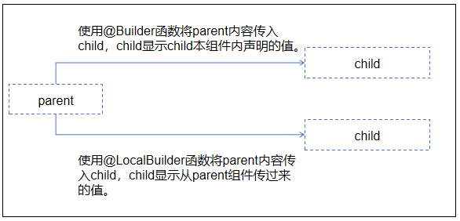

# \@LocalBuilder装饰器： 维持组件关系

开发者跨组件传递局部@Builder时， `this` 指向可能发生偏移，导致访问到的组件关系错误。为了纠正组件的错误关系，会使用特定函数来修正执行上下文，组件间关系维护起来变得复杂。为了解决this指向问题，ArkUI引入了@LocalBuilder装饰器。@LocalBuilder不仅具备局部@Builder的功能，还能更精确的确定组件间的关系。

在阅读本文档前，建议提前阅读：[\@Builder](./arkts-builder.md)。

> **说明：**
>
> 从API version 12开始支持。
>
> 

## 装饰器使用说明


### 自定义组件内自定义构建函数

定义的语法：


```ts
@LocalBuilder MyBuilderFunction() { ... }
```

使用方法：


```ts
this.MyBuilderFunction()
```

- 允许在自定义组件内定义一个或多个@LocalBuilder方法，该方法被认为是该组件的私有、特殊类型的成员函数。
- 自定义构建函数可以在所属组件的build方法和其他自定义构建函数中调用，但不允许在组件外调用。
- 在自定义函数体中，this指代当前所属组件，组件的状态变量可以在自定义构建函数内访问。建议通过this访问自定义组件的状态变量而不是参数传递。

## 限制条件

- @LocalBuilder只能在所属组件内声明，不允许全局声明。

- @LocalBuilder不能被内置装饰器和自定义装饰器使用。

- 自定义组件内的静态方法不能和@LocalBuilder一起使用。

## @LocalBuilder和局部@Builder使用区别

跨组件传递局部@Builder方法时，会使用一些函数来改变this的指向，比如bind(this)，使用bind(this)之后，当前组件的和子组件关系会改变。但是@LocalBuilder是否使用bind(this)，都不会改变组件间的关系。 详细请参考[@LocalBuilder和@Builder区别说明](arkts-localBuilder.md#localbuilder和builder区别说明)。

 

> **说明：**
>
> bind()方法创建一个新的函数，称为绑定函数，当调用者绑定bind()时，该绑定函数会以创建时传入的第一个this作为原函数的this。

## 参数传递规则

@LocalBuilder函数的参数传递有[按值传递](#按值传递参数)和[按引用传递](#按引用传递参数)两种，均需遵守以下规则：

- 参数的类型必须与参数声明的类型一致，不允许undefined、null和返回undefined、null的表达式。

- 在@LocalBuilder修饰的函数内部，不允许改变参数值。

- \@LocalBuilder内UI语法遵循[UI语法规则](arkts-create-custom-components.md#build函数)。

- 只有传入一个参数，且参数需要直接传入对象字面量才会按引用传递该参数，其余传递方式均为按值传递。


### 按引用传递参数

按引用传递参数时，传递的参数可为状态变量，且状态变量的改变会引起\@LocalBuilder方法内的UI刷新。

特别说明，若\@LocalBuilder函数和$$参数一起使用，子组件调用父组件的@LocalBuilder函数，传入的参数发生变化，不会引起\@LocalBuilder方法内的UI刷新。

使用场景：

组件Parent内的@LocalBuilder方法在build函数内调用，按键值对写法进行传值，当点击Click me 时，@LocalBuilder内的Text文本内容会随着状态变量内容的改变而改变。

```ts
class ReferenceType {
  paramString: string = '';
}

@Entry
@Component
struct Parent {
  @State variableValue: string = 'Hello World';

  @LocalBuilder
  citeLocalBuilder(params: ReferenceType) {
    Row() {
      Text(`UseStateVarByReference: ${params.paramString}`)
    }
  };

  build() {
    Column() {
      this.citeLocalBuilder({ paramString: this.variableValue })
      Button('Click me').onClick(() => {
        this.variableValue = 'Hi World';
      })
    }
  }
}
```

按引用传递参数时，如果在\@LocalBuilder方法内调用自定义组件，ArkUI提供[$$](arkts-two-way-sync.md)作为按引用传递参数的范式。

使用场景：

组件Parent内的@LocalBuilder方法内调用自定义组件，且按照引用传递参数将值传递到自定义组件，当Parent组件内状态变量值发生变化时，@LocalBuilder方法内的自定义组件HelloComponent的message值也会发生变化。

```ts
class ReferenceType {
  paramString: string = '';
}

@Component
struct HelloComponent {
  @Prop message: string;

  build() {
    Row() {
      Text(`HelloComponent===${this.message}`)
    }
  }
}

@Entry
@Component
struct Parent {
  @State variableValue: string = 'Hello World';

  @LocalBuilder
  citeLocalBuilder($$: ReferenceType) {
    Row() {
      Column() {
        Text(`citeLocalBuilder===${$$.paramString}`)
        HelloComponent({ message: $$.paramString })
      }
    }
  }

  build() {
    Column() {
      this.citeLocalBuilder({ paramString: this.variableValue })
      Button('Click me').onClick(() => {
        this.variableValue = 'Hi World';
      })
    }
  }
}
```

子组件引用父组件的@LocalBuilder函数，传入的参数为状态变量，状态变量的改变不会引发@LocalBuilder方法内的UI刷新，原因是@Localbuilder装饰的函数绑定在父组件上，状态变量刷新机制是刷新本组件以及其子组件，对父组件无影响，故无法引发刷新。若使用@Builder修饰则可引发刷新，原因是@Builder改变了函数的this指向，此时函数被绑定到子组件上，故能引发UI刷新。


使用场景：

组件Child将状态变量传递到Parent的@Builder和@LocalBuilder函数内，在@Builder的函数内，this指向Child，参数变化能引发UI刷新，在@LocalBuilder函数内，this指向Parent，参数变化不能引发UI刷新。若@LocalBuilder函数内引用Parent的状态变量发生变化，UI能正常刷新。

```ts
class Data {
  size: number = 0;
}

@Entry
@Component
struct Parent {
  label: string = 'parent';
  @State data: Data = new Data();

  @Builder
  componentBuilder($$: Data) {
    Text(`builder + $$`)
    Text(`${'this -> ' + this.label}`)
    Text(`${'size : ' + $$.size}`)
    Text(`------------------------`)
  }

  @LocalBuilder
  componentLocalBuilder($$: Data) {
    Text(`LocalBuilder + $$ data`)
    Text(`${'this -> ' + this.label}`)
    Text(`${'size : ' + $$.size}`)
    Text(`------------------------`)
  }

  @LocalBuilder
  contentLocalBuilderNoArgument() {
    Text(`LocalBuilder + local data`)
    Text(`${'this -> ' + this.label}`)
    Text(`${'size : ' + this.data.size}`)
    Text(`------------------------`)
  }

  build() {
    Column() {
      Child({
        contentBuilder: this.componentBuilder,
        contentLocalBuilder: this.componentLocalBuilder,
        contentLocalBuilderNoArgument: this.contentLocalBuilderNoArgument,
        data: this.data
      })
    }
  }
}

@Component
struct Child {
  label: string = 'child';
  @Builder customBuilder() {};
  @BuilderParam contentBuilder: ((data: Data) => void) = this.customBuilder;
  @BuilderParam contentLocalBuilder: ((data: Data) => void) = this.customBuilder;
  @BuilderParam contentLocalBuilderNoArgument: (() => void) = this.customBuilder;
  @Link data: Data;

  build() {
    Column() {
      this.contentBuilder({ size: this.data.size })
      this.contentLocalBuilder({ size: this.data.size })
      this.contentLocalBuilderNoArgument()
      Button("add child size").onClick(() => {
        this.data.size += 1;
      })
    }
  }
}
```

### 按值传递参数

调用\@LocalBuilder装饰的函数默认按值传递。当传递的参数为状态变量时，状态变量的改变不会引起\@LocalBuilder方法内的UI刷新。所以当使用状态变量的时候，推荐使用[按引用传递](#按引用传递参数)。

使用场景：

组件Parent将@State修饰的label值按照函数传参方式传递到@LocalBuilder函数内，此时@LocalBuilder函数获取到的值为普通变量值，所以改变@State修饰的label值时，@LocalBuilder函数内的值不会发生改变。


```ts
@Entry
@Component
struct Parent {
  @State label: string = 'Hello';

  @LocalBuilder
  citeLocalBuilder(paramA1: string) {
    Row() {
      Text(`UseStateVarByValue: ${paramA1}`)
    }
  }

  build() {
    Column() {
      this.citeLocalBuilder(this.label)
    }
  }
}
```

## @LocalBuilder和@Builder区别说明

函数componentBuilder被@Builder修饰时，显示效果是 “Child”，函数componentBuilder被@LocalBuilder修饰时，显示效果是“Parent”。

说明：

@Builder componentBuilder()通过this.componentBuilder的形式传给子组件@BuilderParam customBuilderParam，this指向在Child的label，即“Child”。

@LocalBuilder componentBuilder()通过this.componentBuilder的形式传给子组件@BuilderParam customBuilderParam，this指向Parent的label，即“Parent”。

```ts
@Component
struct Child {
  label: string = 'Child';
  @BuilderParam customBuilderParam: () => void;

  build() {
    Column() {
      this.customBuilderParam()
    }
  }
}

@Entry
@Component
struct Parent {
  label: string = 'Parent';

  @Builder componentBuilder() {
    Text(`${this.label}`)
  }

  // @LocalBuilder componentBuilder() {
  //   Text(`${this.label}`)
  // }

  build() {
    Column() {
      Child({ customBuilderParam: this.componentBuilder })
    }
  }
}
```

## 使用场景

### @LocalBuilder在@ComponentV2修饰的自定义组件中使用

使用局部的@LocalBuilder在@ComponentV2修饰的自定义组件中调用，修改变量触发UI刷新。

```ts
@ObservedV2
class Info {
  @Trace name: string = '';
  @Trace age: number = 0;
}

@ComponentV2
struct ChildPage {
  @Require @Param childInfo: Info;
  build() {
    Column() {
      Text(`自定义组件 name :${this.childInfo.name}`)
        .fontSize(20)
        .fontWeight(FontWeight.Bold)
      Text(`自定义组件 age :${this.childInfo.age}`)
        .fontSize(20)
        .fontWeight(FontWeight.Bold)
    }
  }
}

@Entry
@ComponentV2
struct ParentPage {
  info1: Info = { name: "Tom", age: 25 };
  @Local info2: Info = { name: "Tom", age: 25 };

  @LocalBuilder
  privateBuilder() {
    Column() {
      Text(`局部LocalBuilder@Builder name :${this.info1.name}`)
        .fontSize(20)
        .fontWeight(FontWeight.Bold)
      Text(`局部LocalBuilder@Builder age :${this.info1.age}`)
        .fontSize(20)
        .fontWeight(FontWeight.Bold)
    }
  }

  @LocalBuilder
  privateBuilderSecond() {
    Column() {
      Text(`局部LocalBuilder@Builder name :${this.info2.name}`)
        .fontSize(20)
        .fontWeight(FontWeight.Bold)
      Text(`局部LocalBuilder@Builder age :${this.info2.age}`)
        .fontSize(20)
        .fontWeight(FontWeight.Bold)
    }
  }
  build() {
    Column() {
      Text(`info1: ${this.info1.name}  ${this.info1.age}`) // Text1
        .fontSize(30)
        .fontWeight(FontWeight.Bold)
      this.privateBuilder() // 调用局部@Builder
      Line()
        .width('100%')
        .height(10)
        .backgroundColor('#000000').margin(10)
      Text(`info2: ${this.info2.name}  ${this.info2.age}`) // Text2
        .fontSize(30)
        .fontWeight(FontWeight.Bold)
      this.privateBuilderSecond() // 调用局部@Builder
      Line()
        .width('100%')
        .height(10)
        .backgroundColor('#000000').margin(10)
      Text(`info1: ${this.info1.name}  ${this.info1.age}`) // Text1
        .fontSize(30)
        .fontWeight(FontWeight.Bold)
      ChildPage({ childInfo: this.info1}) // 调用自定义组件
      Line()
        .width('100%')
        .height(10)
        .backgroundColor('#000000').margin(10)
      Text(`info2: ${this.info2.name}  ${this.info2.age}`) // Text2
        .fontSize(30)
        .fontWeight(FontWeight.Bold)
      ChildPage({ childInfo: this.info2}) // 调用自定义组件
      Line()
        .width('100%')
        .height(10)
        .backgroundColor('#000000').margin(10)
      Button("change info1&info2")
        .onClick(() => {
          this.info1 = { name: "Cat", age: 18}; // Text1不会刷新，原因是没有装饰器修饰监听不到值的改变。
          this.info2 = { name: "Cat", age: 18}; // Text2会刷新，原因是有装饰器修饰，可以监听到值的改变。
        })
    }
  }
}
```