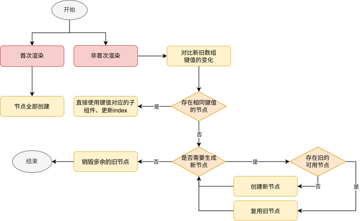
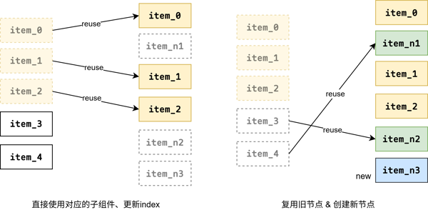
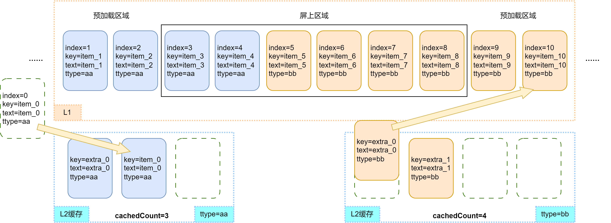
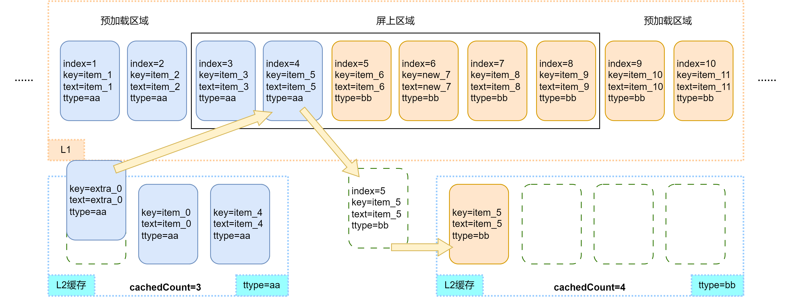
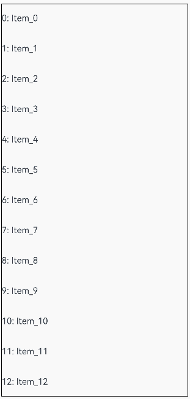
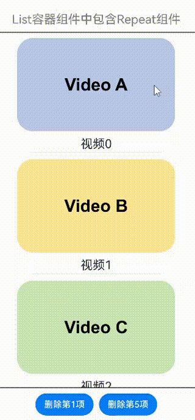
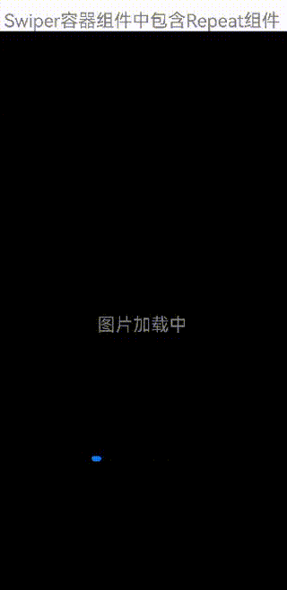

# Repeat：可复用的循环渲染

> **说明：**
> 
> Repeat从API version 12开始支持。
> 
> 本文档仅为开发者指南。API参数说明见：[Repeat API参数说明](../../reference/apis-arkui/arkui-ts/ts-rendering-control-repeat.md)。

## 概述

Repeat基于数组类型数据来进行循环渲染，一般与容器组件配合使用。Repeat组件包含两种模式：**non-virtualScroll模式**和**virtualScroll模式**。

- **non-virtualScroll模式**：Repeat在初始化页面时加载列表中的所有子组件，适合**短数据列表/组件全部加载**的场景。详细描述见[non-virtualScroll模式](#non-virtualscroll模式)。
- **virtualScroll模式**（开启[virtualScroll](../../reference/apis-arkui/arkui-ts/ts-rendering-control-repeat.md#virtualscroll)开关）：Repeat根据容器组件的**有效加载范围（可视区域+预加载区域）** 加载子组件。当容器滑动/数组改变时，Repeat会根据父容器组件传递的参数重新计算有效加载范围，实时管理列表节点的创建与销毁。
<br/>该模式适合**需要懒加载的长数据列表/通过组件复用优化性能表现**的场景。详细描述见[virtualScroll模式](#virtualscroll模式)。

> **说明：**
> 
> Repeat与ForEach、LazyForEach的区别：
> 
> - 相较于[ForEach](arkts-rendering-control-foreach.md)组件，non-virtualScroll模式在以下两个维度实现了优化升级：首先，针对特定数组更新场景的渲染性能进行了优化；其次，将子组件的内容/索引管理职责转移至框架层面。
> - 相较于[LazyForEach](arkts-rendering-control-lazyforeach.md)组件，virtualScroll模式直接监听状态变量的变化，而LazyForEach需要开发者实现[IDataSource](../../reference/apis-arkui/arkui-ts/ts-rendering-control-lazyforeach.md#idatasource10)接口，手动管理子组件内容/索引的修改。除此之外，Repeat还增强了节点复用能力，提高了长列表滑动和数据更新的渲染性能。Repeat增加了模板（template）的能力，在同一个数组中，根据开发者自定义的模板类型（template type）渲染不同的子组件。

下面的示例代码使用Repeat组件的virtualScroll模式进行循环渲染。

```ts
// 在List容器组件中使用Repeat virtualScroll模式
@Entry
@ComponentV2 // 推荐使用V2装饰器
struct RepeatExample {
  @Local dataArr: Array<string> = []; // 数据源

  aboutToAppear(): void {
    for (let i = 0; i < 50; i++) {
      this.dataArr.push(`data_${i}`); // 为数组添加一些数据
    }
  }

  build() {
    Column() {
      List() {
        Repeat<string>(this.dataArr)
          .each((ri: RepeatItem<string>) => { // 默认模板
            ListItem() {
              Text('each_A_' + ri.item).fontSize(30).fontColor(Color.Red) // 文本颜色为红色
            }
          })
          .key((item: string, index: number): string => item) // 键值生成函数
          .virtualScroll({ totalCount: this.dataArr.length }) // 打开virtualScroll模式，totalCount为期望加载的数据长度
          .templateId((item: string, index: number): string => { // 根据返回值寻找对应的模板子组件进行渲染
            return index <= 4 ? 'A' : (index <= 10 ? 'B' : ''); // 前5个节点模板为A，接下来的5个为B，其余为默认模板
          })
          .template('A', (ri: RepeatItem<string>) => { // 'A'模板
            ListItem() {
              Text('ttype_A_' + ri.item).fontSize(30).fontColor(Color.Green) // 文本颜色为绿色
            }
          }, { cachedCount: 3 }) // 'A'模板的缓存列表容量为3
          .template('B', (ri: RepeatItem<string>) => { // 'B'模板
            ListItem() {
              Text('ttype_B_' + ri.item).fontSize(30).fontColor(Color.Blue) // 文本颜色为蓝色
            }
          }, { cachedCount: 4 }) // 'B'模板的缓存列表容量为4
      }
      .cachedCount(2) // 容器组件的预加载区域大小
      .height('70%')
      .border({ width: 1 }) // 边框
    }
  }
}
```

运行后界面如下图所示。


## 使用限制

- Repeat一般与容器组件配合使用，子组件应当是允许包含在容器组件中的子组件，例如，Repeat与[List](../../reference/apis-arkui/arkui-ts/ts-container-list.md)组件配合使用时，子组件必须为[ListItem](../../reference/apis-arkui/arkui-ts/ts-container-listitem.md)组件。
- 当Repeat与自定义组件或[@Builder函数](./arkts-builder.md)混用时，必须将RepeatItem类型整体进行传参，组件才能监听到数据变化，如果只传递`RepeatItem.item`或`RepeatItem.index`，将会出现UI渲染异常。详细见[Repeat与@Builder混用的限制](#repeat与builder混用的限制)。

Repeat virtualScroll模式使用限制：

- 必须在滚动类容器组件内使用，仅有[List](../../reference/apis-arkui/arkui-ts/ts-container-list.md)、[Grid](../../reference/apis-arkui/arkui-ts/ts-container-grid.md)、[Swiper](../../reference/apis-arkui/arkui-ts/ts-container-swiper.md)以及[WaterFlow](../../reference/apis-arkui/arkui-ts/ts-container-waterflow.md)组件支持Repeat virtualScroll模式。
- virtualScroll模式不支持V1装饰器，混用V1装饰器会导致渲染异常，不建议开发者同时使用。
- 必须创建且只允许创建一个子组件，生成的子组件必须是允许包含在Repeat父容器组件中的子组件。
- 滚动容器组件内只能包含一个Repeat。以List为例，同时包含ListItem、ForEach、LazyForEach的场景是不推荐的；同时包含多个Repeat也是不推荐的。
- totalCount值大于数组长度时，在父组件容器滚动过程中，应用需要保证列表即将滑动到数据源末尾时请求后续数据，直到数据源全部加载完成，否则列表滑动的过程中会出现滚动效果异常。解决方案见[totalCount值大于数据源长度](#totalcount值大于数据源长度)。

Repeat通过键值识别数组如何改变：增加了哪些数据、删除了哪些数据，以及哪些数据改变了位置（索引）。键值生成函数`.key()`的使用建议如下：

- 即使数组发生变化，开发者也必须保证键值key唯一。
- 每次执行`.key()`函数时，使用相同的数据项作为输入，输出必须是一致的。
- 允许在`.key()`中使用index，但不建议开发者这样做。因为在数据项移动时索引index发生变化，key值因此改变，导致Repeat认为数据发生了变化，从而触发子组件重新渲染，降低性能表现。
- 推荐将简单类型数组转换为类对象数组，并添加一个`readonly id`属性，在构造函数中给它赋一个唯一的值。

从API version 18开始，不建议开发者使用`.key()`函数。如果开发者按照上面的建议使用`.key()`，那么Repeat仍能保持兼容性，不会有性能影响。

> **说明：**
> 
> Repeat子组件节点的操作分为四种：节点创建、节点更新、节点复用、节点销毁。其中，节点更新和节点复用的区别为：
> 
> - **节点更新**：组件节点不下树，只有状态变量刷新。
> - **节点复用**：旧的节点下树，但不会销毁，存储在空闲节点缓存池；新节点从缓存池中获取可复用的节点，重新上树。

## non-virtualScroll模式

### 键值生成规则

`.key()`方法为每一项数据生成一个键值。请注意键值（key）与索引（index）的区别：键值是数据项的唯一标识符，Repeat根据键值是否发生变化判断数据项是否更新；索引则只标识数据项在数据源中的位置。

`.key()`的逻辑如下图所示。

当`.key()`缺省时，Repeat会生成新的随机键值。当发现有重复key时，Repeat会在已有键值的基础上递归生成新的键值，直到没有重复键值。


### 子组件渲染逻辑

在Repeat首次渲染时，子组件全部创建。数组发生改变后，Repeat的处理分为以下几个步骤：

首先，遍历旧数组键值，如果新数组中没有该键值，将其加入键值集合deletedKeys。

其次，遍历新数组键值，依次判断以下条件，符合条件时进行对应的操作：

1. 若在旧数组中能找到相同键值，直接使用对应的子组件节点，并更新索引index；
2. 若deletedKeys非空，按照先进后出的顺序，更新该集合中的键值所对应的节点；
3. 若deletedKeys为空，则表示没有可以更新的节点，需要创建新节点。

最后，如果新数组键值遍历结束后，deletedKeys非空，则销毁集合中的键值所对应的节点。



以下图中的数组变化为例。



根据上述判断逻辑，`item_0`没有变化，`item_1`和`item_2`只更新了索引，`item_n1`和`item_n2`分别由`item_4`和`item_3`进行节点更新获得，`item_n3`为新创建的节点。

## virtualScroll模式

### 键值生成规则

`.key()`方法为每一项数据生成一个键值。请注意键值（key）与索引（index）的区别：键值是数据项的唯一标识符，Repeat根据键值是否发生变化判断数据项是否更新；索引则只标识数据项在数据源中的位置。

当开发者未定义`.key()`时，Repeat会直接对比数组数据的变化来判断Repeat子节点是否改变（节点发生改变会触发页面刷新逻辑）。当存在重复key时，Repeat会重新生成随机key作为当前数据项的键值。需要注意，当每次刷新页面后，`.key()`会被重新计算（即再次出现重复key），进而生成新的随机key。随机key的构成：`___${index}_+_${key}_+_${Math.random()}`，其中的变量依次为：索引、旧键值、随机数。

### 子组件渲染逻辑

在Repeat首次渲染时，根据容器组件的有效加载范围（可视区域+预加载区域）创建当前需要的子组件。

在容器滑动/数组改变时，将失效的子组件节点（离开有效加载范围）加入空闲节点缓存列表中（断开与组件树的关系，但不销毁），在需要生成新的组件时，对缓存里的组件进行复用（更新被复用子组件的变量值，重新上树）。从API version 18开始，Repeat支持[VirtualScroll模式缓存池自定义组件冻结](./arkts-custom-components-freezeV2.md#repeat-virtualscroll)。

Repeat组件在virtualScroll模式下默认启用复用功能。从API version 18开始，可以通过配置`reusable`字段选择是否启用复用功能。为提高渲染性能，建议启用复用功能。代码示例见[VirtualScrollOptions对象说明](../../reference/apis-arkui/arkui-ts/ts-rendering-control-repeat.md#virtualscrolloptions对象说明)。

通过典型的<!--Del-->[<!--DelEnd-->滑动场景<!--Del-->](#滑动场景)<!--DelEnd-->和<!--Del-->[<!--DelEnd-->数据更新场景<!--Del-->](#数据更新场景)<!--DelEnd-->示例来展示virtualScroll模式下子组件的渲染逻辑。定义长度为20的数组，数组前5项的template type为`aa`，其余项为`bb`。`aa`缓存池容量为3，`bb`缓存池容量为4。容器组件的预加载区域大小为2。为了便于理解，在`aa`和`bb`缓存池中分别加入一个和两个空闲节点。

首次渲染，列表的节点状态如下图所示。


#### 滑动场景

将屏幕向右滑动（屏幕内容右移）一个节点的距离，Repeat将开始复用缓存池中的节点。index=10的节点进入有效加载范围，计算出其template type为`bb`。由于`bb`缓存池非空，Repeat会从`bb`缓存池中取出一个空闲节点进行复用，更新其节点属性，该子组件中涉及数据item和索引index的其他孙子组件会根据V2状态管理的规则做同步更新。其他节点仍在有效加载范围，均只更新索引index。

index=0的节点滑出了有效加载范围。当UI主线程空闲时，会检查`aa`缓存池是否已满，此时`aa`缓存池未满，将该节点加入到对应的缓存池中。

如果此时对应template type的缓存池已满，Repeat会销毁掉多余的节点。



#### 数据更新场景

在上一小节的基础上做如下的数组更新操作，删除index=4的节点，修改节点数据`item_7`为`new_7`。

首先，删除index=4的节点后，失效节点加入`aa`缓存池。后面的列表节点前移，新进入有效加载区域的节点`item_11`会复用`bb`缓存池中的空闲节点，其他节点均只更新索引index。如下图所示。


其次，节点`item_5`前移，索引index更新为4。根据template type的计算规则，节点`item_5`的template type变为`aa`，需要从`aa`缓存池中复用空闲节点，并且将旧节点加入`bb`缓存池。如下图所示。



### template：子组件渲染模板

template模板目前只支持在virtualScroll模式下使用。

- 每个节点会根据`.templateId()`得到template type，从而渲染对应的`.template()`中的子组件。
- 当多个template type相同时，Repeat会覆盖先定义的`.template()`函数，仅生效最后定义的`.template()`。
- 如果找不到对应的template type，Repeat会优先渲染type为空的`.template()`中的子组件，如果没有，则渲染`.each()`中的子组件。

### cachedCount：空闲节点缓存列表大小

cachedCount是相应的template type的缓存池中可缓存子组件节点的最大数量，仅在virtualScroll模式下生效。

> **说明：**
> 
> 滚动容器组件属性`.cachedCount()`和Repeat组件属性`.template()`的参数`cachedCount`都是为了平衡性能和内存，但是含义是不同的。
> - 滚动类容器组件`.cachedCount()`：是指在可见范围外预加载的节点，这些节点会位于组件树上，但不是可见范围内，List/Grid等容器组件会额外渲染这些可见范围外的节点，从而达到其性能收益。Repeat会将这些节点视为“可见”的。
> - `.template()`中的`cachedCount`: 是指Repeat视为“不可见”的节点，这些节点是空闲的，框架会暂时保存，在需要使用的时候更新这些节点，从而实现复用。

将cachedCount设置为当前模板的节点在屏上可能出现的最大数量时，Repeat可以做到尽可能多的复用。但后果是当屏上没有当前模板的节点时，缓存池也不会释放，应用内存会增大。需要开发者根据具体情况自行把控。

- cachedCount缺省时，框架会分别对不同template，根据屏上节点+预加载的节点个数来计算cachedCount。当屏上节点+预加载的节点个数变多时，cachedCount也会对应增长。需要注意cachedCount数量不会减少。
- 显式指定cachedCount，推荐设置成和屏幕上节点个数一致。需要注意，不推荐设置cachedCount小于2，因为这会导致在快速滑动场景下创建新的节点，从而导致性能劣化。

### totalCount：期望加载的数据长度

totalCount表示期望加载的数据长度，默认为原数组长度，可以大于已加载数据项的数量。令arr.length表示数据源长度，以下为totalCount的处理规则：

- totalCount缺省/非自然数时，totalCount默认为arr.length，列表正常滚动。
- 0 <= totalCount < arr.length时，界面中只渲染区间[0, totalCount - 1]范围内的数据。
- totalCount > arr.length时，代表Repeat将渲染区间[0, totalCount - 1]范围内的数据，滚动条样式根据totalCount值变化。

> **注意：** 
>
> 当totalCount > arr.length时，在父组件容器滚动过程中，应用需要保证列表即将滑动到数据源末尾时请求后续数据，开发者需要对数据请求的错误场景（如网络延迟）进行保护操作，直到数据源全部加载完成，否则列表滑动的过程中会出现滚动效果异常。

### onTotalCount：计算期望的数据长度

onTotalCount?(): number;

onTotalCount从API version 18开始支持，需在virtualScroll模式下使用。开发者可设置自定义方法，用于计算期望的数组长度。其返回值应当为自然数，可以不等于实际数据源长度arr.length。以下为onTotalCount的处理规则：

- onTotalCount返回值为非自然数时，使用arr.length代替返回值，列表正常滚动。
- 0 <= onTotalCount返回值 < arr.length时，界面中只渲染区间[0, onTotalCount返回值 - 1]范围内的数据。
- onTotalCount返回值 > arr.length时，代表Repeat将渲染区间[0, onTotalCount返回值 - 1]范围内的数据，滚动条样式根据onTotalCount返回值变化。

> **注意：** 
>
> - 相较于totalCount，Repeat可在需要时主动调用onTotalCount方法，更新期望数据长度。
> - totalCount与onTotalCount至多设置一个。均未设置，则采用默认值arr.length；同时设置，则忽略totalCount。
> - 当onTotalCount返回值 > arr.length时，建议配合使用onLazyLoading实现数据懒加载。

### onLazyLoading：数据精准懒加载

onLazyLoading?(index: number): void;

onLazyLoading从API version 18开始支持，需在virtualScroll模式下使用。开发者可设置自定义方法，用于向指定的数据源index中写入数据。以下为onLazyLoading的处理规则：

- Repeat读取数据源中某一index处对应数据前，会先检查此index处是否存在数据。
- 若不存在数据，且开发者提供了onLazyLoading方法，则Repeat将调用此方法。
- 在onLazyLoading方法中，开发者需要向Repeat指定的index中写入数据，方式如下：`arr[index] = ...`。在onLazyLoading方法中，不允许使用除`[]`以外的数组操作，且不允许写入指定index以外的元素，否则系统将抛出异常。
- onLazyLoading方法执行完成后，若指定index中仍无数据，将导致渲染异常。

> **注意：** 
>
> - 当使用onLazyLoading时，建议与onTotalCount配合使用，而非totalCount。
> - 若期望数据源长度大于实际数据源长度，推荐使用onLazyLoading。
> - onLazyLoading方法中应避免高耗时操作。若数据加载耗时较长，可在onLazyLoading方法中先为此数据创建占位符，再创建异步任务加载数据。
> - 当使用onLazyLoading，并设置onTotalCount为`arr.length + 1`时，可实现数据的无限加载。需要注意，在此场景下，开发者需要提供首屏显示所需的初始数据，并建议设置父容器组件`cachedCount > 0`，否则将会导致渲染异常。若与Swiper-Loop模式同时使用，停留在`index = 0`处时将导致onLazyLoading方法被持续触发，建议避免与Swiper-Loop模式同时使用。此外，开发者需要关注内存消耗情况，避免因数据持续加载而导致内存过量消耗。

## 使用场景

### non-virtualScroll数据展示&操作

#### 数据源变化

```ts
@Entry
@ComponentV2
struct Parent {
  @Local simpleList: Array<string> = ['one', 'two', 'three'];

  build() {
    Row() {
      Column() {
        Text('点击修改第3个数组项的值')
          .fontSize(24)
          .fontColor(Color.Red)
          .onClick(() => {
            this.simpleList[2] = 'new three';
          })

        Repeat<string>(this.simpleList)
            .each((obj: RepeatItem<string>)=>{
              ChildItem({ item: obj.item })
                .margin({top: 20})
            })
            .key((item: string) => item)
      }
      .justifyContent(FlexAlign.Center)
      .width('100%')
      .height('100%')
    }
    .height('100%')
    .backgroundColor(0xF1F3F5)
  }
}

@ComponentV2
struct ChildItem {
  @Param @Require item: string;

  build() {
    Text(this.item)
      .fontSize(30)
  }
}
```


第三个数组项重新渲染时会复用之前的第三项的组件，仅对数据做了刷新。

#### 索引值变化

下方例子当交换数组项1和2时，若键值和上次保持一致，Repeat会复用之前的组件，仅对使用了index索引值的组件做数据刷新。

```ts
@Entry
@ComponentV2
struct Parent {
  @Local simpleList: Array<string> = ['one', 'two', 'three'];

  build() {
    Row() {
      Column() {
        Text('交换数组项1，2')
          .fontSize(24)
          .fontColor(Color.Red)
          .onClick(() => {
            let temp: string = this.simpleList[2];
            this.simpleList[2] = this.simpleList[1];
            this.simpleList[1] = temp;
          })
          .margin({bottom: 20})

        Repeat<string>(this.simpleList)
          .each((obj: RepeatItem<string>)=>{
            Text("index: " + obj.index)
              .fontSize(30)
            ChildItem({ item: obj.item })
              .margin({bottom: 20})
          })
          .key((item: string) => item)
      }
      .justifyContent(FlexAlign.Center)
      .width('100%')
      .height('100%')
    }
    .height('100%')
    .backgroundColor(0xF1F3F5)
  }
}

@ComponentV2
struct ChildItem {
  @Param @Require item: string;

  build() {
    Text(this.item)
      .fontSize(30)
  }
}
```


### virtualScroll数据展示&操作

本小节将展示virtualScroll模式下，Repeat的实际使用场景和组件节点的复用情况。根据复用规则可以衍生出大量的测试场景，篇幅原因，只对典型的数据变化进行解释。

#### 一个template

下面的代码示例展示了Repeat virtualScroll模式下修改数组的常见操作，包括**插入数据、修改数据、删除数据、交换数据**。点击下拉框选择索引index值，点击相应的按钮即可进行数据修改操作。依次点击数据项可以交换被点击的两个数据项。

```ts
@ObservedV2
class Repeat005Clazz {
  @Trace message: string = '';

  constructor(message: string) {
    this.message = message;
  }
}

@Entry
@ComponentV2
struct RepeatVirtualScroll {
  @Local simpleList: Array<Repeat005Clazz> = [];
  private exchange: number[] = [];
  private counter: number = 0;
  @Local selectOptions: SelectOption[] = [];
  @Local selectIdx: number = 0;

  @Monitor("simpleList")
  reloadSelectOptions(): void {
    this.selectOptions = [];
    for (let i = 0; i < this.simpleList.length; ++i) {
      this.selectOptions.push({ value: i.toString() });
    }
    if (this.selectIdx >= this.simpleList.length) {
      this.selectIdx = this.simpleList.length - 1;
    }
  }

  aboutToAppear(): void {
    for (let i = 0; i < 100; i++) {
      this.simpleList.push(new Repeat005Clazz(`item_${i}`));
    }
    this.reloadSelectOptions();
  }

  handleExchange(idx: number): void { // 点击交换子组件
    this.exchange.push(idx);
    if (this.exchange.length === 2) {
      let _a = this.exchange[0];
      let _b = this.exchange[1];
      let temp: Repeat005Clazz = this.simpleList[_a];
      this.simpleList[_a] = this.simpleList[_b];
      this.simpleList[_b] = temp;
      this.exchange = [];
    }
  }

  build() {
    Column({ space: 10 }) {
      Text('virtualScroll each()&template() 1t')
        .fontSize(15)
        .fontColor(Color.Gray)
      Text('Select an index and press the button to update data.')
        .fontSize(15)
        .fontColor(Color.Gray)

      Select(this.selectOptions)
        .selected(this.selectIdx)
        .value(this.selectIdx.toString())
        .key('selectIdx')
        .onSelect((index: number) => {
          this.selectIdx = index;
        })
      Row({ space: 5 }) {
        Button('Add No.' + this.selectIdx)
          .onClick(() => {
            this.simpleList.splice(this.selectIdx, 0, new Repeat005Clazz(`${this.counter++}_add_item`));
            this.reloadSelectOptions();
          })
        Button('Modify No.' + this.selectIdx)
          .onClick(() => {
            this.simpleList.splice(this.selectIdx, 1, new Repeat005Clazz(`${this.counter++}_modify_item`));
          })
        Button('Del No.' + this.selectIdx)
          .onClick(() => {
            this.simpleList.splice(this.selectIdx, 1);
            this.reloadSelectOptions();
          })
      }
      Button('Update array length to 5.')
        .onClick(() => {
          this.simpleList = this.simpleList.slice(0, 5);
          this.reloadSelectOptions();
        })

      Text('Click on two items to exchange.')
        .fontSize(15)
        .fontColor(Color.Gray)

      List({ space: 10 }) {
        Repeat<Repeat005Clazz>(this.simpleList)
          .each((obj: RepeatItem<Repeat005Clazz>) => {
            ListItem() {
              Text(`[each] index${obj.index}: ${obj.item.message}`)
                .fontSize(25)
                .onClick(() => {
                  this.handleExchange(obj.index);
                })
            }
          })
          .key((item: Repeat005Clazz, index: number) => {
            return item.message;
          })
          .virtualScroll({ totalCount: this.simpleList.length })
          .templateId(() => "a")
          .template('a', (ri) => {
            Text(`[a] index${ri.index}: ${ri.item.message}`)
              .fontSize(25)
              .onClick(() => {
                this.handleExchange(ri.index);
              })
          }, { cachedCount: 3 })
      }
      .cachedCount(2)
      .border({ width: 1 })
      .width('95%')
      .height('40%')
    }
    .justifyContent(FlexAlign.Center)
    .width('100%')
    .height('100%')
  }
}
```
该应用列表内容为100项自定义类`RepeatClazz`的`message`字符串属性，List组件的cachedCount设为2，模板'a'的缓存池大小设为3。应用界面如下图所示：


#### 多个template

```ts
@ObservedV2
class Repeat006Clazz {
  @Trace message: string = '';

  constructor(message: string) {
    this.message = message;
  }
}

@Entry
@ComponentV2
struct RepeatVirtualScroll2T {
  @Local simpleList: Array<Repeat006Clazz> = [];
  private exchange: number[] = [];
  private counter: number = 0;
  @Local selectOptions: SelectOption[] = [];
  @Local selectIdx: number = 0;

  @Monitor("simpleList")
  reloadSelectOptions(): void {
    this.selectOptions = [];
    for (let i = 0; i < this.simpleList.length; ++i) {
      this.selectOptions.push({ value: i.toString() });
    }
    if (this.selectIdx >= this.simpleList.length) {
      this.selectIdx = this.simpleList.length - 1;
    }
  }

  aboutToAppear(): void {
    for (let i = 0; i < 100; i++) {
      this.simpleList.push(new Repeat006Clazz(`item_${i}`));
    }
    this.reloadSelectOptions();
  }

  handleExchange(idx: number): void { // 点击交换子组件
    this.exchange.push(idx);
    if (this.exchange.length === 2) {
      let _a = this.exchange[0];
      let _b = this.exchange[1];
      let temp: Repeat006Clazz = this.simpleList[_a];
      this.simpleList[_a] = this.simpleList[_b];
      this.simpleList[_b] = temp;
      this.exchange = [];
    }
  }

  build() {
    Column({ space: 10 }) {
      Text('virtualScroll each()&template() 2t')
        .fontSize(15)
        .fontColor(Color.Gray)
      Text('Select an index and press the button to update data.')
        .fontSize(15)
        .fontColor(Color.Gray)

      Select(this.selectOptions)
        .selected(this.selectIdx)
        .value(this.selectIdx.toString())
        .key('selectIdx')
        .onSelect((index: number) => {
          this.selectIdx = index;
        })
      Row({ space: 5 }) {
        Button('Add No.' + this.selectIdx)
          .onClick(() => {
            this.simpleList.splice(this.selectIdx, 0, new Repeat006Clazz(`${this.counter++}_add_item`));
            this.reloadSelectOptions();
          })
        Button('Modify No.' + this.selectIdx)
          .onClick(() => {
            this.simpleList.splice(this.selectIdx, 1, new Repeat006Clazz(`${this.counter++}_modify_item`));
          })
        Button('Del No.' + this.selectIdx)
          .onClick(() => {
            this.simpleList.splice(this.selectIdx, 1);
            this.reloadSelectOptions();
          })
      }
      Button('Update array length to 5.')
        .onClick(() => {
          this.simpleList = this.simpleList.slice(0, 5);
          this.reloadSelectOptions();
        })

      Text('Click on two items to exchange.')
        .fontSize(15)
        .fontColor(Color.Gray)

      List({ space: 10 }) {
        Repeat<Repeat006Clazz>(this.simpleList)
          .each((obj: RepeatItem<Repeat006Clazz>) => {
            ListItem() {
              Text(`[each] index${obj.index}: ${obj.item.message}`)
                .fontSize(25)
                .onClick(() => {
                  this.handleExchange(obj.index);
                })
            }
          })
          .key((item: Repeat006Clazz, index: number) => {
            return item.message;
          })
          .virtualScroll({ totalCount: this.simpleList.length })
          .templateId((item: Repeat006Clazz, index: number) => {
            return (index % 2 === 0) ? 'odd' : 'even';
          })
          .template('odd', (ri) => {
            Text(`[odd] index${ri.index}: ${ri.item.message}`)
              .fontSize(25)
              .fontColor(Color.Blue)
              .onClick(() => {
                this.handleExchange(ri.index);
              })
          }, { cachedCount: 3 })
          .template('even', (ri) => {
            Text(`[even] index${ri.index}: ${ri.item.message}`)
              .fontSize(25)
              .fontColor(Color.Green)
              .onClick(() => {
                this.handleExchange(ri.index);
              })
          }, { cachedCount: 1 })
      }
      .cachedCount(2)
      .border({ width: 1 })
      .width('95%')
      .height('40%')
    }
    .justifyContent(FlexAlign.Center)
    .width('100%')
    .height('100%')
  }
}
```


#### 数据精准懒加载

当数据源总长度较长，或数据项加载耗时较长时，可使用数据懒加载功能，避免在初始化时加载所有数据。

**示例一**

数据源总长度较长，在首次渲染、滑动屏幕、跳转显示区域时，动态加载对应区域内的数据。

```ts
@Entry
@ComponentV2
struct RepeatLazyLoading {
  // 假设数据源总长度较长，为1000。初始数组未提供数据。
  @Local arr: Array<string> = [];
  scroller: Scroller = new Scroller();
  build() {
    Column({ space: 5 }) {
      // 初始显示位置为index = 100, 数据可通过懒加载自动获取。
      List({ scroller: this.scroller, space: 5, initialIndex: 100 }) {
        Repeat(this.arr)
          .virtualScroll({
            // 期望的数据源总长度为1000。
            onTotalCount: () => { return 1000; },
            // 实现数据懒加载。
            onLazyLoading: (index: number) => { this.arr[index] = index.toString(); }
          })
          .each((obj: RepeatItem<string>) => {
            ListItem() {
              Row({ space: 5 }) {
                Text(`${obj.index}: Item_${obj.item}`)
              }
            }
            .height(50)
          })
      }
      .height('80%')
      .border({ width: 1})
      // 显示位置跳转至index = 500, 数据可通过懒加载自动获取。
      Button('ScrollToIndex 500')
        .onClick(() => { this.scroller.scrollToIndex(500); })
    }
  }
}
```

运行效果：


**示例二**

数据加载耗时长，在onLazyLoading方法中，首先为数据项创建占位符，再通过异步任务加载数据。

```ts
@Entry
@ComponentV2
struct RepeatLazyLoading {
  @Local arr: Array<string> = [];
  build() {
    Column({ space: 5 }) {
      List({ space: 5 }) {
        Repeat(this.arr)
          .virtualScroll({
            onTotalCount: () => { return 100; },
            // 实现数据懒加载。
            onLazyLoading: (index: number) => {
              // 创建占位符。
              this.arr[index] = '';
              // 模拟高耗时加载过程，通过异步任务加载数据。
              setTimeout(() => { this.arr[index] = index.toString(); }, 1000);
            }
          })
          .each((obj: RepeatItem<string>) => {
            ListItem() {
              Row({ space: 5 }) {
                Text(`${obj.index}: Item_${obj.item}`)
              }
            }
            .height(50)
          })
      }
      .height('100%')
      .border({ width: 1})
    }
  }
}
```

运行效果：


**示例三**

使用数据懒加载，并配合设置`onTotalCount: () => { return this.arr.length + 1; }`，可实现数据无限懒加载。

> **注意：** 
>
> - 此场景下，开发者需要提供首屏显示所需的初始数据，并建议设置父容器组件`cachedCount > 0`，否则将会导致渲染异常。
> - 若与Swiper-Loop模式同时使用，停留在`index = 0`处时将导致onLazyLoading方法被持续触发，建议避免与Swiper-Loop模式同时使用。
> - 开发者需要关注内存消耗情况，避免因数据持续加载而导致内存过量消耗。

```ts
@Entry
@ComponentV2
struct RepeatLazyLoading {
  @Local arr: Array<string> = [];
  // 提供首屏显示所需的初始数据。
  aboutToAppear(): void {
    for (let i = 0; i < 15; i++) {
      this.arr.push(i.toString());
    }
  }
  build() {
    Column({ space: 5 }) {
      List({ space: 5 }) {
        Repeat(this.arr)
          .virtualScroll({
            // 数据无限懒加载。
            onTotalCount: () => { return this.arr.length + 1; },
            onLazyLoading: (index: number) => { this.arr[index] = index.toString(); }
          })
          .each((obj: RepeatItem<string>) => {
            ListItem() {
              Row({ space: 5 }) {
                Text(`${obj.index}: Item_${obj.item}`)
              }
            }
            .height(50)
          })
      }
      .height('100%')
      .border({ width: 1})
      // 建议设置cachedCount > 0
      .cachedCount(1)
    }
  }
}
```

运行效果：



### Repeat嵌套

Repeat支持嵌套使用。下面是使用virtualScroll模式进行嵌套的示例代码：

```ts
// Repeat嵌套
@Entry
@ComponentV2
struct RepeatNest {
  @Local outerList: string[] = [];
  @Local innerList: number[] = [];

  aboutToAppear(): void {
    for (let i = 0; i < 20; i++) {
      this.outerList.push(i.toString());
      this.innerList.push(i);
    }
  }

  build() {
    Column({ space: 20 }) {
      Text('Repeat virtualScroll嵌套')
        .fontSize(15)
        .fontColor(Color.Gray)
      List() {
        Repeat<string>(this.outerList)
          .each((obj) => {
            ListItem() {
              Column() {
                Text('outerList item: ' + obj.item)
                  .fontSize(30)
                List() {
                  Repeat<number>(this.innerList)
                    .each((subObj) => {
                      ListItem() {
                        Text('innerList item: ' + subObj.item)
                          .fontSize(20)
                      }
                    })
                    .key((item) => "innerList_" + item)
                    .virtualScroll()
                }
                .width('80%')
                .border({ width: 1 })
                .backgroundColor(Color.Orange)
              }
              .height('30%')
              .backgroundColor(Color.Pink)
            }
            .border({ width: 1 })
          })
          .key((item) => "outerList_" + item)
          .virtualScroll()
      }
      .width('80%')
      .border({ width: 1 })
    }
    .justifyContent(FlexAlign.Center)
    .width('90%')
    .height('80%')
  }
}
```

运行效果：


### 父容器组件应用场景

本节展示Repeat virtualScroll模式与容器组件的常见应用场景。

#### 与List组合使用

在List容器组件中使用Repeat的virtualScroll模式，示例如下：

```ts
class DemoListItemInfo {
  name: string;
  icon: Resource;

  constructor(name: string, icon: Resource) {
    this.name = name;
    this.icon = icon;
  }
}

@Entry
@ComponentV2
struct DemoList {
  @Local videoList: Array<DemoListItemInfo> = [];

  aboutToAppear(): void {
    for (let i = 0; i < 10; i++) {
      // 此处app.media.listItem0、app.media.listItem1、app.media.listItem2仅作示例，请开发者自行替换
      this.videoList.push(new DemoListItemInfo('视频' + i,
        i % 3 == 0 ? $r("app.media.listItem0") :
        i % 3 == 1 ? $r("app.media.listItem1") : $r("app.media.listItem2")));
    }
  }

  @Builder
  itemEnd(index: number) {
    Button('删除')
      .backgroundColor(Color.Red)
      .onClick(() => {
        this.videoList.splice(index, 1);
      })
  }

  build() {
    Column({ space: 10 }) {
      Text('List容器组件中包含Repeat组件')
        .fontSize(15)
        .fontColor(Color.Gray)

      List({ space: 5 }) {
        Repeat<DemoListItemInfo>(this.videoList)
          .each((obj: RepeatItem<DemoListItemInfo>) => {
            ListItem() {
              Column() {
                Image(obj.item.icon)
                  .width('80%')
                  .margin(10)
                Text(obj.item.name)
                  .fontSize(20)
              }
            }
            .swipeAction({
              end: {
                builder: () => {
                  this.itemEnd(obj.index);
                }
              }
            })
            .onAppear(() => {
              console.info('AceTag', obj.item.name);
            })
          })
          .key((item: DemoListItemInfo) => item.name)
          .virtualScroll()
      }
      .cachedCount(2)
      .height('90%')
      .border({ width: 1 })
      .listDirection(Axis.Vertical)
      .alignListItem(ListItemAlign.Center)
      .divider({
        strokeWidth: 1,
        startMargin: 60,
        endMargin: 60,
        color: '#ffe9f0f0'
      })

      Row({ space: 10 }) {
        Button('删除第1项')
          .onClick(() => {
            this.videoList.splice(0, 1);
          })
        Button('删除第5项')
          .onClick(() => {
            this.videoList.splice(4, 1);
          })
      }
    }
    .width('100%')
    .height('100%')
    .justifyContent(FlexAlign.Center)
  }
}
```

右滑并点击按钮，或点击底部按钮，可删除视频卡片：



#### 与Grid组合使用

在Grid容器组件中使用Repeat的virtualScroll模式，示例如下：

```ts
class DemoGridItemInfo {
  name: string;
  icon: Resource;

  constructor(name: string, icon: Resource) {
    this.name = name;
    this.icon = icon;
  }
}

@Entry
@ComponentV2
struct DemoGrid {
  @Local itemList: Array<DemoGridItemInfo> = [];
  @Local isRefreshing: boolean = false;
  private layoutOptions: GridLayoutOptions = {
    regularSize: [1, 1],
    irregularIndexes: [10]
  }
  private GridScroller: Scroller = new Scroller();
  private num: number = 0;

  aboutToAppear(): void {
    for (let i = 0; i < 10; i++) {
      // 此处app.media.gridItem0、app.media.gridItem1、app.media.gridItem2仅作示例，请开发者自行替换
      this.itemList.push(new DemoGridItemInfo('视频' + i,
        i % 3 == 0 ? $r("app.media.gridItem0") :
        i % 3 == 1 ? $r("app.media.gridItem1") : $r("app.media.gridItem2")));
    }
  }

  build() {
    Column({ space: 10 }) {
      Text('Grid容器组件中包含Repeat组件')
        .fontSize(15)
        .fontColor(Color.Gray)

      Refresh({ refreshing: $$this.isRefreshing }) {
        Grid(this.GridScroller, this.layoutOptions) {
          Repeat<DemoGridItemInfo>(this.itemList)
            .each((obj: RepeatItem<DemoGridItemInfo>) => {
              if (obj.index === 10 ) {
                GridItem() {
                  Text('先前浏览至此，点击刷新')
                    .fontSize(20)
                }
                .height(30)
                .border({ width: 1 })
                .onClick(() => {
                  this.GridScroller.scrollToIndex(0);
                  this.isRefreshing = true;
                })
                .onAppear(() => {
                  console.info('AceTag', obj.item.name);
                })
              } else {
                GridItem() {
                  Column() {
                    Image(obj.item.icon)
                      .width('100%')
                      .height(80)
                      .objectFit(ImageFit.Cover)
                      .borderRadius({ topLeft: 16, topRight: 16 })
                    Text(obj.item.name)
                      .fontSize(15)
                      .height(20)
                  }
                }
                .height(100)
                .borderRadius(16)
                .backgroundColor(Color.White)
                .onAppear(() => {
                  console.info('AceTag', obj.item.name);
                })
              }
            })
            .key((item: DemoGridItemInfo) => item.name)
            .virtualScroll()
        }
        .columnsTemplate('repeat(auto-fit, 150)')
        .cachedCount(4)
        .rowsGap(15)
        .columnsGap(10)
        .height('100%')
        .padding(10)
        .backgroundColor('#F1F3F5')
      }
      .onRefreshing(() => {
        setTimeout(() => {
          this.itemList.splice(10, 1);
          this.itemList.unshift(new DemoGridItemInfo('refresh', $r('app.media.gridItem0'))); // 此处app.media.gridItem0仅作示例，请开发者自行替换
          for (let i = 0; i < 10; i++) {
            // 此处app.media.gridItem0、app.media.gridItem1、app.media.gridItem2仅作示例，请开发者自行替换
            this.itemList.unshift(new DemoGridItemInfo('新视频' + this.num,
              i % 3 == 0 ? $r("app.media.gridItem0") :
              i % 3 == 1 ? $r("app.media.gridItem1") : $r("app.media.gridItem2")));
            this.num++;
          }
          this.isRefreshing = false;
        }, 1000);
        console.info('AceTag', 'onRefreshing');
      })
      .refreshOffset(64)
      .pullToRefresh(true)
      .width('100%')
      .height('85%')

      Button('刷新')
        .onClick(() => {
          this.GridScroller.scrollToIndex(0);
          this.isRefreshing = true;
        })
    }
    .width('100%')
    .height('100%')
    .justifyContent(FlexAlign.Center)
  }
}
```

下拉屏幕，或点击刷新按钮，或点击“先前浏览至此，点击刷新”，可加载新的视频内容：


#### 与Swiper组合使用

在Swiper容器组件中使用Repeat的virtualScroll模式，示例如下：

```ts
const remotePictures: Array<string> = [
  'https://www.example.com/xxx/0001.jpg', // 请填写具体的网络图片地址
  'https://www.example.com/xxx/0002.jpg',
  'https://www.example.com/xxx/0003.jpg',
  'https://www.example.com/xxx/0004.jpg',
  'https://www.example.com/xxx/0005.jpg',
  'https://www.example.com/xxx/0006.jpg',
  'https://www.example.com/xxx/0007.jpg',
  'https://www.example.com/xxx/0008.jpg',
  'https://www.example.com/xxx/0009.jpg'
];

@ObservedV2
class DemoSwiperItemInfo {
  id: string;
  @Trace url: string = 'default';

  constructor(id: string) {
    this.id = id;
  }
}

@Entry
@ComponentV2
struct DemoSwiper {
  @Local pics: Array<DemoSwiperItemInfo> = [];

  aboutToAppear(): void {
    for (let i = 0; i < 9; i++) {
      this.pics.push(new DemoSwiperItemInfo('pic' + i));
    }
    setTimeout(() => {
      this.pics[0].url = remotePictures[0];
    }, 1000);
  }

  build() {
    Column() {
      Text('Swiper容器组件中包含Repeat组件')
        .fontSize(15)
        .fontColor(Color.Gray)

      Stack() {
        Text('图片加载中')
          .fontSize(15)
          .fontColor(Color.Gray)
        Swiper() {
          Repeat(this.pics)
            .each((obj: RepeatItem<DemoSwiperItemInfo>) => {
              Image(obj.item.url)
                .onAppear(() => {
                  console.info('AceTag', obj.item.id);
                })
            })
            .key((item: DemoSwiperItemInfo) => item.id)
            .virtualScroll()
        }
        .cachedCount(9)
        .height('50%')
        .loop(false)
        .indicator(true)
        .onChange((index) => {
          setTimeout(() => {
            this.pics[index].url = remotePictures[index];
          }, 1000);
        })
      }
      .width('100%')
      .height('100%')
      .backgroundColor(Color.Black)
    }
  }
}
```

定时1秒后加载图片，模拟网络延迟：



### 拖拽排序

当Repeat在List组件下使用，并且设置了onMove事件，Repeat每次迭代都生成一个ListItem时，可以使能拖拽排序。non-virtualScroll模式和virtualScroll模式都支持设置拖拽排序。

#### 使用限制
- 拖拽排序离手后，如果数据位置发生变化，则会触发onMove事件，上报数据移动原始索引号和目标索引号。在onMove事件中，需要根据上报的起始索引号和目标索引号修改数据源。数据源修改前后，要保持每个数据的键值不变，只是顺序发生变化，才能保证落位动画正常执行。
- 拖拽排序过程中，在离手之前，不允许修改数据源。

#### 示例代码
```ts
@Entry
@ComponentV2
struct RepeatVirtualScrollOnMove {
  @Local simpleList: Array<string> = [];

  aboutToAppear(): void {
    for (let i = 0; i < 100; i++) {
      this.simpleList.push(`${i}`);
    }
  }

  build() {
    Column() {
      List() {
        Repeat<string>(this.simpleList)
          // 通过设置onMove，使能拖拽排序。
          .onMove((from: number, to: number) => {
            let temp = this.simpleList.splice(from, 1);
            this.simpleList.splice(to, 0, temp[0]);
          })
          .each((obj: RepeatItem<string>) => {
            ListItem() {
              Text(obj.item)
                .fontSize(16)
                .textAlign(TextAlign.Center)
                .size({height: 100, width: "100%"})
            }.margin(10)
            .borderRadius(10)
            .backgroundColor("#FFFFFFFF")
          })
          .key((item: string, index: number) => {
            return item;
          })
          .virtualScroll({ totalCount: this.simpleList.length })
      }
      .border({ width: 1 })
      .backgroundColor("#FFDCDCDC")
      .width('100%')
      .height('100%')
    }
  }
}
```

运行效果：


### 通过`.key()`函数控制列表节点刷新范围

从API version 18开始，开发者自定义`.key()`函数时，Repeat子节点会根据key的变化来判断节点是否需要更新。修改数组后，1）如果key发生改变，则页面立即刷新，数据更新为修改后的值；2）key没有改变，页面不会立即刷新。

前置条件：使用Repeat virtualScroll模式渲染数组，数据项为被`@ObservedV2`装饰的类，两个类属性均被`@Trace`装饰。其中`msg`属性值作为列表渲染的节点内容，点击“click”按钮修改列表第一个节点的内容。

第一种预期场景：当列表节点数据的属性值发生改变时，触发页面刷新，第一个列表节点数据更新为修改后的值。

这种场景有两种实现方式：1）定义`.key()`函数，并且对应节点的键值发生变化；2）不定义`.key()`函数，Repeat会直接对比数据对象是否改变。代码示例如下：

```ts
@ObservedV2
class RepeatData {
  @Trace id: string;
  @Trace msg: string;

  constructor(id: string, msg: string) {
    this.id = id;
    this.msg = msg;
  }
}

@Entry
@ComponentV2
struct RepeatRerender {
  @Local dataArr: Array<RepeatData> = [];

  aboutToAppear(): void {
    for (let i = 0; i < 10; i++) {
      this.dataArr.push(new RepeatData(`key${i}`, `data${i}`));
    }
  }

  build() {
    Column({ space: 20 }) {
      List() {
        Repeat<RepeatData>(this.dataArr)
          .each((ri: RepeatItem<RepeatData>) => {
            ListItem() {
              Text(ri.item.msg).fontSize(30)
            }
          })
          .key((item: RepeatData, index: number) => item.msg) // 第一种方式：将.key()函数返回值设为与节点数据的改变保持一致的值，如msg属性值
          // 第二种方式：删除.key()函数
          .virtualScroll()
      }
      .cachedCount(2)
      .width('100%')
      .height('40%')
      .border({ width: 1 })
      .backgroundColor(0xFAEEE0)

      Button('click').onClick(() => {
        this.dataArr.splice(0, 1, new RepeatData('key0', 'new msg')); // 改变列表第一个节点数据的msg属性值
      })
    }
  }
}
```

运行效果如下，点击按钮后数据发生改变。


第二种预期场景：当列表节点数据的属性值发生改变但是key不变时，不会立即触发页面刷新，从而控制节点的刷新频率，提高页面整体的渲染性能。

实现方式：定义`.key()`函数，返回值为节点数据对象的`id`属性。点击按钮后，保持`id`属性值不变（即key不变），修改`msg`属性值，页面不会刷新。代码示例如下：

需要注意的是，直接修改`msg`属性（即`this.dataArr[0].msg = 'new msg'`），页面仍然会触发刷新。原因是`msg`属性值被`@Trace`装饰，如果被直接修改，会触发状态变量变化逻辑，页面立即刷新。

```ts
@ObservedV2
class RepeatData {
  @Trace id: string;
  @Trace msg: string;

  constructor(id: string, msg: string) {
    this.id = id;
    this.msg = msg;
  }
}

@Entry
@ComponentV2
struct RepeatRerender {
  @Local dataArr: Array<RepeatData> = [];

  aboutToAppear(): void {
    for (let i = 0; i < 10; i++) {
      this.dataArr.push(new RepeatData(`key${i}`, `data${i}`));
    }
  }

  build() {
    Column({ space: 20 }) {
      List() {
        Repeat<RepeatData>(this.dataArr)
          .each((ri: RepeatItem<RepeatData>) => {
            ListItem() {
              Text(ri.item.msg).fontSize(30)
            }
          })
          .key((item: RepeatData, index: number) => item.id) // 将.key()函数返回值设为不受子节点数据改变影响的值，如id属性值
          .virtualScroll()
      }
      .cachedCount(2)
      .width('100%')
      .height('40%')
      .border({ width: 1 })
      .backgroundColor(0xFAEEE0)

      Button('click').onClick(() => {
        this.dataArr.splice(0, 1, new RepeatData('key0', 'new msg')); // 改变列表第一个节点数据的msg属性值，保持id属性值不变
      })
    }
  }
}
```

运行效果如下，点击按钮后数据不发生改变。


## 常见问题

### 屏幕外的列表数据发生变化时，保证滚动条位置不变

以下示例中，屏幕外的数据源变化将影响屏幕中List列表Scroller停留的位置：
在List组件中声明Repeat组件，实现key值生成逻辑和each逻辑（如下示例代码），点击按钮“insert”，在屏幕显示的第一个元素前面插入一个元素，屏幕出现向下滚动。

```ts
// 定义一个类，标记为可观察的
// 类中自定义一个数组，标记为可追踪的
@ObservedV2
class ArrayHolder {
  @Trace arr: Array<number> = [];

  // constructor，用于初始化数组个数
  constructor(count: number) {
    for (let i = 0; i < count; i++) {
      this.arr.push(i);
    }
  }
}

@Entry
@ComponentV2
struct RepeatTemplateSingle {
  @Local arrayHolder: ArrayHolder = new ArrayHolder(100);
  @Local totalCount: number = this.arrayHolder.arr.length;
  scroller: Scroller = new Scroller();

  build() {
    Column({ space: 5 }) {
      List({ space: 20, initialIndex: 19, scroller: this.scroller }) {
        Repeat(this.arrayHolder.arr)
          .virtualScroll({ totalCount: this.totalCount })
          .templateId((item, index) => {
            return 'number';
          })
          .template('number', (r) => {
            ListItem() {
              Text(r.index! + ":" + r.item + "Reuse");
            }
          })
          .each((r) => {
            ListItem() {
              Text(r.index! + ":" + r.item + "eachMessage");
            }
          })
      }
      .height('30%')

      Button(`insert totalCount ${this.totalCount}`)
        .height(60)
        .onClick(() => {
          // 插入元素，元素位置为屏幕显示的前一个元素
          this.arrayHolder.arr.splice(18, 0, this.totalCount);
          this.totalCount = this.arrayHolder.arr.length;
        })
    }
    .width('100%')
    .margin({ top: 5 })
  }
}
```

运行效果：


以下为修正后的示例：
在一些场景中，我们不希望屏幕外的数据源变化影响屏幕中List列表Scroller停留的位置，可以通过List组件的[onScrollIndex](../arkts-layout-development-create-list.md#响应滚动位置)事件对列表滚动动作进行监听，当列表发生滚动时，获取列表滚动位置。使用Scroller组件的[scrollToIndex](../../reference/apis-arkui/arkui-ts/ts-container-scroll.md#scrolltoindex)特性，滑动到指定index位置，实现屏幕外的数据源增加/删除数据时，Scroller停留的位置不变的效果。

示例代码仅对增加数据的情况进行展示。

```ts
// ...ArrayHolder的定义和上述demo代码一致

@Entry
@ComponentV2
struct RepeatTemplateSingle {
  @Local arrayHolder: ArrayHolder = new ArrayHolder(100);
  @Local totalCount: number = this.arrayHolder.arr.length;
  scroller: Scroller = new Scroller();

  private start: number = 1;
  private end: number = 1;

  build() {
    Column({ space: 5 }) {
      List({ space: 20, initialIndex: 19, scroller: this.scroller }) {
        Repeat(this.arrayHolder.arr)
          .virtualScroll({ totalCount: this.totalCount })
          .templateId((item, index) => {
            return 'number';
          })
          .template('number', (r) => {
            ListItem() {
              Text(r.index! + ":" + r.item + "Reuse")
            }
          })
          .each((r) => {
            ListItem() {
              Text(r.index! + ":" + r.item + "eachMessage")
            }
          })
      }
      .onScrollIndex((start, end) => {
        this.start = start;
        this.end = end;
      })
      .height('30%')

      Button(`insert totalCount ${this.totalCount}`)
        .height(60)
        .onClick(() => {
          // 插入元素，元素位置为屏幕显示的前一个元素
          this.arrayHolder.arr.splice(18, 0, this.totalCount);
          let rect = this.scroller.getItemRect(this.start); // 获取子组件的大小位置
          this.scroller.scrollToIndex(this.start + 1); // 滑动到指定index
          this.scroller.scrollBy(0, -rect.y); // 滑动指定距离
          this.totalCount = this.arrayHolder.arr.length;
        })
    }
    .width('100%')
    .margin({ top: 5 })
  }
}
```

运行效果：


### totalCount值大于数据源长度

当数据源总长度很大时，会使用懒加载的方式先加载一部分数据，为了使Repeat显示正确的滚动条样式，需要将数据总长度赋值给totalCount，即数据源全部加载完成前，totalCount大于array.length。

totalCount > array.length时，在父组件容器滚动过程中，应用需要保证列表即将滑动到数据源末尾时请求后续数据，开发者需要对数据请求的错误场景（如网络延迟）进行保护操作，直到数据源全部加载完成，否则列表滑动的过程中会出现滚动效果异常。

上述规范可以通过实现父组件List/Grid的[onScrollIndex](../arkts-layout-development-create-list.md#响应滚动位置)属性的回调函数完成。示例代码如下：

```ts
@ObservedV2
class VehicleData {
  @Trace name: string;
  @Trace price: number;

  constructor(name: string, price: number) {
    this.name = name;
    this.price = price;
  }
}

@ObservedV2
class VehicleDB {
  public vehicleItems: VehicleData[] = [];

  constructor() {
    // 数组初始化大小 20
    for (let i = 1; i <= 20; i++) {
      this.vehicleItems.push(new VehicleData(`Vehicle${i}`, i));
    }
  }
}

@Entry
@ComponentV2
struct entryCompSucc {
  @Local vehicleItems: VehicleData[] = new VehicleDB().vehicleItems;
  @Local listChildrenSize: ChildrenMainSize = new ChildrenMainSize(60);
  @Local totalCount: number = this.vehicleItems.length;
  scroller: Scroller = new Scroller();

  build() {
    Column({ space: 3 }) {
      List({ scroller: this.scroller }) {
        Repeat(this.vehicleItems)
          .virtualScroll({ totalCount: 50 }) // 数组预期长度 50
          .templateId(() => 'default')
          .template('default', (ri) => {
            ListItem() {
              Column() {
                Text(`${ri.item.name} + ${ri.index}`)
                  .width('90%')
                  .height(this.listChildrenSize.childDefaultSize)
                  .backgroundColor(0xFFA07A)
                  .textAlign(TextAlign.Center)
                  .fontSize(20)
                  .fontWeight(FontWeight.Bold)
              }
            }.border({ width: 1 })
          }, { cachedCount: 5 })
          .each((ri) => {
            ListItem() {
              Text("Wrong: " + `${ri.item.name} + ${ri.index}`)
                .width('90%')
                .height(this.listChildrenSize.childDefaultSize)
                .backgroundColor(0xFFA07A)
                .textAlign(TextAlign.Center)
                .fontSize(20)
                .fontWeight(FontWeight.Bold)
            }.border({ width: 1 })
          })
          .key((item, index) => `${index}:${item}`)
      }
      .height('50%')
      .margin({ top: 20 })
      .childrenMainSize(this.listChildrenSize)
      .alignListItem(ListItemAlign.Center)
      .onScrollIndex((start, end) => {
        console.log('onScrollIndex', start, end);
        // 数据懒加载
        if (this.vehicleItems.length < 50) {
          for (let i = 0; i < 10; i++) {
            if (this.vehicleItems.length < 50) {
              this.vehicleItems.push(new VehicleData("Vehicle_loaded", i));
            }
          }
        }
      })
    }
  }
}
```

示例代码运行效果：


### Repeat与@Builder混用的限制

当Repeat与@Builder混用时，必须将RepeatItem类型整体进行传参，组件才能监听到数据变化，如果只传递`RepeatItem.item`或`RepeatItem.index`，将会出现UI渲染异常。

示例代码如下：

```ts
@Entry
@ComponentV2
struct RepeatBuilderPage {
  @Local simpleList1: Array<number> = [];
  @Local simpleList2: Array<number> = [];

  aboutToAppear(): void {
    for (let i = 0; i < 100; i++) {
      this.simpleList1.push(i);
      this.simpleList2.push(i);
    }
  }

  build() {
    Column({ space: 20 }) {
      Text('Repeat与@Builder混用，左边是异常场景，右边是正常场景，向下滑动一段距离可以看出差别')
        .fontSize(15)
        .fontColor(Color.Gray)

      Row({ space: 20 }) {
        List({ initialIndex: 5, space: 20 }) {
          Repeat<number>(this.simpleList1)
            .each((ri) => {})
            .virtualScroll({ totalCount: this.simpleList1.length })
            .templateId((item: number, index: number) => "default")
            .template('default', (ri) => {
              ListItem() {
                Column() {
                  Text('Text id = ' + ri.item)
                    .fontSize(20)
                  this.buildItem1(ri.item) // 错误示例，为避免渲染异常，应修改为：this.buildItem1(ri)
                }
              }
              .border({ width: 1 })
            }, { cachedCount: 3 })
        }
        .cachedCount(1)
        .border({ width: 1 })
        .width('45%')
        .height('60%')

        List({ initialIndex: 5, space: 20 }) {
          Repeat<number>(this.simpleList2)
            .each((ri) => {})
            .virtualScroll({ totalCount: this.simpleList2.length })
            .templateId((item: number, index: number) => "default")
            .template('default', (ri) => {
              ListItem() {
                Column() {
                  Text('Text id = ' + ri.item)
                    .fontSize(20)
                  this.buildItem2(ri) // 正确示例，渲染正常
                }
              }
              .border({ width: 1 })
            }, { cachedCount: 3 })
        }
        .cachedCount(1)
        .border({ width: 1 })
        .width('45%')
        .height('60%')
      }
    }
    .height('100%')
    .justifyContent(FlexAlign.Center)
  }

  @Builder
  // @Builder参数必须传RepeatItem类型才能正常渲染
  buildItem1(item: number) {
    Text('Builder1 id = ' + item)
      .fontSize(20)
      .fontColor(Color.Red)
      .margin({ top: 2 })
  }

  @Builder
  buildItem2(ri: RepeatItem<number>) {
    Text('Builder2 id = ' + ri.item)
      .fontSize(20)
      .fontColor(Color.Red)
      .margin({ top: 2 })
  }
}
```

界面展示如下图，进入页面后向下滑动一段距离可以看出差别，左边是错误用法，右边是正确用法（Text组件为黑色，Builder组件为红色）。上述代码展示了开发过程中易出错的场景，即在@Builder构造函数中传参方式为值传递。

