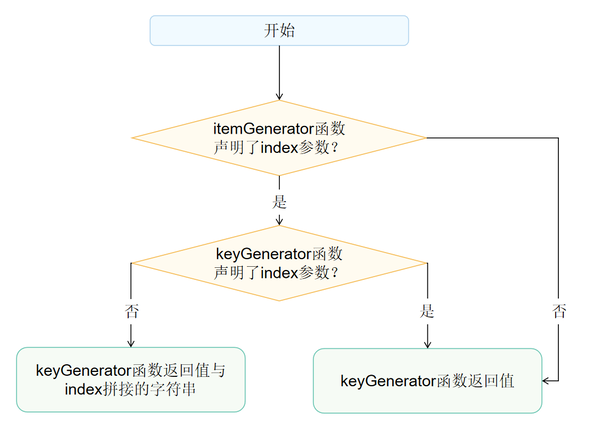
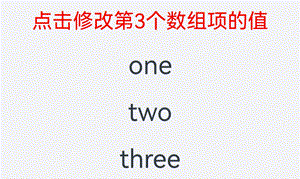
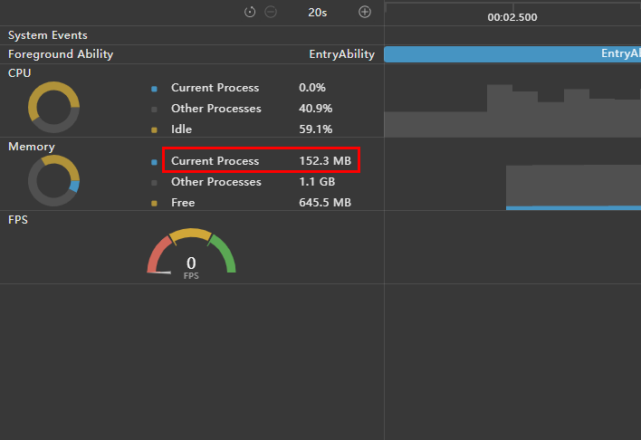
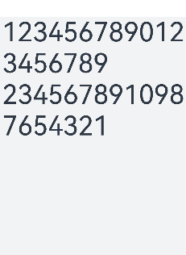

# ForEach：循环渲染

ForEach接口基于数组循环渲染，需要与容器组件配合使用，且接口返回的组件应当是允许包含在ForEach父容器组件中的子组件。例如，ListItem组件要求ForEach的父容器组件必须为[List组件](../../reference/apis-arkui/arkui-ts/ts-container-list.md)。

API参数说明见：[ForEach API参数说明](../../reference/apis-arkui/arkui-ts/ts-rendering-control-foreach.md)。

> **说明：**
>
> 从API version 9开始，该接口支持在ArkTS卡片中使用。

## 键值生成规则

在`ForEach`循环渲染过程中，系统会为每个数组元素生成一个唯一且持久的键值，用于标识对应的组件。当键值变化时，ArkUI框架会视为该数组元素已被替换或修改，并会基于新的键值创建一个新的组件。

`ForEach`提供了一个名为`keyGenerator`的参数，这是一个函数，开发者可以通过它自定义键值的生成规则。如果开发者没有定义`keyGenerator`函数，则ArkUI框架会使用默认的键值生成函数，即`(item: Object, index: number) => { return index + '__' + JSON.stringify(item); }`。

ArkUI框架对于`ForEach`的键值生成有一套特定的判断规则，这主要与`itemGenerator`函数和`keyGenerator`函数的第二个参数`index`有关。具体的键值生成规则判断逻辑如下图所示。

**图1** ForEach键值生成规则  


> **说明：**
>
> ArkUI框架会对重复的键值发出警告。在UI更新时，如果出现重复的键值，框架可能无法正常工作，具体请参见[渲染结果非预期](#渲染结果非预期)。

## 组件创建规则

在确定键值生成规则后，ForEach的第二个参数`itemGenerator`函数会根据键值生成规则为数据源的每个数组项创建组件。组件的创建包括两种情况：[ForEach首次渲染](#首次渲染)和[ForEach非首次渲染](#非首次渲染)。

### 首次渲染

在ForEach首次渲染时，会根据前述键值生成规则为数据源的每个数组项生成唯一键值，并创建相应的组件。

```ts
@Entry
@Component
struct Parent {
  @State simpleList: Array<string> = ['one', 'two', 'three'];

  build() {
    Row() {
      Column() {
        ForEach(this.simpleList, (item: string) => {
          ChildItem({ item: item })
        }, (item: string) => item)
      }
      .width('100%')
      .height('100%')
    }
    .height('100%')
    .backgroundColor(0xF1F3F5)
  }
}

@Component
struct ChildItem {
  @Prop item: string;

  build() {
    Text(this.item)
      .fontSize(50)
  }
}
```

运行效果如下图所示。

**图2**  ForEach数据源不存在相同值案例首次渲染运行效果图  


在上述代码中，`keyGenerator`函数的返回值是`item`。在ForEach渲染循环时，为数组项依次生成键值`one`、`two`和`three`，并创建对应的`ChildItem`组件渲染到界面上。

当不同数组项生成的键值相同时，框架的行为是未定义的。例如，在以下代码中，ForEach渲染相同的数据项`two`时，只创建了一个`ChildItem`组件，而没有创建多个具有相同键值的组件。

```ts
@Entry
@Component
struct Parent {
  @State simpleList: Array<string> = ['one', 'two', 'two', 'three'];

  build() {
    Row() {
      Column() {
        ForEach(this.simpleList, (item: string) => {
          ChildItem({ item: item })
        }, (item: string) => item)
      }
      .width('100%')
      .height('100%')
    }
    .height('100%')
    .backgroundColor(0xF1F3F5)
  }
}

@Component
struct ChildItem {
  @Prop item: string;

  build() {
    Text(this.item)
      .fontSize(50)
  }
}
 ```

运行效果如下图所示。

**图3**  ForEach数据源存在相同值案例首次渲染运行效果图  


在该示例中，最终键值生成规则为`item`。当ForEach遍历数据源`simpleList`，遍历到索引为1的`two`时，创建键值为`two`的组件并记录。当遍历到索引为2的`two`时，当前项的键值也为`two`，此时不再创建新的组件。

### 非首次渲染

在ForEach组件进行非首次渲染时，它会检查新生成的键值是否在上次渲染中已经存在。如果键值不存在，则会创建一个新的组件；如果键值存在，则不会创建新的组件，而是直接渲染该键值所对应的组件。例如，在以下的代码示例中，通过点击事件修改了数组的第三项值为"new three"，这将触发ForEach组件进行非首次渲染。

```ts
@Entry
@Component
struct Parent {
  @State simpleList: Array<string> = ['one', 'two', 'three'];

  build() {
    Row() {
      Column() {
        Text('点击修改第3个数组项的值')
          .fontSize(24)
          .fontColor(Color.Red)
          .onClick(() => {
            this.simpleList[2] = 'new three';
          })

        ForEach(this.simpleList, (item: string) => {
          ChildItem({ item: item })
            .margin({ top: 20 })
        }, (item: string) => item)
      }
      .justifyContent(FlexAlign.Center)
      .width('100%')
      .height('100%')
    }
    .height('100%')
    .backgroundColor(0xF1F3F5)
  }
}

@Component
struct ChildItem {
  @Prop item: string;

  build() {
    Text(this.item)
      .fontSize(30)
  }
}
```

运行效果如下图所示。

**图4**  ForEach非首次渲染案例运行效果图  


从本例可以看出`@State`能够监听到简单数据类型数组`simpleList`数组项的变化。

1. 当`simpleList`数组项发生变化时，会触发`ForEach`重新渲染。
2. `ForEach`遍历新的数据源`['one', 'two', 'new three']`，并生成对应的键值`one`、`two`和`new three`。
3. 其中，键值`one`和`two`在上次渲染中已经存在，所以 `ForEach` 复用了对应的组件并进行了渲染。对于第三个数组项 "new three"，由于其通过键值生成规则 `item` 生成的键值`new three`在上次渲染中不存在，因此 `ForEach` 为该数组项创建了一个新的组件。

## 使用场景

ForEach组件在开发过程中的主要应用场景包括：[数据源不变](#数据源不变)、[数据源数组项发生变化](#数据源数组项发生变化)（如插入、删除操作）、[数据源数组项子属性变化](#数据源数组项子属性变化)。

### 数据源不变

在数据源保持不变的场景中，数据源可以直接采用基本数据类型。例如，页面加载状态时，可以使用骨架屏列表进行渲染展示。

```ts
@Entry
@Component
struct ArticleList {
  @State simpleList: Array<number> = [1, 2, 3, 4, 5];

  build() {
    Column() {
      ForEach(this.simpleList, (item: number) => {
        ArticleSkeletonView()
          .margin({ top: 20 })
      }, (item: number) => item.toString())
    }
    .padding(20)
    .width('100%')
    .height('100%')
  }
}

@Builder
function textArea(width: number | Resource | string = '100%', height: number | Resource | string = '100%') {
  Row()
    .width(width)
    .height(height)
    .backgroundColor('#FFF2F3F4')
}

@Component
struct ArticleSkeletonView {
  build() {
    Row() {
      Column() {
        textArea(80, 80)
      }
      .margin({ right: 20 })

      Column() {
        textArea('60%', 20)
        textArea('50%', 20)
      }
      .alignItems(HorizontalAlign.Start)
      .justifyContent(FlexAlign.SpaceAround)
      .height('100%')
    }
    .padding(20)
    .borderRadius(12)
    .backgroundColor('#FFECECEC')
    .height(120)
    .width('100%')
    .justifyContent(FlexAlign.SpaceBetween)
  }
}
```

运行效果如下图所示。

**图5** 骨架屏运行效果图  


在本示例中，采用数据项item作为键值生成规则，由于数据源simpleList的数组项各不相同，因此能够保证键值的唯一性。

### 数据源数组项发生变化

在数据源数组项发生变化的场景下，如数组插入、删除操作或者数组项索引位置交换时，数据源应为对象数组类型，并使用对象的唯一ID作为键值。

```ts
class Article {
  id: string;
  title: string;
  brief: string;

  constructor(id: string, title: string, brief: string) {
    this.id = id;
    this.title = title;
    this.brief = brief;
  }
}

@Entry
@Component
struct ArticleListView {
  @State isListReachEnd: boolean = false;
  @State articleList: Array<Article> = [
    new Article('001', '第1篇文章', '文章简介内容'),
    new Article('002', '第2篇文章', '文章简介内容'),
    new Article('003', '第3篇文章', '文章简介内容'),
    new Article('004', '第4篇文章', '文章简介内容'),
    new Article('005', '第5篇文章', '文章简介内容'),
    new Article('006', '第6篇文章', '文章简介内容')
  ];

  loadMoreArticles() {
    this.articleList.push(new Article('007', '加载的新文章', '文章简介内容'));
  }

  build() {
    Column({ space: 5 }) {
      List() {
        ForEach(this.articleList, (item: Article) => {
          ListItem() {
            ArticleCard({ article: item })
              .margin({ top: 20 })
          }
        }, (item: Article) => item.id)
      }
      .onReachEnd(() => {
        this.isListReachEnd = true;
      })
      .parallelGesture(
        PanGesture({ direction: PanDirection.Up, distance: 80 })
          .onActionStart(() => {
            if (this.isListReachEnd) {
              this.loadMoreArticles();
              this.isListReachEnd = false;
            }
          })
      )
      .padding(20)
      .scrollBar(BarState.Off)
    }
    .width('100%')
    .height('100%')
    .backgroundColor(0xF1F3F5)
  }
}

@Component
struct ArticleCard {
  @Prop article: Article;

  build() {
    Row() {
      // 此处'app.media.icon'仅作示例，请开发者自行替换，否则imageSource创建失败会导致后续无法正常执行。
      Image($r('app.media.icon'))
        .width(80)
        .height(80)
        .margin({ right: 20 })

      Column() {
        Text(this.article.title)
          .fontSize(20)
          .margin({ bottom: 8 })
        Text(this.article.brief)
          .fontSize(16)
          .fontColor(Color.Gray)
          .margin({ bottom: 8 })
      }
      .alignItems(HorizontalAlign.Start)
      .width('80%')
      .height('100%')
    }
    .padding(20)
    .borderRadius(12)
    .backgroundColor('#FFECECEC')
    .height(120)
    .width('100%')
    .justifyContent(FlexAlign.SpaceBetween)
  }
}
```

初始运行效果（左图）和手势上滑加载后效果（右图）如下图所示。

**图6**  数据源数组项变化案例运行效果图  


在本示例中，`ArticleCard`组件作为`ArticleListView`组件的子组件，通过`@Prop`装饰器接收一个`Article`对象，用于渲染文章卡片。

1. 当列表滚动到底部且手势滑动距离超过80vp时，触发`loadMoreArticles()`函数。此函数在`articleList`数据源尾部添加新数据项，增加数据源长度。
2. 数据源被`@State`装饰器修饰，ArkUI框架能够感知数据源长度的变化并触发`ForEach`进行重新渲染。

### 数据源数组项子属性变化

当数据源的数组项为对象数据类型，并且只修改某个数组项的属性值时，由于数据源为复杂数据类型，ArkUI框架无法监听到`@State`装饰器修饰的数据源数组项的属性变化，从而无法触发`ForEach`的重新渲染。为实现`ForEach`重新渲染，需要结合`@Observed`和`@ObjectLink`装饰器使用。例如，在文章列表卡片上点击“点赞”按钮，从而修改文章的点赞数量。

```ts
@Observed
class Article {
  id: string;
  title: string;
  brief: string;
  isLiked: boolean;
  likesCount: number;

  constructor(id: string, title: string, brief: string, isLiked: boolean, likesCount: number) {
    this.id = id;
    this.title = title;
    this.brief = brief;
    this.isLiked = isLiked;
    this.likesCount = likesCount;
  }
}

@Entry
@Component
struct ArticleListView {
  @State articleList: Array<Article> = [
    new Article('001', '第0篇文章', '文章简介内容', false, 100),
    new Article('002', '第1篇文章', '文章简介内容', false, 100),
    new Article('003', '第2篇文章', '文章简介内容', false, 100),
    new Article('004', '第4篇文章', '文章简介内容', false, 100),
    new Article('005', '第5篇文章', '文章简介内容', false, 100),
    new Article('006', '第6篇文章', '文章简介内容', false, 100),
  ];

  build() {
    List() {
      ForEach(this.articleList, (item: Article) => {
        ListItem() {
          ArticleCard({
            article: item
          })
            .margin({ top: 20 })
        }
      }, (item: Article) => item.id)
    }
    .padding(20)
    .scrollBar(BarState.Off)
    .backgroundColor(0xF1F3F5)
  }
}

@Component
struct ArticleCard {
  @ObjectLink article: Article;

  handleLiked() {
    this.article.isLiked = !this.article.isLiked;
    this.article.likesCount = this.article.isLiked ? this.article.likesCount + 1 : this.article.likesCount - 1;
  }

  build() {
    Row() {
      // 此处'app.media.icon'仅作示例，请开发者自行替换，否则imageSource创建失败会导致后续无法正常执行。
      Image($r('app.media.icon'))
        .width(80)
        .height(80)
        .margin({ right: 20 })

      Column() {
        Text(this.article.title)
          .fontSize(20)
          .margin({ bottom: 8 })
        Text(this.article.brief)
          .fontSize(16)
          .fontColor(Color.Gray)
          .margin({ bottom: 8 })

        Row() {
          // 此处app.media.iconLiked'，'app.media.iconUnLiked'仅作示例，请开发者自行替换，否则imageSource创建失败会导致后续无法正常执行。
          Image(this.article.isLiked ? $r('app.media.iconLiked') : $r('app.media.iconUnLiked'))
            .width(24)
            .height(24)
            .margin({ right: 8 })
          Text(this.article.likesCount.toString())
            .fontSize(16)
        }
        .onClick(() => this.handleLiked())
        .justifyContent(FlexAlign.Center)
      }
      .alignItems(HorizontalAlign.Start)
      .width('80%')
      .height('100%')
    }
    .padding(20)
    .borderRadius(12)
    .backgroundColor('#FFECECEC')
    .height(120)
    .width('100%')
    .justifyContent(FlexAlign.SpaceBetween)
  }
}
```

上述代码的初始运行效果（左图）和点击第1个文章卡片上的点赞图标后的运行效果（右图）如下图所示。

**图7** 数据源数组项子属性变化案例运行效果图  


在本示例中，`Article`类被`@Observed`装饰器修饰。父组件`ArticleListView`传入`Article`对象实例给子组件`ArticleCard`，子组件使用`@ObjectLink`装饰器接收该实例。

1. 当点击第1个文章卡片上的点赞图标时，会触发`ArticleCard`组件的`handleLiked`函数。该函数修改第1个卡片对应组件里`article`实例的`isLiked`和`likesCount`属性值。
2. `article`实例是`@ObjectLink`装饰的状态变量，其属性值变化，会触发`ArticleCard`组件渲染，此时读取的`isLiked`和`likesCount`为修改后的新值。

### 拖拽排序
在List组件下使用ForEach，并设置[onMove](../../reference/apis-arkui/arkui-ts/ts-universal-attributes-drag-sorting.md#onmove)事件，每次迭代生成一个ListItem时，可以使能拖拽排序。拖拽排序离手后，如果数据位置发生变化，将触发onMove事件，上报数据移动原始索引号和目标索引号。在onMove事件中，需要根据上报的起始索引号和目标索引号修改数据源。数据源修改前后，要保持每个数据的键值不变，只是顺序发生变化，才能保证落位动画正常执行。

```ts
@Entry
@Component
struct ForEachSort {
  @State arr: Array<string> = [];

  build() {
    Column() {
      // 点击此按钮会触发ForEach重新渲染
      Button('Add one item')
        .onClick(() => {
          this.arr.push('10');
        })
        .width(300)
        .margin(10)

      List() {
        ForEach(this.arr, (item: string) => {
          ListItem() {
            Text(item.toString())
              .fontSize(16)
              .textAlign(TextAlign.Center)
              .size({ height: 100, width: "100%" })
          }.margin(10)
          .borderRadius(10)
          .backgroundColor("#FFFFFFFF")
        }, (item: string) => item)
          .onMove((from: number, to: number) => {
            // 以下两行代码是为了确保拖拽后屏幕上组件的顺序与数组arr中每一项的顺序保持一致。
            // 若注释以下两行，第一步拖拽排序，第二步在arr末尾插入一项，触发ForEach渲染，此时屏上组件的顺序会跟数组arr中每一项的顺序一致，而不是维持第一步拖拽后的顺序，意味着拖拽排序在ForEach渲染后失效了。
            let tmp = this.arr.splice(from, 1);
            this.arr.splice(to, 0, tmp[0]);
          })
      }
      .width('100%')
      .height('100%')
      .backgroundColor("#FFDCDCDC")
    }
  }

  aboutToAppear(): void {
    for (let i = 0; i < 10; i++) {
      this.arr.push(i.toString());
    }
  }
}
```

**图8** ForEach拖拽排序效果图  
  

注释掉`onMove`事件调用中的两行代码，点击`Add one item`触发渲染后的效果如下图所示。  

**图9** ForEach拖拽排序效果在重新渲染后没有保留  


## 使用建议

- 为满足键值的唯一性，对于对象数据类型，建议使用对象数据中的唯一`id`作为键值。
- 不建议在键值中包含数据项索引`index`，可能会导致[渲染结果非预期](#渲染结果非预期)和[渲染性能降低](#渲染性能降低)。如果确实需要使用`index`，例如列表通过`index`进行条件渲染，开发者需接受`ForEach`在数据源变更后重新创建组件导致的性能损耗。
- 基本类型数组的数据项没有唯一`ID`属性。如果使用数据项作为键值，必须确保数据项无重复。对于数据源会变化的场景，建议将基本类型数组转换为具有唯一`ID`属性的Object类型数组，再使用唯一`ID`属性作为键值。
- 对于以上限制规则，`index`参数存在的意义为：index是开发者保证键值唯一性的最终手段；对数据项进行修改时，由于`itemGenerator`中的`item`参数是不可修改的，所以须用index索引值对数据源进行修改，进而触发UI重新渲染。
- ForEach在下列容器组件 [List](../../reference/apis-arkui/arkui-ts/ts-container-list.md)、[Grid](../../reference/apis-arkui/arkui-ts/ts-container-grid.md)、[Swiper](../../reference/apis-arkui/arkui-ts/ts-container-swiper.md)以及[WaterFlow](../../reference/apis-arkui/arkui-ts/ts-container-waterflow.md) 内使用的时候，不要与[LazyForEach](./arkts-rendering-control-lazyforeach.md) 混用。 以List为例，同时包含ForEach、LazyForEach的情形是不推荐的。
- 当数组项为对象类型时，不建议用内容相同的数组项替换旧项。若数组项发生变更但键值未变，会导致[数据变化不渲染](#数据变化不渲染)。
## 不推荐案例

对ForEach键值的错误使用会导致功能和性能问题，导致渲染效果非预期。详见案例[渲染结果非预期](#渲染结果非预期)和[渲染性能降低](#渲染性能降低)。

### 渲染结果非预期

在本示例中，通过设置`ForEach`的第三个参数`KeyGenerator`函数，自定义键值生成规则为数据源的索引`index`的字符串类型值。当点击父组件`Parent`中“在第1项后插入新项”文本组件后，界面会出现非预期的结果。

```ts
@Entry
@Component
struct Parent {
  @State simpleList: Array<string> = ['one', 'two', 'three'];

  build() {
    Column() {
      Button() {
        Text('在第1项后插入新项').fontSize(30)
      }
      .onClick(() => {
        this.simpleList.splice(1, 0, 'new item');
      })

      ForEach(this.simpleList, (item: string) => {
        ChildItem({ item: item })
      }, (item: string, index: number) => index.toString())
    }
    .justifyContent(FlexAlign.Center)
    .width('100%')
    .height('100%')
    .backgroundColor(0xF1F3F5)
  }
}

@Component
struct ChildItem {
  @Prop item: string;

  build() {
    Text(this.item)
      .fontSize(30)
  }
}
```

上述代码的初始渲染效果和点击“在第1项后插入新项”文本组件后的渲染效果如下图所示。

**图10**  渲染结果非预期运行效果图  


`ForEach`在首次渲染时，创建的键值依次为"0"、"1"、"2"。

插入新项后，数据源`simpleList`变为`['one', 'new item', 'two', 'three']`，框架监听到`@State`装饰的数据源长度变化触发`ForEach`重新渲染。

`ForEach`依次遍历新数据源，遍历数据项"one"时生成键值"0"，存在相同键值，因此不创建新组件。继续遍历数据项"new item"时生成键值"1"，存在相同键值，因此不创建新组件。继续遍历数据项"two"生成键值"2"，存在相同键值，因此不创建新组件。最后遍历数据项"three"时生成键值"3"，不存在相同键值，创建内容为"three"的新组件并渲染。

从以上可以看出，当键值包含数据项索引`index`时，期望的界面渲染结果为`['one', 'new item', 'two', 'three']`，而实际的渲染结果为`['one', 'two', 'three', 'three']`，不符合开发者预期。因此，开发者在使用`ForEach`时应避免键值包含索引`index`。

### 渲染性能降低

在本示例中，`ForEach`的第三个参数`KeyGenerator`函数缺省。根据上述[键值生成规则](#键值生成规则)，此例使用框架默认的键值，即最终键值为字符串`index + '__' + JSON.stringify(item)`。点击文本组件“在第1项后插入新项”后，`ForEach`将为第2个数组项及后面的所有数据项重新创建组件。

```ts
@Entry
@Component
struct Parent {
  @State simpleList: Array<string> = ['one', 'two', 'three'];

  build() {
    Column() {
      Button() {
        Text('在第1项后插入新项').fontSize(30)
      }
      .onClick(() => {
        this.simpleList.splice(1, 0, 'new item');
        console.info(`[onClick]: simpleList is [${this.simpleList.join(', ')}]`);
      })

      ForEach(this.simpleList, (item: string) => {
        ChildItem({ item: item })
      })
    }
    .justifyContent(FlexAlign.Center)
    .width('100%')
    .height('100%')
    .backgroundColor(0xF1F3F5)
  }
}

@Component
struct ChildItem {
  @Prop item: string;

  aboutToAppear() {
    console.info(`[aboutToAppear]: item is ${this.item}`);
  }

  build() {
    Text(this.item)
      .fontSize(50)
  }
}
```

以上代码的初始渲染效果和点击"在第1项后插入新项"文本组件后的渲染效果如下图所示。

**图11**  渲染性能降低案例运行效果图  


点击“在第1项后插入新项”文本组件后，DevEco Studio的日志打印结果如下所示。

**图12**  渲染性能降低案例日志打印图  


插入新项后，`ForEach`为`new item`、 `two`、 `three`三个数组项创建了对应的`ChildItem`组件，并执行了组件的[`aboutToAppear()`](../../reference/apis-arkui/arkui-ts/ts-custom-component-lifecycle.md#abouttoappear)生命周期函数。这是因为：

1. `ForEach`首次渲染时，生成的键值依次为`0__one`、`1__two`和`2__three`。
2. 插入新项后，数据源`simpleList`变为`['one', 'new item', 'two', 'three']`，ArkUI框架监听到`@State`装饰的数据源长度变化触发`ForEach`重新渲染。
3. `ForEach`依次遍历新数据源，遍历数据项`one`时生成键值`0__one`，键值已存在，因此不创建新组件。继续遍历数据项`new item`时生成键值`1__new item`，不存在相同键值，创建内容为`new item`的新组件并渲染。继续遍历数据项`two`生成键值`2__two`，不存在相同键值，创建内容为`two`的新组件并渲染。最后遍历数据项`three`时生成键值`3__three`，不存在相同键值，创建内容为`three`的新组件并渲染。

尽管本例中界面渲染结果符合预期，但在每次向数组中间插入新数组项时，`ForEach`会为该数组项及其后面的所有数组项重新创建组件。当数据源数据量较大或组件结构复杂时，组件无法复用会导致性能下降。因此，不建议省略第三个参数`KeyGenerator`函数，也不建议在键值中使用数据项索引`index`。

正确渲染并保证效率的`ForEach`写法是：
```ts
ForEach(this.simpleList, (item: string) => {
  ChildItem({ item: item })
}, (item: string) => item)  // 需要保证key唯一
```
提供了第三个参数`KeyGenerator`，在这个例子中，对数据源的不同数据项生成不同的key，并且对同一个数据项每次生成相同的key。

### 数据变化不渲染
点击按钮`Like/UnLike first article`，第一个组件会切换点赞手势和后面的点赞数量，但是点击按钮`Replace first article`之后再点击按钮`Like/UnLike first article`就不生效了。原因是替换`articleList[0]`之后，`articleList`状态变量发生变化，触发ForEach重新渲染，但是新的`articleList[0]`生成的key没有变，ForEach不会将数据更新同步给子组件，因此第一个组件仍然绑定旧的`articleList[0]`。新`articleList[0]`的属性发生变更，第一个组件感知不到，不会重新渲染。点击点赞手势，会触发渲染。因为变更的是跟组件绑定的数组项的属性，组件会感知并重新渲染。

```ts
@Observed
class Article {
  id: string;
  title: string;
  brief: string;
  isLiked: boolean;
  likesCount: number;

  constructor(id: string, title: string, brief: string, isLiked: boolean, likesCount: number) {
    this.id = id;
    this.title = title;
    this.brief = brief;
    this.isLiked = isLiked;
    this.likesCount = likesCount;
  }
}

@Entry
@Component
struct ArticleListView {
  @State articleList: Array<Article> = [
    new Article('001', '第0篇文章', '文章简介内容', false, 100),
    new Article('002', '第1篇文章', '文章简介内容', false, 100),
    new Article('003', '第2篇文章', '文章简介内容', false, 100),
    new Article('004', '第4篇文章', '文章简介内容', false, 100),
    new Article('005', '第5篇文章', '文章简介内容', false, 100),
    new Article('006', '第6篇文章', '文章简介内容', false, 100),
  ];

  build() {
    Column() {
      Button('Replace first article')
        .onClick(() => {
          this.articleList[0] = new Article('001', '第0篇文章', '文章简介内容', false, 100);
        })
        .width(300)
        .margin(10)

      Button('Like/Unlike first article')
        .onClick(() => {
          this.articleList[0].isLiked = !this.articleList[0].isLiked;
          this.articleList[0].likesCount =
            this.articleList[0].isLiked ? this.articleList[0].likesCount + 1 : this.articleList[0].likesCount - 1;
        })
        .width(300)
        .margin(10)

      List() {
        ForEach(this.articleList, (item: Article) => {
          ListItem() {
            ArticleCard({
              article: item
            })
              .margin({ top: 20 })
          }
        }, (item: Article) => item.id)
      }
      .padding(20)
      .scrollBar(BarState.Off)
      .backgroundColor(0xF1F3F5)
    }
  }
}

@Component
struct ArticleCard {
  @ObjectLink article: Article;

  handleLiked() {
    this.article.isLiked = !this.article.isLiked;
    this.article.likesCount = this.article.isLiked ? this.article.likesCount + 1 : this.article.likesCount - 1;
  }

  build() {
    Row() {
      // 此处'app.media.icon'仅作示例，请开发者自行替换，否则imageSource创建失败会导致后续无法正常执行。
      Image($r('app.media.icon'))
        .width(80)
        .height(80)
        .margin({ right: 20 })

      Column() {
        Text(this.article.title)
          .fontSize(20)
          .margin({ bottom: 8 })
        Text(this.article.brief)
          .fontSize(16)
          .fontColor(Color.Gray)
          .margin({ bottom: 8 })

        Row() {
          // 此处app.media.iconLiked'，'app.media.iconUnLiked'仅作示例，请开发者自行替换，否则imageSource创建失败会导致后续无法正常执行。
          Image(this.article.isLiked ? $r('app.media.iconLiked') : $r('app.media.iconUnLiked'))
            .width(24)
            .height(24)
            .margin({ right: 8 })
          Text(this.article.likesCount.toString())
            .fontSize(16)
        }
        .onClick(() => this.handleLiked())
        .justifyContent(FlexAlign.Center)
      }
      .alignItems(HorizontalAlign.Start)
      .width('80%')
      .height('100%')
    }
    .padding(20)
    .borderRadius(12)
    .backgroundColor('#FFECECEC')
    .height(120)
    .width('100%')
    .justifyContent(FlexAlign.SpaceBetween)
  }
}
```
**图13** 数据变化不渲染  


### 非必要内存消耗
如果开发者没有定义`keyGenerator`函数，则ArkUI框架会使用默认的键值生成函数，即`(item: Object, index: number) => { return index + '__' + JSON.stringify(item); }`。当`item`是复杂对象时，将其JSON序列化会得到长字符串，占用更多的内存。

```ts
class Data {
  longStr: string;
  key: string;

  constructor(longStr: string, key: string) {
    this.longStr = longStr;
    this.key = key;
  }
}

@Entry
@Component
struct Parent {
  @State simpleList: Array<Data> = [];

  aboutToAppear(): void {
    let longStr = '';
    for (let i = 0; i < 2000; i++) {
      longStr += i.toString();
    }
    for (let index = 0; index < 3000; index++) {
      let data: Data = new Data(longStr, 'a' + index.toString());
      this.simpleList.push(data);
    }
  }

  build() {
    List() {
      ForEach(this.simpleList, (item: Data) => {
        ListItem() {
          Text(item.key)
        }
      }
        // 如果不定义下面的keyGenerator函数，则ArkUI框架会使用默认的键值生成函数
        , (item: Data) => {
          return item.key;
        }
      )
    }.height('100%')
    .width('100%')
  }
}
```

对比自定义`keyGenerator`函数和使用默认键值生成函数两种情况下的内存占用。自定义`keyGenerator`函数，这个示例代码的内存占用降低了约70MB。  

**图14** 使用默认键值生成函数下的内存占用  

  
**图15** 自定义键值生成函数下的内存占用  


### 键值生成失败
如果开发者没有定义`keyGenerator`函数，则ArkUI框架会使用默认的键值生成函数，即`(item: Object, index: number) => { return index + '__' + JSON.stringify(item); }`。然而，`JSON.stringify`序列化在某些数据结构上会失败，导致应用发生jscrash并退出。例如，`bigint`无法被`JSON.stringify`序列化：

```ts
class Data {
  content: bigint;

  constructor(content: bigint) {
    this.content = content;
  }
}

@Entry
@Component
struct Parent {
  @State simpleList: Array<Data> = [new Data(1234567890123456789n), new Data(2345678910987654321n)];

  build() {
    Row() {
      Column() {
        ForEach(this.simpleList, (item: Data) => {
          ChildItem({ item: item.content.toString() })
        }
          // 如果不定义下面的keyGenerator函数，则ArkUI框架会使用默认的键值生成函数
          // Data中的content: bigint在JSON序列化时失败
          , (item: Data) => item.content.toString()
        )
      }
      .width('100%')
      .height('100%')
    }
    .height('100%')
    .backgroundColor(0xF1F3F5)
  }
}

@Component
struct ChildItem {
  @Prop item: string;

  build() {
    Text(this.item)
      .fontSize(50)
  }
}
```

开发者定义`keyGenerator`函数，应用正常启动：  
  

使用默认的键值生成函数，应用发生jscrash： 
```
Error message:@Component 'Parent'[4]: ForEach id 7: use of default id generator function not possible on provided data structure. Need to specify id generator function (ForEach 3rd parameter). Application Error!
Stacktrace:
    ...
    at anonymous (entry/src/main/ets/pages/Index.ets:18:52)
```