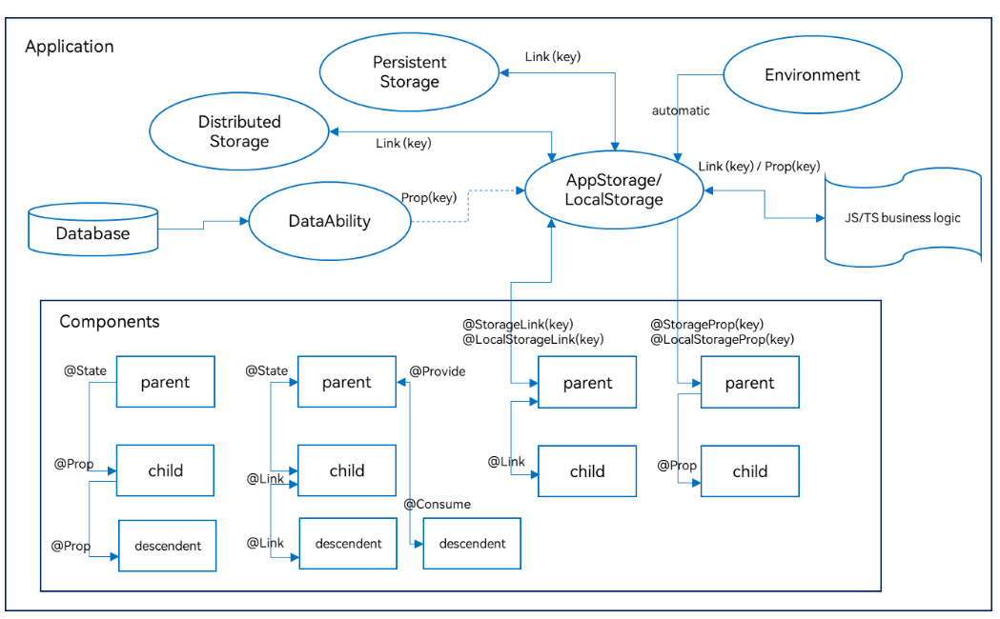

# 状态管理概述

在前面的章节中，构建的页面多为静态界面。如果希望构建一个动态、有交互的界面，需要引入“状态”的概念。

  **图1** 效果图  


以上示例中，用户与应用的交互触发了文本状态变更，状态变更引起了UI渲染，UI从“Hello World”变更为“Hello ArkUI”。

在声明式UI编程框架中，UI是程序状态的运行结果，用户构建了一个UI模型，其中应用的运行时的状态是参数。当参数改变时，UI作为返回结果，也将进行对应的改变。这些运行时的状态变化所带来的UI的重新渲染，在ArkUI中统称为状态管理机制。

自定义组件拥有变量，变量必须被装饰器装饰才可以成为状态变量，状态变量的改变会引起UI的渲染刷新。如果不使用状态变量，UI只能在初始化时渲染，后续将不会再刷新。 下图展示了State和View（UI）之间的关系。


- View(UI)：UI渲染，指将build方法内的UI描述和\@Builder装饰的方法内的UI描述映射到界面。

- State：状态，指驱动UI更新的数据。用户通过触发组件的事件方法，改变状态数据。状态数据的改变，引起UI的重新渲染。


在阅读状态管理文档前，开发者需要对UI范式基本语法有基本的了解。建议提前阅读：[基本语法概述](./arkts-basic-syntax-overview.md)，[声明式UI描述](./arkts-declarative-ui-description.md)，[自定义组件-创建自定义组件](./arkts-create-custom-components.md)。

## 基本概念

- 状态变量：被状态装饰器装饰的变量，状态变量值的改变会引起UI的渲染更新。示例：@State num: number = 1，其中，@State是状态装饰器，num是状态变量。

- 常规变量：没有被状态装饰器装饰的变量，通常应用于辅助计算。它的改变永远不会引起UI的刷新。以下示例中increaseBy变量为常规变量。

- 数据源/同步源：状态变量的原始来源，可以同步给不同的状态数据。通常意义为父组件传给子组件的数据。以下示例中数据源为count: 1。

- 命名参数机制：父组件通过指定参数传递给子组件的状态变量，为父子传递同步参数的主要手段。示例：CompA({ aProp: this.aProp })。

- 从父组件初始化：父组件使用命名参数机制，将指定参数传递给子组件。子组件初始化的默认值在有父组件传值的情况下，会被覆盖。示例：

  ```ts
  @Component
  struct MyComponent {
    @State count: number = 0;
    private increaseBy: number = 1;

    build() {
    }
  }

  @Entry
  @Component
  struct Parent {
    build() {
      Column() {
        // 从父组件初始化，覆盖本地定义的默认值
        MyComponent({ count: 1, increaseBy: 2 })
      }
    }
  }
  ```

- 初始化子组件：父组件中状态变量可以传递给子组件，初始化子组件对应的状态变量。示例同上。

- 本地初始化：在变量声明的时候赋值，作为变量的默认值。示例：\@State count: number = 0。

>**说明：**
>
>当前状态管理的功能仅支持在UI主线程使用，不能在子线程、Worker、TaskPool中使用。

## 状态管理（V1）

开发者可以选择使用状态管理V1版本进行应用开发。

### 装饰器总览

ArkUI状态管理V1提供了多种装饰器，通过使用这些装饰器，状态变量不仅可以观察组件内的改变，还可以在不同组件层级间传递，比如父子组件、跨组件层级，也可以观察全局范围内的变化。根据状态变量的影响范围，将所有的装饰器可以大致分为：

- 管理组件内状态的装饰器：组件级别的状态管理，可以观察同一个组件树上（即同一个页面内）组件内或不同组件层级的变量变化。

- 管理应用级状态的装饰器：应用级别的状态管理，可以观察不同页面，甚至不同UIAbility的状态变化，是应用内全局的状态管理。


从数据的传递形式和同步类型层面看，装饰器也可分为：


- 只读的单向传递；

- 可变更的双向传递。


图示如下，具体装饰器的介绍，可详见[管理组件拥有的状态](arkts-state.md)和[管理应用拥有的状态](arkts-application-state-management-overview.md)。开发者可以灵活地利用这些能力来实现数据和UI的联动。





上图中，Components部分的装饰器为组件级别的状态管理，Application部分为应用的状态管理。开发者可以通过[@StorageLink](arkts-appstorage.md#storagelink)/[@LocalStorageLink](arkts-localstorage.md#localstoragelink)实现应用和组件状态的双向同步，通过[@StorageProp](arkts-appstorage.md#storageprop)/[@LocalStorageProp](arkts-localstorage.md#localstorageprop)实现应用和组件状态的单向同步。


[管理组件拥有的状态](arkts-state.md)，即图中Components级别的状态管理：


- [\@State](arkts-state.md)：\@State装饰的变量拥有其所属组件的状态，可以作为其子组件单向和双向同步的数据源。当其数值改变时，会引起相关组件的渲染刷新。

- [\@Prop](arkts-prop.md)：\@Prop装饰的变量可以和父组件建立单向同步关系，\@Prop装饰的变量是可变的，但修改不会同步回父组件。

- [\@Link](arkts-link.md)：\@Link装饰的变量可以和父组件建立双向同步关系，子组件中\@Link装饰变量的修改会同步给父组件中建立双向数据绑定的数据源，父组件的更新也会同步给\@Link装饰的变量。

- [\@Provide/\@Consume](arkts-provide-and-consume.md)：\@Provide/\@Consume装饰的变量用于跨组件层级（多层组件）同步状态变量，可以不需要通过参数命名机制传递，通过alias（别名）或者属性名绑定。

- [\@Observed](arkts-observed-and-objectlink.md)：\@Observed装饰class，需要观察多层嵌套场景的class需要被\@Observed装饰。单独使用\@Observed没有任何作用，需要和\@ObjectLink、\@Prop联用。

- [\@ObjectLink](arkts-observed-and-objectlink.md)：\@ObjectLink装饰的变量接收\@Observed装饰的class的实例，应用于观察多层嵌套场景，和父组件的数据源构建双向同步。

> **说明：**
>
> 仅[\@Observed/\@ObjectLink](arkts-observed-and-objectlink.md)可以观察嵌套场景，其他的状态变量仅能观察第一层，详情见各个装饰器章节的“观察变化和行为表现”小节。


[管理应用拥有的状态](arkts-application-state-management-overview.md)，即图中Application级别的状态管理：


- [AppStorage](arkts-appstorage.md)是应用程序中的一个特殊的单例[LocalStorage](arkts-localstorage.md)对象，是应用级的数据库，和进程绑定，通过[@StorageProp](arkts-appstorage.md#storageprop)和[@StorageLink](arkts-appstorage.md#storagelink)装饰器可以和组件联动。

- AppStorage是应用状态的“中枢”，将需要与组件（UI）交互的数据存入AppStorage，比如持久化数据[PersistentStorage](arkts-persiststorage.md)和环境变量[Environment](arkts-environment.md)。UI再通过AppStorage提供的装饰器或者API接口，访问这些数据。

- 框架还提供了LocalStorage，AppStorage是LocalStorage特殊的单例。LocalStorage是应用程序声明的应用状态的内存“数据库”，通常用于页面级的状态共享，通过[@LocalStorageProp](arkts-localstorage.md#localstorageprop)和[@LocalStorageLink](arkts-localstorage.md#localstoragelink)装饰器可以和UI联动。


### 其他状态管理V1功能

[\@Watch](arkts-watch.md)用于监听状态变量的变化。


[$$运算符](arkts-two-way-sync.md)：给系统组件提供TS变量的引用，使得TS变量和系统组件的内部状态保持同步。

### 相关实例

针对页面状态管理，有以下相关实例可供参考：

- [状态管理（ArkTS）（API9）](https://gitee.com/openharmony/applications_app_samples/tree/master/code/UI/ArkTsComponentCollection/StateManagement)

- [目标管理（ArkTS）（API9）](https://gitee.com/openharmony/codelabs/tree/master/ETSUI/TargetManagement)

## 状态管理（V2）

为了增强状态管理V1版本的部分能力，例如深度观察、属性级更新等，ArkUI推出状态管理V2供开发者使用。

### 状态管理V1现状以及V2优点

状态管理V1使用代理观察数据，当创建一个状态变量时，同时也创建了一个数据代理观察者。该观察者可感知代理变化，但无法感知实际数据变化，因此在使用上有如下限制：

- 状态变量不能独立于UI存在，同一个数据被多个视图代理时，在其中一个视图的更改不会通知其他视图更新。
- 只能感知对象属性第一层的变化，无法做到深度观测和深度监听。
- 在更改对象中属性以及更改数组中元素的场景下存在冗余更新的问题。
- 装饰器间配合使用限制多，不易用。组件中没有明确状态变量的输入与输出，不利于组件化。


状态管理V2将观察能力增强到数据本身，数据本身就是可观察的，更改数据会触发相应的视图的更新。相较于状态管理V1，状态管理V2有如下优点：

- 状态变量独立于UI，更改数据会触发相应视图的更新。

- 支持对象的深度观测和深度监听，且深度观测机制不影响观测性能。

- 支持对象中属性级精准更新及数组中元素的最小化更新。

- 装饰器易用性高、拓展性强，在组件中明确输入与输出，有利于组件化。


### 装饰器总览

状态管理（V2）提供了一套全新的装饰器。

- [\@ObservedV2](arkts-new-observedV2-and-trace.md)：\@ObservedV2装饰器装饰class，使得被装饰的class具有深度监听的能力。\@ObservedV2和\@Trace配合使用可以使class中的属性具有深度观测的能力。

- [\@Trace](arkts-new-observedV2-and-trace.md)：\@Trace装饰器装饰被\@ObservedV2装饰的class中的属性，被装饰的属性具有深度观测的能力。

- [\@ComponentV2](arkts-new-componentV2.md)：使用\@ComponentV2装饰的struct中能使用新的装饰器。例如：\@Local、\@Param、\@Event、\@Once、\@Monitor、\@Provider、\@Consumer。

- [\@Local](arkts-new-local.md)：\@Local装饰的变量为组件内部状态，无法从外部初始化。

- [\@Param](arkts-new-param.md)：\@Param装饰的变量作为组件的输入，可以接受从外部传入初始化并同步。

- [\@Once](arkts-new-once.md)：\@Once装饰的变量仅初始化时同步一次，需要与\@Param一起使用。

- [\@Event](arkts-new-event.md)：\@Event装饰方法类型，作为组件输出，可以通过该方法影响父组件中变量。

- [\@Monitor](arkts-new-monitor.md)：\@Monitor装饰器用于\@ComponentV2装饰的自定义组件或\@ObservedV2装饰的类中，能够对状态变量进行深度监听。

- [\@Provider和\@Consumer](arkts-new-Provider-and-Consumer.md)：用于跨组件层级双向同步。

- [\@Computed](arkts-new-Computed.md)：计算属性，在被计算的值变化的时候，只会计算一次。主要应用于解决UI多次重用该属性从而重复计算导致的性能问题。

- [!!语法](arkts-new-binding.md)：双向绑定语法糖。

### 状态管理V1与V2能力对比

| V1能力   | V2能力                                             | 说明                                                         |
| ------------ | ------------------------------------------------------ | ------------------------------------------------------------ |
| \@Observed   | \@ObservedV2                                           | 表明当前对象为可观察对象。但两者能力并不相同。 <br/>\@Observed可观察第一层的属性，需要搭配\@ObjectLink使用才能生效。 <br/>\@ObservedV2本身无观察能力，仅代表当前class可被观察，如果要观察其属性，需要搭配\@Trace使用。 |
| \@Track      | \@Trace                                                | V1装饰器@Track为精确观察，可以不依赖@Observed单独使用。不使用@Track将无法做到类属性的精准观察。<br/>V2\@Trace装饰的属性可以被精确跟踪观察。 |
| \@Component  | \@ComponentV2                                          | \@Component为搭配V1状态变量使用的自定义组件装饰器。<br/>@ComponentV2为搭配V2状态变量使用的自定义组件装饰器。 |
| \@State      | 无外部初始化：@Local<br/>外部初始化一次：\@Param\@Once | \@State和\@Local类似都是数据源的概念，区别是\@State可以外部传入初始化，而\@Local无法外部传入初始化。 |
| \@Prop       | \@Param                                                | \@Prop和\@Param类似都是自定义组件参数的概念。当输入参数为复杂类型时，\@Prop为深拷贝，\@Param为引用。 |
| \@Link       | \@Param\@Event                                         | \@Link是框架自己封装实现的双向同步，对于V2开发者可以通过@Param@Event自己实现双向同步。 |
| \@ObjectLink            | \@Param                   | 直接兼容，\@ObjectLink需要被@Observed装饰的class的实例初始化，\@Param没有此限制。 |
| \@Provide    | \@Provider                                             | 兼容。                                                       |
| \@Consume    | \@Consumer                                             | 兼容。                                                       |
| \@Watch               | \@Monitor                | \@Watch用于监听V1状态变量的变化，具有监听状态变量本身和其第一层属性变化的能力。状态变量可观察到的变化会触发其\@Watch监听事件。<br/>\@Monitor用于监听V2状态变量的变化，搭配\@Trace使用，可有深层监听的能力。状态变量在一次事件中多次变化时，仅会以最终的结果判断是否触发\@Monitor监听事件。 |
| LocalStorage               | 全局\@ObservedV2\@Trace   | 兼容。 |
| AppStorage               | AppStorageV2   | 兼容。 |
| Environment       | 调用Ability接口获取系统环境变量   | Environment获取环境变量能力和AppStorage耦合。在V2中可直接调用Ability接口获取系统环境变量。 |
| PersistentStorage     | PersistenceV2   | PersistentStorage持久化能力和AppStorage耦合，PersistenceV2持久化能力可独立使用。 |
| 自定义组件生命周期     | 自定义组件生命周期   | 均支持。[aboutToAppear](../../reference/apis-arkui/arkui-ts/ts-custom-component-lifecycle.md#abouttoappear)、[onDidBuild](../../reference/apis-arkui/arkui-ts/ts-custom-component-lifecycle.md#ondidbuild12)、[aboutToDisappear](../../reference/apis-arkui/arkui-ts/ts-custom-component-lifecycle.md#abouttodisappear)。 |
| 页面生命周期     | 页面生命周期   | 均支持。[onPageShow](../../reference/apis-arkui/arkui-ts/ts-custom-component-lifecycle.md#onpageshow)、[onPageHide](../../reference/apis-arkui/arkui-ts/ts-custom-component-lifecycle.md#onpagehide)、[onBackPress](../../reference/apis-arkui/arkui-ts/ts-custom-component-lifecycle.md#onbackpress)。  |
| \@Reusable   | \@ReusableV2                                                 | 组件复用。包括：[aboutToReuse](../../reference/apis-arkui/arkui-ts/ts-custom-component-lifecycle.md#abouttoreuse10)、[aboutToRecycle](../../reference/apis-arkui/arkui-ts/ts-custom-component-lifecycle.md#abouttorecycle10)。 |
| $$            | !!         | 双向绑定。V2建议使用!!实现双向绑定。 |
| \@CustomDialog | [openCustomDialog](../../../application-dev/reference/apis-arkui/js-apis-arkui-UIContext.md#opencustomdialog12)接口   | 自定义弹窗。V2建议使用openCustomDialog实现自定义弹窗功能。 |
| WithTheme     | WithTheme   | 主题。用于设置应用局部页面自定义主题风格。包括：[onWillApplyTheme](../../reference/apis-arkui/arkui-ts/ts-custom-component-lifecycle.md#onwillapplytheme12)。<br>从API version 18开始，该接口支持在状态管理V2组件中使用。 |
| 高级组件     | 暂未提供   | 高级组件。例如：[DownloadFileButton](../../../application-dev/reference/apis-arkui/arkui-ts/ohos-arkui-advanced-DownloadFileButton.md)、[ProgressButton](../../../application-dev/reference/apis-arkui/arkui-ts/ohos-arkui-advanced-ProgressButton.md)、[SegmentButton](../../../application-dev/reference/apis-arkui/arkui-ts/ohos-arkui-advanced-SegmentButton.md)。 |
| animateTo | 部分场景不支持 | 当前某些场景下，在状态管理V2中使用animateTo动画，会产生异常效果，详见：[在状态管理V2中使用animateTo动画效果异常](./arkts-new-local.md#在状态管理v2中使用animateto动画效果异常)。 |

有关V1向V2的迁移可参考[迁移指导](./arkts-v1-v2-migration.md)，有关V1与V2的混用可参考[混用文档](./arkts-custom-component-mixed-scenarios.md)。
