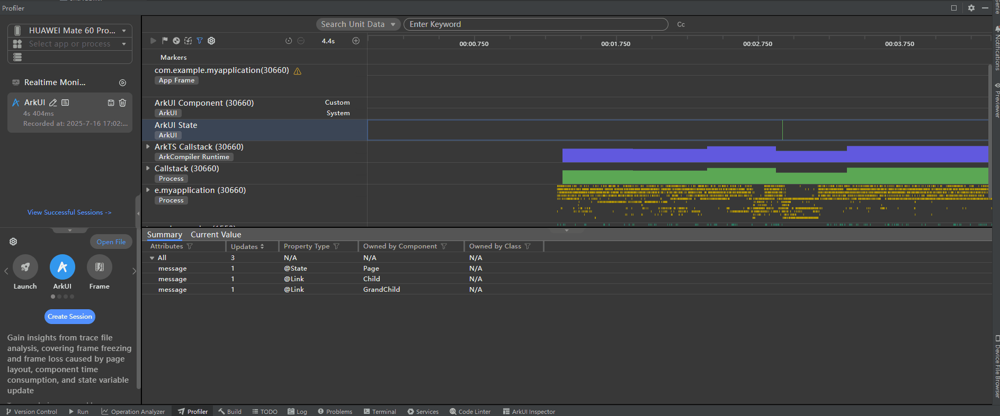

#  UI调试与优化

本章节主要介绍UI的调试调优能力，用于提高开发效率和优化开发者体验。

## 状态管理调试与调优

为提升开发者定位状为提升开发者定位状态管理问题的效率和易用性，UI提供针对状态变量的调试和调优功能，将状态变量的黑盒信息暴露给开发者，帮助开发者深入了解状态变量和UI组件的变化过程，提高开发高性能应用的效率。

状态管理接入OpenHarmony的Hidumper，将状态变量关联的组件、自定义组件树等信息加入到dump中，完成状态管理相关信息的输出，方便开发者了解使用状态变量影响的UI范围，便于写出高性能应用代码。

下面介绍dump状态变量每个参数的含义：

- jsdump: 请求状态管理中的dump信息；
- viewHierarchy: 打印自定义组件树信息，默认只打印根自定义组件；
- r: 递归从根节点打印，自定义组件和其拥有的elemetid；
- viewId: 打印指定viewId的自定义组件树；
- stateVariable： 打印状态变量及关联的自定义组件和内置组件信息息，状态变量变化，这些关联的自定义组件和内置组件会被标脏；
- registerdElementIds: 打印当前自定义组件拥有的elementId；
-viewId: 打印指定自定义组件信息，每个自定义组件有唯一的viewId；

介绍上述命令行参数后，下面给出一个嵌套2层子组件，分介绍上述命令行参数后，下面给出一个嵌套两层子组件的典型示例，分别使用 `@State` 和 `@Link`，用于静态展示状态变量修改对 UI 组件范围的影响，指导开发者调试。

```ts
struct Page {
  @State message: string = 'hello world';

  build() {
    Column() {
      Text('Parent:' + this.message)
        .fontSize(20)
        .onClick(()=>{
          this.message += '1';
        })
      PageChild({ message: this.message })
    }
    .height('100%')
    .width('100%')
  }
}

@Component
 struct PageChild {
  @Link message: string;

  build() {
    Column() {
      Text('Child:' + this.message)
        .fontSize(20)
      PageGrandChild({message: this.message})
    }
  }
}

@Component
struct PageGrandChild {
  @Link message: string;

  build() {
    Column() {
      Text('GrandChild: ' + this.message)
        .fontSize(20)
    }
  }
}
```

步骤1：开启debug开关。由于获取这些状态变量信息不能影响运行时性能，只有在debug版本生效。

在windows系统中，打开cmd，执行如下命令：

"hdc shell param set persist.ace.debug.enabled 1"

步骤2：获取当前激活窗口的id:

"hdc shell hidumper -s WindowManagerService -a '-a'"

步骤3：执行输出状态变量dump信息的命令：

假定激活的窗口是62，可通过对应命令dump出所有自定义组件的信息以及指定viewId的信息。

命令1：递归打印所有自定义组件和状态变量信息：

 "hdc shell hidumper -s WindowManagerService -a '-w 62 -jsdump -dumpAll -r'"

执行上述命令后，将打印出如下信息：
```ts

--------------------ViewPUInfo--------------------
[-dumpAll, viewId=4, isRecursive=true]

@Component
Page[4]

View Hierarchy:

|--Page[4]ViewPU {isViewActive: true, isDeleting_: false}
  |--PageChild[7]ViewPU {isViewActive: true, isDeleting_: false}
    |--PageGrandChild[10]ViewPU {isViewActive: true, isDeleting_: false}

State variables:
|--Page[4]
  @State 'message'[0]
  |--Owned by @Component 'Page'[4]
  |--Sync peers: {
    @Link 'message'[-1] <@Component 'PageChild'[7]>
  }
  dependencies: variable assignment affects elmtIds: Text[6]
  |--Dependent elements: Text[6]; @Component 'PageChild'[7], Text[9]; @Component 'PageGrandChild'[10], Text[12]

Registered Element IDs:

|--Page[4]: {
    Column[5]
    Text[6]
    PageChild[7]
  }[3]
  |--PageChild[7]: {
      Column[8]
      Text[9]
      PageGrandChild[10]
    }[3]
    |--PageGrandChild[10]: {
        Column[11]
        Text[12]
      }[2]
Total: 8

Dirty Registered Element IDs:

|--Page[4]: {
  }[0]
  |--PageChild[7]: {
    }[0]
    |--PageGrandChild[10]: {
      }[0]
Total: 0

```

-命命令2：系统将打印指定自定义组件及状态变量信息：

比如PageChild的elementId是7，可执行如下命令：
"hdc shell hidumper -s WindowManagerService -a '-w 62 -jsdump -dumpAll -viewId=7'"

系统将dump出自定义组件viewId为7的相关信息：

```ts
--------------------ViewPUInfo--------------------
[-dumpAll, viewId=7, isRecursive=false]

@Component
PageChild[7]

View Hierarchy:

|--PageChild[7]ViewPU {isViewActive: true, isDeleting_: false}
  |--PageGrandChild[10]ViewPU {isViewActive: true, isDeleting_: false}

State variables:
|--PageChild[7]
  @Link 'message'[-1]
  |--Owned by @Component 'PageChild'[7]
  |--Sync peers: {
    @Link 'message'[-2] <@Component 'PageGrandChild'[10]>
  }
  dependencies: variable assignment affects elmtIds: Text[9]
  |--Dependent elements: Text[9]; @Component 'PageGrandChild'[10], Text[12]

Registered Element IDs:

|--PageChild[7]: {
    Column[8]
    Text[9]
    PageGrandChild[10]
  }[3]

Dirty Registered Element IDs:

|--PageChild[7]: {
  }[0]
```

### 状态变量Profier调优能力
状态管理提供状态变量相关的信息给IDE的profiler工具，在profiler工具的泳道图上展示状态变量的变化及展示关联组件的更新耗时，以告诉开发者更新导致卡顿的原因。

状态管理在Profier工具中，会展示如下信息内容：
- Start Time：状态变量修改的时间；
- Attributes：状态变量的属性名；
- Owned by Component：所属自定义组件名；
- Owned by Class：所属类名；
- Property Type：装饰器名称；
- Current Values：状态变量当前值；
- Update Component Count：自定义组件更新的次数；

录制ArkUI State泳道图步骤如下：

步骤1：点击ArkUI模板创建session，并启动录制，录制过程中点击按钮，修改状态变量'message', 触发组件刷新；

步骤2： 录制结束等待数据处理完成。点击ArkUI State泳道，可在下方数据区查看录制过程中状态变量变化。如图1所示，Summary区域可查看状态变量名称，变化次数，状态变量类型，所属组件或所属类等信息，同时在Current Value区域可查看每个状态变量，在右侧more区域将展示关联的UI组件树信息，每个组件的创建、测量和布局时间。

**图1** ArkUI State泳道图示意图

步骤3：定位到可能造成卡顿的状态变量变化时间点，框选对应的时间段，选择ArkUI Component泳道，查看对应的组件刷新时间。如果组件刷新时间较长，则说明组件创建性能需要优化。化。

> **说明：**
>
> 由于隐私安全政策，已上架应用市场的应用不支持录制ArkUI State泳道。

以上主要介绍了状态管理的dump和profiler能力，这些工具方便开发者调测，有助于提升开发高性能应用的效率。


