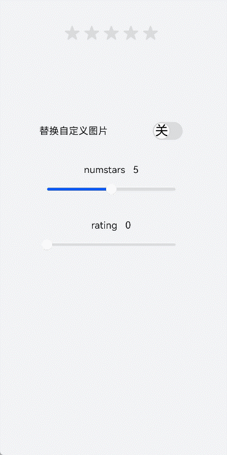

# rating开发指导


rating为评分条组件，表示用户使用感受的衡量标准条。具体用法请参考[rating](../reference/arkui-js/js-components-basic-rating.md)。


## 创建rating组件

在pages/index目录下的hml文件中创建一个rating组件。


```html
<!-- xxx.hml -->
<div class="container">
  <rating></rating>
</div>
```


```css
/* xxx.css */
.container {
  width: 100%;
  height: 100%;
  display: flex;
  justify-content: center;
  align-items: center;
  background-color: #F1F3F5;
}
rating {
  width: 80%;
  height: 150px;
}
```


## 设置评分星级

rating组件通过设置numstars和rating属性设置评分条的星级总数和当前评星数。


```html
<!-- xxx.hml -->
<div class="container">
  <rating numstars="6" rating="5">
  </rating>
</div>
```


```css
/* xxx.css */
.container {
  width: 100%;
  height: 100%;
  display: flex;
  justify-content: center;
  align-items: center;
  background-color: #F1F3F5;
}
rating {
  width: 80%;
  height: 150px;
}
```


## 设置评分样式

rating组件通过star-background、star-foreground和star-secondary属性设置单个星级未选择、选中和选中的次级背景图片。


```html
<!-- xxx.hml -->
<div class="container">
  <div style="width: 500px;height: 500px;align-items: center;justify-content: center;flex-direction: column;;">
    <rating numstars="5" rating="1" class="myrating" style="width: {{ratewidth}}; height:{{rateheight}};
    star-background: {{backstar}}; star-secondary: {{secstar}};star-foreground: {{forestar}};rtl-flip: true;">
    </rating>
  </div>
</div>
```


```css
/* xxx.css */
.container {
  width: 100%;
  height: 100%;
  flex-direction: column;
  align-items: center;
  justify-content: center;
  background-color: #F1F3F5;
}
```


```js
// index.js
export default {
  data: {
    backstar: 'common/love.png',
    secstar: 'common/love.png',
    forestar: 'common/love1.png',
    ratewidth: '400px',
    rateheight: '150px'
  },
  onInit(){
  }
}
```


> **说明：**
> - star-background、star-secondary、star-foreground属性的星级图源必须全部设置，否则默认的星级颜色为灰色，提示图源设置错误。
>
> - star-background、star-secondary、star-foreground属性只支持本地路径图片，图片格式为png和jpg。


## 绑定事件

向rating组件添加change事件，打印当前评分。


```html
<!-- xxx.hml -->
<div class="container">
  <rating numstars="5" rating="0" onchange="showrating"></rating>
</div>
```


```css
/* xxx.css */
.container {
  width: 100%;
  height: 100%;
  display: flex;
  justify-content: center;
  align-items: center;
  background-color: #F1F3F5;
}
rating {
  width: 80%;
  height: 150px;
}
```


```js
// xxx.js
import promptAction from '@ohos.promptAction';
export default {
  showrating(e) {
    promptAction.showToast({
      message: '当前评分' + e.rating
    })
  }
}
```


## 场景示例

开发者可以通过改变开关状态切换星级背景图，通过改变滑动条的值调整星级总数。


```html
<!-- xxx.hml -->
<div style="width: 100%;height:100%;flex-direction: column;align-items: center;background-color: #F1F3F5;">
    <div style="width: 500px;height: 500px;align-items: center;justify-content: center;flex-direction: column;;">
        <rating numstars="{{stars}}" rating="{{rate}}" stepsize="{{step}}" onchange="showrating" class="myrating"
                style="width: {{ratewidth}};height:{{rateheight}};star-background: {{backstar}};star-secondary: {{secstar}};
                        star-foreground: {{forestar}};rtl-flip: true;"></rating>
    </div>
    <div style="flex-direction: column;width: 80%;align-items: center;">
        <div style="width: 100%;height: 100px;align-items: center;justify-content: space-around;">
            <text>替换自定义图片</text>
            <switch checked="false" showtext="true" onchange="setstar"></switch>
        </div>
        <div style="width: 100%;height:120px;margin-top: 50px;margin-bottom: 50px;flex-direction: column;align-items: center;
                justify-content: space-around;">
            <text>numstars   {{stars}}</text>
            <slider id="sli1" min="0" max="10" value="5" step="1" onchange="setnumstars"></slider>
        </div>
        <div style="width: 100%;height:120px;flex-direction: column;align-items: center;justify-content: space-around;">
            <text>rating   {{rate}}</text>
            <slider id="sli2" min="0" max="10" value="{{rate}}" step="0.5" onchange="setrating"></slider>
        </div>
    </div>
</div>
```


```css
/* xxx.css */
.myrating:active {
    width: 500px;
    height: 100px;
}
switch{
    font-size: 40px;
}
```


```js
// xxx.js
import promptAction from '@ohos.promptAction';
export default {
    data: {
        backstar: '',
        secstar: '',
        forestar: '',
        stars: 5,
        ratewidth: '300px',
        rateheight: '60px',
        step: 0.5,
        rate: 0
    },
    onInit(){
    },
    setstar(e) {
        if (e.checked == true) {
            this.backstar = '/common/love.PNG'
            this.secstar = 'common/love.png'
            this.forestar = 'common/love1.png'
        } else {
            this.backstar = ''
            this.secstar = ''
            this.forestar = ''
        }
    },
    setnumstars(e) {
        this.stars = e.progress
        this.ratewidth = 60 * parseInt(this.stars) + 'px'
    },
    setstep(e) {
        this.step = e.progress
    },
    setrating(e){
        this.rate = e.progress
    },
    showrating(e) {
        this.rate = e.rating
        promptAction.showToast({
            message: '当前评分' + e.rating
        })
    }
}
```



## 相关实例

针对rating组件的开发，有以下相关实例可供参考：

- [rating组件的使用（JS）（API9）](https://gitee.com/openharmony/codelabs/tree/master/JSUI/RatingApplication)