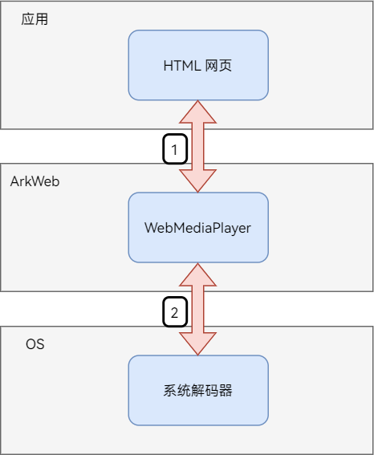
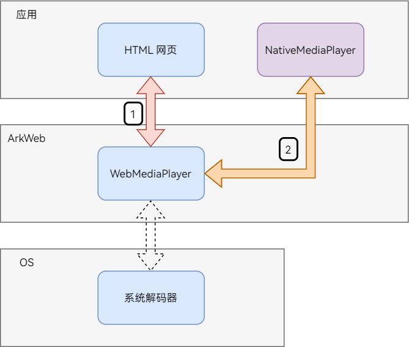
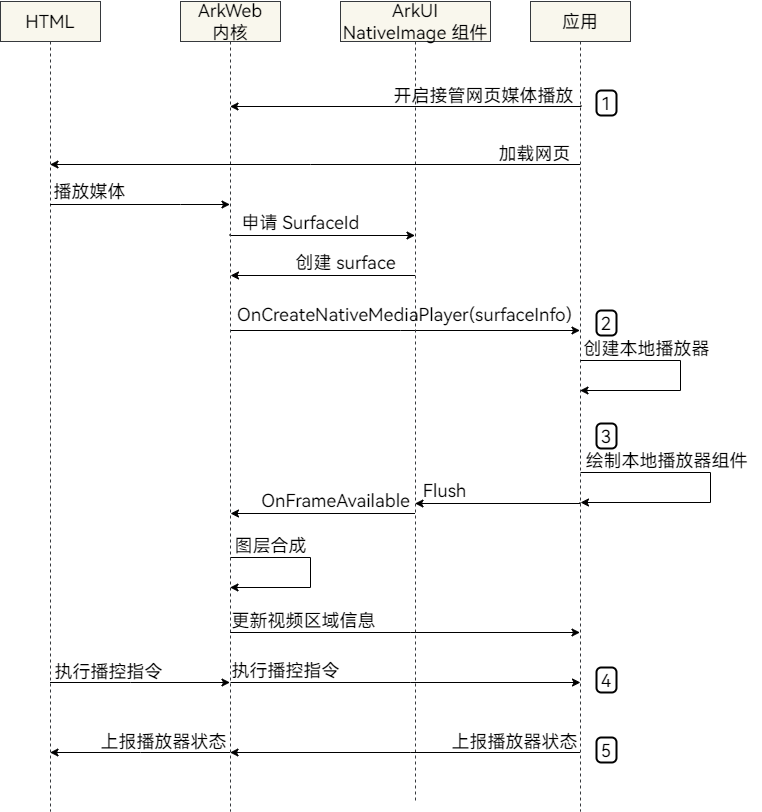

# 托管网页中的媒体播放

Web组件提供了应用接管网页中的媒体播放的能力， 用来支持应用增强网页媒体播放能力(如：画质增强)的场景。

## 使用场景

网页播放媒体时，存在着一些不能令人满意的场景， 如网页视频不够清晰， 网页的播放器界面太简陋、功能太少，甚至一些视频不能播放。

此时，如果应用开发者想通过自己的或者第三方的播放器接管网页媒体播放来改善网页的媒体播放体验，则可以使用该功能。

## 实现原理

### ArkWeb内核播放媒体的框架

不开启该功能时， ArkWeb 内核的播放架构如下：

  

  > **说明：**
  > - 上图中 1 表示 ArkWeb 内核创建 WebMdiaPlayer 来播放网页中的媒体资源。
  > - 上图中 2 表示 WebMdiaPlayer 使用系统解码器来渲染媒体数据。

开启该功能后， ArkWeb 内核的播放架构如下：

  

  > **说明：**
  > - 上图中 1 表示 ArkWeb 内核创建 WebMdiaPlayer 来播放网页中的媒体资源。
  > - 上图中 2 表示 WebMdiaPlayer 使用应用提供的本地播放器(NativeMediaPlayer)来渲染媒体数据。


### ArkWeb内核与应用的交互

  

  > **说明：**
  > - 上图中 1 的详细说明见：[开启接管网页媒体播放](#开启接管网页媒体播放)。
  > - 上图中 2 的详细说明见：[创建本地播放器](#创建本地播放器nativemediaplayer)。
  > - 上图中 3 的详细说明见：[绘制本地播放器组件](#绘制本地播放器组件)。
  > - 上图中 4 的详细说明见：[执行 ArkWeb 内核发送给本地播放器的播控指令](#执行arkweb内核发送给本地播放器的播控指令)。
  > - 上图中 5 的详细说明见：[将本地播放器的状态信息通知给 ArkWeb 内核](#将本地播放器的状态信息通知给arkweb内核)。

## 开发指导

### 开启接管网页媒体播放

如果要使用接管网页媒体播放的功能，需要先开启该功能。

开发者可以通过[enableNativeMediaPlayer](../reference/apis-arkweb/ts-basic-components-web.md#enablenativemediaplayer12)来开启该功能。

  ```ts
  // xxx.ets
  import { webview } from '@kit.ArkWeb';

  @Entry
  @Component
  struct WebComponent {
    controller: webview.WebviewController = new webview.WebviewController();

    build() {
      Column() {
        Web({ src: 'www.example.com', controller: this.controller })
          .enableNativeMediaPlayer({ enable: true, shouldOverlay: false })
      }
    }
  }
  ```

接口及参数详细说明见 [enableNativeMediaPlayer](../reference/apis-arkweb/ts-basic-components-web.md#enablenativemediaplayer12)

### 创建本地播放器(NativeMediaPlayer)

该功能开启后， 每当网页中有媒体需要播放时， ArkWeb 内核会触发由[onCreateNativeMediaPlayer](../reference/apis-arkweb/js-apis-webview.md#oncreatenativemediaplayer12)注册的回调函数。

开发者则需要调用 `onCreateNativeMediaPlayer` 来注册一个创建本地播放器的回调函数。

该回调函数需要根据媒体信息来判断是否要创建一个本地播放器来接管当前的网页媒体资源。

  * 如果应用不接管当前的为网页媒体资源， 需要在回调函数里返回 `null` 。
  * 如果应用接管当前的为网页媒体资源， 需要在回调函数里返回一个本地播放器实例。

本地播放器需要实现 [NativeMediaPlayerBridge](../reference/apis-arkweb/js-apis-webview.md#nativemediaplayerbridge12) 接口， 以便 ArkWeb 内核对本地播放器进行播控操作。

  ```ts
  // xxx.ets
  import { webview } from '@kit.ArkWeb';

  // 实现 webview.NativeMediaPlayerBridge 接口。
  // ArkWeb 内核调用该类的方法来对 NativeMediaPlayer 进行播控。
  class NativeMediaPlayerImpl implements webview.NativeMediaPlayerBridge {
    // ... 实现 NativeMediaPlayerBridge 里的接口方法 ...
    constructor(handler: webview.NativeMediaPlayerHandler, mediaInfo: webview.MediaInfo) {}
    updateRect(x: number, y: number, width: number, height: number) {}
    play() {}
    pause() {}
    seek(targetTime: number) {}
    release() {}
    setVolume(volume: number) {}
    setMuted(muted: boolean) {}
    setPlaybackRate(playbackRate: number) {}
    enterFullscreen() {}
    exitFullscreen() {}
  }

  @Entry
  @Component
  struct WebComponent {
    controller: webview.WebviewController = new webview.WebviewController();

    build() {
      Column() {
        Web({ src: 'www.example.com', controller: this.controller })
          .enableNativeMediaPlayer({ enable: true, shouldOverlay: false })
          .onPageBegin((event) => {
            this.controller.onCreateNativeMediaPlayer((handler: webview.NativeMediaPlayerHandler, mediaInfo: webview.MediaInfo) => {
              // 判断需不需要接管当前的媒体。
              if (!shouldHandle(mediaInfo)) {
                // 本地播放器不接管该媒体。
                // 返回 null 。ArkWeb 内核将用自己的播放器来播放该媒体。
                return null;
              }
              // 接管当前的媒体。
              // 返回一个本地播放器实例给 ArkWeb 内核。
              let nativePlayer: webview.NativeMediaPlayerBridge = new NativeMediaPlayerImpl(handler, mediaInfo);
              return nativePlayer;
            });
          })
      }
    }
  }

  // stub
  function shouldHandle(mediaInfo: webview.MediaInfo) {
    return true;
  }
  ```

接口及参数详细说明见 [onCreateNativeMediaPlayer](../reference/apis-arkweb/js-apis-webview.md#oncreatenativemediaplayer12)

### 绘制本地播放器组件

应用接管网页的媒体后，应用开发者需要将本地播放器组件及视频画面绘制到 ArkWeb 内核提供的 Surface 上。

然后 ArkWeb 内核将 Surface 与网页进行合成，最后上屏显示。

该流程与[同层渲染绘制](web-same-layer.md)相同。


1. 要在应用启动阶段保存 UIContext ，后续的同层渲染绘制流程会用到该 UIContext 。

   ```ts
   // xxxAbility.ets

   import { UIAbility } from '@kit.AbilityKit';
   import { window } from '@kit.ArkUI';

   export default class EntryAbility extends UIAbility {
     onWindowStageCreate(windowStage: window.WindowStage): void {
       windowStage.loadContent('pages/Index', (err, data) => {
         if (err.code) {
           return;
         }
         // 保存 UIContext， 在后续的同层渲染绘制中会用到。
         AppStorage.setOrCreate<UIContext>("UIContext", windowStage.getMainWindowSync().getUIContext());
       });
     }

     // ... 其他需要重写的方法 ...
   }
   ```

2. 使用 ArkWeb 内核创建的 surface 进行同层渲染绘制。

   ```ts
   // xxx.ets
   import { webview } from '@kit.ArkWeb';
   import { BuilderNode, FrameNode, NodeController, NodeRenderType } from '@kit.ArkUI';

   interface ComponentParams {}

   class MyNodeController extends NodeController {
     private rootNode: BuilderNode<[ComponentParams]> | undefined;

     constructor(surfaceId: string, renderType: NodeRenderType) {
       super();

       // 获取之前保存的 UIContext 。
       let uiContext = AppStorage.get<UIContext>("UIContext");
       this.rootNode = new BuilderNode(uiContext as UIContext, { surfaceId: surfaceId, type: renderType });
     }

     makeNode(uiContext: UIContext): FrameNode | null {
       if (this.rootNode) {
         return this.rootNode.getFrameNode() as FrameNode;
       }
       return null;
     }

     build() {
       // 构造本地播放器组件
     }
   }

   @Entry
   @Component
   struct WebComponent {
     node_controller?: MyNodeController;
     controller: webview.WebviewController = new webview.WebviewController();
     @State show_native_media_player: boolean = false;

     build() {
       Column() {
         Stack({ alignContent: Alignment.TopStart }) {
           if (this.show_native_media_player) {
             NodeContainer(this.node_controller)
               .width(300)
               .height(150)
               .backgroundColor(Color.Transparent)
               .border({ width: 2, color: Color.Orange })
           }
           Web({ src: 'www.example.com', controller: this.controller })
             .enableNativeMediaPlayer({ enable: true, shouldOverlay: false })
             .onPageBegin((event) => {
               this.controller.onCreateNativeMediaPlayer((handler: webview.NativeMediaPlayerHandler, mediaInfo:    webview.MediaInfo) => {
                 // 接管当前的媒体。

                 // 使用同层渲染流程提供的 surface 来构造一个本地播放器组件。
                 this.node_controller = new MyNodeController(mediaInfo..surfaceInfo.id, NodeRenderType.  RENDER_TYPE_TEXTURE);
                 this.node_controller.build();

                 // 展示本地播放器组件。
                 this.show_native_media_player = true;

                 // 返回一个本地播放器实例给 ArkWeb 内核。
                 return null;
               });
             })
         }
       }
     }
   }
   ```

动态创建组件并绘制到 Surface 上的详细介绍见 [同层渲染绘制](web-same-layer.md) 。

### 执行ArkWeb内核发送给本地播放器的播控指令

为了方便 ArkWeb 内核对本地播放器进行播控操作, 应用开发者需要令本地播放器实现 [NativeMediaPlayerBridge](../reference/apis-arkweb/js-apis-webview.md#nativemediaplayerbridge12) 接口，并根据每个接口方法的功能对本地播放器进行相应的操作。

  ```ts
  // xxx.ets
  import { webview } from '@kit.ArkWeb';

  class ActualNativeMediaPlayerListener {
    constructor(handler: webview.NativeMediaPlayerHandler) {}
  }

  class NativeMediaPlayerImpl implements webview.NativeMediaPlayerBridge {
    constructor(handler: webview.NativeMediaPlayerHandler, mediaInfo: webview.MediaInfo) {
      // 1. 创建一个本地播放器的状态监听。
      let listener: ActualNativeMediaPlayerListener = new ActualNativeMediaPlayerListener(handler);
      // 2. 创建一个本地播放器。
      // 3. 监听该本地播放器。
      // ...
    }

    updateRect(x: number, y: number, width: number, height: number) {
      // <video> 标签的位置和大小发生了变化。
      // 根据该信息变化，作出相应的改变。
    }

    play() {
      // 启动本地播放器播放。
    }

    pause() {
      // 暂停本地播放器播放。
    }

    seek(targetTime: number) {
      // 本地播放器跳转到指定的时间点。
    }

    release() {
      // 销毁本地播放器。
    }

    setVolume(volume: number) {
      // ArkWeb 内核要求调整本地播放器的音量。
      // 设置本地播放器的音量。
    }

    setMuted(muted: boolean) {
      // 将本地播放器静音或取消静音。
    }

    setPlaybackRate(playbackRate: number) {
      // 调整本地播放器的播放速度。
    }

    enterFullscreen() {
      // 将本地播放器设置为全屏播放。
    }

    exitFullscreen() {
      // 将本地播放器退出全屏播放。
    }
  }
  ```

接口方法详细说明见 [NativeMediaPlayerBridge](../reference/apis-arkweb/js-apis-webview.md#nativemediaplayerbridge12)

### 将本地播放器的状态信息通知给ArkWeb内核

ArkWeb 内核需要本地播放器的状态信息来更新到网页， 如视频的宽高、播放时间、缓存时间等。应用开发者需要将本地播放器的状态信息通知给 ArkWeb 内核。

在 [onCreateNativeMediaPlayer](../reference/apis-arkweb/js-apis-webview.md#oncreatenativemediaplayer12) 接口中， ArkWeb 内核传递给应用一个 [NativeMediaPlayerHandler](../reference/apis-arkweb/js-apis-webview.md#nativemediaplayerhandler12) 对象。

应用开发者需要通过该对象将本地播放器的最新状态信息通知给 ArkWeb 内核。

  ```ts
  // xxx.ets
  import { webview } from '@kit.ArkWeb';

  class ActualNativeMediaPlayerListener {
    handler: webview.NativeMediaPlayerHandler;

    constructor(handler: webview.NativeMediaPlayerHandler) {
      this.handler = handler;
    }

    onPlaying() {
      // 本地播放器开始播放。
      this.handler.handleStatusChanged(webview.PlaybackStatus.PLAYING);
    }
    onPaused() {
      // 本地播放器暂停播放。
      this.handler.handleStatusChanged(webview.PlaybackStatus.PAUSED);
    }
    onSeeking() {
      // 本地播放器开始执行跳转到目标时间点。
      this.handler.handleSeeking();
    }
    onSeekDone() {
      // 本地播放器 seek 完成。
      this.handler.handleSeekFinished();
    }
    onEnded() {
      // 本地播放器播放完成。
      this.handler.handleEnded();
    }
    onVolumeChanged() {
      // 获取本地播放器的音量。
      let volume: number = getVolume();
      this.handler.handleVolumeChanged(volume);
    }
    onCurrentPlayingTimeUpdate() {
      // 更新播放时间。
      let currentTime: number = getCurrentPlayingTime();
      // 将时间单位换算成秒。
      let currentTimeInSeconds = convertToSeconds(currentTime);
      this.handler.handleTimeUpdate(currentTimeInSeconds);
    }
    onBufferedChanged() {
      // 缓存发生了变化。
      // 获取本地播放器的缓存时长。
      let bufferedEndTime: number = getCurrentBufferedTime();
      // 将时间单位换算成秒。
      let bufferedEndTimeInSeconds = convertToSeconds(bufferedEndTime);
      this.handler.handleBufferedEndTimeChanged(bufferedEndTimeInSeconds);

      // 检查缓存状态。
      // 如果缓存状态发生了变化，则向 ArkWeb 内核通知缓存状态。
      let lastReadyState: webview.ReadyState = getLastReadyState();
      let currentReadyState: webview.ReadyState = getCurrentReadyState();
      if (lastReadyState != currentReadyState) {
        this.handler.handleReadyStateChanged(currentReadyState);
      }
    }
    onEnterFullscreen() {
      // 本地播放器进入了全屏状态。
      let isFullscreen: boolean = true;
      this.handler.handleFullscreenChanged(isFullscreen);
    }
    onExitFullscreen() {
      // 本地播放器退出了全屏状态。
      let isFullscreen: boolean = false;
      this.handler.handleFullscreenChanged(isFullscreen);
    }
    onUpdateVideoSize(width: number, height: number) {
      // 当本地播放器解析出视频宽高时， 通知 ArkWeb 内核。
      this.handler.handleVideoSizeChanged(width, height);
    }

    // ... 监听本地播放器其他的状态 ...
  }
  @Entry
  @Component
  struct WebComponent {
    controller: webview.WebviewController = new webview.WebviewController();
    @State show_native_media_player: boolean = false;

    build() {
      Column() {
        Web({ src: 'www.example.com', controller: this.controller })
          .enableNativeMediaPlayer({enable: true, shouldOverlay: false})
          .onPageBegin((event) => {
            this.controller.onCreateNativeMediaPlayer((handler: webview.NativeMediaPlayerHandler, mediaInfo: webview.MediaInfo) => {
              // 接管当前的媒体。

              // 创建一个本地播放器实例。
              // let nativePlayer: NativeMediaPlayerImpl = new NativeMediaPlayerImpl(handler, mediaInfo);

              // 创建一个本地播放器状态监听对象。
              let nativeMediaPlayerListener: ActualNativeMediaPlayerListener = new ActualNativeMediaPlayerListener(handler);
              // 监听本地播放器状态。
              // nativePlayer.setListener(nativeMediaPlayerListener);

              // 返回这个本地播放器实例给 ArkWeb 内核。
              return null;
            });
          })
      }
    }
  }

  // stub
  function getVolume() {
    return 1;
  }
  function getCurrentPlayingTime() {
    return 1;
  }
  function getCurrentBufferedTime() {
    return 1;
  }
  function convertToSeconds(input: number) {
    return input;
  }
  function getLastReadyState() {
    return webview.ReadyState.HAVE_NOTHING;
  }
  function getCurrentReadyState() {
    return webview.ReadyState.HAVE_NOTHING;
  }
  ```


接口方法详细说明见 [NativeMediaPlayerHandler](../reference/apis-arkweb/js-apis-webview.md#nativemediaplayerhandler12)


## 完整示例

- 使用前请在module.json5添加如下权限。

  ```ts
  "ohos.permission.INTERNET"
  ```

- 应用侧代码，在应用启动阶段保存 UIContext 。

  ```ts
  // xxxAbility.ets

  import { UIAbility } from '@kit.AbilityKit';
  import { window } from '@kit.ArkUI';

  export default class EntryAbility extends UIAbility {
    onWindowStageCreate(windowStage: window.WindowStage): void {
      windowStage.loadContent('pages/Index', (err, data) => {
        if (err.code) {
          return;
        }
        // 保存 UIContext， 在后续的同层渲染绘制中会用到。
        AppStorage.setOrCreate<UIContext>("UIContext", windowStage.getMainWindowSync().getUIContext());
      });
    }

    // ... 其他需要重写的方法 ...
  }
  ```

- 应用侧代码，视频托管使用示例。

  ```ts
  import { webview } from '@kit.ArkWeb';
  import { BuilderNode, FrameNode, NodeController, NodeRenderType, UIContext } from '@kit.ArkUI';
  import { AVPlayerDemo, AVPlayerListener } from './PlayerDemo';

  // 实现 webview.NativeMediaPlayerBridge 接口。
  // ArkWeb 内核调用该类的方法来对 NativeMediaPlayer 进行播控。
  class NativeMediaPlayerImpl implements webview.NativeMediaPlayerBridge {
    private surfaceId: string;
    mediaSource: string;
    private mediaHandler: webview.NativeMediaPlayerHandler;
    web: WebComponent;
    nativePlayer?: AVPlayerDemo;

    constructor(web: WebComponent, handler: webview.NativeMediaPlayerHandler, mediaInfo: webview.MediaInfo) {
      console.log('NativeMediaPlayerImpl.constructor, surface_id[' + mediaInfo.surfaceInfo.id + ']');
      this.web = web;
      this.mediaHandler = handler;
      this.surfaceId = mediaInfo.surfaceInfo.id;
      this.mediaSource = mediaInfo.mediaSrcList[0].source;

      // 使用同层渲染功能，将视频及其播控组件绘制到网页中
      this.web.node_controller = new MyNodeController(
          this.web, this.surfaceId, this.mediaHandler, this, NodeRenderType.RENDER_TYPE_TEXTURE)
      this.web.node_controller.build()
      this.web.show_native_media_player = true;

      console.log('NativeMediaPlayerImpl.mediaSource : ' + this.mediaSource);
    }

    setNativePlayer(nativePlayer: AVPlayerDemo) {
      this.nativePlayer = nativePlayer;
    }

    updateRect(x: number, y: number, width: number, height: number): void {
      this.web.node_width = width
      this.web.node_height = height
    }

    play() {
      this.nativePlayer?.play();
    }
    pause() {
      this.nativePlayer?.pause();
    }
    seek(targetTime: number) {
    }
    setVolume(volume: number) {
    }
    setMuted(muted: boolean) {
    }
    setPlaybackRate(playbackRate: number) {
    }
    release() {
      this.nativePlayer?.release();
      this.web.show_native_media_player = false;
    }
    enterFullscreen() {
    }
    exitFullscreen() {
    }
  }

  // 监听NativeMediaPlayer的状态, 然后通过 webview.NativeMediaPlayerHandler 将状态上报给 ArkWeb 内核。
  class AVPlayerListenerImpl implements AVPlayerListener {
    handler: webview.NativeMediaPlayerHandler;
    component: NativePlayerComponent;

    constructor(handler: webview.NativeMediaPlayerHandler, component: NativePlayerComponent) {
      this.handler = handler;
      this.component = component;
    }
    onPlaying() {
      this.handler.handleStatusChanged(webview.PlaybackStatus.PLAYING);
    }
    onPaused() {
      this.handler.handleStatusChanged(webview.PlaybackStatus.PAUSED);
    }
    onDurationChanged(duration: number) {
      this.handler.handleDurationChanged(duration);
    }
    onBufferedTimeChanged(buffered: number) {
      this.handler.handleBufferedEndTimeChanged(buffered);
    }
    onTimeUpdate(time: number) {
      this.handler.handleTimeUpdate(time);
    }
    onEnded() {
      this.handler.handleEnded();
    }
    onError() {
      this.handler.handleError(1, "Oops!");
    }
    onVideoSizeChanged(width: number, height: number) {
      this.handler.handleVideoSizeChanged(width, height);
      this.component.onSizeChanged(width, height);
    }
  }

  interface Params {
    text: string
    text2: string
    web_tab: WebComponent
    handler: webview.NativeMediaPlayerHandler
    player: NativeMediaPlayerImpl
  }

  // 自定义的播放器组件
  @Component
  struct NativePlayerComponent {
    params?: Params
    @State bkColor: Color = Color.Red
    mXComponentController: XComponentController = new XComponentController();
    @State player_changed: boolean = false;

    videoController: VideoController = new VideoController();
    player?: AVPlayerDemo
    offset_x: number = 0
    offset_y: number = 0
    @State video_width_percent: number = 100;
    @State video_height_percent: number = 100;
    view_width: number = 0;
    view_height: number = 0;
    video_width: number = 0;
    video_height: number = 0;

    fullscreen: boolean = false;

    onSizeChanged(width: number, height: number) {
      this.video_width = width;
      this.video_height = height;
      let scale: number = this.view_width / width;
      let scaled_video_height: number = scale * height;
      this.video_height_percent = scaled_video_height / this.view_height * 100;
    }

    build() {
      Column() {
        Stack() {
          XComponent({ id: 'video_player_id', type: XComponentType.SURFACE, controller: this.mXComponentController })
            .width(this.video_width_percent + '%')
            .height(this.video_height_percent + '%')
            .border({ width: 1, color: Color.Red })
            .onLoad(()=>{
              if (!this.params) {
                console.log('this.params is null');
                return;
              }
              this.player = new AVPlayerDemo();
              this.params.player?.setNativePlayer(this.player);
              this.player.setSurfaceID(this.mXComponentController.getXComponentSurfaceId());
              this.player_changed = !this.player_changed;

              this.player.avPlayerLiveDemo(
                this.params.player.mediaSource,
                new AVPlayerListenerImpl(this.params.handler, this));
            })
          Column() {
            Row() {
              Button(this.params?.text)
                .height(50)
                .border({ width: 2, color: Color.Red })
                .backgroundColor(this.bkColor)
                .onClick(()=>{
                  console.log('[BrowserShell] Button[' + this.params?.text + '] is clicked');
                  this.player?.play();
                })
                .onTouch((event: TouchEvent) => {
                  event.stopPropagation();
                })
              Button(this.params?.text2)
                .height(50)
                .border({ width: 2, color: Color.Red })
                .onClick(()=>{
                  console.log('[BrowserShell] Button[' + this.params?.text2 + '] is clicked');
                  this.player?.pause();
                })
                .onTouch((event: TouchEvent) => {
                  event.stopPropagation();
                })
            }
            .width('100%')
            .justifyContent(FlexAlign.SpaceEvenly)
          }
        }
      }
      .width('100%')
      .height('100%')
      .onTouchIntercept((event : TouchEvent) => {
        return HitTestMode.None
      })
      .onAreaChange((oldValue: Area, newValue: Area) => {
        this.view_width = new Number(newValue.width).valueOf()
        this.view_height = new Number(newValue.height).valueOf()

        this.onSizeChanged(this.video_width, this.video_height);
      })
    }
  }

  @Builder
  function NativePlayerComponentBuilder(params: Params) {
    NativePlayerComponent({ params: params })
      .backgroundColor(Color.Green)
      .border({ width: 1, color: Color.Brown })
      .width('100%')
      .height('100%')
  }

  // 通过 NodeController 来动态创建自定义的播放器组件， 并将组件内容绘制到 surfaceId 指定的 surface 上。
  class MyNodeController extends NodeController {
    private rootNode: BuilderNode<[Params]> | undefined;
    private isRemove = false;
    web_tab: WebComponent
    listener: webview.NativeMediaPlayerHandler
    player: NativeMediaPlayerImpl

    constructor(web_tab: WebComponent, surfaceId: string,  listener: webview.NativeMediaPlayerHandler, player: NativeMediaPlayerImpl, renderType: NodeRenderType) {
      super()
      this.web_tab = web_tab;
      this.listener = listener;
      this.player = player;
      let uiContext = AppStorage.get<UIContext>("UIContext");
      this.rootNode = new BuilderNode(uiContext as UIContext, { surfaceId: surfaceId, type: renderType });
    }

    makeNode(uiContext: UIContext): FrameNode | null {
      if (this.rootNode) {
        return this.rootNode.getFrameNode() as FrameNode;
      }
      return null;
    }

    build() {
      if (this.rootNode) {
        this.rootNode.build(wrapBuilder(NativePlayerComponentBuilder),
          { "text": "play", "text2": "pause", web_tab: this.web_tab, handler: this.listener, player: this.player})
      }
    }
  }

  interface PageBeginParam {
    url: string
  }

  @Entry
  @Component
  struct WebComponent {
    controller: WebviewController = new webview.WebviewController()
    nativePlayer? : webview.NativeMediaPlayerBridge
    page_url: Resource = $rawfile('main.html')
    node_controller?: MyNodeController
    @State show_native_media_player: boolean = false;
    @State node_width : number = 300;
    @State node_height : number = 150;
    area?: Area

    build() {
      Column() {
        Stack({alignContent: Alignment.TopStart}) {
          if (this.show_native_media_player) {
            NodeContainer(this.node_controller)
              .width(this.node_width + 'px')
              .height(this.node_height + 'px')
              .backgroundColor(Color.Transparent)
              .border({ width: 2, color: Color.Orange })
          }
          Web({ src: this.page_url, controller: this.controller })
            .enableNativeMediaPlayer({ enable: true, shouldOverlay: true })
            .onPageBegin((event: PageBeginParam) => {
              this.controller.onCreateNativeMediaPlayer((handler: webview.NativeMediaPlayerHandler, mediaInfo: webview.MediaInfo) => {
                console.error('onCreateNativeMediaPlayer(' + JSON.stringify(mediaInfo) + ')');
                this.nativePlayer = new NativeMediaPlayerImpl(this, handler, mediaInfo);
                return this.nativePlayer;
              });
            })
            .width('100%')
            .height('100%')
            .onAreaChange((oldValue: Area, newValue: Area) => {
              oldValue;
              this.area = newValue;
            })
        }
      }
    }
  }
  ```

- 应用侧代码，视频播放示例, ./PlayerDemo.ets。

  ```ts
  import { media } from '@kit.MediaKit';
  import { common } from '@kit.AbilityKit';
  import { BusinessError } from '@kit.BasicServicesKit';

  export interface AVPlayerListener {
    onPlaying() : void
    onPaused() : void
    onDurationChanged(duration: number) : void
    onBufferedTimeChanged(buffered: number) : void
    onTimeUpdate(time: number) : void
    onEnded() : void
    onError() : void
    onVideoSizeChanged(width: number, height: number): void
  }

  export class AVPlayerDemo {
    private surfaceID: string = ''; // surfaceID用于播放画面显示，具体的值需要通过Xcomponent接口获取，相关文档链接见上面Xcomponent创建方法
    private isSeek: boolean = true; // 用于区分模式是否支持seek操作
    private fileSize: number = -1;
    private fd: number = 0;

    avPlayer?: media.AVPlayer;

    setSurfaceID(surface_id: string) {
      console.log('setSurfaceID : ' + surface_id)
      this.surfaceID = surface_id;
    }
    // 注册avplayer回调函数
    setAVPlayerCallback(avPlayer: media.AVPlayer, listener?: AVPlayerListener) {
      // seek操作结果回调函数
      avPlayer.on('seekDone', (seekDoneTime: number) => {
        console.info(`AVPlayer seek succeeded, seek time is ${seekDoneTime}`);
      })
      // error回调监听函数,当avPlayer在操作过程中出现错误时调用reset接口触发重置流程
      avPlayer.on('error', (err: BusinessError) => {
        console.error(`Invoke avPlayer failed, code is ${err.code}, message is ${err.message}`);
        listener?.onError();
        avPlayer.reset(); // 调用reset重置资源，触发idle状态
      })
      // 状态机变化回调函数
      avPlayer.on('stateChange', async (state: string, reason: media.StateChangeReason) => {
        switch (state) {
          case 'idle': // 成功调用reset接口后触发该状态机上报
            console.info('AVPlayer state idle called.');
            avPlayer.release(); // 调用release接口销毁实例对象
            break;
          case 'initialized': // avplayer 设置播放源后触发该状态上报
            console.info('AVPlayer state initialized called.');
            avPlayer.surfaceId = this.surfaceID; // 设置显示画面，当播放的资源为纯音频时无需设置
            avPlayer.prepare();
            break;
          case 'prepared': // prepare调用成功后上报该状态机
            console.info('AVPlayer state prepared called.');
            //avPlayer.play();
            break;
          case 'playing': // play成功调用后触发该状态机上报
            console.info('AVPlayer state playing called.');
            listener?.onPlaying();
            break;
          case 'paused': // pause成功调用后触发该状态机上报
            console.info('AVPlayer state paused called.');
            listener?.onPaused();
            break;
          case 'completed': // 播放结束后触发该状态机上报
            console.info('AVPlayer state completed called.');
            avPlayer.stop(); //调用播放结束接口
            //avPlayer.seek(0);
            //avPlayer.play();
            break;
          case 'stopped': // stop接口成功调用后触发该状态机上报
            console.info('AVPlayer state stopped called.');
            listener?.onEnded();
            //avPlayer.reset(); // 调用reset接口初始化avplayer状态
            break;
          case 'released':
            console.info('AVPlayer state released called.');
            break;
          default:
            console.info('AVPlayer state unknown called.');
            break;
        }
      })
      avPlayer.on('durationUpdate', (duration: number) => {
        console.info('AVPlayer state durationUpdate success,new duration is :' + duration)
        listener?.onDurationChanged(duration/1000);
      })
      avPlayer.on('timeUpdate', (time:number) => {
        listener?.onTimeUpdate(time/1000);
      })
      avPlayer.on('bufferingUpdate', (infoType: media.BufferingInfoType, value: number) => {
        console.info('AVPlayer state bufferingUpdate success,and infoType value is:' + infoType + ', value is :' + value)
        if (infoType == media.BufferingInfoType.BUFFERING_PERCENT) {
        }
        listener?.onBufferedTimeChanged(value);
      })
      avPlayer.on('videoSizeChange', (width: number, height: number) => {
        console.info('AVPlayer state videoSizeChange success,and width is:' + width + ', height is :' + height)
        listener?.onVideoSizeChanged(width, height);
      })
    }

    // 以下demo为通过url设置网络地址来实现播放直播码流的demo
    async avPlayerLiveDemo(url: string, listener?: AVPlayerListener) {
      // 创建avPlayer实例对象
      this.avPlayer = await media.createAVPlayer();
      // 创建状态机变化回调函数
      this.setAVPlayerCallback(this.avPlayer, listener);
      this.isSeek = false; // 不支持seek操作
      this.avPlayer.url = url;
    }

    play() {
      console.info('AVPlayer.play()');
      this.avPlayer?.play()
    }
    pause() {
      console.info('AVPlayer.pause()');
      this.avPlayer?.pause()
    }
    release() {
      console.info('AVPlayer.release()');
      this.avPlayer?.release();
    }
    seek(time: number) {
      console.info('AVPlayer.seek(' + time + ')');
      this.avPlayer?.seek(time * 1000);
    }
  }
  ```

- 前端页面示例。

  ```html
  <html>
  <head>
      <title>视频托管测试html</title>
      <meta name="viewport" content="width=device-width">
  </head>
  <body>
  <div>
    <video src='https://media.w3.org/2010/05/sintel/trailer.mp4'></video>
  </div>
  </body>
  </html>
  ```
