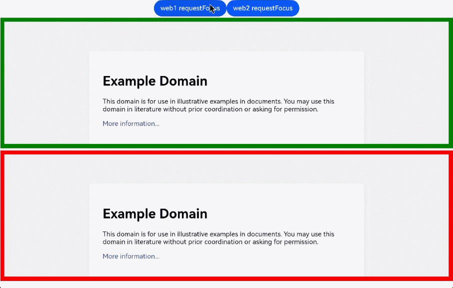

# Web组件焦点管理

开发者可利用Web组件的焦点管理功能，有效管理Web组件的聚焦与失焦，同时利用H5侧的W3C标准接口，管理网页界面上唯一可交互的元素聚焦与失焦。

- Web组件与ArkUI组件焦点控制的常用接口及其使用场景：

  1. 通过requestFocus主动请求Web组件获焦：当应用内有多个组件时，开发者可通过Web组件的[requestFocus](../reference/apis-arkweb/js-apis-webview-WebviewController.md#requestfocus)接口，主动将焦点转移到Web组件。
  2. 根据焦点情况更改Web组件样式：组件监听焦点事件上报，为组件修改样式，例如边框、背景色等，以提供视觉和交互反馈。

- Web组件内H5元素焦点控制的常用接口及其使用场景：

  1. 通过tabindex属性管理元素焦点：定义Web组件内元素的焦点顺序。可以通过将元素的tabindex设置为"-1"，使其能够通过脚本进行聚焦，同时在CSS中对元素的可见性进行控制。
  2. 键盘事件更新焦点位置：监听键盘事件，例如Tab键，依据用户的操作更新Web内元素焦点位置。
  3. 根据焦点情况更改Web组件内元素样式：为焦点元素添加样式，例如边框、背景色等，以提供视觉和交互反馈。

## 基础概念
Web组件焦点、焦点链和走焦的详情说明请参考[ArkUI焦点基础概念](../ui/arkts-common-events-focus-event.md#基础概念)。

- 焦点：
    - 组件焦点：指当前应用界面上唯一的一个可交互元素。
    - 网页内元素焦点：指当前网页界面上唯一的一个可交互元素。
- 走焦：
    - 组件走焦：指焦点在应用内的组件之间转移的行为。这一过程对用户是透明的，开发者可以通过监听onFocus（焦点获取）和onBlur（焦点失去）事件来捕捉这些变化。
    - 网页内元素走焦：指焦点在网页内的元素之间转移的行为。该行为遵循W3C标准，开发者可以通过监听focus（在元素获取焦点时触发）和blur（在元素失去焦点时触发）事件来捕捉这些变化。

## Web组件走焦规范
根据走焦的触发方式，可以分为主动走焦和被动走焦，Web组件走焦规范详情参考[ArkUI走焦规范](../ui/arkts-common-events-focus-event.md#走焦规范)。

### 主动走焦
指开发者或用户主观行为导致的焦点移动。包括：使用requestFocus申请焦点、外接键盘的按键走焦（TAB键/Shift+TAB键）、点击申请焦点（手势/鼠标/触摸板）等导致的焦点转移。

- requestFocus

  详见[Web组件与ArkUI组件焦点控制](./web-focus.md#web组件与arkui组件焦点控制)，可以主动将焦点转移到Web组件上。

- 按键走焦

  - 支持ArkWeb与其他组件通过TAB键、Shift+TAB键走焦。
  - 支持ArkWeb内部网页元素通过TAB键、Shift+TAB键走焦，网页元素走焦完成后，抛回ArkUI继续框架侧走焦。

- 点击申请获焦

  开发者或用户可通过手势、鼠标或触摸板点击Web组件，使其主动获得焦点。当具体点击到Web组件内的某个元素时，该元素能够获得焦点，例如：点击网页内的输入框，可使其从不可编辑状态转变为可编辑状态，并激活输入法。

### 被动走焦
被动走焦指焦点因系统或其他操作而转移，无需开发者直接干预，是焦点系统的默认行为。

被动走焦的场景有：

- 组件删除：当焦点所在的Web组件被移除时，系统会按照先向后再向前的原则，将焦点转移至相邻的同级组件。若所有同级组件均不可获焦，则焦点将被释放，并通知其父级组件进行焦点处理。

- 属性变更：若将处于焦点状态的组件的focusable或enabled属性设置为false，或者将visibility属性设置为不可见，系统将自动转移焦点至其他可获焦组件，转移方式同组件删除。

- Web组件不可见：ArkWeb获焦后，应用前后台切换、页面切换、Navigation导航等场景，ArkWeb会失焦再获焦。

- Web组件加载网页：ArkWeb通过src、loadUrl、loadData加载网页，默认会获取焦点，但若此时web组件为不可获焦状态则会获焦失败（常见的不可获焦状态原因有：过场动画过程中父组件不可获焦、应用侧设置了web组件或其父组件不可获焦属性等），应用侧可以调用主动申请获焦接口[requestFocus](../reference/apis-arkweb//js-apis-webview-WebviewController.md#requestfocus)再次尝试使web组件获焦。当获焦成功后，应用侧onFocus、w3c focus事件均会上报。

- autofocus样式：设置了autofocus样式的元素网页完成加载时默认获焦。若该元素支持文本输入，则输入框会有光标闪烁，但不会弹出软键盘。如需自动弹出软键盘，可参考[软键盘自动弹出](web-docking-softkeyboard.md#软键盘自动弹出)。


- 菜单弹出：ArkUI的overlay属性类型组件默认抢焦，在与此类组件结合的ArkWeb场景中（[menu](../reference/apis-arkui/arkui-ts/ts-basic-components-menu.md)、[datepicker](../reference/apis-arkui/arkui-ts/ts-basic-components-datepicker.md)、[timepicker](../reference/apis-arkui/arkui-ts/ts-basic-components-timepicker.md)、下拉框、弹窗等），ArkWeb均会失焦。

## Web组件与ArkUI组件焦点控制

- 应用侧通用获焦回调接口[onFocus](../reference/apis-arkui/arkui-ts/ts-universal-focus-event.md#onfocus)，获焦事件回调，绑定该接口的组件获焦时，回调响应。
- 应用侧通用失焦回调接口[onBlur](../reference/apis-arkui/arkui-ts/ts-universal-focus-event.md#onblur)，失焦事件回调，绑定该接口的组件失焦时，回调响应。
- 应用侧主动申请获焦接口[requestFocus](../reference/apis-arkweb/js-apis-webview-WebviewController.md#requestfocus)，组件主动申请获焦。
- 设置组件是否可获焦：应用可以通过设置[focusable](../reference/apis-arkui/arkui-ts/ts-universal-attributes-focus.md#focusable)属性，控制Web组件是否能够获取焦点。Web组件默认可获焦。

**示例：**
1. requestFocus接口允许应用开发者主动控制让Web组件获焦。
2. onFocus和onBlur两个接口通常成对使用，来监听组件的焦点变化。

```ts
// xxx.ets
import { webview } from '@kit.ArkWeb';
import { BusinessError } from '@kit.BasicServicesKit';

@Entry
@Component
struct WebComponent {
  controller: webview.WebviewController = new webview.WebviewController();
  controller2: webview.WebviewController = new webview.WebviewController();
  @State webborderColor: Color = Color.Red;
  @State webborderColor2: Color = Color.Red;

  build() {
    Column() {
      Row() {
        Button('web1 requestFocus')
          .onClick(() => {
            try {
              this.controller.requestFocus();
            } catch (error) {
              console.error(`ErrorCode: ${(error as BusinessError).code},  Message: ${(error as BusinessError).message}`);
            }
          });
        Button('web2 requestFocus')
          .onClick(() => {
            try {
              this.controller2.requestFocus();
            } catch (error) {
              console.error(`ErrorCode: ${(error as BusinessError).code},  Message: ${(error as BusinessError).message}`);
            }
          });
      }
      Web({ src: 'www.example.com', controller: this.controller })
        .onFocus(() => {
          this.webborderColor = Color.Green;
        })
        .onBlur(() => {
          this.webborderColor = Color.Red;
        })
        .margin(3)
        .borderWidth(10)
        .borderColor(this.webborderColor)
        .height("45%")

      Web({ src: 'www.example.com', controller: this.controller2 })
        .onFocus(() => {
          this.webborderColor2 = Color.Green;
        })
        .onBlur(() => {
          this.webborderColor2 = Color.Red;
        })
        .margin(3)
        .borderWidth(10)
        .borderColor(this.webborderColor2)
        .height("45%")
    }
  }
}
```
**示例图1**  组件焦点获焦/失焦事件

通过requestFocus接口主动请求获焦，并监听通用接口onFocus和onBlur事件，改变Web组件边框颜色。



## Web组件内H5元素焦点控制
- W3C标准事件focus，前端感知网页获焦
```
addEventListener("focus", (event) => {});

onfocus = (event) => {};
```
- W3C标准事件blur，前端感知网页失焦
```
addEventListener("blur", (event) => {});

onblur = (event) => {};
```
- W3C autofocus，表示元素应在页面加载时或其所属的 `dialog` 显示时被聚焦
```
<input name="q" autofocus />
```
在文档或对话框中，最多只能有一个元素具有 autofocus 属性。若应用于多个元素，第一个元素将获得焦点。

**示例：**
```ts
// xxx.ets
import { webview } from '@kit.ArkWeb';
import { BusinessError } from '@kit.BasicServicesKit';

@Entry
@Component
struct WebComponent {
  controller: webview.WebviewController = new webview.WebviewController();

  build() {
    Column() {
      Web({ src: $rawfile("test.html"), controller: this.controller })
    }
  }
}
```

```js
// test.html
<!DOCTYPE html>
<html>
<head>
<meta charset="utf-8">
<title>test</title>
</head>
<body>
  <form id="form">
    <input type="text" placeholder="text input" />
    <input type="password" placeholder="password" />
  </form>
</body>
<script>
const form = document.getElementById("form");

form.addEventListener(
  "focus",
  (event) => {
    event.target.style.background = "pink";
  },
  true,
);

form.addEventListener(
  "blur",
  (event) => {
    event.target.style.background = "";
  },
  true,
);
</script>
</html>
```

**示例图2**  Web组件内元素焦点获焦/失焦事件

通过监听W3C接口focus和blur事件，改变输入背景色。

