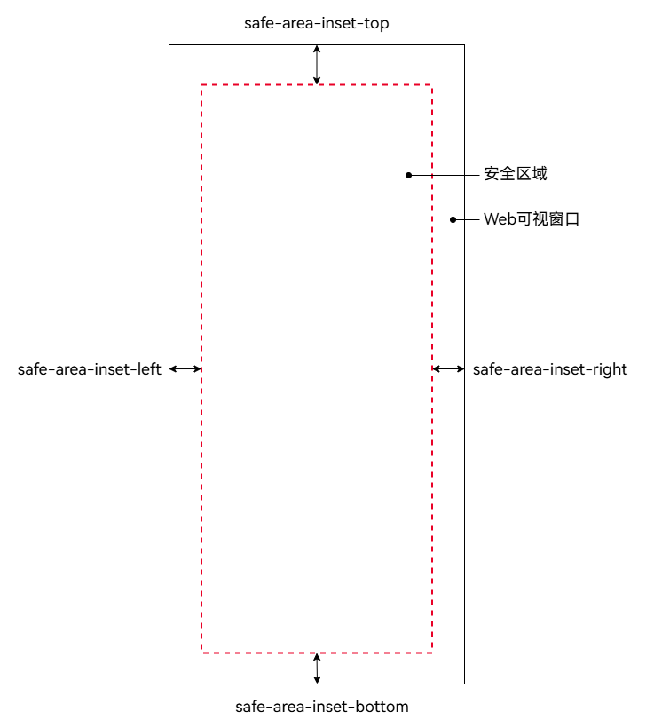

# 网页中安全区域计算和避让适配

早期设备屏幕多为规整矩形，应用界面可以完整展示。随着全面屏、刘海屏等异形屏幕的普及，屏幕边缘可能存在圆角、摄像头或系统导航条等，导致界面被遮挡。

安全区域是屏幕中未被设备硬件或系统UI遮挡的区域，不与系统非安全区域（如状态栏、挖孔区和导航栏）重叠。应用的布局默认限制在安全区域内，但系统提供沉浸式布局能力，应用可以通过配置使界面扩展至非安全区域。

在沉浸式效果下，Web组件网页元素会出现被状态栏、挖孔区以及导航条遮挡的问题。该场景下，需要网页开发者进行避让适配，使网页中文字、表单和交互组件等关键内容避让非安全区域，以确保用户能完整地阅读和交互。

Web组件提供了利用W3C CSS进行安全区域计算并避让适配的能力，用来支持异形屏幕设备在沉浸式效果下网页的正常显示，网页开发者可以使用该能力对被遮挡元素进行避让。

## 开启Web组件沉浸式效果

Web组件默认布局在安全区域内。开启沉浸式效果时，Web网页延伸至状态栏和导航栏，可以最大化利用屏幕可视区域，优化视觉连贯性，提升用户的UI体验。开发者可以通过以下方式开启Web组件沉浸式效果：

- 通过[setWindowLayoutFullScreen](../reference/apis-arkui/js-apis-window.md#setwindowlayoutfullscreen9)设置应用窗口全屏。窗口全屏时，Web组件可布局至非安全区域。

  ```ts
  // EntryAbility.ets
  import { UIAbility } from '@kit.AbilityKit';
  import { window } from '@kit.ArkUI';

  export default class EntryAbility extends UIAbility {
    // ...
    onWindowStageCreate(windowStage: window.WindowStage): void {
      windowStage.getMainWindow().then(window => {
        // 设置窗口全屏
        window.setWindowLayoutFullScreen(true);
      });
    }
  }
  ```

  ```ts
  // xxx.ets
  import { webview } from '@kit.ArkWeb';

  @Entry
  @Component
  struct WebComponent {
    controller: webview.WebviewController = new webview.WebviewController();

    build() {
      Column() {
        Web({ src: 'www.example.com', controller: this.controller })
          .width('100%').height('100%')
      }
    }
  }
  ```

- 通过[expandSafeArea](../reference/apis-arkui/arkui-ts/ts-universal-attributes-expand-safe-area.md)设置Web组件扩展安全区域，可以自定义扩展类型和方向。下面的示例中，Web组件可扩展至状态栏和导航栏，实现沉浸式效果。

  ```ts
  // xxx.ets
  import { webview } from '@kit.ArkWeb';

  @Entry
  @Component
  struct WebComponent {
    controller: webview.WebviewController = new webview.WebviewController();

    build() {
      Column() {
        Web({ src: 'www.example.com', controller: this.controller })
          .width('100%').height('100%')
          // 扩展至系统默认非安全区域（状态栏、导航栏），并设置只扩展上方区域和下方区域
          .expandSafeArea([SafeAreaType.SYSTEM], [SafeAreaEdge.TOP, SafeAreaEdge.BOTTOM])
      }
    }
  }
  ```

## 设置网页在可视窗口中的布局方式

viewport-fit用于设置网页在可视窗口中的布局方式，是`<meta name="viewport">`标签的一个属性。设置方式如下：

```html
<meta name='viewport' content='viewport-fit=cover'>
```

如表1所示，viewport-fit默认为`auto`，与`contain`表现一致，表示网页内容全部包含在安全区域内。`cover`表示网页内容完全覆盖可视窗口，可能与非安全区域发生重叠。

**表1** viewport-fit属性取值说明

| viewport-fit取值 | 说明 | 适用场景 |
| - | - | - |
| auto | 默认值，与contain表现一致。 | 无需特殊适配的普通网页。 |
| contain | 网页内容被严格限制在安全区域内，不与非安全区域重叠。 | 需要确保完整显示的网页。 |
| cover | 网页内容完全覆盖可视窗口，可能与非安全区域重叠。 | 需要最大化渲染可视窗口的网页，由网页开发者进行避让适配。 |

> **说明：**
> 
> Web组件当前还不支持开启沉浸式效果时将网页内容限制在安全区域内。因此，当设置`viewport-fit=contain`时，表现与`cover`一致，网页内容完全填充Web组件区域。

## 网页元素避让适配

`safe-area-inset-*`是一组CSS环境变量，定义了安全区域与Web可视窗口边缘的距离，即网页内容要完整显示时，在top、right、bottom和left四个方向上需要避让的距离，如下图所示。不同于其他CSS属性，环境变量的属性名称对大小写敏感。

**图1** safe-area-inset-*示意图



`viewport-fit=cover`时，ArkWeb内核会持续监测Web组件及系统非安全区域的位置与尺寸，依据两者的重叠部分计算出网页在四个方向上需要避让的具体距离，并设置给环境变量`safe-area-inset-*`。在矩形显示器（如普通2in1设备的屏幕）中，这些值等于零。而对于非矩形显示器（如圆形表盘或移动设备屏幕），`safe-area-inset-*`所形成的内矩形区域即安全区域，网页内容在该区域内可以完整显示，避免被非矩形显示区域切断。

网页元素的避让适配依赖CSS函数`env()`，该函数用于获取浏览器或系统提供的环境变量。使用`env()`函数可以获取`safe-area-inset-*`的值。网页开发者无需关注设备非安全区域的具体大小，在CSS样式中使用`env(safe-area-inset-*)`即可定义网页需要避让的距离，实现跨设备避让。语法如下：

```
/* 分别表示上、右、下、左，四个方向上的避让值 */
env(safe-area-inset-top);
env(safe-area-inset-right);
env(safe-area-inset-bottom);
env(safe-area-inset-left);

/* 基于fallback设置避让值，第二个参数表示环境变量不存在时的回退值 */
/* 下述长度单位参见：https://developer.mozilla.org/zh-CN/docs/Web/CSS/length */
env(safe-area-inset-top, 20px);
env(safe-area-inset-right, 1em);
env(safe-area-inset-bottom, 0.5vh);
env(safe-area-inset-left, 1.4rem);

/* env()可基于部分数学计算函数`calc()`,`min()`,`max()`进行组合计算 */
calc(env(safe-area-inset-top) + 10px)
min(env(safe-area-inset-left), 50px)
max(env(safe-area-inset-bottom), 30px)
```

> **说明：**
>
> 使用`env(safe-area-inset-*)`进行避让时需要设置`viewport-fit=cover`。`viewport-fit=contain`时，`env(safe-area-inset-*)`值为0。

## 最佳实践

Web组件开启沉浸式效果时，渲染内容可能会与非安全区域重叠，影响用户阅读交互，示例如图2。顶部状态栏、屏幕挖孔区和底部导航条均为非安全区域。沉浸式效果下，index.html网页标题栏被挖孔区遮挡，底部Tab区域与导航条重叠。

**图2** Web组件开启沉浸式效果时网页元素被非安全区域遮挡


```html
<!-- index.html -->
<!DOCTYPE html>
<html lang="en">
<head>
    <meta charset="UTF-8">
    <meta name="viewport" content="width=device-width, initial-scale=1.0, viewport-fit=cover">
    <style>
        body {
            margin: 0;
            background: #f6f6f6;
        }
        .edge {
            position: fixed;
            display: flex;
            width: 100%;
            background: #fefefe;
        }
        .title-bar {
            align-items: center;
            justify-content: center;
            top: 0;
            height: 40px;
        }
        .content {
            margin: 8px;
            padding-top: 40px;
        }
        .tabs {
            justify-content: space-around;
            bottom: 0;
            height: 40px;
        }
        .tab {
            padding: 10px;
        }
        .tab.active {
            color: Blue;
        }
    </style>
</head>
<body>
    <div>
        <div class="edge title-bar">Example page</div>
        <div class="content">
            <p>Contents of page</p>
        </div>
    </div>
    <div class="edge tabs">
        <div class="tab active">Tab1</div>
        <div class="tab">Tab2</div>
        <div class="tab">Tab3</div>
    </div>
</body>
</html>
```

网页开发者可以使用`env(safe-area-inset-*)`灵活定义CSS样式，使文字、图片和交互组件避让非安全区域。在下面的示例中，使用`env(safe-area-inset-*)`更新了index.html的CSS样式，使网页主要内容避让非安全区域，避让效果见图3：

```
.title-bar {
    align-items: center;
    justify-content: center;
    top: 0;
    height: 40px;
    padding-top: env(safe-area-inset-top); /* 设置padding-top避让上方非安全区域 */
}
.content {
    margin: 8px;
    padding-top: calc(env(safe-area-inset-top) + 40px); /* 同步title-bar增加padding-top高度 */
}
.tabs {
    justify-content: space-around;
    bottom: 0;
    height: calc(env(safe-area-inset-bottom) + 40px); /* 增加tab区域高度以避让下方安全区域 */
}
```

**图3** Web组件开启沉浸式效果时网页元素避让非安全区域


