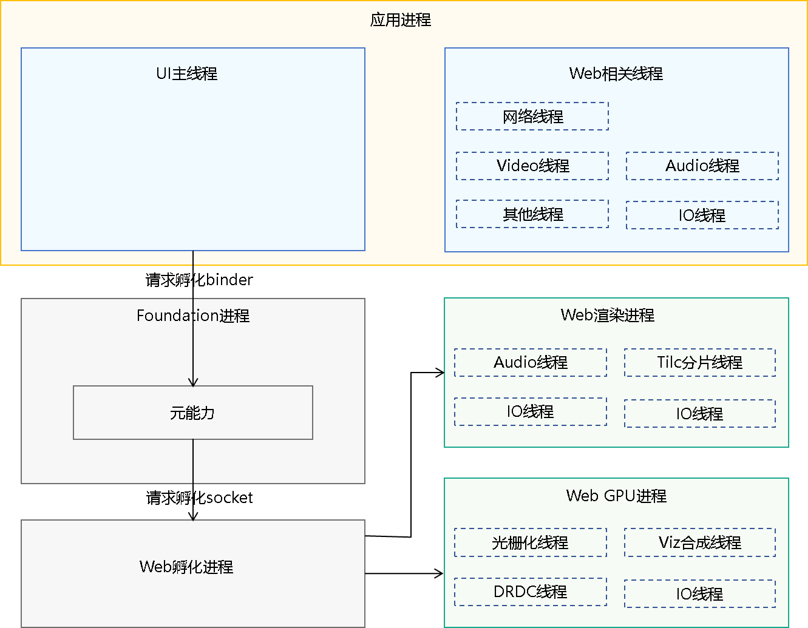

# ArkWeb进程

ArkWeb是多进程模型，分为应用进程、Web渲染进程、Web GPU进程、Web孵化进程和Foundation进程。

> **说明：**
>
> Web内核对内存大小的申请没有限制约束。

**图1** ArkWeb进程模型图



- 应用进程中Web相关线程（应用唯一）

  - 应用进程为主进程。包含网络线程、Video线程、Audio线程和IO线程等。

  - 负责Web组件的对外接口与回调处理，网络请求、媒体服务等需要与其他系统服务交互的功能。

- Foundation进程（系统唯一）

  负责接收应用进程进行孵化进程的请求，管理应用进程和Web渲染进程的绑定关系。

- Web孵化进程（系统唯一）

  - 负责接收Foundation进程的请求，执行孵化Web渲染进程与Web GPU进程。

  - 执行孵化后处理安全沙箱降权、预加载动态库，以提升性能。

- Web渲染进程（应用可指定多Web实例间共享或独立进程）

  - 负责运行Web渲染进程引擎（HTML解析、排版、绘制、渲染）。

  - 负责运行ArkWeb执行引擎（JavaScript、Web Assembly）。

  - 提供接口供应用选择多Web实例间是否共享渲染进程，满足不同场景对安全性、稳定性、内存占用的诉求。

  - 默认策略：移动设备上共享渲染进程以节省内存，2in1设备上独立渲染进程提升安全与稳定性。

- Web GPU进程（应用唯一）

  负责光栅化、合成送显等与GPU、RenderService交互功能。提升应用进程稳定性、安全性。

1. 可通过[setRenderProcessMode](../reference/apis-arkweb/arkts-apis-webview-WebviewController.md#setrenderprocessmode12)设置渲染子进程的模式，从而控制渲染过程的单进程或多进程状态。

   移动设备默认为单进程渲染，而2in1设备则默认采用多进程渲染。通过调用[getRenderProcessMode](../reference/apis-arkweb/arkts-apis-webview-WebviewController.md#getrenderprocessmode12)可查询当前的渲染子进程模式，其中枚举值0表示单进程模式，枚举值1对应多进程模式。若获取的值不在[RenderProcessMode](../reference/apis-arkweb/arkts-apis-webview-e.md#renderprocessmode12)枚举值范围内，则系统将自动采用多进程渲染模式作为默认设置。

   ```ts
   // xxx.ets
   import { webview } from '@kit.ArkWeb';
   import { BusinessError } from '@kit.BasicServicesKit';

   @Entry
   @Component
   struct WebComponent {
     controller: webview.WebviewController = new webview.WebviewController();

     build() {
       Column() {
         Button('getRenderProcessMode')
           .onClick(() => {
             let mode = webview.WebviewController.getRenderProcessMode();
             console.log("getRenderProcessMode: " + mode);
           })
         Button('setRenderProcessMode')
           .onClick(() => {
             try {
               webview.WebviewController.setRenderProcessMode(webview.RenderProcessMode.MULTIPLE);
             } catch (error) {
               console.error(`ErrorCode: ${(error as BusinessError).code},  Message: ${(error as     BusinessError).message}`);
             }
           })
         Web({ src: 'www.example.com', controller: this.controller })
       }
     }
   }
   ```

2. 可通过[terminateRenderProcess](../reference/apis-arkweb/arkts-apis-webview-WebviewController.md#terminaterenderprocess12)来主动关闭渲染进程。若渲染进程尚未启动或已销毁，此操作将不会产生任何影响。此外，销毁渲染进程将同时影响所有与之关联的其他实例。

   ```ts
   // xxx.ets
   import { webview } from '@kit.ArkWeb';
   
   @Entry
   @Component
   struct WebComponent {
     controller: webview.WebviewController = new webview.WebviewController();
   
     build() {
       Column() {
         Button('terminateRenderProcess')
         .onClick(() => {
           let result = this.controller.terminateRenderProcess();
           console.log("terminateRenderProcess result: " + result);
         })
         Web({ src: 'www.example.com', controller: this.controller })
       }
     }
   }
   ```

3. 可通过[onRenderExited](../reference/apis-arkweb/arkts-basic-components-web-events.md#onrenderexited9)来监听渲染进程的退出事件，从而获知退出的具体原因（如内存OOM、crash或正常退出等）。由于多个Web组件可能共用同一个渲染进程，因此，每当渲染进程退出时，每个受此影响的Web组件均会触发相应的回调。

   ```ts
   // xxx.ets
   import { webview } from '@kit.ArkWeb';
   
   @Entry
   @Component
   struct WebComponent {
     controller: webview.WebviewController = new webview.WebviewController();
   
     build() {
       Column() {
         Web({ src: 'chrome://crash/', controller: this.controller })
           .onRenderExited((event) => {
             if (event) {
               console.log('reason:' + event.renderExitReason);
             }
           })
       }
     }
   }
   ```

4. 可通过[onRenderProcessNotResponding](../reference/apis-arkweb/arkts-basic-components-web-events.md#onrenderprocessnotresponding12)、[onRenderProcessResponding](../reference/apis-arkweb/arkts-basic-components-web-events.md#onrenderprocessresponding12)来监听渲染进程的无响应状态。

   当Web组件无法处理输入事件，或未能在预期时间内导航至新URL时，系统会判定网页进程为无响应状态，并触发onRenderProcessNotResponding回调。在网页进程持续无响应期间，该回调可能反复触发，直至进程恢复至正常运行状态，此时将触发onRenderProcessResponding回调。

   ```ts
   // xxx.ets
   import { webview } from '@kit.ArkWeb';
   
   @Entry
   @Component
   struct WebComponent {
     controller: webview.WebviewController = new webview.WebviewController();
   
     build() {
       Column() {
         Web({ src: 'www.example.com', controller: this.controller })
           .onRenderProcessNotResponding((data) => {
             console.log("onRenderProcessNotResponding: [jsStack]= " + data.jsStack +
               ", [process]=" + data.pid + ", [reason]=" + data.reason);
           })
       }
     }
   }
   ```

   ```ts
   // xxx.ets
   import { webview } from '@kit.ArkWeb';
   
   @Entry
   @Component
   struct WebComponent {
     controller: webview.WebviewController = new webview.WebviewController();
   
     build() {
       Column() {
         Web({ src: 'www.example.com', controller: this.controller })
           .onRenderProcessResponding(() => {
             console.log("onRenderProcessResponding again");
           })
       }
     }
   }
   ```

5. [Web组件](../reference/apis-arkweb/arkts-basic-components-web.md)创建参数涵盖了多进程模型的运用。其中，sharedRenderProcessToken标识了当前Web组件所指定的共享渲染进程的token。在多渲染进程模式下，拥有相同token的Web组件将优先尝试重用与该token绑定的渲染进程。token与渲染进程的绑定关系，在渲染进程的初始化阶段形成。一旦渲染进程不再关联任何Web组件，它与token的绑定关系将被解除。

   ```ts
   // xxx.ets
   import { webview } from '@kit.ArkWeb';
   
   @Entry
   @Component
   struct WebComponent {
     controller1: webview.WebviewController = new webview.WebviewController();
     controller2: webview.WebviewController = new webview.WebviewController();
   
     build() {
       Column() {
         Web({ src: 'www.example.com', controller: this.controller1, sharedRenderProcessToken: "111" })
         Web({ src: 'www.w3.org', controller: this.controller2, sharedRenderProcessToken: "111" })
       }
     }
   }
   ```