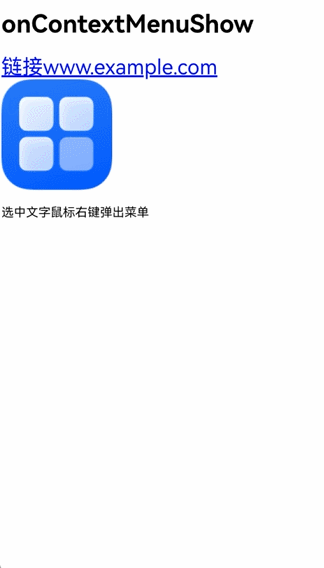

# Web组件菜单开发指导
菜单作为用户交互的核心组件，它的作用是构建清晰的导航体系，通过结构化布局呈现功能入口，使用户能够快速定位目标内容或操作，同时作为人机交互的关键枢纽，它显著提升了Web组件的可访问性与用户体验流畅度，是应用设计中不可或缺的一环。Web组件菜单分为文本选中菜单、上下文菜单和自定义菜单，应用可根据需求灵活使用。

## 文本选中菜单
Web组件的文本选中菜单是一种通过自定义元素实现的上下文交互控件，当用户选中文本时动态浮现，提供复制、分享、标注等语义化操作，兼具标准化功能与可扩展性，是移动端文本操作的核心功能。文本选中菜单在用户手势长按选中文本或编辑态长按出现单手柄弹出，菜单项横向排列。系统提供默认的菜单实现。
应用可通过[editMenuOptions](../../application-dev/reference/apis-arkweb//ts-basic-components-web.md#editmenuoptions12)或[selectionMenuOptions](../../application-dev/reference/apis-arkweb/ts-basic-components-web.md#selectionmenuoptionsdeprecated)（不建议，editMenuOptions接口功能可以完全覆盖selectionMenuOptions，该接口将在API20废弃）对文本选中菜单进行自定义操作。当两个接口同时使用时，selectionMenuOptions接口不生效。

### editMenuOptions规格说明
1. 应用需要创建一个[EditMenuOptions](../../application-dev/reference/apis-arkui/arkui-ts/ts-text-common.md#editmenuoptions)对象，通过Web组件的[editMenuOptions](../../application-dev/reference/apis-arkweb/ts-basic-components-web.md#editmenuoptions12)方法与Web组件绑定，对象包含onCreateMenu和onMenuItemClick两个方法。onCreateMenu通过处理Array<[TextMenuItem](../../application-dev/reference/apis-arkui/arkui-ts/ts-basic-components-menuitem.md)>数组控制菜单项信息，onMenuItemClick通过传入的TextMenuItem处理对应菜单项点击事件。
2. onCreateMenu处理菜单项信息，菜单项由Array<[TextMenuItem](../../application-dev/reference/apis-arkui/arkui-ts/ts-basic-components-menuitem.md)>数组控制，通过操作Array<[TextMenuItem](../../application-dev/reference/apis-arkui/arkui-ts/ts-basic-components-menuitem.md)>数组可对显示菜单项进行增减操作。[TextMenuItem](../../application-dev/reference/apis-arkui/arkui-ts/ts-basic-components-menuitem.md)中可定义菜单项名称、图标、ID等内容。
3. onMenuItemClick处理菜单项点击事件，当返回false时会执行系统默认逻辑。方法入参为[TextMenuItem](../../application-dev/reference/apis-arkui/arkui-ts/ts-text-common.md#textmenuitem12)菜单项信息和[TextRange](../../application-dev/reference/apis-arkui/arkui-ts/ts-text-common.md#textrange12)选中文本信息。
4. 菜单项过多时会在菜单末尾出现下拉按钮，点击下拉按钮出现未显示菜单项，只有下拉按钮中的菜单项会显示图标。
5. 本接口在与[selectionMenuOptions](../../application-dev/reference/apis-arkweb/ts-basic-components-web.md#selectionmenuoptionsdeprecated)同时使用时，会使selectionMenuOptions接口不生效。

### editMenuOptions代码示例

  ```ts
// xxx.ets
import { webview } from '@kit.ArkWeb';
@Entry
@Component
struct WebComponent {
  controller: webview.WebviewController = new webview.WebviewController();

  onCreateMenu(menuItems: Array<TextMenuItem>): Array<TextMenuItem> {
    let items = menuItems.filter((menuItem) => {
      // 过滤用户需要的系统按键
      return (
        menuItem.id.equals(TextMenuItemId.CUT) ||
        menuItem.id.equals(TextMenuItemId.COPY) ||
        menuItem.id.equals((TextMenuItemId.PASTE))
      )
    });
    let customItem1: TextMenuItem = {
      content: 'customItem1',
      id: TextMenuItemId.of('customItem1'),
      icon: $r('app.media.startIcon')
    };
    let customItem2: TextMenuItem = {
      content: $r('app.string.EntryAbility_label'),
      id: TextMenuItemId.of('customItem2'),
      icon: $r('app.media.startIcon')
    };
    items.push(customItem1);// 在选项列表后添加新选项
    items.unshift(customItem2);// 在选项列表前添加选项
    items.push(customItem1);
    items.push(customItem1);
    items.push(customItem1);
    items.push(customItem1);
    items.push(customItem1);
    return items;
  }

  onMenuItemClick(menuItem: TextMenuItem, textRange: TextRange): boolean {
    if (menuItem.id.equals(TextMenuItemId.CUT)) {
      // 用户自定义行为
      console.log("拦截 id：CUT")
      return true; // 返回true不执行系统回调
    } else if (menuItem.id.equals(TextMenuItemId.COPY)) {
      // 用户自定义行为
      console.log("不拦截 id：COPY")
      return false; // 返回false执行系统回调
    } else if (menuItem.id.equals(TextMenuItemId.of('customItem1'))) {
      // 用户自定义行为
      console.log("拦截 id：customItem1")
      return true;// 用户自定义菜单选项返回true时点击后不关闭菜单，返回false时关闭菜单
    } else if (menuItem.id.equals((TextMenuItemId.of($r('app.string.EntryAbility_label'))))){
      // 用户自定义行为
      console.log("拦截 id：app.string.customItem2")
      return true;
    }
    return false;// 返回默认值false
  }

  @State EditMenuOptions: EditMenuOptions = { onCreateMenu: this.onCreateMenu, onMenuItemClick: this.onMenuItemClick }

  build() {
    Column() {
      Web({ src: $rawfile("index.html"), controller: this.controller })
        .editMenuOptions(this.EditMenuOptions)
    }
  }
}
  ```
  
  ```html
<!--index.html-->
<!DOCTYPE html>
<html>
  <head>
      <title>测试网页</title>
  </head>
  <body>
    <h1>editMenuOptions Demo</h1>
    <span>edit menu options</span>
  </body>
</html>
  ```
1. 通过onCreateMenu方法自定义菜单项，通过操作Array<[TextMenuItem](../../application-dev/reference/apis-arkui/arkui-ts/ts-basic-components-menuitem.md)>数组可对显示菜单项进行增减操作，在[TextMenuItem](../../application-dev/reference/apis-arkui/arkui-ts/ts-basic-components-menuitem.md)中定义菜单项名称、图标、ID等内容。
2. 通过onMenuItemClick方法处理菜单项点击事件，当返回false时会执行系统默认逻辑。
3. 创建一个[EditMenuOptions](../../application-dev/reference/apis-arkui/arkui-ts/ts-text-common.md#editmenuoptions)对象，包含onCreateMenu和onMenuItemClick两个方法，通过Web组件的[editMenuOptions](../../application-dev/reference/apis-arkweb/ts-basic-components-web.md#editmenuoptions12)方法与Web组件绑定。

### selectionMenuOptions规格说明
1. 从API version 12开始支持，从API version 20开始废弃。建议使用[editMenuOptions](../../application-dev/reference/apis-arkweb/ts-basic-components-web.md#editmenuoptions12)替代。
2. Web组件自定义菜单扩展项接口，允许设置菜单项名称、图标和处理逻辑。
3. 该接口只支持选中纯文本，当选中内容包含图片及其他非文本内容时，action信息中会显示乱码。
4. 定义Array<[ExpandedMenuItemOptions](../../application-dev/reference/apis-arkweb/ts-basic-components-web.md#expandedmenuitemoptions12)>数组作为菜单项，通过Web组件的[selectionMenuOptions](../../application-dev/reference/apis-arkweb/ts-basic-components-web.md#selectionmenuoptionsdeprecated)方法绑定。
5. 与[editMenuOptions](../../application-dev/reference/apis-arkweb/ts-basic-components-web.md#editmenuoptions12)同时使用时，该接口不生效。
6. 菜单项过多时会在菜单末尾出现下拉按钮，点击下拉按钮出现未显示菜单项，只有下拉按钮中的菜单项会显示图标。

### selectionMenuOptions代码示例

  ```ts
// xxx.ets
import { webview } from '@kit.ArkWeb';

@Entry
@Component
struct WebComponent {
controller: webview.WebviewController = new webview.WebviewController();
@State menuOptionArray: Array<ExpandedMenuItemOptions> = [
    {content: 'Apple', startIcon: $r('app.media.startIcon'), action: (selectedText) => {
    console.info('select info ' + selectedText.toString());
    }},
    {content: '香蕉', startIcon: $r('app.media.startIcon'), action: (selectedText) => {
    console.info('select info ' + selectedText.toString());
    }},
    {content: '香蕉', startIcon: $r('app.media.startIcon'), action: (selectedText) => {
    console.info('select info ' + selectedText.toString());
    }},
    {content: '香蕉', startIcon: $r('app.media.startIcon'), action: (selectedText) => {
    console.info('select info ' + selectedText.toString());
    }},
    {content: '香蕉', startIcon: $r('app.media.startIcon'), action: (selectedText) => {
    console.info('select info ' + selectedText.toString());
    }}
];

build() {
    Column() {
    Web({ src: $rawfile("index.html"), controller: this.controller })
    .selectionMenuOptions(this.menuOptionArray)
    }
}
}
  ```
  ```html
<!--index.html-->
<!DOCTYPE html>
<html>
<head>
  <title>测试网页</title>
</head>
<body>
  <h1>selectionMenuOptions Demo</h1>
  <span>selection menu options</span>
</body>
</html>
  ```
1. 定义一个Array<[ExpandedMenuItemOptions](../../application-dev/reference/apis-arkweb/ts-basic-components-web.md#expandedmenuitemoptions12)>数组。通过ExpandedMenuItemOptions实现每个菜单项的行为。
2. 通过Web组件的[selectionMenuOptions](../../application-dev/reference/apis-arkweb/ts-basic-components-web.md#selectionmenuoptionsdeprecated)方法将menuOptionArray与Web组件绑定。

## 上下文菜单
上下文菜单作为人机交互的精准触达工具，通过动态聚合与当前界面元素强关联的二级操作指令，在维持界面简洁性的同时实现功能的高效分层触达，其空间锚定特性与即时响应机制显著缩短用户认知路径，构建"界面对象-操作意图"的直觉映射关系。

### 规格说明
1. 上下文菜单菜单在用户长按富文本或鼠标右键点击时弹出，菜单项竖向排列。系统不提供默认实现，如果应用为实现则不显示上下文菜单。
2. 上下文菜单需要应用通过[Menu](../../application-dev/reference/apis-arkui/arkui-ts/ts-basic-components-menu.md#menu)组件创建一个菜单子窗口与Web绑定，通过菜单弹出时的[onContextMenuShow](../../application-dev/reference/apis-arkweb/ts-basic-components-web.md#oncontextmenushow)接口获取到上下文菜单详细信息，包含点击位置的HTML元素信息，点击位置信息等。
 
### 代码示例

```ts
// xxx.ets
import { webview } from '@kit.ArkWeb';
import { pasteboard } from '@kit.BasicServicesKit';

const TAG = 'ContextMenu';

@Entry
@Component
struct WebComponent {
  controller: webview.WebviewController = new webview.WebviewController();
  private result: WebContextMenuResult | undefined = undefined;
  @State linkUrl: string = '';
  @State offsetX: number = 0;
  @State offsetY: number = 0;
  @State showMenu: boolean = false;

  @Builder
  // 构建自定义菜单及触发功能接口
  MenuBuilder() {
    // 以垂直列表形式显示的菜单。
    Menu() {
      // 展示菜单Menu中具体的item菜单项。
      MenuItem({
        content: '复制图片',
      })
        .width(100)
        .height(50)
        .onClick(() => {
          this.result?.copyImage();
          this.showMenu = false;
        })
      MenuItem({
        content: '剪切',
      })
        .width(100)
        .height(50)
        .onClick(() => {
          this.result?.cut();
          this.showMenu = false;
        })
      MenuItem({
        content: '复制',
      })
        .width(100)
        .height(50)
        .onClick(() => {
          this.result?.copy();
          this.showMenu = false;
        })
      MenuItem({
        content: '粘贴',
      })
        .width(100)
        .height(50)
        .onClick(() => {
          this.result?.paste();
          this.showMenu = false;
        })
      MenuItem({
        content: '复制链接',
      })
        .width(100)
        .height(50)
        .onClick(() => {
          let pasteData = pasteboard.createData('text/plain', this.linkUrl);
          pasteboard.getSystemPasteboard().setData(pasteData, (error) => {
            if (error) {
              return;
            }
          })
          this.showMenu = false;
        })
      MenuItem({
        content: '全选',
      })
        .width(100)
        .height(50)
        .onClick(() => {
          this.result?.selectAll();
          this.showMenu = false;
        })
    }
    .width(150)
    .height(300)
  }

  build() {
    Column() {
      Web({ src: $rawfile("index.html"), controller: this.controller })
        // 触发自定义弹窗
        .onContextMenuShow((event) => {
          if (event) {
            this.result = event.result
            console.info("x coord = " + event.param.x());
            console.info("link url = " + event.param.getLinkUrl());
            this.linkUrl = event.param.getLinkUrl();
          }
          console.info(TAG, `x: ${this.offsetX}, y: ${this.offsetY}`);
          this.showMenu = true;
          this.offsetX = 0;
          this.offsetY = Math.max(px2vp(event?.param.y() ?? 0) - 0, 0);
          return true;
        })
        .bindPopup(this.showMenu,
          {
            builder: this.MenuBuilder(),
            enableArrow: false,
            placement: Placement.LeftTop,
            offset: { x: this.offsetX, y: this.offsetY },
            mask: false,
            onStateChange: (e) => {
              if (!e.isVisible) {
                this.showMenu = false;
                this.result!.closeContextMenu();
              }
            }
          })
    }
  }
}
```
```html
<!-- index.html -->
<!DOCTYPE html>
<html lang="en">
<body>
  <h1>onContextMenuShow</h1>
  <a href="http://www.example.com" style="font-size:27px">链接www.example.com</a>
  // rawfile下放任意一张图片命名为example.png
  <div></div>
  <p>选中文字鼠标右键弹出菜单</p>
</body>
</html>
```
1. 创建[Menu](../../application-dev/reference/apis-arkui/arkui-ts/ts-basic-components-menu.md#menu)组件作为弹出的菜单，包含所有菜单项行为与样式。
2. 使用bindPopup方法将Menu组件与Web组件绑定。当上下文菜单弹出时，将显示创建的Menu组件。
3. 在onContextMenuShow回调中获取菜单事件信息，[onContextMenuShowEvent](../../application-dev/reference/apis-arkweb/ts-basic-components-web.md#oncontextmenushowevent12)。其中param为[WebContextMenuParam](../../application-dev/reference/apis-arkweb/ts-basic-components-web.md#webcontextmenuparam9)类型包括点击位置对应HTML元素信息和位置信息，result为[WebContextMenuResult](../../application-dev/reference/apis-arkweb/ts-basic-components-web.md#webcontextmenuresult9)提供常见的菜单能力。

## 自定义菜单
自定义菜单赋予开发者灵活调整菜单触发时机与视觉呈现的能力，使应用能够根据用户操作场景动态匹配功能入口，既简化了开发流程中的界面适配工作，又让应用交互更贴合用户直觉习惯。

### 规格说明
自定义菜单允许应用通过[bindSelectionMenu](../../application-dev/reference/apis-arkweb/ts-basic-components-web.md#bindselectionmenu13)根据事件类型与元素类型弹出自定义菜单，目前支持响应长按图片。
bindSelectionMenu入参和说明：
|  参数名  | 类型  |  必填  |  说明  |
|  ----  | ----  | ----  | ----  |
| elementType  | [WebElementType](../../application-dev/reference/apis-arkweb/ts-basic-components-web.md#webelementtype13) |  是  |  网页元素信息。  |
| content  | [CustomBuilder](../../application-dev/reference/apis-arkui/arkui-ts/ts-types.md#custombuilder8) |  是  |  菜单弹窗。  |
| responseType  | [WebResponseType](../../application-dev/reference/apis-arkweb/ts-basic-components-web.md#webresponsetype13) |  是  |  菜单的响应事件类型。  |
| options  | [SelectionMenuOptionsExt](../../application-dev/reference/apis-arkweb/ts-basic-components-web.md#selectionmenuoptionsext13) |  是  |  自定义菜单扩展项。  |

### 代码示例

```ts
// xxx.ets
import { webview } from '@kit.ArkWeb';

interface PreviewBuilderParam {
  previewImage: Resource | string | undefined;
  width: number;
  height: number;
}

@Builder function PreviewBuilderGlobal($$: PreviewBuilderParam) {
  Column() {
    Image($$.previewImage)
      .objectFit(ImageFit.Fill)
      .autoResize(true)
  }.width($$.width).height($$.height)
}

@Entry
@Component
struct WebComponent {
  controller: webview.WebviewController = new webview.WebviewController();

  private result: WebContextMenuResult | undefined = undefined;
  @State previewImage: Resource | string | undefined = undefined;
  @State previewWidth: number = 0;
  @State previewHeight: number = 0;

  @Builder
  MenuBuilder() {
    Menu() {
      MenuItem({ content: '复制', })
        .onClick(() => {
          this.result?.copy();
          this.result?.closeContextMenu();
        })
      MenuItem({ content: '全选', })
        .onClick(() => {
          this.result?.selectAll();
          this.result?.closeContextMenu();
        })
    }
  }
  build() {
    Column() {
      Web({ src: $rawfile("index.html"), controller: this.controller })
        .bindSelectionMenu(WebElementType.IMAGE, this.MenuBuilder, WebResponseType.LONG_PRESS,
          {
            onAppear: () => {},
            onDisappear: () => {
              this.result?.closeContextMenu();
            },
            preview: PreviewBuilderGlobal({
              previewImage: this.previewImage,
              width: this.previewWidth,
              height: this.previewHeight
            }),
            menuType: MenuType.PREVIEW_MENU
          })
        .onContextMenuShow((event) => {
            if (event) {
              this.result = event.result;
              if (event.param.getLinkUrl()) {
                return false;
              }
              this.previewWidth = px2vp(event.param.getPreviewWidth());
              this.previewHeight = px2vp(event.param.getPreviewHeight());
              if (event.param.getSourceUrl().indexOf("resource://rawfile/") == 0) {
                this.previewImage = $rawfile(event.param.getSourceUrl().substr(19));
              } else {
                this.previewImage = event.param.getSourceUrl();
              }
              return true;
            }
            return false;
          })
    }
  }
}
```
```html
<!--index.html-->
<!DOCTYPE html>
<html>
  <head>
      <title>测试网页</title>
  </head>
  <body>
    <h1>bindSelectionMenu Demo</h1>
    
  </body>
</html>
```
1. 创建[Menu](../../application-dev/reference/apis-arkui/arkui-ts/ts-basic-components-menu.md#menu)组件作为菜单弹窗。
2. 通过Web组件的[bindSelectionMenu](../../application-dev/reference/apis-arkweb/ts-basic-components-web.md#bindselectionmenu13)方法绑定MenuBuilder菜单弹窗。将[elementType](../../application-dev/reference/apis-arkweb/ts-basic-components-web.md#webelementtype13)设置为WebElementType.IMAGE，[responseType](../../application-dev/reference/apis-arkweb/ts-basic-components-web.md#webresponsetype13)设置为WebResponseType.LONG_PRESS，表示长按图片时弹出菜单。在[options](../../application-dev/reference/apis-arkweb/ts-basic-components-web.md#selectionmenuoptionsext13)中定义菜单显示回调onAppear、菜单消失回调onDisappear、预览窗口preview和菜单类型menuType。

## 常见问题
### 如何禁用长按选择时弹出菜单

  ```ts
// xxx.ets
import { webview } from '@kit.ArkWeb';
@Entry
@Component
struct WebComponent {
  controller: webview.WebviewController = new webview.WebviewController();

  onCreateMenu(menuItems: Array<TextMenuItem>): Array<TextMenuItem> {
    let items = menuItems.filter((menuItem) => {
      // 过滤用户需要的系统按键
      return false;
    });
    return items;
  }

  onMenuItemClick(menuItem: TextMenuItem, textRange: TextRange): boolean {
    return false;// 返回默认值false
  }

  @State EditMenuOptions: EditMenuOptions = { onCreateMenu: this.onCreateMenu, onMenuItemClick: this.onMenuItemClick }

  build() {
    Column() {
      Web({ src: $rawfile("index.html"), controller: this.controller })
        .editMenuOptions(this.EditMenuOptions)
    }
  }
}
  ```
  ```html
<!--index.html-->
<!DOCTYPE html>
<html>
  <head>
      <title>测试网页</title>
  </head>
  <body>
    <h1>editMenuOptions Demo</h1>
    <span>edit menu options</span>
  </body>
</html>
  ```
在onCreateMenu方法中将菜单数组置空。

### 出现选区时手柄菜单不显示
可排查是否通过JS的[selection-api](https://www.w3.org/TR/selection-api/)对选区进行了操作，目前通过这种方式改变选区会导致手柄菜单不显示。
