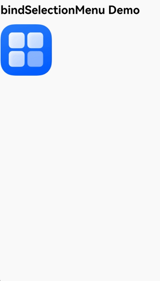
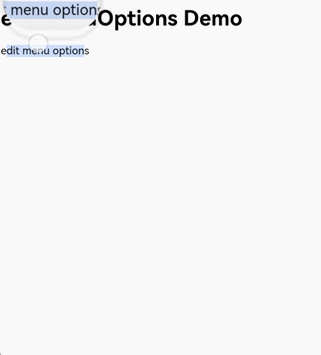

# Web组件的菜单功能
菜单作为用户交互的关键组件，其作用是构建清晰的导航体系，通过结构化布局展示功能入口，使用户能够迅速找到目标内容或执行操作。作为人机交互的重要枢纽，它显著提升了Web组件的可访问性和用户体验，是应用设计中必不可少的部分。Web组件菜单类型包括[文本选中菜单](./web_menu.md#文本选中菜单)、[上下文菜单](./web_menu.md#上下文菜单)和[自定义菜单](./web_menu.md#自定义菜单)，应用可根据具体需求灵活选择。
|菜单类型|目标元素|响应类型|是否支持自定义|
|----|----|----|----|
|[文本选中菜单](./web_menu.md#文本选中菜单)|文本|手势长按|可增减菜单项，菜单样式不可自定义|
|[上下文菜单](./web_menu.md#上下文菜单)|超链接、图片、文字|手势长按、鼠标右键|支持通过菜单组件自定义|
|[自定义菜单](./web_menu.md#自定义菜单)|图片|手势长按|支持通过菜单组件自定义|
## 文本选中菜单
Web组件的文本选中菜单是一种通过自定义元素实现的上下文交互组件，当用户选中文本时会动态显示，提供复制、分享、标注等语义化操作，具备标准化功能与可扩展性，是移动端文本操作的核心功能。文本选中菜单在用户长按选中文本或编辑状态下长按出现单手柄时弹出，菜单项横向排列。系统提供默认的菜单实现。应用可通过[editMenuOptions](../reference/apis-arkweb/ts-basic-components-web-attributes.md#editmenuoptions12)接口对文本选中菜单进行自定义操作。
1. 通过onCreateMenu方法自定义菜单项，通过操作Array<[TextMenuItem](../reference/apis-arkui/arkui-ts/ts-basic-components-menuitem.md)>数组可对显示菜单项进行增减操作，在[TextMenuItem](../reference/apis-arkui/arkui-ts/ts-basic-components-menuitem.md)中定义菜单项名称、图标、ID等内容。
2. 通过onMenuItemClick方法处理菜单项点击事件，当返回false时会执行系统默认逻辑。
3. 创建一个[EditMenuOptions](../reference/apis-arkui/arkui-ts/ts-text-common.md#editmenuoptions)对象，包含onCreateMenu和onMenuItemClick两个方法，通过Web组件的[editMenuOptions](../reference/apis-arkweb/ts-basic-components-web-attributes.md#editmenuoptions12)方法与Web组件绑定。

  ```ts
  // xxx.ets
  import { webview } from '@kit.ArkWeb';
  @Entry
  @Component
  struct WebComponent {
    controller: webview.WebviewController = new webview.WebviewController();

    onCreateMenu(menuItems: Array<TextMenuItem>): Array<TextMenuItem> {
      let items = menuItems.filter((menuItem) => {
        // 过滤用户需要的系统按键
        return (
          menuItem.id.equals(TextMenuItemId.CUT) ||
          menuItem.id.equals(TextMenuItemId.COPY) ||
          menuItem.id.equals((TextMenuItemId.PASTE))
        )
      });
      let customItem1: TextMenuItem = {
        content: 'customItem1',
        id: TextMenuItemId.of('customItem1'),
        icon: $r('app.media.startIcon')
      };
      let customItem2: TextMenuItem = {
        content: $r('app.string.EntryAbility_label'),
        id: TextMenuItemId.of('customItem2'),
        icon: $r('app.media.startIcon')
      };
      items.push(customItem1);// 在选项列表后添加新选项
      items.unshift(customItem2);// 在选项列表前添加选项
      items.push(customItem1);
      items.push(customItem1);
      items.push(customItem1);
      items.push(customItem1);
      items.push(customItem1);
      return items;
    }

    onMenuItemClick(menuItem: TextMenuItem, textRange: TextRange): boolean {
      if (menuItem.id.equals(TextMenuItemId.CUT)) {
        // 用户自定义行为
        console.log("拦截 id：CUT")
        return true; // 返回true不执行系统回调
      } else if (menuItem.id.equals(TextMenuItemId.COPY)) {
        // 用户自定义行为
        console.log("不拦截 id：COPY")
        return false; // 返回false执行系统回调
      } else if (menuItem.id.equals(TextMenuItemId.of('customItem1'))) {
        // 用户自定义行为
        console.log("拦截 id：customItem1")
        return true;// 用户自定义菜单选项返回true时点击后不关闭菜单，返回false时关闭菜单
      } else if (menuItem.id.equals((TextMenuItemId.of($r('app.string.EntryAbility_label'))))){
        // 用户自定义行为
        console.log("拦截 id：app.string.customItem2")
        return true;
      }
      return false;// 返回默认值false
    }

    @State EditMenuOptions: EditMenuOptions = { onCreateMenu: this.onCreateMenu, onMenuItemClick: this.onMenuItemClick }

    build() {
      Column() {
        Web({ src: $rawfile("index.html"), controller: this.controller })
          .editMenuOptions(this.EditMenuOptions)
      }
    }
  }
  ```
  
  ```html
  <!--index.html-->
  <!DOCTYPE html>
  <html>
    <head>
        <title>测试网页</title>
    </head>
    <body>
      <h1>editMenuOptions Demo</h1>
      <span>edit menu options</span>
    </body>
  </html>
  ```
  
## 上下文菜单
上下文菜单是用户通过特定操作（如右键点击或长按富文本）触发的快捷菜单，用于提供与当前操作对象或界面元素相关的功能选项。菜单项纵向排列。系统未提供默认实现，若应用未实现，则不显示上下文菜单。要应用需通过[Menu](../reference/apis-arkui/arkui-ts/ts-basic-components-menu.md#menu)组件创建一个菜单子窗口并与Web绑定，通过菜单弹出时的[onContextMenuShow](../reference/apis-arkweb/ts-basic-components-web-events.md#oncontextmenushow9)接口获取上下文菜单的详细信息，包括点击位置的HTML元素信息及点击位置信息。

1. [Menu](../reference/apis-arkui/arkui-ts/ts-basic-components-menu.md#menu)组件作为弹出的菜单，包含所有菜单项行为与样式。
2. 使用bindPopup方法将Menu组件与Web组件绑定。当上下文菜单弹出时，将显示创建的Menu组件。
3. 在onContextMenuShow回调中获取上下文菜单事件信息[onContextMenuShowEvent](../reference/apis-arkweb/ts-basic-components-web-i.md#oncontextmenushowevent12)。其中param为[WebContextMenuParam](../reference/apis-arkweb/ts-basic-components-web-WebContextMenuParam.md#class-webcontextmenuparam)类型，包含点击位置对应HTML元素信息和位置信息，result为[WebContextMenuResult](../reference/apis-arkweb/ts-basic-components-web-WebContextMenuResult.md#class-webcontextmenuresult)类型，提供常见的菜单能力。

```ts
// xxx.ets
import { webview } from '@kit.ArkWeb';
import { pasteboard } from '@kit.BasicServicesKit';

const TAG = 'ContextMenu';

@Entry
@Component
struct WebComponent {
  controller: webview.WebviewController = new webview.WebviewController();
  private result: WebContextMenuResult | undefined = undefined;
  @State linkUrl: string = '';
  @State offsetX: number = 0;
  @State offsetY: number = 0;
  @State showMenu: boolean = false;

  @Builder
  // 构建自定义菜单及触发功能接口
  MenuBuilder() {
    // 以垂直列表形式显示的菜单。
    Menu() {
      // 展示菜单Menu中具体的item菜单项。
      MenuItem({
        content: '复制图片',
      })
        .width(100)
        .height(50)
        .onClick(() => {
          this.result?.copyImage();
          this.showMenu = false;
        })
      MenuItem({
        content: '剪切',
      })
        .width(100)
        .height(50)
        .onClick(() => {
          this.result?.cut();
          this.showMenu = false;
        })
      MenuItem({
        content: '复制',
      })
        .width(100)
        .height(50)
        .onClick(() => {
          this.result?.copy();
          this.showMenu = false;
        })
      MenuItem({
        content: '粘贴',
      })
        .width(100)
        .height(50)
        .onClick(() => {
          this.result?.paste();
          this.showMenu = false;
        })
      MenuItem({
        content: '复制链接',
      })
        .width(100)
        .height(50)
        .onClick(() => {
          let pasteData = pasteboard.createData('text/plain', this.linkUrl);
          pasteboard.getSystemPasteboard().setData(pasteData, (error) => {
            if (error) {
              return;
            }
          })
          this.showMenu = false;
        })
      MenuItem({
        content: '全选',
      })
        .width(100)
        .height(50)
        .onClick(() => {
          this.result?.selectAll();
          this.showMenu = false;
        })
    }
    .width(150)
    .height(300)
  }

  build() {
    Column() {
      Web({ src: $rawfile("index.html"), controller: this.controller })
        // 触发自定义弹窗
        .onContextMenuShow((event) => {
          if (event) {
            this.result = event.result
            console.info("x coord = " + event.param.x());
            console.info("link url = " + event.param.getLinkUrl());
            this.linkUrl = event.param.getLinkUrl();
          }
          console.info(TAG, `x: ${this.offsetX}, y: ${this.offsetY}`);
          this.showMenu = true;
          this.offsetX = 0;
          this.offsetY = Math.max(px2vp(event?.param.y() ?? 0) - 0, 0);
          return true;
        })
        .bindPopup(this.showMenu,
          {
            builder: this.MenuBuilder(),
            enableArrow: false,
            placement: Placement.LeftTop,
            offset: { x: this.offsetX, y: this.offsetY },
            mask: false,
            onStateChange: (e) => {
              if (!e.isVisible) {
                this.showMenu = false;
                this.result!.closeContextMenu();
              }
            }
          })
    }
  }
}
```
```html
<!-- index.html -->
<!DOCTYPE html>
<html lang="en">
<body>
  <h1>onContextMenuShow</h1>
  <a href="http://www.example.com" style="font-size:27px">超链接www.example.com</a>
  <div></div>
  <p>选中文字鼠标右键弹出菜单</p>
</body>
</html>
```

## 自定义菜单
自定义菜单赋予开发者调整菜单触发时机与视觉展现的能力，使应用能够依据用户操作场景动态匹配功能入口，简化开发流程中的界面适配工作，同时使应用交互更符合用户直觉。自定义菜单允许应用通过[bindSelectionMenu](../reference/apis-arkweb/ts-basic-components-web-attributes.md#bindselectionmenu13)，根据事件类型与元素类型弹出自定义菜单，目前支持响应长按图片。
1. 创建[Menu](../reference/apis-arkui/arkui-ts/ts-basic-components-menu.md#menu)组件作为菜单弹窗。
2. 通过Web组件的[bindSelectionMenu](../reference/apis-arkweb/ts-basic-components-web-attributes.md#bindselectionmenu13)方法绑定MenuBuilder菜单弹窗。将[WebElementType](../reference/apis-arkweb/ts-basic-components-web-e.md#webelementtype13)设置为WebElementType.IMAGE，[responseType](../reference/apis-arkweb/ts-basic-components-web-e.md#webresponsetype13)设置为WebResponseType.LONG_PRESS，表示长按图片时弹出菜单。在[options](../reference/apis-arkweb/ts-basic-components-web-i.md#selectionmenuoptionsext13)中定义菜单显示回调onAppear、菜单消失回调onDisappear、预览窗口preview和菜单类型menuType。
```ts
// xxx.ets
import { webview } from '@kit.ArkWeb';

interface PreviewBuilderParam {
  previewImage: Resource | string | undefined;
  width: number;
  height: number;
}

@Builder function PreviewBuilderGlobal($$: PreviewBuilderParam) {
  Column() {
    Image($$.previewImage)
      .objectFit(ImageFit.Fill)
      .autoResize(true)
  }.width($$.width).height($$.height)
}

@Entry
@Component
struct WebComponent {
  controller: webview.WebviewController = new webview.WebviewController();

  private result: WebContextMenuResult | undefined = undefined;
  @State previewImage: Resource | string | undefined = undefined;
  @State previewWidth: number = 0;
  @State previewHeight: number = 0;

  @Builder
  MenuBuilder() {
    Menu() {
      MenuItem({ content: '复制', })
        .onClick(() => {
          this.result?.copy();
          this.result?.closeContextMenu();
        })
      MenuItem({ content: '全选', })
        .onClick(() => {
          this.result?.selectAll();
          this.result?.closeContextMenu();
        })
    }
  }
  build() {
    Column() {
      Web({ src: $rawfile("index.html"), controller: this.controller })
        .bindSelectionMenu(WebElementType.IMAGE, this.MenuBuilder, WebResponseType.LONG_PRESS,
          {
            onAppear: () => {},
            onDisappear: () => {
              this.result?.closeContextMenu();
            },
            preview: PreviewBuilderGlobal({
              previewImage: this.previewImage,
              width: this.previewWidth,
              height: this.previewHeight
            }),
            menuType: MenuType.PREVIEW_MENU
          })
        .onContextMenuShow((event) => {
            if (event) {
              this.result = event.result;
              if (event.param.getLinkUrl()) {
                return false;
              }
              this.previewWidth = px2vp(event.param.getPreviewWidth());
              this.previewHeight = px2vp(event.param.getPreviewHeight());
              if (event.param.getSourceUrl().indexOf("resource://rawfile/") == 0) {
                this.previewImage = $rawfile(event.param.getSourceUrl().substr(19));
              } else {
                this.previewImage = event.param.getSourceUrl();
              }1
              return true;
            }
            return false;
          })
    }
  }
}
```
```html
<!--index.html-->
<!DOCTYPE html>
<html>
  <head>
      <title>测试网页</title>
  </head>
  <body>
    <h1>bindSelectionMenu Demo</h1>
    
  </body>
</html>
```

## 常见问题
### 如何禁用长按选择时弹出菜单
可通过[editMenuOptions](../reference/apis-arkweb/ts-basic-components-web-attributes.md#editmenuoptions12)接口将系统默认菜单全部过滤，此时无菜单项，则不会显示菜单。
  ```ts
// xxx.ets
import { webview } from '@kit.ArkWeb';
@Entry
@Component
struct WebComponent {
  controller: webview.WebviewController = new webview.WebviewController();

  onCreateMenu(menuItems: Array<TextMenuItem>): Array<TextMenuItem> {
    let items = menuItems.filter((menuItem) => {
      // 过滤用户需要的系统按键
      return false;
    });
    return items;
  }

  onMenuItemClick(menuItem: TextMenuItem, textRange: TextRange): boolean {
    return false;// 返回默认值false
  }

  @State EditMenuOptions: EditMenuOptions = { onCreateMenu: this.onCreateMenu, onMenuItemClick: this.onMenuItemClick }

  build() {
    Column() {
      Web({ src: $rawfile("index.html"), controller: this.controller })
        .editMenuOptions(this.EditMenuOptions)
    }
  }
}
  ```
  ```html
<!--index.html-->
<!DOCTYPE html>
<html>
  <head>
      <title>测试网页</title>
  </head>
  <body>
    <h1>editMenuOptions Demo</h1>
    <span>edit menu options</span>
  </body>
</html>
  ```


### 出现选区时手柄菜单不显示
可排查是否通过JS的[selection-api](https://www.w3.org/TR/selection-api/)对选区进行了操作，目前通过这种方式改变选区会导致手柄菜单不显示。
