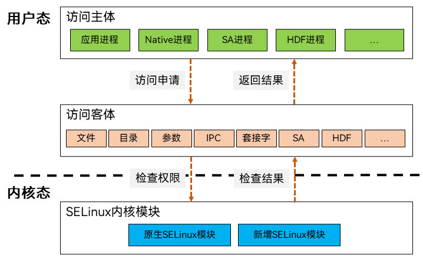

# OpenHarmony SELinux概述

## 简介

OpenHarmony结合系统架构特点，基于安全增强式Linux（英文全称：**S**ecurity-**E**nhanced **Linux**
，以下简称SELinux）对OpenHarmony操作系统内文件、参数、SA、HDF等系统资源提供强制访问控制保护能力。本文基于SELinux访问控制模型，提供OpenHarmony SELinux功能的开发指导。

OpenHarmony SELinux支持以下功能：

1. 支持访问参数、SA、HDF管控。
2. 支持设置应用标签。
3. 支持策略编译与加载。
4. 支持contexts编译与加载。
5. 支持编译时策略合理性检查。

## 基本概念

- **安全上下文**

  安全上下文，也通常称为SELinux标签。OpenHarmony SELinux安全上下文的结构是`user:role:type:sensitivity[:category,...]- sensitivity [:category,...]`，分别是：
  - `user`：用户类型，比如`user u roles { r }`，定义user为u的用户，它属于`role r`。
  - `role`：角色标识符，角色限制了进程在进程上下文中基于角色标识符可转换的类型，其中文件、参数、SA服务、HDF服务等资源的用户类型使用`object_r`，进程的用户类型使用r。
  - `type`：SELinux类型，在SELinux规则语句中，使用类型定义规则。
  - `sensitivity`：分层安全级别，不同安全级别不能相互访问，目前OpenHarmony SELinux仅支持`s0`。
  - `category`：对特定`sensitivity`划分不分层的分类，目前OpenHarmony SELinux已经定义的分类为`c0-c1023`。

- **主体** 

  主体主要是用户态进程，OpenHarmony SELinux将用户态主体分为四大类：Native进程、应用进程、SA进程、HDF进程。

- **客体**

  客体主要是文件、目录、参数、SA服务、HDF服务等系统资源。

- **sid**

  安全标识符(**S**ecurity **ID**)，用于标识进程、文件或其他SELinux对象的唯一标识符。

- **TE**

  类型强制(**T**ype **E**nforcement)，SELinux策略是由多条类型强制规则构成的。

- **运行模式**

  OpenHarmony SELinux支持两种运行模式：
  + `Enforcing`，强制模式，拦截未授权行为并打印avc告警。
  + `Permissive`，宽容模式，放行未授权行为并打印avc告警。

## 实现原理

OpenHarmony SELinux通过主体和客体的安全上下文表示主体是否有权限访问客体，在内核态拦截未授权行为。

**图1** OpenHarmony SELinux分层架构图

