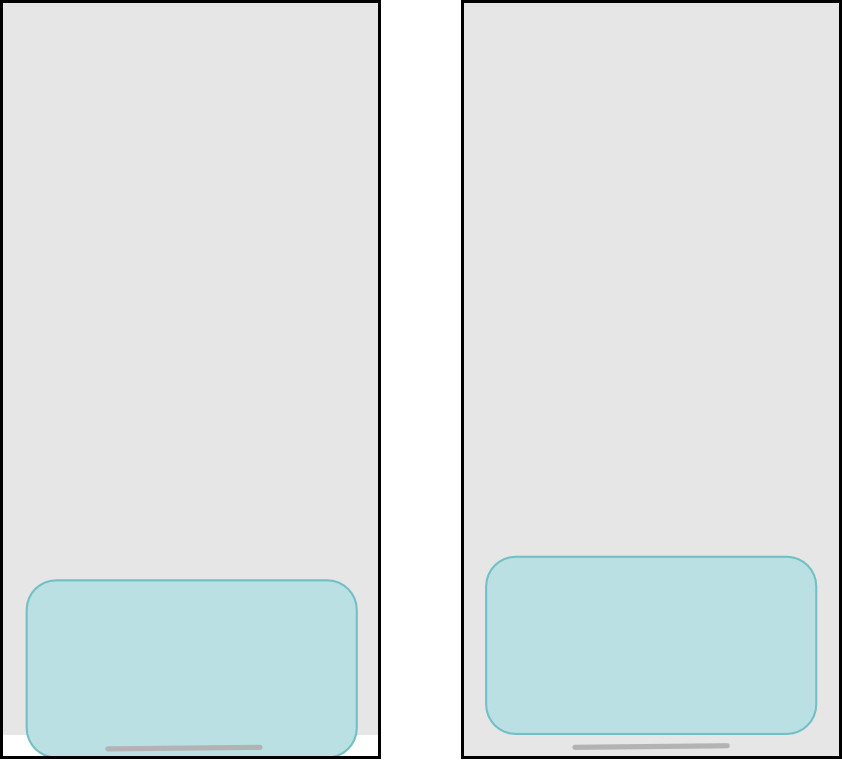

# ArkUI子系统变更说明

## cl.arkui.1 弹窗避让安全区域行为变更

**访问级别**

公开接口

**变更原因**

蒙层区域无法覆盖底部导航栏，沉浸式模式下内容无法避让导航栏与状态栏。

**变更影响**

该变更为非兼容性变更。

变更前：1.弹窗蒙层显示区域未延伸至底部导航条；2.在showInSubwindow为true或应用配置为沉浸式时，内容未避让顶部状态栏与底部导航条。

变更后：1.弹窗蒙层显示区域默认延伸至底部导航条；2.在showInSubwindow为true或应用配置为沉浸式时，内容会避让顶部状态栏与底部导航条。

如下图所示为设置Alignment为Bottom时变更前后效果对比：



**API Level**

AlertDialog、CustomDialog 起始支持版本为 API 7，ActionSheet、DatePickerDialog、TimePickerDialog、TextPickerDialog 起始支持版本为 API 8，promptAction.showDialog 起始支持版本为 API 9，promptAction.openCustomDialog 起始支持版本为 API 11。

**变更发生版本**

从OpenHarmony SDK 5.0.0.19开始。

**变更的接口/组件**

受影响的组件：promptAction.showDialog、promptAction.openCustomDialog、AlertDialog、ActionSheet、DatePickerDialog、TimePickerDialog、TextPickerDialog、CustomDialog。

**适配指导**

若开发者需要弹窗内容不避让导航条，可设置aligment为DialogAligment.Bottom、offset.dy为导航栏高度, 具体示例代码如下：
1.EntryAbility页面设置窗口全屏，获取顶部状态栏与底部导航栏高度
```ts
// src/main/ets/entryability/EntryAbility.ets
import { AbilityConstant, UIAbility, Want } from '@kit.AbilityKit';
import { window } from '@kit.ArkUI';

export default class EntryAbility extends UIAbility {
  onWindowStageCreate(windowStage: window.WindowStage): void {
    windowStage.loadContent('pages/Index', (err, data) => {
      if (err.code) {
        return;
      }
      // 获取应用主窗口
      let windowClass: window.Window = windowStage.getMainWindowSync();
      // 设置窗口全屏
      windowClass.setWindowLayoutFullScreen(true)
      // 获取状态栏高度
      let statusArea = windowClass.getWindowAvoidArea(window.AvoidAreaType.TYPE_SYSTEM);
      AppStorage.setOrCreate('SafeAreaTopHeight', statusArea.topRect.height);
      // 获取导航栏高度
      let navigationArea = windowClass.getWindowAvoidArea(window.AvoidAreaType.TYPE_NAVIGATION_INDICATOR);
      AppStorage.setOrCreate('SafeAreaBottomHeight', navigationArea.bottomRect.height);
    });
  }
}
```

2.调用弹窗页面设置alignment与offset
```ts
// src/main/ets/pages/Index.ets
let storage = LocalStorage.getShared();

@CustomDialog
struct CustomDialogExample {
  controller?: CustomDialogController

  build() {
    Column() {
      Text('这是一个弹窗')
        .fontSize(30)
        .height(100)
      Button('点我关闭弹窗')
        .onClick(() => {
          if (this.controller != undefined) {
            this.controller.close()
          }
        })
        .margin(20)
    }
  }
}

@Entry(storage)
@Component
struct CustomDialogUser {
  safeAreaTopHeight: string = AppStorage.get<number>('SafeAreaTopHeight') + 'px';
  safeAreaBottomHeight: string = AppStorage.get<number>('SafeAreaBottomHeight') + 'px';
  dialogController: CustomDialogController | null = new CustomDialogController({
    builder: CustomDialogExample(),
    alignment: DialogAlignment.Bottom,
    offset: { dx: 0, dy: this.safeAreaBottomHeight }
  })

  build() {
    Column() {
      Button('点击打开弹窗')
        .onClick(() => {
          if (this.dialogController != null) {
            this.dialogController.open()
          }
        })
    }
    .width('100%')
    .height('100%')
    .justifyContent(FlexAlign.Center)
  }
}
```

## cl.arkui.2 linearGradient、sweepGradient、radialGradient通用属性及LinearGradient interface中的colors参数类型从Array&lt;any&gt;变更为Array&lt;[ResourceColor, number]&gt;

**访问级别**

公开接口

**变更原因**

any类型过于宽泛，从api上没有引导开发者使用正确的参数类型。

**变更影响**

该变更为非兼容性变更。

变更前：允许将linearGradient、sweepGradient、radialGradient通用属性及LinearGradient interface中的colors参数定义为Array&lt;any&gt;类型。

变更后：如果使用了与Array&lt;[ResourceColor, number]&gt;不兼容的colors参数类型，如Array&lt;any&gt;，编译报错。

**API Level**

linearGradient、sweepGradient、radialGradient通用属性的起始支持版本为API 7，LinearGradient interface中的起始支持版本为API 9。

**变更发生版本**

从OpenHarmony SDK 5.0.0.19开始。

**适配指导**

如果需要定义linearGradient、sweepGradient、radialGradient接口中使用的变量，colors参数的类型应准确定义为与Array&lt;[ResourceColor, number]&gt;兼容的类型。

## cl.arkui.3 sweepGradient、radialGradient通用属性的center参数类型从Array&lt;any&gt;变更为[Length, Length]

**访问级别**

公开接口

**变更原因**

any类型过于宽泛，从api上没有引导开发者使用正确的参数类型，也没有从api上约束center的长度为2。

**变更影响**

该变更为非兼容性变更。

变更前：允许将sweepGradient、radialGradient通用属性的center参数类型定义为Array&lt;any&gt;类型。

变更后：如果使用了与[Length, Length]不兼容的center参数类型，编译报错。

**API Level**

7

**变更发生版本**

从OpenHarmony SDK 5.0.0.19开始。

**适配指导**

如果需要定义sweepGradient、radialGradient接口中使用的变量，center参数的类型应准确定义为与[Length, Length]兼容的类型。

## cl.arkui.4 快捷键接口keyboardShortcut匹配规则变更为严格匹配，匹配成功后拦截后续按键事件处理

**访问级别**

公开接口

**变更原因**

快捷键匹配原则过于宽松，例如绑定了CTRL+A的快捷键事件，实际使用CTRL+SHIFT+A依然能成功触发该事件。
快捷键事件被匹配并消费后依然会继续下发，并可能触发后续按键事件，例如被输入法响应。

**变更影响**

该变更为非兼容性变更。

变更前：绑定的快捷键是当前已触发按键的子集，即可触发快捷键。触发快捷键后，按键事件会继续触发`onKeyEvent`事件等其他按键事件。

变更后：绑定的快捷键必须与当前触发的按键完全一致，方能触发快捷键。触发快捷键即视为按键已消费，不再触发其他按键事件。

**API Level**

10

**变更发生版本**

从OpenHarmony SDK 5.0.0.19开始。

**适配指导**

快捷键的按键集合严格对应所需要的按键。

## cl.arkui.5 TextInput、TextArea、Search文本手柄颜色和文本选中底板颜色显示样式变更

**访问级别**

公开接口

**变更原因**

该变更为兼容性变更。

**变更影响**

a) TextInput、TextArea、Search文本手柄颜色，显示样式变更

变更前：TextInput、TextArea、Search文本手柄颜色，显示为默认颜色。

变更后：TextInput、TextArea、Search文本手柄颜色，显示为光标颜色。

b) TextInput、TextArea、Search文本选中底板颜色显示样式变更

变更前：TextInput、TextArea、Search文本选中底板颜色，未设置颜色，显示为默认颜色，默认透明度20%。

变更后：TextInput、TextArea、Search文本选中底板颜色，未设置颜色，显示为光标颜色，透明度在光标颜色透明度的基础上叠加20%。

如下图所示为变更前后效果对比：


**API Level**

TextInput起始支持版本为 API 7，TextArea、Search起始支持版本为 API 8

**变更发生版本**

从OpenHarmony SDK 5.0.0.19开始。

**适配指导**

默认样式变更调整，无需适配。
